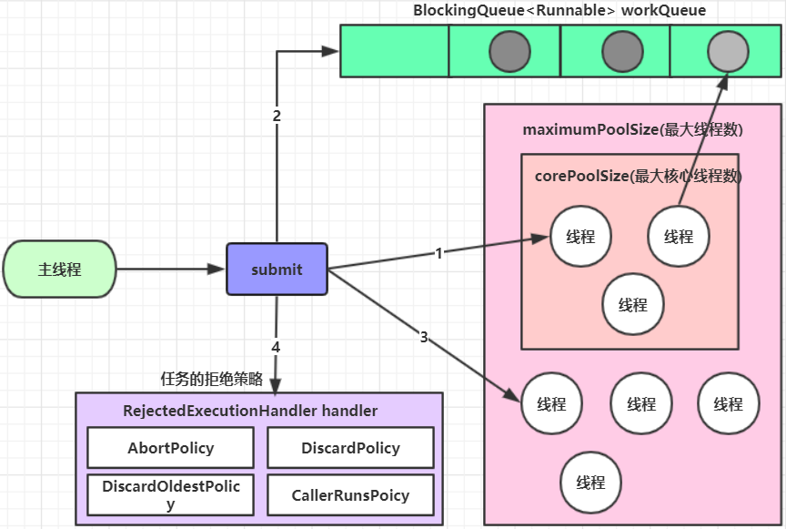
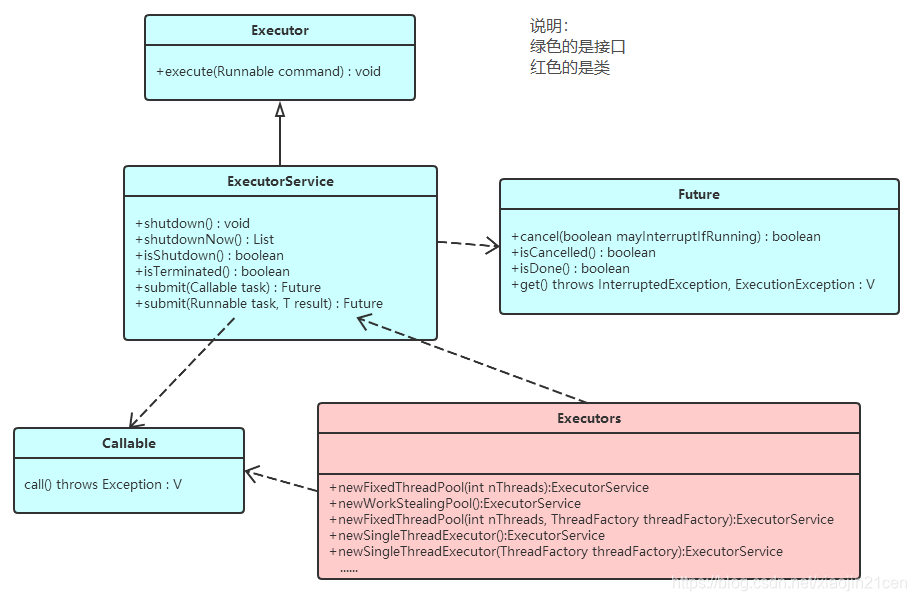
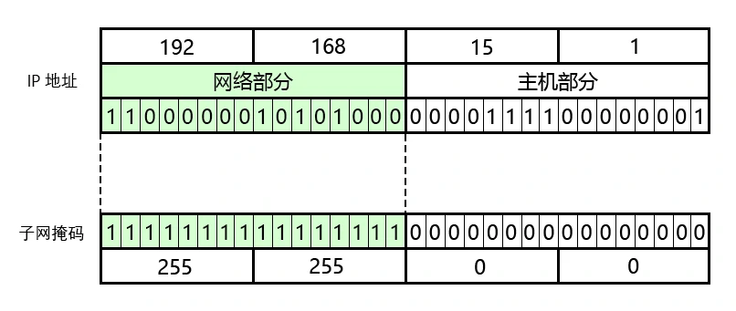
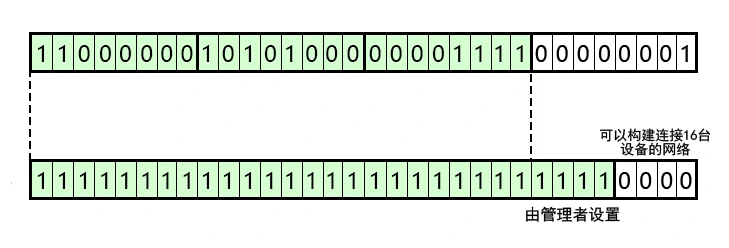
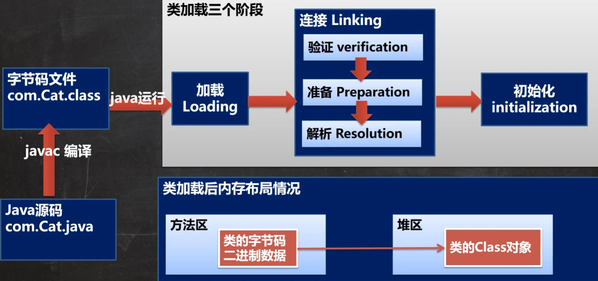
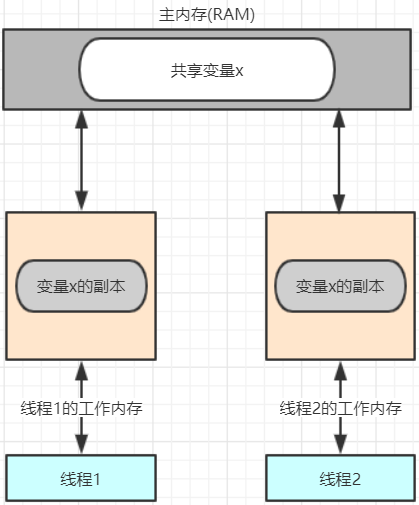
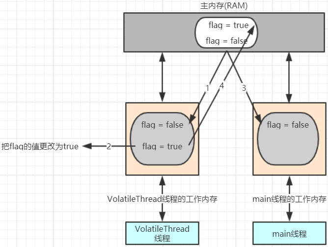
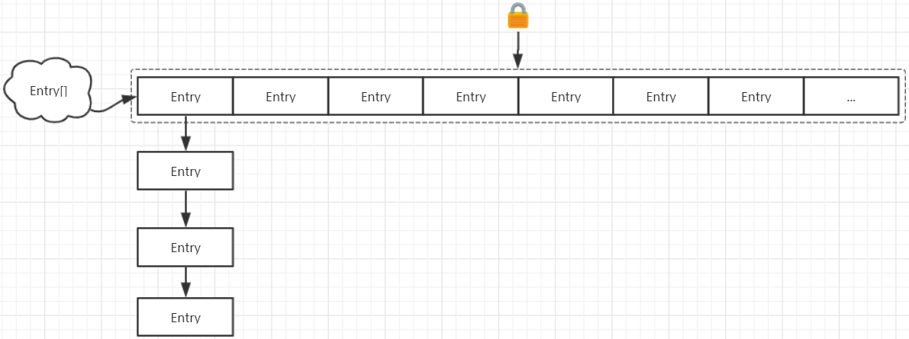
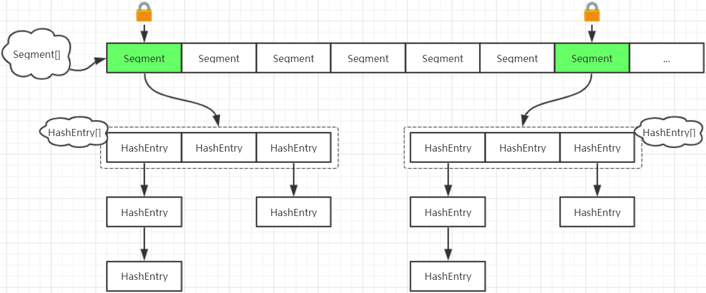
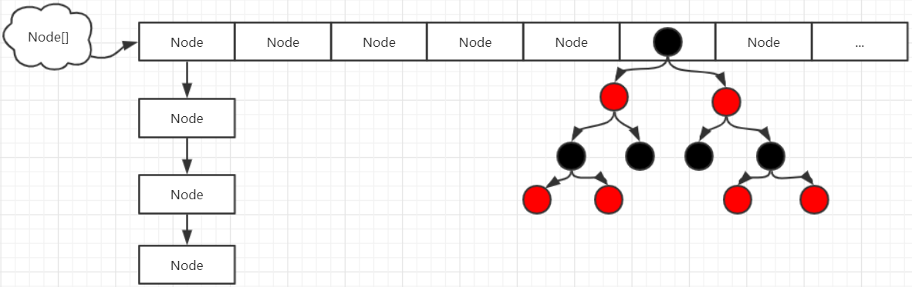

# 12 常用类

## 12.1 包装类

> 包装类（Wrapper）：针对 八种基本数据类型 相应的 引用类型
>
> 有了类的特点，就可以调用类中的方法

| 基本数据类型 | 包装类    | 父类   |
| ------------ | --------- | ------ |
| boolean      | Boolean   | Object |
| char         | Character | Object |
| int          | Integer   | Number |
| float        | Float     | Number |
| double       | Double    | Number |
| long         | Long      | Number |
| short        | Short     | Number |
| byte         | Byte      | Number |
| void         | Void      | Object |

### 12.1.1 装箱和拆箱

- **手动装箱和拆箱（JDK 5 以前）**

  ```
  int n1 = 100;
  Integer integer = new Integer(n1);			// 手动装箱
  Integer integer2 = Integer.valueOf(n1);		// 手动装箱
  int i = integer.intValue();					// 手动拆箱
  ```

- **自动装箱和拆箱（JDK 5 以后）**

  ```
  n2 = 200;
  Integer integer3 = n2;						// 自动装箱
  int j = integer3;							// 自动拆箱
  ```

  虽然可以自动装箱、拆箱，但使用 == 直接比较两个包装类时，仍然是比较其地址。以下比较通常会失败：

  ```
  Integer ia = 1000;
  Integer ib = 1000;
  System.out.print(ia == ib);					// false
  ```

  但，Java 实现仍有可能使其成立。Byte、Boolean 以及 Short、Integer 中 [-128, 127] 间的值已被包装到固定的对象中。对他们的比较可以成功。

  ```
  Integer ia = 127;
  Integer ib = 127;
  System.out.print(ia == ib);					// true
  ```

  由此可见，使用 == 直接比较两个包装类会带来不确定性。**尽量使用 equals 方法对包装类进行比较。**

装箱与拆箱是 **编译器** 的工作。在生成可执行的字节码文件时，编译器已经插入了必要的方法调用。

### 12.1.2 包装类和 `String` 的相互转换

- 包装类转 `String`：

  > ```
  > >Integer integer = 100;
  > >String str1 = integer + "";					//方法1（自动拆箱）
  > >String str2 = integer.toString();			//方法2（toString方法）
  > >String str3 = String.valueOf(integer);		//方法3（自动拆箱）
  > ```

- `String` 转包装类：

  > ```
  > String str4 = "100";
  > Integer integer2 = Integer.parseInt(str4);	//方法1（自动装箱）
  > Integer integer3 = new Integer(str4);		//方法2（构造器）
  > ```

### 12.1.3 包装类的常用方法

- `Integer.MIN_VALUE`：返回最大值

- `Double.MAX_VALUE`：返回最小值

- `byteValue()`、`doubleValue()`、`floatValue()`、`intValue()`、`longValue()`

  按各种基本数据类型返回该对象的值

- `Character.isDigit(int)`：判断是不是数字

  `Character.isLetter(int)`：判断是不是字母

  `Character.isUpperCase(int)`：判断是不是大写字母

  `Character.isLowerCase(int)`：判断是不是小写字母

  `Characher.isWhitespace(int)`：判断是不是空格

- `Character.toUpperCase(int)`：转成大写字母

  `Character.toLowerCase(int)`：转成小写字母

- `Integer.parseInt(string)`：将 String 内容转为 int

  `Double.parseDouble(string)`

- `Integer.toBinaryString(int)`：将数字转为 2 进制表示的字符串

  `Integer.toHexString(int)`：将数字转为 16 进制表示的字符串

  `Integer.toOctalString(int)`：将数字转为 8 进制表示的字符串

  特别地，浮点数类型的包装类只有转成 16 进制的方法。而 Short、Byte 及其他包装类无此方法

- `int Integer.bitCount(i int)`：统计指定数字的二进制格式中 1 的数量

### 12.1.4 strictfp 关键字

> 由于不同处理器对于浮点数寄存采取不同策略（有些处理器使用 64 位寄存 double，有些则是 80 位），对于浮点数的运算在不同平台上可能出现不同结果。

使用 strictfp 关键字标记的方法或类中，所有指令都会使用严格统一的浮点数运算。

比如，把 main 方法标记为 strictfp

```
public static strictfp void main(String[] args) {
    double ᓚᘏᗢ = 1 / 13.97;
    System.out.println(ᓚᘏᗢ);
}
```

## 12.2 `String` 类

1. `String` 对象用于保存字符串，也就是一组字符序列

2. 字符串常量对象是用双引号扩起的字符序列。例如 `"你好"`

3. 字符串的字符使用 Unicode 字符编码。一个字符（不论字母汉字）占 2 字节

4. 常用构造器：

   - `String str1 = new String();`

   - `String str2 = new String(String original);`

   - `String str3 = new String(char[] a);`

   - `String str4 = new String(char[] a, int startIndex, int count);`

     这句意思是：`char[]` 从 `startIndex` 起的 `count` 个字符

5. `String` 实现了接口 `Serializable` 和 `Comparable` ，可以 串行化和 比较大小

   ***串行化：即，可以被网络传输，也能保存到文件***

6. `String` 是 `final` 类，不能被继承

7. `String` 有属性 `private final char[] value;` 用于存放字符串内容。

   `value` 是 `final` 属性。其在栈中的地址不能修改，但堆中的内容可以修改。

### 12.2.1 `String` 构造方法

- 直接指定

  ```
  String str1 = "哈哈哈";
  ```

  该方法：先从常量池看是否有 `"哈哈哈"` 数据空间。有的场合，指向那个空间；否则重新创建然后指向。

  这个方法，`str1` 指向 常量池中的地址。

- 构造器

  ```
  String str2 = new String("嘿嘿嘿");
  ```

  该方法：先在堆中创建空间，里面维护一个 `value` 属性，指向 或 创建后指向 常量池的 `"嘿嘿嘿"` 空间。

  这个方法，`str2` 指向 堆中的地址

### 12.2.2 字符串的特性

- 常量相加，看的是池

  ```
  String str1 = "aa" + "bb";				//常量相加，看的是池
  ```

  > 上例由于构造器自身优化，相当于 `String str1 = "aabb";`

- 变量相加，是在堆中

  ```
  String a = "aa";
  String b = "bb";
  String str2 = a + b;					//变量相加，是在堆中
  ```

  > 上例的底层是如下代码
  >
  > ```
  > StringBuilder sb = new StringBuilder();
  > sb.append(a);
  > sb.append(b);
  > str2 = sb.toString();	//sb.toString()：return new String(value, 0, count);
  > ```

### 12.2.3 `String` 的常用方法

以下方法不需死记硬背，手熟自然牢记

- `boolean equals(String s)`：区分大小写，判断内容是否相等

  `boolean equalsIgnoreCase(String s)`：判断内容是否相等（忽略大小写）

- `boolean empty()`：返回是否为空

- `int charAt(int index)`：获取某索引处的字符（代码单元）。

  必须用 `char c = str.charAt(15);`，不能用 `char c = str[15];`

  `int codePointAt(int index)`

  `int length()`：获取字符（**代码单元**）的个数

  ***—— 代码单元，见 [[2.6.2 字符本质与编码表\]](./Java语法（上）.md#2.6.2 字符本质与编码表)***

  `IntStream codePoints()`：返回字符串中全部码点构成的流

  `long codePoints().count()`：返回真正长度（码点数量）

  ***—— 流，见 [[13 Stream API\]](#13 Stream API)***

- `int indexOf(String str)`：获取字符（串）在字符串中第一次出现的索引。如果找不到，返回 -1

  `int indexOf(int char)` 参数也可以传入一个 int。由于自动类型转换的存在，也能填入 char

  `int indexOf(String str, int index)`：从 index 处（包含）开始查找指定字符（串）

  `int lastIndexOf(String str)`：获取字符在字符串中最后一次出现的索引。如果找不到，返回 -1

- `String substring(int start, int end)`：返回截取指定范围 [start, end) 的 **新** 字符串

  `String substring(int index)`：截取 index（包含）之后的部分

- `String trim()`：返回去前后空格的新字符串

- `String toUperCase()`：返回字母全部转为大写的新字符串

  `String toLowerCase()`：返回字母全部转为小写的新字符串

- `String concat(String another)`：返回拼接字符串

- `String replace(char oldChar, char newChar)`：替换字符串中的元素

  ```
  String str1 = "Foolish cultists";
  String str2 = str1.replace("cultists", "believers");	//str1不变，str2为改变的值
  ```

- `String[] split(String regex)`：分割字符串。

  对于某些分割字符，我们需要转义

  ```
  String str1 = "aaa,bbb,ccc";
  String[] strs1 = str1.split(",");		//这个场合，strs = {"aaa", "bbb", "ccc"};4
  String str2 = "aaa\bbb\ccc";
  String[] strs2 = str2.split("\\");		//"\" 是特殊字符，需要转义为 "\\"
  ```

- `int compareTo(String another)`：按照字典顺序比较两个字符串（的大小）。

  返回出现第一处不同的字符的编号差。前面字符相同，长度不同的场合，返回那个长度差。

  ```
  String str1 = "ccc";
  String str2 = "ca";
  String str3 = "ccc111abc";
  int n1 = str1.compareTo(str2);			//此时 n1 = 'c' - 'a' = 2
  int n2 = str1.compareTo(str3);			//此时 n2 = str1,length - str3.length = -6
  int n3 = str1.compareTo(str1);			//此时 n3 = 0
  ```

- `char[] toCharArray()`：转换成字符数组

  `byte[] getBytes()`：字符串转为字节数组

- `String String.format(String format, Object... args)`：（静态方法）格式字符串

  ```
  String name = "Roin";
  String age = "1M";
  String state = "computer";
  String formatStr = "I am %s, I am %s old, I am a %s";
  String str = String.format(formatStr, name, age, state);
  //其中 %s 是占位符。此时，str = "I am Roin, I am 1M old, I am a computer";
  //%s 表示字符串替换；%d 表示整数替换；#.2f 表示小数（四舍五入保留2位）替换；%c 表示字符替换
  ```

- `String join(deli, ele...)`：拼接字符串（`ele...`），以 `deli` 间隔。

- `boolean startsWith(str)`：测试 str 是否为当前字符串的前缀

- `String repeat(int n)`：返回该字符串重复 n 次的结果

## 12.3 `StringBuffer` 类

> `java.lang.StringBuffer` 代表可变的字符序列。可以对字符串内容进行增删。
>
> 很多方法和 `String` 相同，但 `StringBuffer` 是可变长度。同时，`StringBuffer` 是一个容器

1. `StringBuffer` 的直接父类是 `AbstractStringBuffer`
2. `StringBuffer` 实现了 `Serialiazable`，可以串行化
3. 在父类中，`AbstractStringBuffer` 有属性 `char[] value` 不是 `final`
4. `StringBuffer` 是一个 `final` 类，不能被继承

**`String` 对比 `StringBuffer`**

- `String` 保存字符串常量，其中的值不能更改。每次更新实际上是更改地址，效率较低
- `StringBuffer` 保存字符串变量，里面的值可以更改。每次更新是更新内容，不用每次更新地址。

### 12.3.1 `StringBuffer` 构造方法

1. 无参构造

   ```
   StringBuffer strb1 = new StringBuffer();
   ```

   > 创造一个 16 位容量的空 `StringBuffer`

2. 传入字符串构造

   ```
   String str1 = "abcabc";
   StringBuffer strb2 = new StringBuffer(str1);
   ```

   > （上例）创造一个 str1.length + 16 容量的 `StringBuffer`

3. 指定容量构造

   ```
   StringBuffer strb3 = new StringBuffer(3);
   ```

   > （上例）创造一个 3 容量的空 `StringBuffer`

### 12.3.2 `String` 和 `StringBuffer`的转换

1. 转 `StringBuffer`

   ```
   String str1 = "abcabc";
   StringBuffer strb1 = new StringBuffer(str1);	//方法1（构造器）
   StringBuffer strb1 = new StringBuffer();		
   strb1 = strb1.append(str1);						//方法2（先空再append）
   ```

2. 转 `String`

   ```
   String str2 = strb1.toString();					//方法1（toString）
   String str3 = new String(strb1);				//方法2（构造器）
   ```

### 12.3.3 `StringBuffer` 的常用方法

- `append(char c)`：增加

  `append(String s)` 参数也能是字符串

  特别的，`append(null);` 的场合，等同于 `append("null");`

- `delete(start, end)`：删减 [start, end) 的内容

- `replace(start, end, string)`：将 start 与 end 间的内容替换为 string

- `indexOf`：查找指定字符串第一次出现时的索引。没找到的场合返回 -1

- `insert`：在指定索引位置之前插入指定字符串

- `length()`：返回字符长度

  `capacity()`：返回当前的容量

  String 类对象分配内存时，按照对象中所含字符个数等量分配。

  StringBuffer 类对象分配内存时，除去字符所占空间外，会另加 16 字符大小的缓冲区。

  对于 `length()` 方法，返回的是字符串长度。对于 `capacity()` 方法，返回的是 字符串 + 缓冲区 的大小。

## 12.4 `StringBuilder` 类

> 一个可变的字符序列。此类提供一个与 `StringBuffer` 兼容的 API，但不保证同步（有线程安全问题）。该类被设计成 `StringBuffer` 的一个简易替换，**用在字符串缓冲区被单个线程使用的时候**。如果可能，建议优先使用该类。因为在大多数实现中，它比起 `StringBuffer` 要快。
>
> 在 `StringBuilder` 是的主要操作是 `append` 和 `insert` 方法。可以重载这些方法，以接受任意类型的数据。

1. `StringBuilder` 也继承了 `AbstractStringBuffer`
2. `StringBuilder` 也实现了 `Serialiazable`，可以串行化
3. 仍然是在父类中有属性 `char[] value` ，而且不是 `final`
4. `StringBuilder` 也是一个 `final` 类，不能被继承
5. `StringBuilder` 的方法，没有做互斥的处理（没有 `synchronize`），故而存在线程安全问题

### 12.4.1 `String`、`StringBuffer`、`StringBuilder` 的对比

1. `StringBuilder` 和 `StringBuffer` 类似，均代表可变字符序列，而且方法也一样

2. `String`：不可变字符序列，效率低，但复用率高

3. `StringBuffer`：可变字符序列，效率较高，线程安全

4. `StringBuilder`：可变字符序列，效率最高，存在线程安全问题

5. `String` 为何效率低：

   > ```
   > String str1 = "aa";					//创建了一个字符串
   > for(int n = 0; n < 100; n++){		
   > 	str1 += "bb";					//这里，原先的字符串被丢弃，创建新字符串
   > }									//多次执行后，大量副本字符串留在内存中
   > 									//导致效率降低，也会影响程序性能
   > ```
   >
   > 如上，对 `String` 大量修改的场合，不要使用 `String`

## 12.5 `Math` 类

- `Math.multiplyExact(int n1, int n2)`：进行乘法运算，返回运算结果

  通常的乘法 `n1 * n2` 在结果大于那个数据类型存储上限时，可能返回错误的值。

  使用此方法，结果大于那个数据类型存储上限时，会抛出异常

  `Math.addExact(int n1, int n2)`：加法

  `Math.subtractExact(int n1, int n2)`：减法

  `Math.incrementExact(int n1)`：自增

  `Math.decrementExact(int n1)`：自减

  `Math.negateExact(int n1, int n2)`：改变符号

- `Math.abs(n)`：求绝对值，返回 |n1|

- `Math.pow(n, i)`：求幂，返回 n3 ^ i

- `Math.ceil(n)`：向上取整，返回 >= n3 的最小整数（转成double）

- `Math.floor(n)`：向下取整，返回 <=n4 的最小整数（转成double）

- `Math.floorMod(int n1, int n2)`：返回 n1 除以 n2 的余数

  `n1 % n2` 的场合，返回的可能是负数，而不是数学意义上的余数

- `Math.round(n)`：四舍五入，相当于 `Math.floor(n5 + 0.5)`

- `Math.sqrt(n)`：求开方。负数的场合，返回 `NaN`

- `Math.random()`：返回一个 [0, 1) 区间的随机小数

- `Math.sin(n)`：正弦函数

  `Math.cos(n)`：余弦函数

  `Math.tan(n)`、`Math.atan(n)`、`Math.atan2(n)`

  要注意，上述方法传入的参数是 **弧度值**。

  要得到一个角度的弧度值，应使用：`Math.toRadians(n)`

- `Math.exp(n)`：e 的 n 次幂

  `Math.log10(n)`：10 为底的对数

  `Math.log()`：自然对数

- `Math.PI`：圆周率的近似值

  `Math.E`：e 的近似值

## 12.6 `Arrays` 类

- `Arrays.toString()`：返回数组的字符串形式

  > ```
  > int[] nums = {0, 1, 33};
  > String str = Array.toString(nums);		//此时，str = "[0, 1, 33]"
  > ```
  >
  > 特别的，输入为 null 时返回 “null”

- `Arrays.sort(arr)`：排序

  因为数组是引用类型，使用 sort 排序后，会直接影响到实参。

  默认（自然排序）从小到大排序。

  `Arrays.sort(arr, Comparator c)`：按照传入的比较器决定排序方法

  ```
  Integer[] nums;
  ...
  Comparator<Integer, Integer> c = new Comparator<Integer, Integer>(){
      @Override
      public int compare(Integer o1, Integer o2){
          return n2 - n1;						// 这个场合，变成从大到小排序
      }
  }
  Arrays.sort(nums, c);
  ```

- `Arrays.binarySearch(array, num)`：通过二分搜索法查找。前提是必须先排序。

  找不到的场合，返回 - (low + 1)。即，其应该在的位置的负值

  ```
  Integer[] nums2 = {-10, -5, -2, 0, 4, 5, 9};
  int index = Arrays.binarySearch(nums2, 7);	// 此时 index = -7
  											// 如果 7 存在，应该在第 7 个位置
  ```

- `Arrays.copyOf(arr, n)`：从 `arr` 中，复制 n 个元素（成为新的数组）。

  n > arr.length 的场合，在多余的位置添加 `null`。n < 0 的场合，抛出异常。

  该方法的底层使用的是 `System.arraycopy`

- `Arrays.fill(arr, o)`：用 o 填充 `num` 的所有元素。

- `Arrays.equals(arr1, arr2)`：比较两个数组元素是否完全一致（`true`/`false`）

- `Arrays.asList(a, b, c, d)`：将输入数据转成一个 `List` 集合

## 12.7 `System` 类

- `System.exit(0)`：退出当前程序。0 表示一个状态，正常状态是 0

- `System.arraycopy(arr, 0, newArr, 0 ,3)`：复制数组元素。

  上例是：arr 自下标 0 起开始，向 newArr 自下标 0 开始，依次拷贝 3 个值

  这个方法比较适合底层调用。我们一般使用 `Arrays.copyOf` 来做

- `System.currentTimeMillis`：返回当前时间距离 1970 - 1 - 1 的毫秒数

- `System.gc`：运行垃圾回收机制

## 12.8 `BigInteger` 和 `BigDecimal` 类

> `BigInteger`：适合保存更大的整数
>
> `BigDecimal`：适合保存精度更大的浮点数

```
//用引号把大数变成字符串
BigInteger bigNum = new BigInteger("100000000000000000000000");
```

**构造方法：**

- `new BigInteger(String intStr)`：通过一个字符串构建大数
- `BigInteger BigInteger.valueOf(1)`：通过静态方法，让整数类型转成大数

另外，在对 `BigInteger` 和 `BigDecimal` 进行加减乘除的时候，需要使用对应方法

不能直接用 `+` `-` `*` `/`

**常用方法：**

- `BigInteger add(BigInteger)`：加法运算。返回新的大数

- `BigInteger subtract(BigInteger)`：减法

- `BigInteger multiply(BigInteger)`：乘法

- `BigInteger divide(BigInteger)`：除法运算

  该方法可能抛出异常。因为可能产生是无限长度小数。

  解决方法（保留分子精度）：`bigDecimal.divide(bD3, BigDecimal.ROUND_CELLING)`

- 一些常量：

  `BigInteger.ONE`、`BigInteger.ZERO`、`BigInteger.TEN` 分别是 1、0、10

  one 就是英文的 1，zero 就是英文的 0……这个大家都懂的吧？

## 12.9 日期类

### 12.9.1 第一代日期类

> Date：精确到毫秒，代表特定瞬间。这里的是 java.util.Date
>
> SimpleDateFormat：格式和解析日期的类

1. `Date d1 = new Date();`：调用默认无参构造器，获取当前系统时间。

   默认输出日期格式是国外的格式，因此通常需要进行格式转换

   ```
   SimpleDateFormat sdf = new SimpleDateFormat("yyyy.MM.dd HH.mm.ss");
   String dateFormated = sdf.(d1);							//日期转成指定格式。
   ```

2. 通过指定毫秒数得到时间：

   ```
   Date d2 = new Date(10000000000);
   JAVA
   ```

3. 把一个格式化的字符串转成对应的 Date：

   ```
   SimpleDateFormat sdf2 = new SimpleDateFormat("yyyy年MM月dd日 HH点mm分 E");
   Date d3 = sdf2.parse("2021年12月22日 00点03分 星期三");
   ```

   这个场合，给定的字符串格式应和 `sdf2` 格式相同，否则会抛出异常

### 12.9.2 第二代日期类

> Calendar：构造器是私有的，要通过 getInstance 方法获取实例

1. Calendar 是一个抽象类，其构造器私有

   ```
   Calendar c1 = Calendar.genInstance();				//获取实例的方法
   ```

2. 提供大量方法和字段提供给程序员使用

   - `c1.get(Calendar.YEAR)`：获取年份数

   - `c1.get(Calendar.MONTH)`：获取月份数

     特别的，实际月份是 返回值 +1。因为 Calendar 的月份是从 0 开始编号的

   - `c1.get(Calendar.DAY_OF_MONTH)`：获取日数

   - `c1.get(Calendar.HOUR)`：获取小时数（12小时制）

     `c1.get(Calendar.HOUR_OF_DATE)`：获取小时数（24小时制）

   - `c1.get(Calendar.MINUTE)`：获取分钟数

   - `c1.get(Calendar.SECOND)`：获取秒数

   Calendar 没有专门的格式化方法，需要程序员自己组合来显示

### 12.9.3 第三代日期类

> JDK 1.0 加入的 Date 在 JDK 1.1 加入 Calendar 后已被弃用
>
> 然而，Calendar 也存在不足：
>
> 1. 可变性：像日期和实际这样的类应该是不可改变的
> 2. 偏移性：年份都是从 1900 年开始，月份都是从 0 开始
> 3. 格式化：只对 Date 有用，对 Calendar 没用
> 4. 其他问题：如不能保证线程安全，不能处理闰秒（每隔 2 天多 1 秒）等
>
> 于是，在 JDK 8 加入了以下新日期类：
>
> - LocalDate：只包含 日期（年月日），可以获取 日期字段
> - LocalTime：只包含 时间（时分秒），可以获取 时间字段
> - LocalDateTime：包含 日期 + 时间，可以获取 日期 + 时间字段
> - DateTimeFormatter：格式化日期
> - Instant：时间戳

1. 使用 `now()` 方法返回当前时间的对象

   ```
   LocalDateTime ldt = LocalDateTime.now();				//获取当前时间
   ```

2. 获取各字段方法：

   - `ldt.getYear();`：获取年份数

   - `ldt.getMonth();`：获取月份数（英文）

     `ldt.getMonthValue();`：获取月份数（数字）

   - `ldt.getDayOfMonth();`：获取日数

   - `LocalDateTime ldt2 = ldt.plusDays(100);`：获取 ldt 时间 100 天后的时间实例

   - `LocalDateTime ldt3 = ldt.minusHours(100);`：获取 ldt 时间 100 小时前的时间实例

   - …

3. 格式化日期：

   ```
   DateTimeFormatter dtf = new DateTimeFormatter("yyyy.MM.dd HH.mm.ss");
   String date = dtf.format(ldt);							//获取格式化字符串
   ```

4. `Instant` 和 `Date` 类似

   - 获取当前时间戳：`Instant instant = Instant.now();`
   - 转换为 `Date`：`Date date = Date.form(instant);`
   - 由 `Date` 转换：`Instant instant = date.toInstant;`

## 12.10 泛型

> 泛型（generic）：又称 参数化类型。是JDK 5 出现的新特性。解决数据类型的安全性问题。
>
> 在类声明或实例化时只要制定好需要的具体类型即可。

举例说明：

```
Properties<Person> prop = new Properties<Person>();
```

> 上例表示存放到 `prop` 中的必须是 `Person` 类型。
>
> 如果编译器发现添加类型不符合要求，即报错。
>
> 遍历时，直接取出 `Person` 而非 `Object`

1. 编译时，检查添加元素的类型。可以保证如果编译时没发出警告，运行就不会产生 ClassCastException 异常。提高了安全性，使代码更加简洁、健壮。

2. 也减少了转换的次数，提高了效率。

3. 泛型的作用是：可以在类声明是通过一个标识表示类中某个属性的类型，或某个方法返回值的类型，或参数类型。

   ```
   class P<E> {
   	E e;				//E 表示 e 的数据类型，在定义 P类 时指定。在编译期间即确认类型
   	public P(E e){		//可作为参数类型
   		this.e = e;
   	}
   	public E doSth(){	//可作为返回类型
   		return this.e;
   	}
   }
   ```

   实例化时指定 E 的类型，编译时上例所有 E 会被编译器替换为那个指定类型

#### 使用方法：

- **声明泛型：**

  ```
  interface InterfaceName<T> {...}
  class ClassName<A, B, C, D> {...}
  ```

  上例 T、A、B、C、D 不是值，而是类型。可以用任意字母代替

- **实例化泛型：**

  ```
  List<String> strList = new ArrayList<String>();
  Iterator<Integer> iterator = vector.interator<Integer>();
  ```

  类名后面指定类型参数的值

**注意细节：**

1. 泛型只能是引用类型

2. 指定泛型具体类型后，可以传入该类型或其子类类型

3. 在实际开发中往往简写泛型

   ```
   List<String> strList = new ArrayList<>();
   ```

   编译器会进行类型推断，右边 `< >` 内容可以省略

4. 实例化不写泛型的场合，相当于默认泛型为 `Object`

#### 自定义泛型类 · 接口：

```
class Name<A, B...> {...}				//泛型标识符 可有多个，一般是单个大写字母表示
```

这就是自定义泛型啊

1. 普通成员可以使用泛型（属性、方法）

2. 泛型类的类型，是在创建对象时确定的。

   因此：静态方法中不能使用类的泛型；使用泛型的数组，也不能初始化。

3. 创建对象时不指定的场合，默认 Object。建议还是写上 `<Object>`，大气，上档次

4. 自定义泛型接口

   ```
   interface Name<T, R...> {...}
   ```

   泛型接口，其泛型在 继承接口 或 实现接口 时确定。

#### 自定义泛型方法：

```
修饰符 <T, R...> 返回类型 方法名(形参) {...}
```

1. 可以定义在普通类中，也可以定义在泛型类中

2. 当泛型方法被调用时，类型会确定

3. 以下场合

   > ```
   > Class C<T> {
   > 	public void cMethord(T t){		
   > 	}
   > }
   > ```

   没有 `< >`，不是泛型方法，而是使用了泛型的普通方法

#### 泛型继承：

1. 泛型不具有继承性
2. `<?>`：支持任意泛型类型
3. `<? extends A>`：支持 A 及 A的子类，规定了泛型的上限
4. `<? super B>`：支持 B 及 B 的父类，规定了泛型的下限

# 13 Stream API

> Stream API（`java.util.stream`）把真正的函数式编程风格引入到 Java 中。这是目前为止对 Java 类库最好的补充。因为 Stream API 可以极大提高 Java 程序员的生产力，让程序员写出高效率、干净、简洁的代码。
>
> Stream 是 Java8 中处理集合的关键抽象概念，它可以指定你希望对集合进行的操作，可以执行非常复杂的查找、过滤和映射数据等操作。使用 Stream API 对集合进行数据操作，就类似于使用 SQL 执行的数据库查询。也可以使用 Stream API 来并行执行操作。简言之，Stream API 提供了一种高效且易于使用的处理数据的方式。

Stream API 和 Collection 的区别：Collection 是一种静态的内存数据结构，而 Stream 是有关计算的。前者主要面向内存，储存于内存。后者主要面向 CPU，通过 CPU 实现计算。

## 13.1 什么是 Stream

> Stream 是数据渠道，用于操作数据源所生成的元素序列

- Stream 自己不会储存元素
- Stream 不会改变源对象。他们会返回一个持有结果的新 Stream
- Stream 操作是延迟执行的。这意味着他们会等到需要结果时才执行

## 13.2 Stream 操作步骤

1. 创建 Stream：

   根据一个数据源，获取一个流

2. 中间操作：

   一个中间操作链，对数据源的数据进行处理

3. 终止操作：

   一旦执行终止操作，就执行中间操作链，并产生结果。之后，不会再被使用

### 13.2.1 创建 Stream

1. 通过集合：Collection体系集合使用默认方法stream()生成流， default Stream\<E> stream()

   但如果是Map体系集合，需要先把Map转成Set集合，间接的生成流

   ```java
   List list = new ArrayList();				//某个集合
   Stream stream = list.stream();				//返回一个顺序流
   Stream stream = list.parallelStream();		//返回一个并行流
   
   HashMap<String, Integer> hashMap = new HashMap<>();
   hashMap.keySet().stream().forEach(s -> System.out.println(s));
   hashMap.entrySet().stream().forEach(entry -> System.out.println(entry));
   ```

2. 通过数组：Arrays 类提供了这个静态方法

   ```java
   int[] ints = new int[2];					//基本数据类型只有这三种
   IntStream IS = Arrays.stream(ints);
   long[] longs = new long[2];
   LongStream LS = Arrays.stream(longs);
   double[] doubles = new double[2];
   DoubleStream LS = Arrays.stream(doubles);
   Object[] objs = new Object[4];				//此处表示一个任意类
   Stream<Object> stream = Arrays.stream(objs);
   ```

   这个方法的重载形式，能够处理对应基本类型的数组

   - `public static IntStream stream(int[] arr)`
   - `public static LongStream stream(long[] arr)`
   - `public static DoubleStream stream(double[] arr)`

3. 通过 `Stream.of()` 方法：同种数据类型的多个数据，通过Stream接口的静态方法of(T... values)生成流

   ```java
   Char[] chars1 = new Char[4];
   Char[] chars2 = new Char[4];
   Stream<Char> CS = Stream.of(chars1, chars2);
   ```

   **NOTE： ** 

   1. 如果放多个对象，则按照添加的对象分割。

   2. 如果只放一个对象数组，如果是该对象是基本数据类型，则不会自动整体装箱，而仍然是按照多个对象那样对对象分割，如果不是基本数据类型，则会按每个对象进行分割。

      如果想把多个流合并，请看下面的`concat`方法

4. 创建无限流：

   ```java
   Stream<Integer> iterate = Stream.iterate(1, o -> ++o);
   Stream<Long> generate = Stream.generate(System::currentTimeMillis);
   ```

   - `public static<T> Stream<T> iterate(final T seed, final UnaryOperator<T> f)`

   - `public static<T> Stream<T> generate(Supplier<T> s)`

     ***——看不懂？请看 [[ 14.2.1 Java 内置的函数式接口 \]](#14.2.1 Java 内置的函数式接口 )***

### 13.2.2 中间操作

> 多个中间操作连接起一个流水线。该流水线在触发终止操作前不执行任何处理，终止操作触发时一次性进行全部处理。这个流程也称为 “惰性求值”。

中间操作后返回新的Stream流，用来的Stream就关闭了，因此建议使用链式编程，且修改Stream流中的数据不会改变原来的数据

1. 筛选与切片

   | 方法                  | 描述                                                         |
   | --------------------- | ------------------------------------------------------------ |
   | `filter(Predicate P)` | 接收一个 Lambda，从流中排除某些元素，返回true表示保留        |
   | `distinct()`          | 筛选，通过流生成元素的 `hashCode()` 和 `equals()` 进行去重（底层为HashSet） |
   | `limit(long maxSize)` | 截断流，使其元素不超过给定数量                               |
   | `skip(long n)`        | 跳过元素，返回一个扔掉了前 n 给元素的流。不足 n 的场合返回空流 |

2. 映射

   | 方法                  | 描述                                       |
   | --------------------- | ------------------------------------------ |
   | `map(Function f)`     | 接收一个函数，将元素转化成其他形式提取信息 |
   | `flatMap(Function f)` | 接收一个函数，将每个元素都转换成另一个流   |

3. 排序

   | 方法                   | 描述                               |
   | ---------------------- | ---------------------------------- |
   | `sorted()`             | 产生一个新流，该流按自然顺序排序   |
   | `sorted(Comparator c)` | 产生一个新流，该流按比较器顺序排序 |

4. 拼接

   | 方法                         | 描述                                                     |
   | ---------------------------- | -------------------------------------------------------- |
   | `concat`(Stream a, Stream b) | 合并a，b两个流为一个流（合并结果的类型为a，b的最近父类） |

### 13.2.3 终止操作

1. 匹配和查找

   | 方法                     | 描述                               |
   | ------------------------ | ---------------------------------- |
   | `allMatch(Predicate p)`  | 检查是否匹配全部元素               |
   | `anyMatch(Predicate p)`  | 检查是否有任意元素匹配             |
   | `noneMatch(Predicate p)` | 检查是否任意元素都不匹配           |
   | `findFirst()`            | 返回第一个元素                     |
   | `findAny()`              | 返回当前流的任意元素               |
   | `count()`                | 返回当前流的元素个数               |
   | `max(Comparator c)`      | 返回流中的（比较器顺序下的）最大值 |
   | `min(Comparator c)`      | 返回流中的（比较器顺序下的）最小值 |
   | `forEach(Consumer c)`    | 内部迭代                           |

   - 关于内部迭代：使用 `Collection` 接口需要用户去做迭代，称为外部迭代。Stream API 使用内部迭代，不需要用户做迭代。

2. 归约

   | 方法                                   | 描述                                                      |
   | -------------------------------------- | --------------------------------------------------------- |
   | `reduce(T identity, BinaryOperator b)` | 可以把流中元素反复结合起来，得到一个值。返回 `T`          |
   | `reduce(BinaryOperator b)`             | 可以把流中元素反复结合起来，得到一个值。返回 `Optinal<T>` |

3. 收集

   | 方法                                  | 描述                                                         |
   | ------------------------------------- | ------------------------------------------------------------ |
   | `collect(Collector c)`                | 将流转换为其他形式。接收一个 Collector 接口的实现，用于给 Stream 中元素做汇总的方法 |
   | `toArray()`                           | 收集流中的数据，并将其放置到数组中                           |
   | `toArray(IntFunction<T[]> generator)` | 收集流中的数据，并将其放置到T类型的数组中                    |

   `Collector` 接口中方法的实现决定了如何对流执行收集的操作

   另外，工具类`Collectors` 实用类提供了很多静态方法，可以方便地创建常见收集器实例，见下表。

   | 方法名                                           | 说明                                       |
   | ------------------------------------------------ | ------------------------------------------ |
   | ` toList()`                                      | 返回一个List集合，其中包括收集到的所有元素 |
   | ` toSet()`                                       | 返回一个Set集合，其中包括收集到的所有元素  |
   | `toMap(Function keyMapper,Function valueMapper)` | 返回一个Map集合，其中包括收集到的所有元素  |

​		在`Collectors.toMap()`方法中，要收集的数据其键值不能重复，如果重复会报错，其参数中的两个Function分别用来返回键和值，举例如下：

```java
ArrayList<String> list = new ArrayList<>();
        Collections.addAll(list, "张无忌-男-15", "周芷若-女-14", "张三丰-男-100", "赵敏-女-13");
        Map<String, Integer> map = list.stream().filter(s -> "男".equals(s.split("-")[1])).collect(Collectors.toMap(
                new Function<String, String>() {
                    @Override
                    public String apply(String s) {
                        return s.split("-")[0];
                    }
                },
                new Function<String, Integer>() {
                    @Override
                    public Integer apply(String s) {
                        return Integer.parseInt(s.split("-")[2]);
                    }
                }));
// 使用Lambda表达式后可以化简为
Map<String, Integer> map = list.stream().filter(s -> "男".equals(s.split("-")[1]))
                .collect(Collectors.toMap(s -> s.split("-")[0], s -> Integer.parseInt(s.split("-")[2])));
```

# 14 Java 8 新特性

> Java 8 是 Java 语言开发的一个主要版本，其为 Java 带来了大量新特性

## 14.1 Lambda 表达式

> Lambda 是一个匿名函数，可以理解为一段可传递的代码。使用它可以写出更简洁、更灵活的代码。作为一种更紧凑的代码风格，使 Java 语言的表达能力得到了提升。
>
> （Java 中）Lambda 的本质：作为函数式接口的实例

~~学了13章的Stream流，你一定对Lambda表达式充满了期待吧！~~原代码：

```java
Comparator<Integer> comp = new Comparator<Integer>() {
    @Override
    public int compare(Integer o1, Integer o2) {
        return Integer.compare(o1, o2);
    }
};
System.out.println(comp.compare(11, 10));
```

使用 Lambda 表达式重写的代码：

```java
Comparator<Integer> comp = (o1, o2) -> Integer.compare(o1, o2);
System.out.println(comp.compare(11, 10));
```

通过 [方法引用](# 14.3.1 方法引用) 进一步改写代码：

```java
Comparator<Integer> comp = Integer::compare;
System.out.println(comp.compare(11, 10));
```

### 14.1.1 Lambda 表达式的使用

Lambda 表达式：在 Java 8 语言中引入的一种新的语法元素和操作符。这个操作符 `->` 被称为 Lambda 操作符（箭头操作符）。它将 Lambda 分为两部分：

- 左侧：Lambda 形参列表。
- 右侧：Lambda 体。

**Lambda 表达式省略规则：**

1. 参数类型如果可以推断出来则可以省略不写
2. 如果只有一个参数，那么左侧的`()`也可以省略
3. 如果Lambda 表达式的方法体只有一行，右侧的`{}`、`;`和`return`可以同时省略

**NOTE：**Lambda 表达式只能简化[函数式接口](# 14.2 函数式接口)的匿名内部类的写法。

## 14.2 函数式接口

> 一个接口中只声明了一个抽象方法（有且仅有一个抽象方法），这种接口就被称为函数式接口
>
> 可以在一个接口上使用 `@FunctionalInterface` 注解，以检查其是否是一个函数式接口。

### 14.2.1 Java 内置的函数式接口

**常用的四个函数式接口：**

| 函数式接口                   | 参数类型 | 返回类型 | 用途                                       | 抽象方法            |
| ---------------------------- | -------- | -------- | ------------------------------------------ | ------------------- |
| `Consumer<T>`：消费型接口    | T        | void     | 对类型 T 的对象进行操作                    | `void accept(T t)`  |
| `Supplier<T>`：供给型接口    | 无       | T        | 返回类型 T 的对象                          | `T get()`           |
| `Function<T, R>`：函数型接口 | T        | R        | 对类型 T 的对象进行操作，返回类型 R 的对象 | `R apply(T t)`      |
| `Predicate<T>`：断定型接口   | T        | boolean  | 确定类型 T 的对象是否满足约束              | `boolean test(T t)` |

**其他的函数式接口：**

| 函数式接口                                                   | 参数类型            | 返回类型            | 用途                                              | 抽象方法                 |
| ------------------------------------------------------------ | ------------------- | ------------------- | ------------------------------------------------- | ------------------------ |
| `BiFunction<T, U, R>`                                        | T、U                | R                   | 对类型 T、U 的对象进行操作，返回类型 R 的对象     | `R apply(T t, U u)`      |
| `UnaryOperator<T>`（`Function` 子接口）                      | T                   | T                   | 对类型 T 的对象进行一元运算，返回类型 T 的对象    | `T apply(T t)`           |
| `BinaryOperator<T>`（`BiFunction` 子接口）                   | T、T                | T                   | 对类型 T 的对象进行二元运算，返回类型 T 的对象    | `T apply(T t1, T t2)`    |
| `BiConsumer<T, U>`                                           | T、U                | void                | 对类型 T、U 的对象进行操作                        | `void accept(T t, U u)`  |
| `BiPredicate<T, U>`                                          | T、U                | boolean             | 确定类型 T、U 的对象是否满足约束                  | `boolean test(T t, U u)` |
| `ToIntFunction<T>`、`ToLongFunction<T>`、`ToDoubleFunction<T>` | T                   | int / long / double | 计算 int / long /double 值的函数                  | `int apply(T t)`         |
| `IntFunction<T>`、`LongFunction<T>`、`DoubleFunction<T>`     | int / long / double | T                   | 参数是 int / long /double 的函数，返回T类型的对象 | `T applt(int n)`         |

## 14.3 方法引用和构造器引用

> 在使用Lambda表达式的时候，我们实际上传递进去的代码就是一种解决方案：拿参数做操作
>
> 那么考虑一种情况：如果我们在Lambda中所指定的操作方案，已经有地方存在相同方案，那是否还有必要再写重复逻辑呢？答案肯定是没有必要，因此当要传递给 Lambda 体的操作**已经有实现方法，且参数类型一致**，则可以使用方法引用。
>
> 方法引用可以看作是 Lambda 表达式深层次的表达。换句话说，方法引用就是 Lambda 表达式，即函数式接口的一个实例。通过方法名指向一个方法。

方法引用使用的操作符是 `::` ，也称为 方法引用符，是方法引用中一个独特的符号，方法引用是Lambda的孪生兄弟

方法引用时要注意什么?

- 需要有函数式接口
- 被引用方法必须已经存在
- 被引用方法的形参和返回值需要跟抽象方法保持一致
- 被引用方法的功能要满足当前的需求

### 14.3.1 方法引用

> 实现接口的抽象方法的参数列表和返回值，与引用方法的参数列表和返回值一致

1. `对象::非静态方法`

   ```java
   PrintStream out = System.out;
   Consumer<String> con = out::println;
   // 或者
   Consumer<String> consumer = new PrintStream("路径")::println;
   ```

   如果是在class内部，则可以使用`this::方法名`或`super::方法名`，但引用处不能是静态方法，想想为什么

2. `类::静态方法`

   ```java
   Supplier<Long> sl = System::currentTimeMillis;
   ```

3. `类::非静态方法`

   对于`类::非静态方法`其有单独的规则

   - 需要有函数式接口
   - 被引用方法必须已经存在
   - 被引用方法的形参需要跟抽象方法的第二个形参到最后一个形参保持一致，返回值需要保持一致。
   - 被引用方法的功能要满足当前的需求

   抽象方法形参的讲解：

   1. 第一个参数表示被引用方法的调用者，决定了可以引用哪些类中的方法在stream流当中，第一个参数一般都表示流里面的每一个数据。假设流里面的数据是字符串，那么使用这种方式进行方法引用，只能引用string这个类中的方法。
   2. 第二个参数到最后一个参数:跟被引用方法的形参保持一致，如果没有第二个参数，说明被引用的方法需要是无参的成员方法

   ```java
   ArrayList<String> list = new ArrayList<>();
   Collections.addAll(list, "aaa", "bbb", "ccc", "ddd");
   // 使用实现接口的方式
   list.stream().map(new Function<String, String>() {
               @Override
               public String apply(String s) {
                   return s.toUpperCase();
               }
           }).forEach(System.out::println);
   // 使用匿名表达式
   list.stream().map(s -> s.toUpperCase()).forEach(System.out::println);
   // 使用方法引用
   list.stream().map(String::toUpperCase).forEach(System.out::println);
   ```

   由于此时到map中的数据流都是String类型的，因此使用 `类::非静态方法` 时，`类` 只能是String，由于抽象方法apply只有一个形参，因此 `非静态方法` 必须是无参的，且 `非静态方法` 的返回值必须与apply一致，即都为String。

   ```java
   Comparator<String> bp = String::compareTo;
   ```

   上面的代码等同于以下 Lambda 表达式的写法

   ```java
   Comparator<String> bp = (str1, str2) -> str1.compareTo(str2);
   ```

### 14.3.2 构造器引用

> 实现接口的抽象方法的参数列表与构造器参数列表一致，返回类型与构造器所在类一致

1. 无参构造器

   ```java
   Supplier<String> s = String::new;
   ```

   等同于以下写法

   ```java
   Supplier<String> s = new Supplier<String>(){
       @Override
       public String get(){
           return new String();
       }
   }
   ```

2. 有参构造器

   ```java
   Function<String, String> function = String::new;
   ```

### 14.3.3 数组引用

> 把数组看成一个类，则其用法与构造器引用相同，但要注意数组的类型要与流中数据的类型保持一致，即不能将基本数据类型与其包装类混用

例子：

```java
ArrayList<String> list = new ArrayList<>();
Collections.addAll(list, "aaa", "bbb", "ccc", "ddd");
list.stream().map(String::toUpperCase).toArray(new IntFunction<String[]>() {
    @Override
    public String[] apply(int value) {
    	return new String[value];
    }
});
// 使用lambda表达式
list.stream().map(String::toUpperCase).toArray(value -> new String[value]);
// 使用方法引用
list.stream().map(String::toUpperCase).toArray(String[]::new);
```

```java
ArrayList<Integer> list = new ArrayList<>();
Collections.addAll(list, 2, 3, 4, 5);
list.stream().map(new Function<Integer, String[]>() {
    @Override
    	public String[] apply(Integer integer) {
    return new String[integer];
    }
});
// 使用lambda表达式
list.stream().map(integer -> new String[integer]);
// 使用方法引用
list.stream().map(String[]::new);
```

## 14.4 `Optional` 类

> `Optional` 类（`java.util.Optional`）是一个容器类，它可以保存类型 T 的值，代表这个值存在。也可以仅仅保存 null，表示这个值不存在。原来用 null 表示一个值不存在，现在 Optional 可以更好地表达这个概念，而且可以避免空指针异常。
>
> 同时Optional 是 Java 实现函数式编程的强劲一步，并且帮助在范式中实现。

### 14.4.1 方法

**创建方法：**

- `Optional.of(T t)`：创建一个 `Optional` 实例。**`t` 必须非空**
- `Optional.empty()`：创建一个空的 `Optional` 实例
- `Optional.ofNullable(T t)`：创建一个 `Optional` 实例。**`t` 可以为 null**

**判断 `Optional` 实例是否包含对象：**

- `isPresent()`：判断是否包含对象，返回 boolean
- `ifPresent(Consumer c)`：如果有值，则传入该值并执行 `Consumer` 接口的实现代码。

**获取 `Optional` 实例的对象：**

- `get()`：如果有值，返回该值。否则抛出异常。
- `orElse(T other)`：如果有值，返回该值。否则返回指定的 other 对象。
- `orElseGet(Supplier other)`：如果有值，返回该值。否则返回 `Supplier` 接口实现提供的对象。
- `orElseThrow(Supplier excption)`：如果有值，返回该值。否则抛出 `Supplier` 接口实现提供的异常。

# 15 图形界面设计

> 图形用户界面（Graphical User Interface，简称 GUI）是大多数程序不可缺少的部分。
>
> Java 的图形界面由各种组件组成。在 java.awt 和 java.swing 包中定义了多种用于创建图形用户界面的组件类。
>
> Swing 组件和 AWT 组件最大的不同是 Swing 组件实现时不包含任何本地代码，因此不受硬件平台的限制，而具有更多的功能，并且在任何平台上运行效果都是相同的。不包含本地代码的 Swing 组件被称为 “轻量级” 组件，而 AWT 被称为 “重量级” 组件。两种组件一同使用的场合，AWT 总是显示在上面。

设计用户界面是一般有 3 个步骤：

1. 选取组件
2. 设计布局
3. 响应事件

## 15.1 容器

> 组件分为容器组件和非容器组件。容器组件即可以包含其他组件的组件。非容器组件必须包含在容器组件中。
>
> 容器组件分为：顶层容器、一般用途容器

### 15.1.1 顶层容器

Swing 中提供了 4 种顶层容器：

- JFrame：带有标题行和控制按钮（最小化、恢复/最大化、关闭）的独立窗口。有时称为框架。创建程序时要使用 JFream
- JApplet：创建小应用程序时要使用 JApplet。其被包含在浏览器窗口中
- JDialog：创建对话框时使用 JDialog
- JWindow：一个不带有标题行和控制按钮的窗口。一般很少使用

构造方法：

- `new JFrame()`：构造一个初始不可见，无标题的新框架窗体
- `new JFrame("Title")`：构造一个初始不可见，具有指定标题的新框架窗体

常用方法：

- `void setBounds(int x, int y, int width, int height)`：移动并调整框架大小。框架左上角位置为（x, y），框架大小为 width × height

- `void setSize(int width, int height)`：设置窗口大小

- `void setBackground(Color bg)`：设置框架背景色

  `void setForeground(Color fg)`：设置框架前景色

- `void setVisible(boolean aFlag)`：设置可见性

- `void pack()`：自适应框架大小，以符合子组件的首选大小和布局

- `void setTitle(String title)`：设置标题

- `Container getContentPane()`：返回此框架窗体的内容窗格对象

  *Container 类是所有容器类的父类，包含容器的共有操作*

  `void setContentPane(Container contentPane)`：把指定内容窗格设置为此框架的内容窗格对象

- `void setLayout(LayoutManager manager)`：设置布局管理器

 ***—— 哦我的上帝啊，如果有什么名词是你不懂的，为什么不试着继续看下去呢？***

### 15.1.2 内容窗格

> 4 个顶层容器每个都有 1 个内容窗格。除菜单外，顶层容器的所有组件都放在这个内容窗格内。

- 直接添加组件至内容窗格

  ```
  Container contentPane = jframe.getContentPane();		//[1] 获取内容窗格对象
  contentPane.add(button, BorderLayout.CENTER);			//[2] 将组件添加到内容窗格
  ```

  > 1. 使用顶层容器的 `getContentPane()` 方法获得其内容窗格对象。
  >
  > 2. 将组件添加到内容窗格。
  >
  >    其中 button 是一个按钮控件，BorderLayout.CENTER 代表位置在中间
  >
  >    向顶层容器内容窗格添加组件时，也可以直接调用顶层容器的 add() 方法

- 以新的内容窗格代替原有内容窗格

  ```
  JPanel contentPane = new JPanel();					//[1] 创建 JPanel 实例
  contentPane.setLayout(new BorderLayout());			//[2] 创建布局管理器
  contentPane.add(button, BorderLayout.CENTER);		//[3] 添加组件
  jfream.setContentPane(contentPane);					//[4] 添加内容窗格
  ```

  > 1. 创建 JPanel（面板）实例。JPanel 是 Container 的子类。
  > 2. 顶层容器默认的布局管理器是 BorderLayout，而 JPanel 的默认布局管理器是 FlowLayout
  > 3. 通过 `setContentPane(contentPane)` 方法为 jfream 设置新的内容窗格

### 15.1.3 面板

> 普通面板（JPanel）和滚动面板（JScrollPanel）都是用途广泛的容器。面板与顶层容器不同，不能独立存在，而必须添加到其他容器内部。面板可以嵌套，由此可以设计出复杂的图形用户界面。

#### #15.1.3.1 JPanel

**构造方法：**

- `new JPanel()`：创建具有 FlowLayout 布局的新面板
- `new JPanel(LayoutManager layout)`：创建指定布局的新面板

**常用方法：**

- `Component add(Compinent comp)`：将指定组件添加至面板

#### #15.1.3.2 JScrollPanel

JScrollPanel 是一个带有滚动条的面板，但只能添加一个组件。添加多个组件的场合，先将那些组件添加入 JPanel 对象，再将该 JPanel 对象添加进 JScrollPanel 对象中

**构造方法：**

- `new JScrollPanel()`：创建一个空的 JScrollPanel。水平、垂直滚动条都能显示
- `new JScrollPanel(Component view)`：创建指定组件内容的 JScrollPanel

**常用方法：**

- `void setHorizontalScrollBarPolicy(int policy)`：确定水平滚动条何时显示

  其中 policy 的可选值是以下三种：

  - ScrollPaneConstants.HORIZONTAL_SCROLLBAR_AS_NEEDED：需要时可见
  - ScrollPaneConstants.HORIZONTAL_SCROLLBAR_NEVER：永远不可见
  - ScrollPaneConstants.HORIZONTAL_SCROLLBAR_ALWAYS：永远可见

- `void setVerticalScrollBarPolicy(int policy)`：确定垂直滚动条何时显示

  其中 policy 的可选值是以下三种：

  - ScrollPaneConstants.VERTICAL_SCROLLBAR_AS_NEEDED：需要时可见
  - ScrollPaneConstants.VERTICAL_SCROLLBAR_NEVER：永远不可见
  - ScrollPaneConstants.VERTICAL_SCROLLBAR_ALWAYS：永远可见

#### #15.1.3.3 Scrollbar

AWT 中还有一个滚动条组件，提供了允许用户在一定范围的值中进行选择的便捷方式

**构造器：**

- `new Scrollbar()`：构造一个新的滚动条

- `new Scrollbar(int orientation)`：构造一个有指定方向的滚动条

  其中 orientation 的可选值是：

  - Scrollbar.HORIZONTAL：水平滚动条
  - Scrollbar.VERTICAL：垂直滚动条

- `new Scrollbar(int orientation, int value, int visible, int minimum, int maximun)`：构造一个有初始方向、初始值、可视量、最小/最大值的滚动条

## 15.2 标签和按钮

### 15.2.1 标签

> 标签（JLable）是最简单的 Swing 组件，通常用于显示提示性的文本信息或图标。其不可被编辑

**构造器：**

- `new JLable()`：构造一个不显示文本或图标的空标签

- `new JLable(Icon image)`：构造一个显示图标的标签

- `new JLable(String text)`：构造一个显示文本的标签

- `new JLable(Icon image, int horizontalAlignment)`：构造一个显示图标的标签，并指定水平对齐方式

  其中 horizontalAlignment 的取值可以是：

  - JLable.LEFT：左对齐
  - JLable.RIGHT：右对齐
  - JLable.CENTER：居中对齐

- `new JLable(String text, int horizontalAlignment)`：构造一个显示文本的标签，并指定水平对齐方式

- `new JLable(String text, Icon image, int horizontalAlignment)`：构造一个同时显示文本和图标的标签，并指定水平对齐方式

### 15.2.2 按钮

> 按钮（JButton）是 Java 图形用户界面的基本组件之一。
>
> 经常用到的按钮有 4 种形式：按钮（JButton）、切换按钮（JToggleButton）、复选按钮（JCheckButton）、单选按钮（JRadioButton）
>
> 这些按钮类均是 AbstractButton 的子类或间接子类

#### #15.2.2.1 JButton

**构造器：**

- `new JButton()`：构造一个既没有文本也没有图标的按钮
- `new JButton(Icon icon)`：构造一个有图标的按钮
- `new JButton(String text)`：构造一个有文本的按钮
- `new JButton(String text, Icon icon)`：构造一个有文本也有图标的按钮

**常用方法：**

- `void setMnemonic(int mnemonic)`：设置当前按钮的键盘助记符

- `void setText(String text)`：设置按钮的文本

  `void setIcon(Icon icon)`：设置按钮图标

- `void setEnabled(boolean mod)`：是否启用按钮

- `String getText()`：返回按钮的文本

- `void setToolTipText()`：设置提示文本

- `void addActionListener(ActionListener l)`：为按钮添加事件监听程序

  `void removeActionListener(ActionListener l)`：移除事件监听程序

#### #15.2.2.2 JToggleButton、JCheckButton、JRadioButton

> JToggleButton 是有两种状态（选中状态、未选中状态）的按钮。通过点击切换这两种状态
>
> JCheckButton、JRadioButton 是 JToggleButton 的子类，构造方法与 JToggleButton 相同。

**构造器：**

- `new JToggleButton()`：构造一个没有文本也没有图标的切换按钮

- `new JToggleButton(Icon icon)`：构造一个有图标的切换按钮

  `new JToggleButton(Icon icon, boolean selected)`：构造一个有图标的切换按钮，设置其初始状态

- `new JToggleButton(String text)`：构造一个有文本的切换按钮

  `new JToggleButton(String text, boolean selected)`

- `new JToggleButton(String text, Icon icon)`：构造一个有文本也有图标的切换按钮

  `new JToggleButton(String text, Icon icon, boolean selected)`

**常用方法（除 JButton 方法外）：**

- `boolean isSeleced()`：获取按钮的当前状态

- `void addItemListener(ItemListener l)`：为按钮添加事件侦听程序

  `void removeItemListener(ItemListener l)`：移除事件侦听程序

## 15.3 布局管理器

> 容器中包含了组件。组件的布局，包括其位置和大小，通常由布局管理器负责安排。每个容器都有一个默认的布局管理器。

### 15.3.1 FlowLayout 流布局管理器

> FlowLayout 定义在 java.awt 包中。

**构造器：**

- `new FlowLayout()`：创建默认的 FlowLayout 布局管理器。

  居中对齐。默认水平、垂直间距是 5 像素

- `new FlowLayout(int align)`：创建一个 FlowLayout 布局管理器。

  指定对齐方式。默认水平、垂直间距是 5 像素

  align 的可选值有这些：

  - FlowLayout.LEFT：左对齐
  - FlowLayout.RIGHT：右对齐
  - FlowLayout.CENTER：居中对齐

- `new FlowLayout(int align, int hgap, int vgap)`：创建一个 FlowLayout 布局管理器。

  指定对齐方式。指定水平、垂直间距

**使用说明：**

1. FlowLayout 对容器中组件进行布局的方式是将组件逐个放置在容器中的一行上。一行满后，另起一行。
2. 与其他布局管理器不同。FlowLayout 不会强行设定组件的大小，而是通过每个组件的 getPreferredSize() 方法获取其各自的期望大小

### 15.3.2 BorderLayout 边界布局管理器

> BorderLayout 定义在 java.awt 包中，是顶层容器的默认布局管理器。它提供了一种较为复杂的组件布局管理方案。

**构造方法：**

- `new BorderLayout()`：一个组件间没有间距的布局管理器
- `new BorderLayout(int hgap, int vgap)`：定义水平、垂直间距的布局管理器

**使用说明：**

1. 每个由 BorderLayout 管理的容器被划分成 5 个区域，分别是容器的 上部（BorderLayout.NORTH）、下部（BorderLayout.SOUTH）、左部（BorderLayout.WEST）、右部（BorderLayout.EAST）、中部（BorderLayout.CENTER）
2. 在 BorderLayout 布局管理器的管理下，组件必须通过 add() 方法加入容器的指定区域。不指定的场合，默认加入中部区域
3. 容器的每个区域仅能加入一个组件。加入了多个组件的场合，只有最后一个生效
4. 对于中部以外的 4 个边界区域，没有使用的区域的大小将变为零。此时，中部区域会扩展并占据该未用区域的位置。如果 4 个边界区域都没有使用，中部区域会占据整个窗口。
5. 窗口大小改变时，按钮的相对位置不会变化。但按钮的大小会改变

### 15.3.3 GridLayout 网格布局管理器

> GridLayout 定义在 java.awt 包中，是一种网格式的布局管理器。

**构造器：**

- `new GridLayout()`：创建一个一行的网格。列数根据实际需要决定

- `new GridLayout(int rows, int cols)`：指定行数、列数的网格布局

  rows 和 cols 中，最多有一个可以是 0，但不能都为 0。那个为 0 的场合，根据实际需要决定数量

- `new GridLayout(int rows, int cols, int hgap, int vgap)`：指定行数、列数，也指定水平、垂直间距的网格

**使用说明：**

1. GridLayout 将容器空间划分成若干行乘若干列的网格。组件依次放入其中，每个组件占据一格

2. 网格每列宽度相同，每行高度相同。组件放入的次序决定了其位置

3. 想要组件间留有空白的场合，可以添加一个空白标签

4. 网格数多于组件数的场合，那些多余的格子为空白。

   网格数少于组件数的场合，系统根据需要适当添加。

5. 窗口大小改变时，按钮的相对位置不会变化。但按钮的大小会改变

### 15.3.4 CardLayout 卡片式布局管理器

> CardLayout 定义在 java.awt 包中，是一种卡片式的布局管理器。

**构造器：**

- `new CardLayout()`：一个默认无间距的 CardLayout 布局管理器
- `new CardLayout(int hgap, int vgap)`：指定水平、垂直间距的 CardLayout 布局管理器

**常用方法：**

- `void first(Container parent)`：翻转到容器的第一张卡片

  `void next(Container parent)`：翻转到下一张卡片。当前是最后一张的场合，翻到第一张卡片

  `void previous(Container parent)`：翻转到前一张卡片。当前是第一张的场合，翻到最后一张卡片

  `void last(Container parent)`：翻转到容器的最后一张卡片

- `void show(Container parent, String name)`：翻转到卡片集中具有指定 name 的卡片。没有该卡片的场合不执行任何操作

**使用说明：**

1. CardLayout 将容器中的组件处理为一系列卡片，每一刻只显示其中一张。
2. 容器第一次显示时，显示第一个添加的组件。

### 15.3.5 BoxLayout 方框布局管理器

> BoxLayout 定义在 javax.swing 包中，其组件横排一行或竖排一列，但宽度（高度）可以不同。

**构造器：**

- `new BoxLayout(Container target, int axis)`：创建一个沿给定轴放置组件的布局管理器

  其中 target 表明为哪个容器设置此布局管理器，axis 指明组件排列方向

  axis 的值是：

  - BoxLayout.X_AXIS：水平方向排列
  - BoxLayout.Y_AXIS：竖直方向排列

  举个例子：

  > ```
  > JPanel jp = new JPanel();
  > jp.setLayout(new BoxLayout(jp, BoxLayout.X_AXXIS));JAVA
  > ```

**使用说明：**

1. BoxLayout 将容器中的组件横排一行或竖排一列。那些组件横排一行时，可以有不同宽度；竖排一列时，可以有不同的高度。
2. 窗口大小改变时，按钮的相对位置不会变化。

**Box 类**

> javax.swing 中定义了一个专门使用 BoxLayout 的容器 Box 类。

- `static Box createHorizontalBox()`：返回一个使用水平方向的 BoxLayout 的 Box

  `static Box createVerticalBox()`：返回一个使用竖直方向的 BoxLayout 的 Box

- `static Component createHorizontalGlue()`：创建一个水平方向的不可视的组件（填满剩余空间）

  `static Component createVerticalGlue()`

- `static Component createHorizontalStrut()`：创建一个水平方向的不可视的组件（指定宽高）

  `static Component createVerticalStrut()`

- `static Component createRigidArea()`：创建一个不可视的组件，不大不小，尺寸真是好极了

### 15.3.6 空布局

> 其实也能不用布局管理器的，真的

1. 调用容器的 `setLayout(null)` 将容器的布局管理器置空
2. 调用组件的 `setBounds(x, y, w, h)` 方法设置其位置和大小。~老东西，你的布局管理器最没用啦！~

## 15.4 事件处理

> Java 运行时，如果用户进行某个操作，程序应当做出相应。
>
> 程 · 序 · 无 · 响 · 应（噔 噔 咚）
>
> ……总之，用户在程序界面进行的操作称为用户事件，对事件的相应称为事件处理。

### 15.4.1 事件处理模型

> Java 事件处理是采取 “委派事件模型”。当事件发生时，产生事件类对象。这里说的事件类对象实际上就是 `java.awt.event` 事件类库里某个类创建的对象。操作不同的场合，事件类对象不同。
>
> 会把此事件类对象传递给事件侦听程序处理。它是实现了对应侦听程序接口的一个类。
>
> 事件只是一个对象，其只向注册的侦听程序报告

示范一个简单的事件处理：

```
import javax.seing.*;
import java.awt.*;													//[0]

public class Code_15_4_1 {
    public static void main(String[] args) throws InterruptedException {
        Button b = new Button("Button");
        b.addActionListener((e) -> System.out.println("Pressed"));	//[1]
        JFrame jFrame = new JFrame("Test");
        jFrame.setBounds(30, 30, 100, 100);
        jFrame.add(b);
        jFrame.setVisible(true);
    }
}
```

> 1. 引入 java.awt.event 包
>
> 2. 注册事件侦听程序，并实现其方法
>
>    示例中的简写其实相当于以下代码（匿名内部类）：
>
>    ```
>    b.addActionListener(new ActionListener() {
>        @OverRide
>        public void actionPerformed (ActionEvent e) {
>            System.out.println("Pressed");
>        }
>    });
>    ```
>
>    ***—— 示例写法见 [14 Java8 新特性]***
>
>    事件侦听程序可以定义在单独的类中，也可以定义在组件类中：
>
>    ```
>    class MyButton extends JButton implements ActionListener{
>        public MyButton() {
>            addActionListener(this);
>        }
>                   
>        @Override
>        public void actionPerformed(ActionEvent e) {
>            System.out.println("Pressed");
>        }
>    }
>    ```

### 15.4.2 事件的种类

> 在 java.awt.event 包和 javax.swing.event 包中定义了很多其他的事件类。每种事件类有一个对应的接口，接口中声明了一个或多个抽象的事件处理方法。

| 事件类           | 组件                                                   | 方法及说明                                                   |
| ---------------- | ------------------------------------------------------ | ------------------------------------------------------------ |
| ActionEvent      | JButton、JCheckBox、JComboBox、JMenuItem、JRaidoButton | actionPerformed(e) 单击按钮、选择菜单项或在文本框中按回车时  |
| AdjustmentEvent  | JScrollBar                                             | adjustmentValueChanged(e) 当改变滚动条滑块位置时             |
| ComponentEvent   | JComponent 及其子类                                    | componentMoved(e) 组件移动时；componentHidden(e) 组件隐藏时；componenetResized(e) 组件缩时；componentShown(e) 组件显示时 |
| ContainerEvent   | JContainer 及其子类                                    | containerAdded(e) 添加组件时；containerMoved(e)移除组件时    |
| FocusEvent       | 同 ComponentEvent                                      | focusGained(e) 组件获得焦点时；focusLost(e) 组件失去焦点时   |
| ItemEvent        | JCheckBox、JCheckboxMenuItem、JComboBox                | itemStateChanged(e) 选择复选框、选项框、单击列表框、选中带复选框菜单时 |
| KeyEvent         | 同 ComponentEvent                                      | keyPressed(e) 键按下时；keyReleased(e) 键释放时；keyTaped(e) 击键时 |
| MouseEvent       | 同 ComponentEvent                                      | mousePressed(e) 鼠标按下时；mouseEntered(e) 鼠标进入时；mouseExited(e) 鼠标离开时；mouseClicked(e) 鼠标点击时；mouseReleased(e) 鼠标释放时 |
| MouseMotionEvent | 同 ComponentEvent                                      | mouseDragged(e) 鼠标拖放时；mouseMoved(e) 鼠标移动时         |
| TextEvent        | JTextField、JTextArea                                  | textValueChanged(e) 文本框、多行文本框内容修改时             |
| WindowEvent      | JFrame、JWindow、JDialog                               | windowOpened(e) 窗口打开时；windowClosing(e) 窗口关闭时；windowClosed(e) 窗口关闭后；windowActived(e) 窗口激活时；windowDeactivated(e) 窗口失去焦点时；windowIconified(e) 窗口最小化时；WindowDeiconified(e) 窗口最小化还原时 |

使用说明：

1. XXXEvent 事件类的接口名就是 XXXListener。占地方太大，上面就没写

2. 事件侦听模式允许为一个组件多次调用 addListener 方法，注册多个侦听程序。

   事件发生时，单个事件的多个侦听程序的调用顺序不确定。

3. 调用事件处理方法时会传入一个参数。该参数就是那些事件类实例，其中包含事件有关的重要信息。

   调用这些事件类实例各自特有的方法获取这些信息。

### 15.4.3 事件适配器

> 侦听程序必须实现接口的全部抽象方法，但有时我们只关心其中的某一种方法。为了编程方便，Java 为一些声明了多个抽象方法的 Listener 接口提供了相应的适配器类。

| 接口名称            | 适配器名称         |
| ------------------- | ------------------ |
| ComponentListener   | ComponentAdapter   |
| ContainerListener   | ContainerAdapter   |
| FocusListener       | FocusAdapter       |
| KeyListener         | KeyAdapter         |
| MouseListener       | MouseAdapter       |
| MouseMotionListener | MouseMotionAdapter |
| MouseInputListener  | MouseInputAdapter  |
| WindowListener      | WindowAdapter      |

这些适配器实现了接口的全部抽象方法，只是方法内容为空

这样，创建新类时可以不必实现接口，而是继承适配器类，并重写需要的方法

## 15.5 Java 绘图技术

> Java 语言约定，显示屏上一个长方形区域为程序绘图区域，坐标原点（0, 0）位于整个区域左上角。
>
> 一个坐标点（x, y）对应一个像素，其中坐标点的 x、y 必须是非负整数。x 沿水平方向从左向右递增、y 沿竖直方向从上往下递增

### 15.5.1 颜色

> 可以使用 java.awt 包中的 Color 类来定义和管理颜色。Color 类的每个对象代表一种颜色。

Color 类有 26 个常量，代表 13 种预定义颜色：

| 颜色              | 对象            | ᓚᘏᗢ             |
| ----------------- | --------------- | --------------- |
| 黑色（#000000）   | Color.black     | Color.BLACK     |
| 蓝色（#0000FF）   | Color.blue      | Color.BLUE      |
| 青色（#00FFFF）   | Color.cyan      | Color.CYAN      |
| 灰色（#808080）   | Color.gray      | Color.GRAY      |
| 深灰色（#404040） | Color.darkGary  | Color.DARKGARY  |
| 浅灰色（#C0C0C0） | Color.lightGary | Color.LIGHTGARY |
| 绿色（#00FF00）   | Color.green     | Color.GREEN     |
| 洋红色（#FF00FF） | Color.magenta   | Color.MAGENTA   |
| 橙色（#FFC800）   | Color.orange    | Color.ORANGE    |
| 粉红色（#FFAFAF） | Color.pink      | Color.PINK      |
| 红色（#FF0000）   | Color.red       | Color.RED       |
| 白色（#FFFFFF）   | Color.write     | Color.WRITE     |
| 黄色（#FFFF00）   | Color.yellow    | Color.YELLOW    |

也可以通过红、绿、蓝三原色值来组合。每种颜色由三个值组成（RGB），值的范围是 [0, 256)：

```
Color color = new Color(102, 204, 255);
```

> 这个颜色是：天依蓝（#66CCFF）
>
> 这部分笔记恐怕是所有 Java 笔记里唯一有五颜六色的地方了，真难得

### *15.5.2 字体*

> 文字有 字体、样式、字号 三个要素

基本的样式有：

- Font.PLAIN：正常（0）

- Font.BOLD：**粗体**（1）

- Font.ITALIC：*斜体*（2）

  样式可以组合使用，如 (Font.BOLD + Font.ITALIC) 即 ***粗斜体***

常用的字体：Times New roman（Times New roman）、Symbol（Symbol）、宋体（宋体）、楷体（楷体）等

**构造器：**

- `new Font(String name, int style, int size)`：新建字体，指定字体、样式、字号

**常用方法：**

- `String getName()`：返回其字体名称

  `int getSize()`：返回其字号大小

  `int getStyle()`：返回其样式

- `boolean isBold()`：是否是粗体

  `boolean isItalic()`、`boolean isPlain()`

### 15.5.3 Graphics 类

> java.awt 包下的 Graohics 类是所有图形处理的基础，是所有图形上下文的抽象父类。其允许应用程序在组件及屏幕图像上进行绘制。

当先后绘制的图形不同时，确定重叠部分颜色的方法称为绘图模式。

绘图模式分为两种：

- 正常模式：`setPaintMode()`

  后绘制的图形覆盖先绘制的图形。

- 异或模式：`setXORMode(Color c)`

  当前绘制的颜色、先前绘制的颜色 及 选定的颜色 c 之间进行某种处理后，用新的颜色绘制。

  这个模式下，如果使用同一颜色绘制 2 次，则相当于擦除之前绘制的图形，即恢复原本状态。

若要在某个组件中绘图，应重写该组件的 paint(Graphics g) 方法，并在重写的方法内进行绘图。

- `paint(Graphics g)`：组件被显示出来时，调用该方法

  以下情况该方法会被调用

  - 组件第一次在屏幕显示时
  - 窗口最小化/最大化
  - 窗口大小发生变化
  - `repaint` 函数被调用

- `repaint()`：重绘组件

  该方法默认情况下会调用以下方法

  - `paintCompnent(Graphics g)`：绘制组件

    一般情况下，要在 JComponent 子类的组件中绘图，重写该方法即可

  - `paintBorder(Graphics g)`：绘制组件边框

  - `paintChildren(Graphics g)`：绘制组件的子组件

**设置画笔：**

- `setColor(Color c)`：设置画笔前景色

  `setBackgroud(Color c)`：设置背景色

  每个图形环境都有一种画图时正在使用的前景色。画图所在的每个表面都有背景色

- `setFont(Font f)`：设置画笔字体

**绘制几何图案：**

- `drawArc(int x, int y, int width, int height, int startAngle, int arcAngle)`：绘制弧线

  该弧线是 沿着起始点为 (x, y)、宽 width、高 height 的矩形所限定的椭圆 绘制一条弧线。

  该弧线起始角度为 startAngle，弧度角度为 arcAngle

  `fillArc(int x, int y, int width, int height, int startAngle, int arcAngle)`：填充扇形

- `drawLine(int x1, int y1, int x2, int y2)`：绘制线段

  该线段的两个端点是 (x1, y1) 和 (x2, y2)

- `drawOval(int x, int y, int width, int height)`：绘制椭圆

  一个起始点为 (x, y)、宽 width、高 height 的矩形所限定的椭圆

  `fillOval(int x, int y, int width, int height)`：填充椭圆

- `drawPolygon(int[] xPoints, int[] tPoints, int nPoints)`：绘制多边形

  `drawPolygon(Polygon p)`：也能通过传入一个 Polygon 对象来绘制多边形

  该图形的端点由传入参数确定。如果最后一个端点和第一个端点不相等，那么图形可能不闭合

  `fillPolygon(int[] xPoints, int[] tPoints, int nPoints)`：填充多边形

  `fillPolygon(Polygon p)`：通过传入一个 Polygon 对象来填充多边形

  低情商：这咋填充？高情商：留给读者们思考吧

- `drawRect(int x, int y, int width, int height)`：绘制矩形

  一个起始点为 (x, y)、宽 width、高 height 的矩形

  `fillRect(int x, int y, int width, int height)`：填充矩形

- `drawRoundRect(int x, int y, int width, int height, int arcWidth, int arcHeight)`：圆角矩形

  一个起始点为 (x, y)、宽 width、高 height 的矩形，其圆角形状由 arcWidth、arcHeight 确定

  其实就是矩形（线段）和椭圆（圆弧）的某种拼接

  `fillRoundRect(int x, int y, int width, int height, int arcWidth, int arcHeight)`：填充圆角矩形

- `drawString(String str, int x, int y)`：输出字符串

  在 (x, y) 处输出字符串 str，向右扩展

  `drawChars(char[] chars, int offSet, int length, int x, int y)`：输出字符串

  从字符数组的 offSet 下标处起，在 (x, y) 处输出 length 个字符，向右扩展

  `drawBytes(byte[] data, int offSet, int length, int x, int y)`：还不是一样？

- `draw3DRect(int x, int y, int width, int height, boolean raised)`：绘制 3D 矩形

  `fill3DRect(int x, int y, int width, int height, boolean raised)`：填充 3D 矩形

  我感觉是和 PS 里的浮雕效果类似，生成了亮部和暗部。rasied 决定是凸起还是凹陷。

#### #15.5.3.1 Polygon 类

> Polygon 对象封装了多边形的坐标。

构造方法：

- `new Polygon()`：构造一个空的多边形。

  无为太虚，无生一，一生二，二生三，三生万物。所以，空的多边形也是多边形。

- `new Polygon(int[] xs, int[] ys, int n)`：构造一个 n 点连接成的多边形

常用方法：

- `addPoint(int x, int y)`：将该点加入多边形中

- `boolean contains(int x, int y)`：如果多边形包含该点，则返回真

  `boolean contains(Point p)`

- `get Bounds()`：得到多边形的外接矩形

- `translate(int dx, int dy)`：偏移

  将多边形各点沿 x 轴偏移 dx，再沿 y 轴偏移 dy

### 15.5.4 Graphics2D 类

> 为了解决图形对象的局限性，Java 1.1 后 引入了 Java 2D，其包含一个继承自 Graphics 的 Graphics2D 类，增加了很多状态属性，扩展了 Java 的绘图功能
>
> Graphics2D 拥有强大的二维图形处理能力，提供对几何形状、坐标转换、颜色管理、文字布局等更复杂的控制

#### #15.5.4.1 图形状态属性

> 通过设定和修改属性，可以指定画笔宽度和画笔连接方式、设定平移、旋转、缩放或裁剪变换图形，还能设置填充图形的颜色和图案等。

**状态属性：**

- **stroke 属性：**

  该属性控制线宽、笔形样式、线段连接方式、短划线图案。

  使用 `setStroke(Stroke s)` 方法设置 stroke 属性。

  构造方法：

  - `new BasicStroke(float w)`：指定线宽的 stroke

  - `new BasicStroke(float w, int cap, int join)`：指定线宽、端点样式 cap、线段交汇方式 join 的 stroke

    其中，端点样式 cap 的值可以是：

    - BasicStroke.CAP_BUTT：无修饰（0）
    - BasicStroke.CAP_ROUND：半圆形末端（1）
    - BasicStroke.CAP_SQUARE：方形末端（2，默认值）

    线段交汇方式 join 的值可以是：

    - BasicStroke.JOIN_BEVEL：无修饰（2）
    - BasicStroke.JOIN_MITER：尖型末端（0，默认值）
    - BasicStroke.JOIN_ROUND：圆形末端（1）

- **paint 属性：**

  该属性控制填充效果。

  使用 `setPaint(Paint p)` 方法设置 paint 属性

  构造方法：

  - `new GradientPaint(float x1, float y1, Color c1, float x2, float y2, Color c2)`：构造一个简单的非周期性的 paint 对象。

    从点 (x1, y1) 至点 (x2, y2) 处，颜色由 c1 渐变至 c2

  - `new GradientPaint(float x1, float y1, Color c1, float x2, float y2, Color c2, boolean cyclic)`：构造一个周期或非周期性的 paint 对象。

    如果希望渐变至终点又是起点的颜色，将 cyclic 设定为 true

- **transform 属性：**

  该属性用来实现常用的图形平移、缩放、斜切等

  使用 `setTransform(Transform t)` 方法设置 transform 属性

  构造方法：

  - `new AffineTransform()`：构造一个表示仿射变换的新的 tansform

    *仿射变换：用我的话来讲，就是保持坐标点不变的情况下变换坐标系，能形成的变换*

  常用方法：

  - `setToRotation(double theta)`：旋转 theta 角度

    `setToRotation(double theta, double x, double y)`：以 (x, y) 为旋转中心旋转

    `rotate(double theta, double x, double y)`

  - `setToScale(double sx, double sy)`：拉伸变换

    x、y 方向按照 sx、yx 比例变换

    `scale(double sx, double sy)`

  - `setToTranslation(double tx, double ty)`：平移变换

    `translate(double tx, double ty)`

  - `setToShear(double shx, double shy)`：斜切变换

    shx、shy 分别指定 x、y 方向的斜拉度

  看得出来，出版社的人写到这里应该是到了下班的点了。内容不明不白的不说，还写错了好几处。

  我笔记上是改过来的。放心。

  就这还 ”指定教材“ 呢。垃圾，还没我笔记写得好。

- **clip 属性：**

  该属性用于实现剪裁效果。

  使用 `setClip(Shape clip)` 方法，确定裁剪区域的 Shape。可以连续使用该方法以得到其交集区域

- **composit 属性：**

  该属性设置图形重叠区域的效果

  通过 `Alpha.Composite.getInstance(int rule, float alpha)` 得到一个实例。其中 alpha（透明度）的范围是 [0.0f, 1.0f]

  至于 rule 是什么……我也不知道。或许不重要吧

  通过 `setComposite(Composite comp)` 设置混合效果

#### #15.5.4.2 Graphics2D 的绘图方法

> Graphics2D 保留了 Graphics 的绘图方法，又增加了很多新方法
>
> 另外，在 java.awt.geom 中声明了一系列类，能用于创建各种几何图形对象，包括：Line2D 线段类、Rectangle2D 矩形类、RoundRectangle2D 圆角矩形类、Ellipse2D 椭圆类、Arc2D 圆弧类、QuadCurve2D 二次曲线类、CubicCurve2D 三次曲线类
>
> 这些类都是抽象类，但这些类包中有实现了其方法的 Double 类。

```
...
@OverRide
public void paintComponents(Graphics g) {
    Graphics2D g2d = (Graphics2D)g;						//[1]
    Line2D line = new Line2D.Double(5, 5, 5, 5);		//[2]
    g2d.draw(line);										//[3]
}
```

> 1. 将 Graphics 对象强制转型为 Graphics2D 对象
>
> 2. 创建几何图形对象
>
>    这里的 Line2D.Double 表示 Line2D 包下的 Double 类。此处调用了 Double 类的构造器
>
> 3. 绘制线段

#### #15.5.4.3 Graphics2D 中的几何图形类

- `new Line2D.Double(int x1, int y1, int x2, int y2)`：线段

  从 (x1, y1) 到 (x2, y2) 的线段

- ……（略了略了。相信椭圆、矩形之类的也不用再详细说明了吧）

- `new Arc2D.Double(double x, double y, double w, double h, double start, double extent, int type)`：弧

  但是特别地，type 的值是以下几种：

  - Arc2D.OPEN：开弧
  - Arc2D.CHORD：弓弧
  - Arc2D.PIE：饼弧

- `new QuadCurver2D.Double(double x1, double y1, double ctrlx, double ctrly, double x2, double y2)`：绘制二次曲线

  绘制二次曲线需要 3 个点，分别是起始点 (x1, y1)、终点 (x2, y2)、控制点 (ctrlx, ctrly)

- `new CubicCurve2D.Double(double x1, double y1, double ctrlx1, double ctrly1, double ctrlx2, double ctrly2, double x2, double y2)`：绘制三次曲线

  绘制三次曲线需要 4 个点，分别是起始点、终点、两个控制点

## 15.6 组合框与列表

### 15.6.1 JComboBox 组合框

> JComboBox 是一个下拉式菜单。它有两种模式：可编辑的、不可编辑的。
>
> 对于不可编辑的 JComboBox，用户只能在现有列表中进行选择
>
> 对于可编辑的 JComboBox，用户既能在现有选项中选择，也能输入新的内容

**构造方法：**

- `new JComboBox<E>()`：创建一个 E 类型（泛型）的没有任何可选项的默认组合框

- `new JComboBox<E>(E[] items)`：根据 items 数组创建组合框

  items 数组元素即为组合框的可选项

**常用方法：**

- `void setEditable(boolean aFlag)`：设置可编辑性

  不设置的场合，默认处于不可编辑状态

- `void addItem(E item)`：在末尾添加可选项

  `void insertItemAt(E item, int index)`：在指定下标处添加可选项

- `void removeAllItems()`：删除所有可选项

  `void removeItem(E iten)`：删除 item 指定的可选项

  `void removeItemAt(int index)`：删除指定下标处的可选项

- `E getItemAt(int index)`：获取指定下标的可选项

- `int getItemCount()`：获取列表项数

- `int getSelectedIndex()`：获取选中项匹配的第一个选项的索引下标

  `E getSelectedItem()`：获取选中项

### 15.6.2 JList 列表

> JList 是可供用户选择的一系列可选项

**构造方法：**

- `new JList<E>()`：构造一个空列表
- `new JList<E>(E[] listData)`：构造一个列表，可选元素由 listData 指定
- `new JList<E>(Vector<E> listData)`：构造一个列表，使其显示指定 Vector 中的元素

**常用方法：**

- `addListSelectionListener(ListSelectionListener l)`：添加监视器

  当用户在列表上选择时，会触发 ListSelectionEvent 事件。

  在 ListSelectionListener 接口中，仅有一个方法：

  ```
  void valueChanged(ListSelectionEvent e);
  ```

  当列表的当前选项改变时，会调用该方法。

- `int getSelectedIndex()`：返回选中项第一次出现的下标索引

  没有选中项的场合，返回 -1

  `E getSelectedValue()`：返回所选的第一个值

  没有选中项的场合，返回 null

- `void setVisableRowCount(int count)`：设置不使用滚动条可以在列表中显示的选项行数

- `void setSelectionMode(int mode)`：设置列表的选择模式

  其中，mode 的值可以是以下几种：

  - ListSelectionModel.SINGLE_SELECTION：仅支持单项选择（0）
  - ListSelectionModel.SINGLE_INTERVAL_SELECTION：可多选，但多个选项必须是连续的（1）
  - ListSelectionModel.MULTIPLE_INTERVAL_SELECTION：可多选（2，默认值）

## 15.7 文本组件

> 文本组件可以提示信息和提供用户输入功能。Swing 中提供了 JTextField（文本域）、JPasswordField（口令输入域）、JTextArea（文本区）等多个文本组件。

文本组件的共同的父类是 JTextComponent，其中定义了文本组件的共有方法：

- `String getSelectedText()`：从文本组件中提取被选中的文本内容

- `String getText()`：从文本组件中提取全部文本内容

  `String getText(int offs, int len)`：从文本组件中提取指定范围的文本内容

- `void select(inr start, int end)`：在文本组件中选中指定范围内容

  `void selectAll()`：在文本组件中选中全部内容

- `void setEditable(boolean b)`：设置可编辑状态

- `void setText(String t)`：设置文本组件的文本内容

- `void setDocument(Document doc)`：设置文本组件的文档

- `void copy()`：复制选中文本至剪贴板

  `void cut()`：剪切选中文本至剪贴板

  `void paste()`：粘贴剪贴板内容至当前位置

另外，JComponrnt 类中有如下方法：

- `boolean requestFocusInWindow()`：请求当前组件获得输入焦点

### 15.7.1 JTextField 文本域

> 文本域是一个单行的文本输入框，可以用于输入少量文本

**构造方法：**

- `new JTextField()`：构造一个空文本域

- `new JTextField(int columns)`：构造一个指定列数的空文本域

  由于组件大小通常由布局管理器确定，因此指定的列数可能被忽略

- `new JTextField(String text)`：构造一个显示指定初始字符的文本域

- `new JTextField(String text, int columns)`：构造一个指定列数及初始字符的文本域

**常用方法：**

- `void addActionListener(ActionListener l)`：添加指定侦听器

  `void removeActionListener(ActionListener l)`：移除指定侦听器

- `void setFont()`：设置当前字体

- `void setHorizontalAlignment(int alignment)`：设置水平对齐方式

  有效值包括：

  - JTextField.LEFT：左对齐（2）

  - JTextField.RIGHT：右对齐（4）

  - JTextField.CENTER：居中对齐（0）

  - JTextField.LEADING：领先对齐（10）

    （似乎是）识别文字前端的对齐方式……好吧，我也不太明白

  - JTextField.TRAILING：落后对齐（11）

- `int getColumns()`：返回文本域列数

### 15.7.2 JTextArea 文本区

> JTextArea 是一个多行多列的文本输入框

**构造方法：**

- `new JTextArea()`：构造一个空文本区
- `new JTextArea(int rows, int columns)`：构造一个指定行数、列数数的空文本区
- `new JTextArea(String text)`：构造一个显示指定初始字符的文本区
- `new JTextArea(String text, int rows, int columns)`：构造一个指定行列数及初始字符的文本区

**常用方法：**

- `void append(String str)`：追加文本到文本区

- `void insert(String str, int pos)`：将指定文本插入到特定位置 pos 处

- `void replaceRange(String str, int start, int end)`：用指定文本 str 替换指定范围的文本

- `void addAncestorListener(AncestorListener listener)`：添加指定侦听器

  特别地，用户输入文本时，按下 Enter 键的场合只是向缓冲区输入一个字符，而不能表示输入的结束。因此，需要识别用户输入完成时，通常要在文本区旁放置一个确定按钮

## 15.8 菜单组件

> 菜单是最常用的 GUI 组件之一。Swing 包中提供了多种菜单组件。
>
> 菜单有下拉式菜单和弹出式菜单两种

### 15.8.1 菜单栏及菜单

> JMenuBar 菜单栏是窗口主菜单，用来包容一组菜单
>
> 通过容器的 `setJMenuBar(JMenuBar m)` 方法将菜单栏放到窗口上

**菜单栏 JMenuBar 构造方法：**

- `new JMenuBar()`：构建一个新的菜单栏

菜单栏也能注册一些事件侦听程序，但通常情况下对于这些事件我们都不进行处理

**菜单构造方法：**

- `new JMenu()`：构造没有文本的新菜单
- `new JMenu(String str)`：构造有指定标签的菜单
- `new JMenu(String str, boolean b)`：构造有指定标签的菜单，并指示其是否可以被分离

**常用方法：**

- `add(JMenu m)`：菜单可以被加入菜单栏或另一个菜单中

- `addSeparator()`：为菜单各项间加入间隔线

  `insertSeparator(int index)`：在指定位置插入间隔线

  也能通过这种方式插入间隔线：

  ```
  menu.add(new JSeparator());				//JSeparator 类即分割线类
  ```

### 15.8.2 JMenuItem 菜单项

> JMenuItem 菜单项是菜单系统的最下一级

**构造方法：**

- `new JMenuItem()`：创建不带有设置文本或图标的菜单项

- `new JMenuItem(Icon i)`：创建只有图标的菜单项

- `new JMenuItem(String str)`：创建只有文本的菜单项

- `new JMenuItem(String str, Icon i)`：创建有图标和文本的菜单项

- `new JMenuItem(String str, int mnemonic)`：创建有文本和快捷键的菜单项

  那个快捷键的有效值是 KeyEvent 包下的各种常量

**常用方法：**

- `setMnemonic(int m)`：设置快捷键

- `setAccelerator(KeyStroke keyStroke)`：设置加速键

- `addActionListener(ActionListener l)`：加入侦听器

  菜单项被选中时，会触发 ActionEvent 事件

### 15.8.3 复选菜单项和单选菜单项

> JCheckBoxMenuItem（复选菜单项）和 JRadioButtonMenuItem（单选菜单项）是两种特殊的菜单项。
>
> JCheckBoxMenuItem 前有个小方框，以供提示复选
>
> JRadioButtonMenuItem 前有个小圆圈，以供提示单选

**复选菜单项构造器：**

- `new JCheckBoxMenuItem()`：一个无文本图标，初始未选中的菜单项
- `new JCheckBoxMenuItem(Icon i)`：就是有图标咯
- `new JCheckBoxMenuItem(String str)`：就是有文本咯
- `new JCheckBoxMenuItem(String str, boolean b)`：就是有文本，又指定初始状态咯
- `new JCheckBoxMenuItem(String str, Icon i)`：就是有文本，又有图标咯
- `new JCheckBoxMenuItem(String str, Icon i, boolean b)`：你猜呗

**单选菜单项构造器：**

单选菜单项是 JRadioButtonMenuItem，剩下的都和上面的一样

## 15.9 对话框

> 对话框是一个临时的可移动窗口，其依赖于其他窗口。当期依赖的窗口消失或最小化时，对话框消失。窗口还原时对话框恢复。
>
> 对话框分为强制型和非强制型。强制型对话框在关闭前，其他窗口不能接收任何形式的输入。也就是说，该对话过程不能中断。强制型对话框也被称为模式窗口。

### 15.9.1 JDialog 自定义对话框

**构造方法：**

- `new JDialog(Dialog owner)`：无标题无模式对话框。指定对话框为其所有者

  `new JDialog(Frame owner)`：指定框架为其所有者

- `new JDialog(Dialog owner, boolean model)`：无标题对话框，指定所有者并指示是否为有模式

- `new JDialog(Dialog owner, String title)`

  `new JDialog(Frame owner, String title)`

  `new JDialog(Dialog owner, String title, boolean model)`

  `new JDialog(Frame owner, String title, boolean model)`：这些你都懂的吧

### 15.9.2 JOptionalPane 标准对话框

> JDialog 通常用于创建自定义对话框。此外，还有用于显示标准对话框的 JOptionalPane 类

JOptionalPane 定义了多个**静态方法**，分为以下 4 个类型：

- **showConfirmDialog**：确认对话框。显示问题，要求用户进行确认（yes / no / cancel）

  其同名方法有以下 3 种

  - int showConfirmDialog(Component parentComponent, Object message)
  - int showConfirmDialog(Component parentComponent, Object message, String title, int optionType)
  - int showConfirmDialog(Component parentComponent, Object message, String title, int optionType, int messageType)

- **showInputDialog**：输入对话框。提示用户进行输入

  同名方法有以下 6 种：

  - showInputDialog(Object message)
  - showInputDialog(Object message, Object initialValue)
  - showInputDialog(Component parentComponent, Object message)
  - showInputDialog(Component parentComponent, Object message, Object initialValue)
  - showInputDialog(Component parentComponent, Object message, String title, int messageType)
  - showInputDialog(Component parentComponent, Object message, String title, int messageType, Icon icon, Object[] options, Object initialValue)

- **showMessageDialog**：信息对话框。显示信息

  同名方法有以下 3 种：

  - showMessageDialog(Component parentComponent, Object message)
  - showMessageDialog(Component parentComponent, Object message, String title, int messageType)
  - showMessageDialog(Component parentComponent, Object message, String title, int messageType, Icon icon)

- **showOptionDialog**：选项对话框，显示选项，要求用户进行选择

  其只有 1 种同名方法

  - showOptionDialog(Component parentComponent, Object message, String title, int optionType, int messageType, Icon icon, Object[] options, Object initialValue)

以上各个方法的参数分别是：

- Component parentComponent：对话框的父窗口对象。其父窗口位置决定了对话框位置

  该值可以是 null，表示用默认的 Frame 作为父窗口。这个场合，对话框位置在屏幕正中

- Object message：显示在对话框的描述信息。

  该参数通常是 String 对象，但也能是一个图标、组件或对象数组

- String title：对话框标题

- int optionType：对话框上的按钮类型。可以是以下常量：

  - JOptionalPane.DEFAULT_OPTION：默认（-1）
  - JOptionalPane.YES_NO_OPTION：一组 yes / no（0）
  - JOptionalPane.YES_NO_CANCEL_OPTION：一组 yes / no / cancel（1）
  - JOptionalPane.OK_CANCEL_OPTION：一组 ok / cancel（2）

  此外，也能通过 Object[] options 参数指定其他形式

- Object[] options：对话框上的选项。

  在输入对话框中，通常以组合框架形式显示。在选项对话框中，则是指按钮类型。

  该参数通常是一个 String[] 数组，但也能是图标数组或组件数组

- int messageType：对话框传递的信息类型。可以是以下常量：

  - JOptionalPane.ERROR_MESSAGE：错误信息（0）
  - JOptionalPane.INFORMATION_MESSAGE：普通信息（1）
  - JOptionalPane.WARNING_MESSAGE：警告信息（2）
  - JOptionalPane.QUESTION_MESSAGE：提问信息（3）
  - JOptionalPane.PLAIN_MESSAGE：无格式信息（-1）

  除 PLAIN_MESSAGE 外，每种类型对应于一个默认的图标

- Object initialValue：初始选项或输入值

### 15.9.3 JFileChooser 文件对话框

> JFileChooser 文件对话框是专门用于对文件或目录进行浏览和选择的对话框

**构造方法：**

- `new JFileChooser()`：构造一个指向客户默认目录的文件对话框
- `new JFileChooser(File currentDirectory)`：指向指定目录的文件对话框
- `new JFileChooser(String path)`：指向指定目录的文件对话框

**常用方法：**

- `showOpenDialog(Component parent)`：弹出一个 “打开” 文件对话框

  parent 是对话框的父窗口对象。其父窗口位置决定了对话框位置

  该值可以是 null，表示用默认的 Frame 作为父窗口。这个场合，对话框位置在屏幕正中

  `showSaveDialog(Component parent)`：弹出一个 “保存” 文件对话框

- `getSelectedFile()`：获得用户选择的文件

# 16 多线程（基础）

## 16.1 线程的概念

> 对于一般程序而言，其结构大都可以分为一个入口、一个出口、一个顺次执行的语句序列。这样的语句结构称为进程，它是程序的一次动态执行，对应了代码加载、执行至完毕的全过程。
>
> 进程即是程序在处理机中的一次运行。在这样一个结构中不仅包含程序代码，也包括了系统资源的概念。
>
> 在单 CPU 计算机内部，微观上讲，同一时间只能有一个线程运行。实现多线程即从宏观上使多个作业同时执行。

程序：为完成特定任务，用某种语言编写的一组指令的集合。

进程：运行中的程序。当你运行一个程序，系统就会为该进程分配空间。进程是程序的一次执行过程。是一个动态过程：有其自身产生、存在、消亡的过程。

线程：由进程创建的，进程的一个实体。一个进程可以有多个线程。

单线程：同一时刻，只允许执行一个线程。

多线程：同一时刻，可以执行多个线程。

并发：同一时刻，多个任务交替执行，造成一种貌似并行的状态。单核 CPU 实现的多任务就是并发。

并行：同一时刻，多个任务同时进行。多核 CPU 可以实现并行。

### 16.1.1 线程的结构

在 Java 中，线程由以下 3 部分组成：

- 虚拟 CPU：封装在 java.lang.Thread 类中，控制着整个线程的运行
- 执行的代码：传递给 Thread 类，由其控制按序执行
- 处理的数据：传递给 Thread 类，是在代码执行过程中需要处理的数据

### 16.1.2 线程的生命周期

> Java 的线程是通过包 java.lang 中定义的类 Thread 来实现的。当生成了一个 Thread 类后就产生了一个线程。通过该对象实例，可以启动线程、终止线程，或暂时挂起线程

线程共有 4 种状态：新建（New）、可运行（Runnable）、死亡（Dead）、阻塞（Blocked）

- **新建（New）：**

  线程对象刚刚创建，还未启动（New）。此时还处于不可运行状态，但已有了相应内存空间及其他资源

- **可运行（Runnable）：**

  此时线程已经启动，处于线程的 `run()` 方法中。这种情况下线程可能正在运行；也可能没有运行，但只要 CPU 空闲就会立刻运行。

  可以运行但没在运行的线程都排在一个队列中，这个队列称为就绪队列。

  可运行状态下，运行中的线程处于**运行状态（Running）**，未运行线程处于**就绪状态（Ready）**。

  调用 `start()` 方法可以让线程进入可运行状态。

- **死亡（Dead）：**

  线程死亡（Terminated）的原因有两个：一是 `run()` 方法最后一个语句执行完毕，二是线程遇到异常退出

- **阻塞（Blocked）：**

  一个正常运行的线程因为特殊原因被暂停执行，就进入阻塞状态（Blocked）。

  阻塞时线程不能进入就绪对流排队，必须等到引起阻塞的原因消除，才能重新进入队列排队。

  引起阻塞的方法很多，`sleep()` 和 `wait()` 是两个常用的阻塞方法

- **中断线程：**

  - `void interrupt()`：向一个线程发送一个中断请求，并把该线程的 interruptd 状态变为 true。

    中断阻塞线程的场合，会抛出 InterruptException 异常

  - `static boolean interrupted()`：检测当前线程是否被中断，并重置状态 interrupted 的值。

    连续调用该方法的场合，第二次调用会返回 false

  - `boolean isInterrupted()`：检测当前线程是否中断。不改变 interrupted 的值

Java中的线程状态被定义在了java.lang.Thread.State枚举类中，State枚举类的源码如下：

```java
public class Thread {
    public enum State {
        /* 新建 */
        NEW , 
        /* 可运行状态 */
        RUNNABLE , 
        /* 阻塞状态 */
        BLOCKED , 
        /* 无限等待状态 */
        WAITING , 
        /* 计时等待 */
        TIMED_WAITING , 
        /* 终止 */
        TERMINATED;
	}
    // 获取当前线程的状态
    public State getState() {
        return jdk.internal.misc.VM.toThreadState(threadStatus);
    }
}
```

通过源码我们可以看到Java中的线程存在6种状态，每种线程状态的含义如下

| 线程状态      | 具体含义                                                     |
| ------------- | ------------------------------------------------------------ |
| NEW           | 一个尚未启动的线程的状态。也称之为初始状态、开始状态。线程刚被创建，但是并未启动。还没调用start方法。MyThread t = new MyThread()只有线程象，没有线程特征。 |
| RUNNABLE      | 当我们调用线程对象的start方法，那么此时线程对象进入了RUNNABLE状态。那么此时才是真正的在JVM进程中创建了一个线程，线程一经启动并不是立即得到执行，线程的运行与否要听令与CPU的调度，那么我们把这个中间状态称之为可执行状态(RUNNABLE)也就是说它具备执行的资格，但是并没有真正的执行起来而是在等待CPU的度。 |
| BLOCKED       | 当一个线程试图获取一个对象锁，而该对象锁被其他的线程持有，则该线程进入Blocked状态；当该线程持有锁时，该线程将变成Runnable状态。 |
| WAITING       | 一个正在等待的线程的状态。也称之为等待状态。造成线程等待的原因有两种，分别是调用Object.wait()、join()方法。处于等待状态的线程，正在等待其他线程去执行一个特定的操作。例如：因为wait()而等待的线程正在等待另一个线程去调用notify()或notifyAll()；一个因为join()而等待的线程正在等待另一个线程结束。 |
| TIMED_WAITING | 一个在限定时间内等待的线程的状态。也称之为限时等待状态。造成线程限时等待状态的原因有三种，分别是：Thread.sleep(long)，Object.wait(long)、join(long)。 |
| TERMINATED    | 一个完全运行完成的线程的状态。也称之为终止状态、结束状态     |

各个状态的转换，如下图所示：


## 16.2 线程的使用

在 Java 中线程使用有两种方法：

1. 继承 `Thread` 类，重写 `run` 方法

   > ```
   > public class Thread implements Runnable		//可见 Thread 也是实现了 Runable 接口
   > ```

2. 实现 `Runable` 接口，重写 `run` 方法

### 16.2.1 继承 Thread 类

> Thread 类是 Java 用于表示线程的类。那么，一个类被定义为其子类，则该类也能用来表示线程

```
public static void main(String[] args) {
 Type type = new Type();
 type.start();								//开始线程
 											//如果用 run 方法，则还是停留在主线程
 											//  那样，相当于 串行。执行完毕才继续
}JAVA
class Type extends Thread {						//先继承 Thread 类
 int i = 0;
 @Override
 public void run() {
     while (true) {
         System.out.println(i);
         try {
             Thread.sleep(100);				//休眠 100 毫秒
         } catch (InterruptedException e) {
             e.printStackTrace();
         }
         if (i++ == 10) {					//i = 10 时停止循环
             break;
         }
     }
 }
}
```

**关于 `start()` 方法**

```
public synchronized void start() {
	...
    start0();
}

private native void start0();					//start0 是 native。即，底层方法
```

1. `start()` 方法调用了一个 `start0()` 底层方法
2. `start0()` 是本地方法，由 JVM 调用，底层是 c/c++ 实现
3. 真正的多线程效果，是 `start0()`，而不是 `run()`
4. `start()` 方法调用 `start0()` 方法后，该线程不一定会立刻执行，只是将线程变成了可运行状态。具体何时运行，由 CPU 统一调度

### 16.2.2 实现 Runable 接口

> Runnable 是 Java 用以实现线程的接口。从根本上将，任何实现线程的类都必须实现该接口。

```java
@FunctionalInterface
public interface Runnable {
   /**
    * 被线程执行，没有返回值也无法抛出异常
    */
    public abstract void run();
}
```

首先是注解是函数式接口，意味着我们可以用lambda表达式更简洁地使用它。

```java
public static void main(String[] args) {
    Runnable type = new Type();                    //Runable 没有 start()方法
    Thread thread = new Thread(type);                //所以，这里使用了 静态代理
    thread.start();
}

class Type implements Runnable {                //这部分和 Thread 相似
    @Override
    public void run() {
        int i = 0;
        while (true) {
            System.out.println(i << i);
            try {
                Thread.sleep(100);
            } catch (InterruptedException e) {
                e.printStackTrace();
            }
            if (++i > 15) {
                break;
            }
        }
    }
}
```

**关于 静态代理**

> ```java
> class Thread implements Runable {
>  private Runnable target;
>  public Thread(Runnable target){    //构造器
>      this.target = target;			// 暂且可以这样认为
>   }
> 
>     public void run(){
>       if(target!=null){
>          target.run();
>       }
>     }
> }
> ```
>
> 相当于，先创建了一个新线程，然后在新线程中调用 run 方法

### 16.2.3 实现 Callable 接口

`Runnable`自 Java 1.0 以来一直存在，但`Callable`仅在 Java 1.5 中引入,目的就是为了来处理`Runnable`不支持的用例。**`Runnable` 接口**不会返回结果或抛出检查异常，但是**`Callable` 接口**可以。所以，如果任务不需要返回结果或抛出异常推荐使用 **`Runnable` 接口**，这样代码看起来会更加简洁。

工具类 `Executors` 可以实现 `Runnable` 对象和 `Callable` 对象之间的相互转换。（`Executors.callable（Runnable task`）或 `Executors.callable（Runnable task，Object resule）`）。

```java
@FunctionalInterface
public interface Callable<V> {
    /**
     * 计算结果，或在无法这样做时抛出异常。
     * @return 计算得出的结果
     * @throws 如果无法计算结果，则抛出异常
     */
    V call() throws Exception;
}
```

首先是注解是函数式接口，意味着我们可以用lambda表达式更简洁地使用它。Callable是个泛型接口，只有一个方法call，该方法返回类型就是传递进来的V类型。call方法还支持抛出异常。

```java
public class CallableTest {
    public static void main(String[] args) throws Exception {
        MyThread mt = new MyThread();
        FutureTask<Integer> result = new FutureTask<Integer>(mt);
        new Thread(result).start();
        // 获取运算结果是同步过程，即 call 方法执行完成，才能获取结果
        Integer sum = result.get();
        System.out.println(sum);
    }
}
class MyThread implements Callable<Integer> {
    @Override
    public Integer call() throws Exception {
        int sum = 0;
        for (int i = 1; i <= 100; i++) {
            sum += i;
        }
        return sum;
    }
}
```

关于FutureTask，请继续往下看。如果不想返回值，可以设置为如下方式：

```java
class MyThread implements Callable<Void> {
    @Override
    public Void call() throws Exception {
        int sum = 0;
        for (int i = 1; i <= 100; i++) {
            sum += i;
        }
        return null;
    }
}
```

Void类型为void的伪类；是一个不能被实例化的占位符，而且当你使用Void作为返回类型时，你发现不写return还报错，因为编译器不会把Void当作void，所以你必须返回点什么，例如null。

#### 继承 Thread 和 实现 Runable 的区别

1. 从 Java 设计来看，两者本质上没有区别。`Thread` 类本身就实现了 `Runable` 接口
2. 实现 `Runable` 接口的方式更加适合多个线程共享一个资源的情况，且避免了单继承的限制。建议使用。

#### 实现 Runable 和实现 Callable 的区别

1. Runnable接口是java1.1就有的，Callable接口是java1.5才有的，可以认为Callable接口是升级版的Runnable接口；
2. Runnable接口里线程任务是在run方法里写的，Callable接口里线程任务是在call方法里写；
3. Callable接口的任务执行后会有返回值，Runnable接口的任务无返回值（void）；
4. call方法支持抛出异常，run方法不可以；
5. 加入线程池运行，Runnable使用ExecutorService的execute方法，Callable使用ExecutorService的submit方法；
6. 运行Callable任务可以拿到一个Future对象，表示异步计算的结果。Future对象封装了检查计算是否完成、检索计算的结果的方法，而Runnable接口没有。

### 16.2.4 线程中止

1. 当线程结束后，会自动退出

2. 还可以通过使用变量来控制 `run` 方法退出的方式来停止线程，即 通知方式。

   > ```java
   > public void run() {
   >   while (active) {					//这个场合，只要外部控制 active 即可
   >         try {
   >             Thread.sleep(1);
   >         } catch (InterruptedException e) {
   >             e.printStackTrace();
   >         }
   >         move();
   >   }
   > }
   > ```

### 16.2.5 线程常用方法

- `setName(name)`：设置线程名称，使之与参数 name 相同

- `getName()`：返回线程名称

- `start()`：线程开始执行。JVM 调用 `start0` 方法

  该方法会创建新的线程，新线程调用 `run`。

- `run()`：到下面玩跑步

  就是简单的方法调用，不会产生新线程。

- `setPriority(int priority)`：更改线程优先级

  `getPriority()`：获取线程优先级

  priority 范围：

  - MAX_PRIORITY：最高优先级（10）
  - MIN_PRIORITY：最低优先级（1）
  - NORM_PRIORITY：不高不低，~~真是好极了的优先级~~（5）

- `sleep(int millsecond)`：让线程休眠指定的时间

  该方法是 Thread 类的静态方法，可以直接调用

- `interrupt()`：中断线程（不是 中止）

- `yield()`：线程的礼让。让出 CPU 让其他线程执行。因为礼让的时间不确定，所以不一定礼让成功。

  本质是 RUNNING 切换为 READY，即让当前线程放弃执行权

- `wait()`：导致当前线程等待

  直到其他线程调用此对象的 `notify()` 方法或 `notifyAll()` 方法才能唤醒此线程

  `notify()`、`notifyAll()`：唤醒因 `wait()` 阻塞的线程。

  这些方法（`wait()`、`notify()`、`notifyAll()`）只能在 synchrnized 方法或代码块中调用

- `join()`：线程的插队。插队的线程一旦插入成功，则必定先执行完插队线程的所有任务

  将导致其他线程的等待，直到 `join()` 方法的线程结束

  `join(long timeout)`：join，但是时间到后也能结束其他线程的等待

- `isAlive()`：测试当前线程是否在活动

- `Thread.currentThread()`：引用当前运行中的线程

### 16.2.6 用户线程和守护线程

- 用户线程：也叫工作线程。当线程任务执行完毕或通知方式结束

- 守护线程：一般是为工作线程服务的。当所有线程结束，守护线程自动结束

  常见的守护线程：垃圾回收机制

  ```java
   Thread thraed = new Thread(bullet);
   thread.setDeamon(true);							//这样，子线程被设置为主线程的守护线程
   thread.start();
  ```

### 16.2.7 线程优先级

线程调度有两种调度方式

- 分时调度模型：所有线程轮流使用 CPU 的使用权，平均分配每个线程占用 CPU 的时间片
- 抢占式调度模型：优先让优先级高的线程使用 CPU，如果线程的优先级相同，那么会随机选择一个，优先级高的线程获取的 CPU 时间片相对多一些

每个线程都有一个**优先级**。在Java 中线程调度采用抢占式调度模型，其特点如下：

- 优先级高的先执行，优先级低的后执行（并不绝对，具有随机性）
- 每个线程创建时会被自动分配一个优先级。默认的场合，继承父类优先级
- 任务紧急的线程，优先级较高
- 同优先级线程按 “先进先出” 原则调度

设置优先级的相关方法在[16.2.5 线程常用方法](# 16.2.5 线程常用方法)中有介绍。

## 16.3 线程的互斥

> 在多线程编程，一些敏感数据不允许被多个线程同时访问。此时就用同步访问技术，保证数据在任意时刻，最多有一个线程同时访问，以保证数据的完整性。
>
> 也可以这样理解：线程同步，即当有一个线程对内存进行操作时，其他线程都不能对这个内存地址进行操作（被阻塞），直到该线程完成操作，再让下一线程进行操作。

### 16.3.1 互斥锁

> 在 Java 语言中，引入了 “对象互斥锁” 的概念，也称为监视器，来保证共享数据操作的完整性
>
> 每个对象都对应一个可称为 “互斥锁” 的标记，这个标记用来保证在任一时刻都只能有一个线程访问对象。

Java 语言中，有 2 种方式实现互斥锁：

- 用关键字 volatile 声明一个共享数据（变量）。一般很少使用该关键字

- 用关键字 synchronized 声明共享数据的一个方法或一个代码（即实现同步）

同步的好处和弊端  

- 好处：解决了多线程的数据安全问题

- 弊端：当线程很多时，因为每个线程都会去判断同步上的锁，这是很耗费资源的，无形中会降低程序的运行效率

锁对象

- 非静态的对象，同步方法的锁可以是 this，也可以是其他对象（**要求是同一对象**）

- 静态对象，同步方法的锁为当前类本身

1. 同步代码块

   ```java
   synchronized (对象) {		//得到对象的锁，才能操作同步代码
       ...
   	需要被同步代码;
       ...
   }
   ```

   在第一个线程持有锁定标记时，如果另一个线程企图执行该代码块语句，将从对象中索取锁定标记。

   因为此时该标记不可得，古该线程不能继续执行，而是加入等待队列。

   程序运行完 synchronized 代码块后，锁定标记会被自动返还。即使该同步代码块执行过程中抛出异常也是如此。一个线程多次调用该同步代码块的场合，也会在最外层执行完毕后正确返还。

2. 放在方法声明中，表示整个方法为同步方法

   因为 synchronized 语句的参数必须是 this，因此允许下面这种简洁的写法：

   ```java
   public synchronized void method(){
   	代码;
   }
   ```

### 16.3.2 Lock锁

虽然我们可以理解同步代码块和同步方法的锁对象问题，但是我们并没有直接看到在哪里加上了锁，在哪里释放了锁，为了更清晰的表达如何加锁和释放锁，在JDK5以后提供了一个新的锁对象Lock

Lock是接口不能直接实例化，这里采用它的实现类ReentrantLock来实例化

- ReentrantLock构造方法

  | 方法名          | 说明                        |
  | --------------- | --------------------------- |
  | ReentrantLock() | 创建一个ReentrantLock的实例 |

- 加锁解锁方法

  | 方法名        | 说明   |
  | ------------- | ------ |
  | void lock()   | 获得锁 |
  | void unlock() | 释放锁 |

关于锁的释放，最好是try-catch-finally中进行，这样可以确保出现异常后锁仍然能释放，下面的是一个示范代码

```java
		ReentrantLock lock = new ReentrantLock();
		...
        lock.lock();
        try {
            ...
        } catch (Exception e) {
            e.printStackTrace();
        } finally {
            lock.unlock();		// 将锁在finally中释放，不论前面怎么执行，最后一定会释放锁
        }
```

### 16.3.3 线程死锁

> 多个线程都占用了对方的资源，不肯相让，就导致了死锁。编程时要避免死锁的产生。

- 以下操作会释放锁

  1. 当前线程的同步方法、同步代码块执行结束。
  2. 当前线程在同步方法、同步代码块中遇到 `break`、`return`
  3. 当前线程在同步方法、同步代码块中出现了未处理的 `Error`
  4. 当前线程在同步方法、同步代码块中执行了 `wait()` 方法，当前线程暂停，并释放锁

- 以下操作不会释放锁

  1. 执行同步方法、同步代码块时，程序调用 `Thread.sleep()` 或 `Thread.yield()` 方法暂停当前线程的执行，不会释放锁

  2. 线程执行同步代码块时，其他线程调用了该线程的 `suspend()` 方法将该线程挂起，该线程不会释放锁

     所以，应尽量避免使用 `suspend()` 和 `resume()` 来控制线程

## 16.4 线程的同步

> Java 中，可以使用 `wait()`、`notify()`、`notifyAll()` 来协调线程间的运行速度关系。这些方法都被定义在 java.lang.Object 中
>
> Java 中的每个对象实例都有两个线程队列和它相连。一个用以实现等待锁定标志的线程，另一个用来实现 `wait()` 和 `notify()` 的交互机制

- `wait()`：让当前线程释放所有其持有的 “对象互斥锁”，进入等待队列

- `notify()`、`notifyAll()`：唤醒一个或所有在等待队列中等待的线程，并将他们移入同一个等待 “对象互斥锁” 的队列。

  执行这些方法时如果没有等待中的线程，则其不会生效，也不会被保留到以后再生效

```java
synchronized (key) {
    if (key.value == 0) key.wait();
    key.value--;
}
synchronized (key) {
    key.value++;
    key.nitifyAll();
}
```

因为调用这些方法时必须持有对象的 “对象互斥锁”，所以上述方法只能在 synhronized 方法或代码块中执行。

## 16.5 线程池

**概述 :** 提到池，大家应该能想到的就是水池。水池就是一个容器，在该容器中存储了很多的水。那么什么是线程池呢？线程池也是可以看做成一个池子，在该池子中存储很多个线程。

**池化技术的思想主要是为了减少每次获取资源的消耗，提高对资源的利用率。**

**线程池存在的意义：**

- **降低资源消耗**。通过重复利用已创建的线程降低线程创建和销毁造成的消耗。
- **提高响应速度**。当任务到达时，任务可以不需要的等到线程创建就能立即执行。
- **提高线程的可管理性**。线程是稀缺资源，如果无限制的创建，不仅会消耗系统资源，还会降低系统的稳定性，使用线程池可以进行统一的分配，调优和监控。

### 16.5.1 基本原理

**线程池的核心原理：**

- 线程池在启动的时，会创建大量空闲线程，当我们向线程池提交任务的时，线程池就会启动一个线程来执行该任务
- 如果提交任务时没有空闲线程，也无法创建空闲线程，那就会排队等待
- 等待任务执行完毕以后，线程并不会死亡，而是再次返回到线程池中称为空闲状态。等待下一次任务的执行

### 16.5.2 Executor

Executor 框架是 Java5 之后引进的，在 Java 5 之后，通过 Executor 来启动线程比使用 Thread 的 start 方法更好，除了更易管理，效率更好（用线程池实现，节约开销）外，还有关键的一点：有助于避免 this 逃逸问题。

> 补充：this 逃逸是指在构造函数返回之前其他线程就持有该对象的引用. 调用尚未构造完全的对象的方法可能引发令人疑惑的错误。

Executor 框架不仅包括了线程池的管理，还提供了线程工厂、队列以及拒绝策略等，Executor 框架让并发编程变得更加简单。

#### 16.5.2.1 Executor 框架结构

**1) 任务(`Runnable` /`Callable`)**

执行任务需要实现的 **`Runnable` 接口** 或 **`Callable`接口**。**`Runnable` 接口**或 **`Callable` 接口** 实现类都可以被 **`ThreadPoolExecutor`** 或 **`ScheduledThreadPoolExecutor`** 执行。

**2) 任务的执行(`Executor`)**

包括任务执行机制的核心接口 **`Executor`** ，以及继承自 `Executor` 接口的 **`ExecutorService` 接口。`ThreadPoolExecutor`** 和 **`ScheduledThreadPoolExecutor`** 这两个关键类实现了 **ExecutorService 接口**。

**这里提了很多底层的类关系，但是，实际上我们需要更多关注的是 `ThreadPoolExecutor` 这个类，这个类在我们实际使用线程池的过程中，使用频率还是非常高的。**

**`ThreadPoolExecutor` 类描述:**

```java
//AbstractExecutorService实现了ExecutorService接口
public class ThreadPoolExecutor extends AbstractExecutorService
```

**`ScheduledThreadPoolExecutor` 类描述:**

```java
//ScheduledExecutorService继承ExecutorService接口
public class ScheduledThreadPoolExecutor extends ThreadPoolExecutor implements ScheduledExecutorService
```

**3) 异步计算的结果(`Future`)**

**`Future`** 接口以及 `Future` 接口的实现类 **`FutureTask`** 类都可以代表异步计算的结果。

当我们把 **`Runnable`接口** 或 **`Callable` 接口** 的实现类提交给 **`ThreadPoolExecutor`** 或 **`ScheduledThreadPoolExecutor`** 执行。（调用 `submit()` 方法时会返回一个 **`FutureTask`** 对象）

#### 16.5.2.2 Executor 框架运行过程

1. **主线程首先要创建实现 `Runnable` 或者 `Callable` 接口的任务对象。**
2. **把创建完成的实现 `Runnable`/`Callable`接口的 对象直接交给 `ExecutorService` 执行**: `ExecutorService.execute（Runnable command）`）或者也可以把 `Runnable` 对象或`Callable` 对象提交给 `ExecutorService` 执行（`ExecutorService.submit（Runnable task）`或 `ExecutorService.submit（Callable <T> task）`）。
3. **如果执行 `ExecutorService.submit（…）`，`ExecutorService` 将返回一个实现`Future`接口的对象**（我们刚刚也提到过了执行 `execute()`方法和 `submit()`方法的区别，`submit()`会返回一个 `FutureTask 对象）。由于 FutureTask` 实现了 `Runnable`，我们也可以创建 `FutureTask`，然后直接交给 `ExecutorService` 执行。
4. **最后，主线程可以执行 `FutureTask.get()`方法来等待任务执行完成。主线程也可以执行 `FutureTask.cancel（boolean mayInterruptIfRunning）`来取消此任务的执行。**

**Executor 与 Thread 的不同：**

不同于 `Thread` 类将任务和执行耦合在一起， `Executor` 将 **任务本身和执行任务分离** 。
可以阅读 `difference between Thread and Executor` 来了解 Thread 和 Executor 间更多的不同。

#### 16.5.2.3 ExecutorService

ExecutorService 接口， 对 Executor 接口进行了扩展，提供了返回 Future 对象，终止，关闭线程池等方法。

下表列出了 `Executor` 和 `ExecutorService` 的区别：

| Executor                                                  | ExecutorService                                              |
| --------------------------------------------------------- | ------------------------------------------------------------ |
| Executor 是 java 线程池的核心接口，用来并发执行提交的任务 | ExecutorService 继随 Executor，也是接口，扩展了方法，提供了异步执行和关闭线程池的方法 |
| 只有 `execute(Runnable command)` 提交任务                 | 增加了 `submit(Callable<T> task)` 、 `submit(Runnable task, T result)`方法提交任务 |
| `execute()` 方法 无返回值                                 | 两个 `submit()` 返回 Future 对象，可用来获取任务执行结果     |
| 不能取消任务                                              | 可以通过 `Future.cancel()` 取消 pending 中的任务             |
| 没有提供和关闭线程有关的方法                              | 提供的关闭线程的 `shutdown()` 方法                           |

### 16.5.3 ThreadPoolExecutor

线程池实现类 `ThreadPoolExecutor` 是 `Executor` 框架**最核心**的类。

**创建线程池对象 :** 

`ThreadPoolExecutor` 类中提供的四个构造方法，其中最长的一个构造方法为：

```java
public ThreadPoolExecutor(int corePoolSize,						//线程池的核心线程数量
                              int maximumPoolSize,				//线程池的最大线程数
                              long keepAliveTime,				//当线程数大于核心线程数时，多余的空闲线程存活的最长时间
                              TimeUnit unit,					//时间单位
                              BlockingQueue<Runnable> workQueue,//任务队列，用来储存等待执行任务的队列，不能为null
                              ThreadFactory threadFactory,		//线程工厂，用来创建线程，一般默认即可，不能为null
                              RejectedExecutionHandler handler	//拒绝策略，当提交的任务过多而不能及时处理时，我们可以定制策略来处理任务
                               )								//，不能为null
```

**`ThreadPoolExecutor` 3 个最重要的参数：**

- **`corePoolSize` :** 核心线程数线程数定义了最小可以同时运行的线程数量。
- **`maximumPoolSize` :** 当队列中存放的任务达到队列容量的时候，当前可以同时运行的线程数量变为最大线程数。
- **`workQueue`:** 当新任务来的时候会先判断当前运行的线程数量是否达到核心线程数，如果达到的话，新任务就会被存放在队列中。

`ThreadPoolExecutor`其他常见参数:

1. **`keepAliveTime`**:当线程池中的线程数量大于 `corePoolSize` 的时候，如果这时没有新的任务提交，核心线程外的线程不会立即销毁，而是会等待，直到等待的时间超过了 `keepAliveTime`才会被回收销毁；
2. **`unit`** : `keepAliveTime` 参数的时间单位。
3. **`threadFactory`** :executor 创建新线程的时候会用到。
4. **`handler`** :饱和策略。关于饱和策略下面单独介绍一下。

**`ThreadPoolExecutor` 饱和策略定义:**

如果当前同时运行的线程数量达到最大线程数量并且队列也已经被放满了任务时，`ThreadPoolTaskExecutor` 定义一些策略:

- **`ThreadPoolExecutor.AbortPolicy`**（终止执行）：**默认策略**。抛出 `RejectedExecutionException`来拒绝新任务的处理。
- **`ThreadPoolExecutor.CallerRunsPolicy`**（调用者线程来运行任务）：调用执行自己的线程运行任务，也就是直接在调用`execute`方法的线程中运行(`run`)被拒绝的任务，如果执行程序已关闭，则会丢弃该任务。因此这种策略会降低对于新任务提交速度，影响程序的整体性能。如果您的应用程序可以承受此延迟并且你要求任何一个任务请求都要被执行的话，你可以选择这个策略。
- **`ThreadPoolExecutor.DiscardPolicy`** （丢弃策略）：不处理新任务，直接丢弃掉。不推荐
- **`ThreadPoolExecutor.DiscardOldestPolicy`**（丢弃队列里最近的一个任务）： 此策略将丢弃最早的未处理的任务请求。

举个例子：

> Spring 通过 `ThreadPoolTaskExecutor` 或者我们直接通过 `ThreadPoolExecutor` 的构造函数创建线程池的时候，当我们不指定 `RejectedExecutionHandler` 饱和策略的话来配置线程池的时候默认使用的是 `ThreadPoolExecutor.AbortPolicy`。在默认情况下，`ThreadPoolExecutor` 将抛出 `RejectedExecutionException` 来拒绝新来的任务 ，这代表你将丢失对这个任务的处理。 对于可伸缩的应用程序，建议使用 `ThreadPoolExecutor.CallerRunsPolicy`。当最大池被填满时，此策略为我们提供可伸缩队列。（这个直接查看 `ThreadPoolExecutor` 的构造函数源码就可以看出）

#### 工作原理

 


当我们通过submit方法向线程池中提交任务的时候，具体的工作流程如下：

1. 客户端每次提交一个任务，线程池就会在核心线程池中创建一个工作线程来执行这个任务。当核心线程池中的线程已满时，则进入下一步操作。
2. 把任务试图存储到工作队列中。如果工作队列没有满，则将新提交的任务存储在这个工作队列里，等待核心线程池中的空闲线程执行。如果工作队列满了，则进入下个流程。
3. 线程池会再次在非核心线程池区域去创建新工作线程来执行任务，直到当前线程池总线程数量超过最大线程数时，就是按照指定的任务处理策略处理多余的任务。

#### 方法对比

**`execute()` vs `submit()`**

- **`execute()`方法用于提交不需要返回值的任务，所以无法判断任务是否被线程池执行成功与否；**

- **`submit()`方法用于提交需要返回值的任务。线程池会返回一个 `Future` 类型的对象，通过这个 `Future` 对象可以判断任务是否执行成功** ，并且可以通过 `Future` 的 `get()`方法来获取返回值，`get()`方法会阻塞当前线程直到任务完成，而使用 `get（long timeout，TimeUnit unit）`方法则会阻塞当前线程一段时间后立即返回，这时候有可能任务没有执行完。

**`shutdown()`VS`shutdownNow()`**

- **`shutdown（）`** :关闭线程池，线程池的状态变为 `SHUTDOWN`。线程池不再接受新任务了，但是队列里的任务得执行完毕。
- **`shutdownNow（）`** :关闭线程池，线程的状态变为 `STOP`。线程池会终止当前正在运行的任务，并停止处理排队的任务并返回正在等待执行的 List。

**`isTerminated()` VS `isShutdown()`**

- **`isShutDown`** 当调用 `shutdown()` 方法后返回为 true。
- **`isTerminated`** 当调用 `shutdown()` 方法后，并且所有提交的任务完成后返回为 true

### 16.5.4 **Executors** 

`Executors` 类似于 `Collections` 、`Arrays` 等 ，是一个工具类，提供工厂方法来创建不同类型的线程池。

`Executors` 创建线程池的方法：

```java
// 创建固定大小的线程池
ExecutorService  pool = Executors.newFixedThreadPool() ;

// 缓存线程池，线程池的数量不固定，可以根据需求自动的更改数量
ExecutorService  pool = Executors.newCachedThreadPool();

// 创建单个线程池。 线程池中只有一个线程
ExecutorService  pool = Executors.newSingleThreadExecutor() ;
		
// 创建固定大小的线程，可以延迟或定时的执行任务
ScheduledExecutorService  pool = Executors.newScheduledThreadPool();
```

Executors 返回的线程池均为ThreadPoolExecutor（ScheduledExecutorService是ThreadPoolExecutor的子类）对象，因此建议不推荐使用Executors 返回，而推荐直接使用ThreadPoolExecutor创建线程池，同时Executors 返回的线程池存在一定的弊端。

**为什么不推荐使用`FixedThreadPool`？**

**`FixedThreadPool` 使用无界队列 `LinkedBlockingQueue`（队列的容量为 Integer.MAX_VALUE）作为线程池的工作队列会对线程池带来如下影响 ：**

1. 当线程池中的线程数达到 `corePoolSize` 后，新任务将在无界队列中等待，因此线程池中的线程数不会超过 corePoolSize；
2. 由于使用无界队列时 `maximumPoolSize` 将是一个无效参数，因为不可能存在任务队列满的情况。所以，通过创建 `FixedThreadPool`的源码可以看出创建的 `FixedThreadPool` 的 `corePoolSize` 和 `maximumPoolSize` 被设置为同一个值。
3. 由于 1 和 2，使用无界队列时 `keepAliveTime` 将是一个无效参数；
4. 运行中的 `FixedThreadPool`（未执行 `shutdown()`或 `shutdownNow()`）不会拒绝任务，在任务比较多的时候会导致 OOM（内存溢出）。

**为什么不推荐使用`SingleThreadExecutor`？**

`SingleThreadExecutor` 使用无界队列 `LinkedBlockingQueue` 作为线程池的工作队列（队列的容量为 Intger.MAX_VALUE）。`SingleThreadExecutor` 使用无界队列作为线程池的工作队列会对线程池带来的影响与 `FixedThreadPool` 相同。说简单点就是可能会导致 OOM

**为什么不推荐使用`CachedThreadPool`？**

`CachedThreadPool`允许创建的线程数量为 Integer.MAX_VALUE ，可能会创建大量线程，从而导致 OOM。

对于**`ScheduledThreadPoolExecutor` 来说，其主要用来在给定的延迟后运行任务，或者定期执行任务。** 这个在实际项目中基本不会被用到，因为有其他方案选择比如`quartz`。只需要简单了解一下它的思想。

### 16.5.5 ScheduledThreadPoolExecutor

`ScheduledThreadPoolExecutor` 使用的任务队列 `DelayQueue` 封装了一个 `PriorityQueue`，`PriorityQueue` 会对队列中的任务进行排序，执行所需时间短的放在前面先被执行(`ScheduledFutureTask` 的 `time` 变量小的先执行)，如果执行所需时间相同则先提交的任务将被先执行(`ScheduledFutureTask` 的 `squenceNumber` 变量小的先执行)。

**`ScheduledThreadPoolExecutor` 的执行主要分为两大部分：**

1. 当调用 `ScheduledThreadPoolExecutor` 的 **`scheduleAtFixedRate()`** 方法或者 **`scheduleWithFixedDelay()`** 方法时，会向 `ScheduledThreadPoolExecutor` 的 **`DelayQueue`** 添加一个实现了 **`RunnableScheduledFuture`** 接口的 **`ScheduledFutureTask`** 。
2. 线程池中的线程从 `DelayQueue` 中获取 `ScheduledFutureTask`，然后执行任务。

**`ScheduledThreadPoolExecutor` 为了实现周期性的执行任务，对 `ThreadPoolExecutor`做了如下修改：**

- 使用 **`DelayQueue`** 作为任务队列；
- 获取任务的方不同
- 执行周期任务后，增加了额外的处理

**ScheduledThreadPoolExecutor 执行周期任务的步骤**

1. 线程 1 从 `DelayQueue` 中获取已到期的 `ScheduledFutureTask（DelayQueue.take()）`。到期任务是指 `ScheduledFutureTask`的 time 大于等于当前系统的时间；
2. 线程 1 执行这个 `ScheduledFutureTask`；
3. 线程 1 修改 `ScheduledFutureTask` 的 time 变量为下次将要被执行的时间；
4. 线程 1 把这个修改 time 之后的 `ScheduledFutureTask` 放回 `DelayQueue` 中（`DelayQueue.add()`)。

### 16.5.6 线程池大小确定

> 上下文切换：
>
> 多线程编程中一般线程的个数都大于 CPU 核心的个数，而一个 CPU 核心在任意时刻只能被一个线程使用，为了让这些线程都能得到有效执行，CPU 采取的策略是为每个线程分配时间片并轮转的形式。当一个线程的时间片用完的时候就会重新处于就绪状态让给其他线程使用，这个过程就属于一次上下文切换。概括来说就是：当前任务在执行完 CPU 时间片切换到另一个任务之前会先保存自己的状态，以便下次再切换回这个任务时，可以再加载这个任务的状态。**任务从保存到再加载的过程就是一次上下文切换**。
>
> 上下文切换通常是计算密集型的。也就是说，它需要相当可观的处理器时间，在每秒几十上百次的切换中，每次切换都需要纳秒量级的时间。所以，上下文切换对系统来说意味着消耗大量的 CPU 时间，事实上，可能是操作系统中时间消耗最大的操作。
>
> Linux 相比与其他操作系统（包括其他类 Unix 系统）有很多的优点，其中有一项就是，其上下文切换和模式切换的时间消耗非常少。

**类比于实现世界中的人类通过合作做某件事情，我们可以肯定的一点是线程池大小设置过大或者过小都会有问题，合适的才是最好。**

如果我们设置的线程池数量太小的话，如果同一时间有大量任务/请求需要处理，可能会导致大量的请求/任务在任务队列中排队等待执行，甚至会出现任务队列满了之后任务/请求无法处理的情况，或者大量任务堆积在任务队列导致 OOM。这样很明显是有问题的！ CPU 根本没有得到充分利用。

但是，如果我们设置线程数量太大，大量线程可能会同时在争取 CPU 资源，这样会导致大量的上下文切换，从而增加线程的执行时间，影响了整体执行效率。

有一个简单并且适用面比较广的公式：

- **CPU 密集型任务(N+1)：** 这种任务消耗的主要是 CPU 资源，可以将线程数设置为 N（CPU 核心数）+1，比 CPU 核心数多出来的一个线程是为了防止线程偶发的缺页中断，或者其它原因导致的任务暂停而带来的影响。一旦任务暂停，CPU 就会处于空闲状态，而在这种情况下多出来的一个线程就可以充分利用 CPU 的空闲时间。
- **I/O 密集型任务(2N)：** 这种任务应用起来，系统会用大部分的时间来处理 I/O 交互，而线程在处理 I/O 的时间段内不会占用 CPU 来处理，这时就可以将 CPU 交出给其它线程使用。因此在 I/O 密集型任务的应用中，我们可以多配置一些线程，具体的计算方法是 2N。

**如何判断是 CPU 密集任务还是 IO 密集任务？**

CPU 密集型简单理解就是利用 CPU 计算能力的任务比如你在内存中对大量数据进行排序。单凡涉及到网络读取，文件读取这类都是 IO 密集型，这类任务的特点是 CPU 计算耗费时间相比于等待 IO 操作完成的时间来说很少，大部分时间都花在了等待 IO 操作完成上。

### 16.5.7 Future

Future是一个接口，封装了异步计算的结果，源码如下：

```java
public interface Future<V> {
    boolean cancel(boolean mayInterruptIfRunning);
    boolean isCancelled();
    boolean isDone();
    V get() throws InterruptedException, ExecutionException;
    V get(long timeout, TimeUnit unit)
        throws InterruptedException, ExecutionException, TimeoutException;
}
```

下面对这五个方法介绍：

**（1）`boolean cancel(boolean mayInterruptIfRunning)`**

参数`mayInterruptIfRunning`表示是否允许取消正在执行却没有执行完毕的任务，如果设置true，则表示可以取消正在执行过程中的任务

如果任务已经完成，则无论`mayInterruptIfRunning`为true还是false，此方法肯定返回false

即如果取消已经完成的任务会返回false；如果任务正在执行，若`mayInterruptIfRunning`设置为true，则返回true，若`mayInterruptIfRunning`设置为false，则返回false；如果任务还没有执行，则无论`mayInterruptIfRunning`为true还是false，肯定返回true

**（2）`boolean isCancelled()`**

`isCancelled`方法表示任务是否被取消成功，如果在任务正常完成前被取消成功，则返回 true

**（3）`boolean isDone()`**

`isDone`方法表示任务是否已经完成，若任务完成，则返回true

**（4）`V get() throws InterruptedException, ExecutionException`**

`get()`方法用来获取执行结果，这个方法会产生阻塞，会一直等到任务执行完毕才返回

**（5） `V get(long timeout, TimeUnit unit)throws InterruptedException, ExecutionException, TimeoutException`**

`get(long timeout, TimeUnit unit)`用来获取执行结果，如果在指定时间内，还没获取到结果，就直接返回null

注意两个get方法都会抛出异常

### 16.5.8 FutureTask

`Future`是一个接口，`FutureTask`是`Future`接口的唯一实现类，一般用的时候向上转型，使用Future。源码如下：

```java
public class FutureTask<V> implements RunnableFuture<V> {
...
}
```

FutureTask类实现的是RunnableFuture<V>接口，该接口的源码如下：

```java
public interface RunnableFuture<V> extends Runnable, Future<V> {
    /**
     * Sets this Future to the result of its computation
     * unless it has been cancelled.
     */
    void run();
}
```

该接口继承了`Runnable`接口和`Future`接口，因此`FutureTask`类既可以当做线程任务递交给线程池执行，又能当`Callable`任务的计算结果。



# 17 IO流

## 17.1 文件

> 文件就是保存数据的地方。
>
> 文件流：文件 在 程序 中是以 流 的形式来操作的。
>
> 流：数据在数据源（文件）和程序（内存）之间经历的路径
>
> 输入流：数据从数据源到程序的路径
>
> 输出流：数据从程序到数据源的路径

### 17.1.1 常用的文件操作

> Java 提供了 File 类，用于处理文件相关的操作

1. 创建文件对象相关构造器和方法

   - `new File(String pathname)`：根据路径创建一个 File 对象

     > ```
     > String path1 = "d:/test.jpg";
     > String path2 = "d:\\test.jpg";
     > File file1 = new File(path1);
     > File file2 = new File(path2);			//此时只是在内存中产生了一个对象
     > ```

   - `new File(File parent, String child)`：根据父目录文件 + 子路径构建

     > ```
     > File parentFile1 = new File("d:\\");
     > String fileName1 = "test.txt";
     > File file3 = new File(parentFile1, fileName1);
     > ```

   - `new File(String parent, String child)`：根据父路径 + 子路径构建

   - `creatNewFile()`：创建新文件

     > ```
     > try {
     > file.createNewFile();				//这个场合，内存对象才写入磁盘
     > } catch (IOException e) {
     > e.printStackTrace();
     > }
     > ```

2. 获取文件相关信息

   - `getName()`：获取名称

   - `getAbsolutePath()`：获取文件绝对路径

   - `getParent()`：获取文件父级目录

   - `long length()`：获取文件大小（字节）

   - `exists()`：文件是否存在

   - `isFile()`：是不是一个文件

   - `isDirectory()`：是不是一个目录

   - `isAbsolute()`：是不是绝对路径

   - `canRead()`：是否可读

     `canWirte()`：是否可写

   - `long lastModified()`：最后修改时间

   - `String[] list()`：列出符合模式的文件名

3. 目录的操作和文件删除

   - `mkdir`：创建一级目录
   - `mkdirs`：创建多级目录
   - `delete`：删除空目录或文件
   - `boolean renameTo(File newName)`：更改文件名

   其实目录（在内存看来）就是特殊的文件

注意事项：

- File 类可以获取文件的各种相关属性，可以对其进行改名，甚至删除。但除了文件名外的属性没有修改方法
- File 类可以用来描述一个目录，但不能改变目录名，也不能删除目录

## 17.2 IO流

1. I / O 是 Input / Output 的缩写。IO 技术是非常实用的技术，用于处理数据传输。如 读 / 写 文件，网络通讯等。
2. Java 程序中，对于数据的 输入 / 输出 操作以 “流（stream）”的方式进行
3. `java.io` 包下提供了各种 “流” 类和接口，用以获取不同种类的数据，并通过方法输入或输出数据
4. 输入（input）：读取外部数据（磁盘、光盘、网络数据等）到程序（内存）中
5. 输出（output）：将程序（内存）数据输出到外部存储

### 17.2.1 IO流的分类

- 按操作数据单位不同分为：

  - 字节流（8 bit）：二进制文件用该方法，能确保文件无损
  - 字符流（按照字符，字符的字节数由编码决定）：文本文件，效率更高

- 按数据流的流向不同分为：

  - 输入流：读取外部数据（磁盘、光盘、网络数据等）到程序（内存）中
  - 输出流：将程序（内存）数据输出到外部存储

- 按流的角色不同分为：

  - 节点流
  - 处理流 / 包装流

  | Σ(っ °Д °;)っ | 字节流       | 字符流 |
  | ------------- | ------------ | ------ |
  | 输入流        | InputStream  | Reader |
  | 输出流        | OutputStream | Writer |

Java 的 IO流 总共涉及 40多个类，实际上都是上述 4 类的抽象基类派生的

由这 4 个类派生的子类名称都是以其父类名作为子类名后缀

### 17.2.2 IO流 常用类

#### #17.2.2.1 `FileInputStream`：文件字节输入流

- 构造器：

  > ```
  > new FileInputStream(File file);				//通过一个 File 的路径指定创建
  > new FileInputStream(String path);			//通过一个路径指定创建
  > new FileInputStream(FileDescriptor fdObj);	//通过文件描述符创建
  > ```

- 方法：

  - `available()`：返回目前可以从流中读取的字节数

    实际操作时，读取的字节数可能大于这个返回值

  - `close()`：关闭文件输入流，释放资源

  - `finalize()`：确保在不引用文件输入流时调用其 `close()` 方法

  - `getChannel()`：返回与此流有关的唯一的 `FileChannel` 对象

  - `getFD()`：返回描述符

  - `read()`：从该输入流中读取一个数据字节

    如果没有输入可用，该方法会被阻止。返回 -1 的场合，说明到达文件的末尾。

    > ```
    > File file = new File("d:\\test");
    > FileInputStream fileInputStream = null;
    > int read;
    > try {
    > fileInputStream = new FileInputStream(file);
    > while ((read = fileInputStream.read()) != -1){
    >   System.out.print((char) read);
    > }
    > } catch (IOException e) {
    > e.printStackTrace();
    > } finally {
    > try {
    >   fileInputStream.close();
    > } catch (IOException e) {
    >   e.printStackTrace();
    > }
    > }										//真 TM 复杂。throw 了算了
    > ```
    >
    > 这个场合，效率较低

    `read(byte[] b)`：从该输入流中把最多 b.length 个字节的数据读入一个 byte 数组

    读取正常的场合，返回实际读取的字节数。

    > ```
    > ...
    > byte[] b = new byte[8];					//一次读取 8 字节
    > try {
    > fileInputStream = new FileInputStream(file);
    > while ((read = fileInputStream.read(b)) != -1){
    >   System.out.print(new String(b, 0, read));
    >   								//这一句看不懂请看[12.2 - 4]
    > }
    > catch 
    > ...
    > finally
    > ...
    > ```

    `read(byte[] b, int off, int len)`：从该输入流中读取 len 字节数据，从数组下标 off 处起写入

  - `skip(long n)`：从该输入流中跳过并去丢弃 n 个字节的数据

  - `mark(int markArea)`：标记数据量的当前位置，并划出一个缓冲区。缓冲区大小至少为 markArea

    `reset()`：将输入流重新定位到对此流最后调用 `mark()` 方法时的位置

    `markSupported()`：测试数据流是否支持 `mark()` 和 `reset()` 操作

#### #17.2.2.2 `FileOutputStream`：文件字节输出流

- 构造器：

  > ```
  > new FileOutputStream(File file);			//通过一个 File 的路径指定创建
  > new FileOutputStream(File file, boolean append);			
  > 							//append = false，写入采用 覆盖原文件 方式
  > 							//append = true 的场合，写入采用 末尾追加 方式
  > new FileOutputStream(String path);			//通过一个路径指定创建
  > new FileOutputStream(String path, boolean append);			
  > new FileOutputStream(FileDescriptor fdObj);	//通过文件描述符创建
  > ```

- 方法：

  - `close()`：关闭文件输入流，释放资源

  - `flush()`：刷新此输出流并强制写出所有缓冲的输出字节

  - `finalize()`：确保在不引用文件输入流时调用其 `close()` 方法

  - `getChannel()`：返回与此流有关的唯一的 `FileChannel` 对象

  - `getFD()`：返回描述符

  - `write(byte[] b)`：将 b.length 个字节从指定 byte 数组写入此文件输出流

    > ```
    > File file = new File("d:\\test1");
    > FileOutputStream fileOutputStream = null;
    > try {
    > fileOutputStream = new FileOutputStream(file);
    > 									//此时，若文件不存在会被创建
    > fileOutputStream.write('a');
    > String str = "Melody";
    > fileOutputStream.write(str.getBytes());
    > } 
    > catch
    > ...
    > finally
    > ...
    > ```

    `write(byte[] b， int off, int len)`：将指定 byte 数组中下标 off 开始的 len 个字节写入此文件输出流

    `write(int b)`：将指定字节写入此文件输出流

#### #17.2.2.3 `FileReader`：文件字符输入流

> 与其他程序设计语言使用 ASCII 码不同，Java 使用 Unicode 码表示字符串和字符。ASCII 码的字符占用 1 字节，可以认为一个字符就是一个字节。但 Unicode 码用 2 字节表示 1 个字符，此时字符流和字节流就不相同。

- 构造器：

  > ```
  > new FileRaeder(File file);
  > new FileRaeder(String string);
  > ```

- 方法：

  - `read()`：读取单个字符。
  - `read(char[])`：批量读取多个字符到数组。

#### #17.2.2.3 `FileWriter`：文件字符输出流

- 构造器：

  > ```
  > new FileWriter(File path);
  > new FileWriter(String path2);
  > new FileWriter(File path3, boolean append);
  > new FileWriter(String path4, boolean append);
  > ```

- 方法：

  - `write(int)`：写入单个字符
  - `write(char[])`：写入指定数组
  - `write(char[], off, len)`：写入指定数组的指定部分
  - `write(string)`：写入字符串
  - `write(string, off, len)`：写入字符串的指定部分
  - `flush()`：刷新该流的缓冲。如果没有执行，内容就不会写入文件
  - `close()`：等于 `flush()` + 关闭

  **注意！`FileWriter` 使用后，必须关闭（close）或刷新（flush），否则无法真正写入**

#### #17.2.2.4 转换流 `InputStreamReader` 和 `OutputStreamWriter`

1. `InputStreamReader` 是 `Reader` 的子类。可以把 `InputStream`（字节流）转换成 `Reader`（字符流）
2. `OutputStreamWriter` 是 `Writer` 的子类。可以把 `OutputStream`（字节流）转换成 `Writer`（字符流）
3. 处理纯文本数据时，如果使用字符流效率更高，并能有效解决中文问题，建议将字节流转换成字符流。
4. 可以在使用时指定编码格式（UTF -8、GBK 等）

- 构造器

  > ```
  > InputStreamReader isr = new InputStreamReader(fileInputStream, "UTF-8");
  > 										//传入 字节流 和 编码类型
  > BufferedReader br = new Bufferedreader(isr);
  > 										//用另一个处理流包装
  > ```

### 17.2.3 节点流和处理流

1. 节点流：从一个特定数据源读写数据。
2. 处理流（包装流）：是 “连接” 在已存在的流（节点流或处理流）上，为程序提供更强大的读写功能。

#### #节点流和处理流的区别和联系

1. 节点流是 底层流 / 低级流。直接和数据源相接。
2. 处理流（包装流）包装节点流，既可以消除不同节点流的实现差异，也可以提供更方便的方法完成输入输出
3. 处理流对节点流进行包装，使用了修饰器设计模式。不会直接与数据源相连
4. 处理流的功能主要体现在
   - 性能的提高：以增加缓冲的方式提高输入输出的效率
   - 操作的便捷：处理流可能提供了一系列便捷方法来一次性输入大量数据，使用更加灵活方便
5. 关闭时关闭外层流即可

#### #17.2.3.1 缓冲区流

> 缓冲区流是一种包装流。缓冲区字节流有 BufferedInputStream 和 BufferedOutputStream；缓冲区字符流有 BufferedWriter 和 BufferedReader。他们是在数据流上加了一个缓冲区。读写数据时，数据以块为单位进入缓冲区，其后的读写操作则作用于缓冲区。
>
> 这种方式能降低不同硬件设备间的速度差异，提高 I/O 效率。

构造器：

```
new BufferedReader(reader);					//传入一个 Reader
new BufferedReader(reader, 1024);			//传入 Reader 并指定缓冲区大小
new BufferedWriter(writer);					//传入一个 Writer
new BufferedWriter(writer, 1024);			//传入 Writer 并指定缓冲区大小
											//追加还是覆盖，取决于 writer
```

方法：

- `bufferedReader.readLine()`：按行读取（不含换行符）。

  会返回一个字符串。返回 null 时，表示读取完毕。

  > ```
  > String line;
  > while (line = bufferedReader.readLine() != null){
  > ...
  > }
  > bufferedReader.close();
  > ```

- `bufferedWriter.write(String str)`：插入字符串

- `bufferedWriter.newLine()`：插入一个（和系统相关的）换行

#### #17.2.3.2 数据数据流

> 除了字节或字节数组外，处理的数据还有其他类型。为解决此问题，可以使用 DataInputStream 和 DataOutputStream。它们允许通过数据流来读写 Java 基本类型，如布尔型（boolean）、浮点型（float）等

构造器：

```
new DataInputStream(inputStream);
new DataOutputStream(outputStream);
```

方法：

- `byte readByte()`：读取下一个 byte

  `int readInt()`、`double readDouble()`、`String readUTF()`……

- `void writeByte(byte b)`：写入一个 byte

  `void writeInt(int n)`、`void writeUTF(String str)`……

  虽然有对字符串的读写方法，但应避免使用这些方法，转而使用字符输入/输出流。

#### #17.2.3.3 对象流

> 当我们保存数据时，同时也把 数据类型 或 对象 保存。
>
> 以上要求，就是能够将 基本数据类型 或 对象 进行 序列化·反序列化 操作

**序列化和反序列化**

1. 把对象转成字符序列的过程称为序列化。保存数据时，保存数据的值和数据类型
2. 把字符序列转成对象的过程称为反序列化。恢复数据时，恢复数据的值和数据类型
3. 需要让某个对象支持序列化机制，则必须让其类是 可序列化的。由此，该类必须实现下列接口之一
   - `Serializable`：推荐。因为是标记接口，没有方法
   - `Externalizable`：该接口有方法需要实现

**transient 关键字**

1. 有一些对象状态不具有可持久性（如 Thread 对象或流对象），这样的成员变量必须用 transient 关键字标明。任何标有 transient 关键字的成员变量都不会被保存。
2. 一些需要保密的数据，不应保存在永久介质中。为保证安全，这些变量前应加上 transient 关键字。

- 构造器：

  > ```
  > new ObjectInputStream(InputStream inputStream);
  > new ObjectOutputStream(OutputStream outputStream);
  > ```

- 方法：

  反序列化顺序需要和序列化顺序一致，否则出现异常。

  - `writeInt(Integer)`：写入一个 int

    `readInt()`：读取一个 int

  - `writeBoolean(Boolaen)`：写入一个 boolean

    `readBoolean()`：读取一个 boolean

  - `writeChar(Character)`：写入一个 char

    `readChar()`：读取一个 char

  - `writeDouble(Double)`：写入一个 double

    `readDouble()`：读取一个 double

  - `writeUTF(String)`：写入一个 String

    `readUTF()`：读取一个 String

  - `writeObject(Serializable)`：写入一个 Obj

    `readObject()`：读取一个 Obj

    读取的场合，如果想要调用方法，需要向下转型。

    为此，需要该类其引入，或将类的定义拷贝到可以引用的位置。

- **注意事项**

  1. 读写顺序要一致

  2. 实现序列化或反序列化的对象，要实现 `Serializable` 或 `Externalizable` 接口

  3. 序列化的类中建议添加 `SerialVersionUID` 以提高版本兼容性

     > ```
     > private static final long serialVersionUID = 1L;
     > ```

     有此序列号的场合，后续修改该类，系统会认为只是版本修改，而非新的类

  4. 序列化对象时，默认将其中所有属性进行序列化（除了 `static` 和 `tansient` 修饰的成员）

  5. 序列化对象时，要求其属性也实现序列化接口

  6. 序列化具备可继承性。某类若实现可序列化，则其子类也可序列化

#### #17.2.3.4 标准输入 / 输出流

| Σ( ° △ °lll）          | 编译类型      | 运行类型              | 默认设备 |
| ---------------------- | ------------- | --------------------- | -------- |
| `System.in`：标准输入  | `InputStream` | `BufferedInputStream` | 键盘     |
| `System.out`：标准输出 | `PaintStream` | `PaintStream`         | 显示器   |

#### #17.2.3.5 打印流 `PaintStream` 和 `PaintWriter`

> 打印流只有输出流，没有输入流

1. `PaintStream` 是 `OutputStream` 的子类。`PaintWriter` 是 `Writer` 的子类。

2. 默认情况下，`System.out` 输出位置是 标准输出（即：显示器）

   修改默认输出位置：

   > ```
   > System.setOut(new PrintStream(path));
   > ```

#### #17.2.3.6 `Properties` 类

1. `Properties` 是专门用于读写配置文件的集合类

   底层维护了一个 `Entry` 数组

2. 配置文件格式：

   ```
   键=值
   键=值
   …ABNF
   ```

   **注意：键值对不需要空格，值不需要引号（值默认 `String`）**

3. 常见方法：

   - `load(InputStream)`

     `load(Reader)`：加载配置文件的键值对到 `Properties` 对象

     > ```
     > Properties properties = new Properties();
     > properties.load(new FileReader("d:\\data.data"));
     > ```

   - `list(PaintStream)`

     `list(PaintWriter)`：将数据显示到指定设备

     > ```
     > properties.list(System.out);			//在控制台显示
     > ```

   - `getProperty(key)`：根据键获取值

     > ```
     > properties.get("IQ");
     > ```

   - `setProperty(key, value)`：设置键值对到 `Properties` 对象

     如果没有该 key，就是创建。如有，就是替换。

     > ```
     > properties.set("IQ", 0);
     > properties.set("Balance", 0);
     > ```

   - `store(Writer, String)`

     `store(OutputStream, String)`：把 `Properties` 中的键值对存储到配置文件。

     后面的 `String` 是注释。如有，会被用 `#` 标记并写在文件最上方。注释可以为 null。

     IDEA 中，如果含有中文，会储存为 unicode 码

     [查询 unicode 码](http://tool.chinaz.com/tools/unicode.aspx)

#### #17.2.3.7 随机访问文件

> 程序阅读文件时不仅要从头读到尾，还要实现每次在不同位置进行读取。此时可以使用 RandomAccessFile

构造器：

```
new RandomAccessFile(String name, String mode);		//通过文件名
new RandomAccessFile(File file, String mode);		//通过文件对象
```

> 参数 mode 决定以只读方式 `mode = "r"` 还是读写方式 `mode = "rw"` 访问文件。

方法：

- `long getFilePointer()`：返回文档指针的当前位置

- `void seek(long pos)`：将文档指针置于指定的绝对位置 pos

  文档指针的位置从文档开始的字符处开始计算，`pos = 0L` 表示文档的开始

- `long length()`：返回文件长度

# 18 正则表达式

> 正则表达式：对字符串执行模式匹配的技术。一个正则表达式，就是用某种模式去匹配字符串的一个公式。除 Java 外，还有许多语言支持正则表达式。

```java
String content = "HeruinKCoin";				//对象文本
String regular = "[A-Z]";					//[1] 创建规则
Pattern pattern = Pattern.compile(regular);	//[2] 创建模式对象
Matcher matcher = pattern.matcher(content);	//[3] 创建匹配器
while (matcher.find()){						//[4] find() 是否找到下一个
    System.out.println(matcher.group(0));	//[5] group(0) 输出找到的当前对象
}
```

> `Matcher` 底层维护了一个 `group[]` 数组。如果 **[4]** 在文本里匹配到对象，会在 `group[0]` 记载该起始位置 n1，在 `group[1]` 记录该结束位置的下一位 n2。即 (n1,n2) 为匹配的字符串，n2 位置是下次匹配的起始位置。
>
> 当 **[1]** 创建的规则包含分组(即使用括号括起来)（如 `String regular = "(\\d\\d)(\\d\\d)";`），此时相当于是三组：全部是第零组、第一第二个是第一组、第三第四是第二组。则第一组的起止位置记录在 `group[2]`、`group[3]`，第二组在 `group[4]`、`group[5]`。以此类推。这时，**[5]** 的 `group(0)` 代表输出全部（认为是第零组），`group[1]` 代表输出第一组，以此类推。

## 18.1 语法

**元字符**

- 限定符
- 选择匹配符
- 分组组合和反向引用符
- 特殊字符
- 字符匹配符
- 定位符

### 18.1.1 转义符号 `\`

使用正则表达式去检索某些特殊字符时，需要加上转义符号。如：`(` 需要写成 `\\(`，因为在 Java 的正则表达式中，`\\` 代表一个 `\`。***——见 [[1.8 Java 转义字符 \]]( ./Java语法（上）.md# 1.8 Java 转义字符)***

需要用到转义符号的字符有：`.`、`+`、`(`、`)`、`$`、`/`、`\`、`?`、`[`、`]`、`^`、`{`、`}`

为了看起来的更加简洁，本章就略写Java代码中的`\\` 而只写一个 `\`代表`\\`

### 18.1.2 字符匹配符

| 符号  | 含义                             | 示例         | 解释                                             |
| ----- | -------------------------------- | ------------ | ------------------------------------------------ |
| `[ ]` | 可接收的字符列表                 | `[abcd]`     | abcd 中的任一字符                                |
| `[^]` | 不接收的字符列表                 | `[^abcd]`    | 非 abcd 的任意字符                               |
| `-`   | 连字符                           | `[a-z]`      | a - z 中的任意字符                               |
| `.`   | 匹配除 `\n` 外的任意字符         | `a..b`       | a 开头，b结尾，中间含 2 字符                     |
| `\d`  | 匹配单个数字字符                 | `\d{3}`      | 包含 3 个数字，等同于`\d{3}\d{3}\d{3}`           |
| `\D`  | 匹配单个非数字字符               | `\D(\d)*`    | 单个非数字字符开头，后接任意个数字字符           |
| `\w`  | 匹配单个数字、大小写字母字符     | `\w{2}\d{3}` | 2 个数字字母字符开头，后接 3 个数字字符          |
| `\W`  | 匹配单个非数字、非大小写字母字符 | `\W+\d{2}`   | 以至少 1 个非数字字母字符开头，后接 2 个数字字符 |
| `\s`  | 匹配空白字符（空格、制表位等）   |              |                                                  |
| `\S`  | 匹配非空白字符                   |              |                                                  |

- 关于 `[ ]`：特别地，对于转义字符如`.`、`?`等，如果它们出现在了`[ ]`中，那就无需转义了，它们就表示原本的意思

- 正则表达式默认区分大小写。要不区分大小写，就加上 `(?i)`

  - `(?i)abc`：即 abc 都不区分大小写

  - `a(?i)bc`：即仅 bc 不区分大小写

  - `a((?i)b)c`：即仅 b 不区分大小写

  - 创建模式对象时，若如此做：

    ```
    Pattern pattern = Pattern.compile(regular, Pattern.CASE_INSENSITIVE);
    ```

    这个场合，也能不区分大小写。

### 18.1.3 选择匹配符 `|`

……我的感想是，和 Java 的逻辑或 `|` 一样！

### 18.1.4 限定符

| 符号    | 含义                                | 示例         | 解释                                                   |
| ------- | ----------------------------------- | ------------ | ------------------------------------------------------ |
| `*`     | 指定字符重复任意次（可以为 0 次）   | `(abc)*`     | 仅包含任意个 abc 字符串的字符串                        |
| `+`     | 指定字符重复至少一次                | `m+(abc)*`   | 以任意个 m 开头，后面可以有 abc 字符串的字符串         |
| `?`     | 指定字符重复最多一次（可以为 0 次） | `m+abc?`     | 以任意个 m 开头，后面可以有最多一个 abc 字符串的字符串 |
| `{n}`   | n 个匹配                            | `[abc]{3}`   | 长度为 3 的 abc 中的任意字符的组合                     |
| `{n,}`  | 至少 n 个匹配                       | `[abc]{3,}`  | 长度不小于 3 的 abc 中的任意字符的组合                 |
| `{n,m}` | n 到 m 个匹配                       | `[abc]{3,5}` | 长度介于 3 到 5 之间的 abc 中的任意字符的组合          |

- Java 的匹配模式默认是贪婪匹配。即：`aaaaa` 匹配 `a{3,5}` 的场合，会匹配到 `aaaaa`

  希望实现非贪婪匹配，可以添加额外的 `?`。如：`*?`、`+?`、`??` 代表各自规则的非贪婪匹配，可以思考一下其原理

### 18.1.5 定位符

| 符号 | 含义                         | 示例            | 解释                                     |
| ---- | ---------------------------- | --------------- | ---------------------------------------- |
| `^`  | 指定起始字符                 | `^[0-9]+[a-z]*` | 至少一个数字开头，后接任意小写字母字符串 |
| `&`  | 指定结束字符                 | `^[0-9][a]$`    | 一个数字开头，一个 a 结尾                |
| `\b` | 匹配目标字符串中单词的边界   | `K\.C\b`        | 匹配边界的 K.C                           |
| `\B` | 匹配目标字符串中单词的非边界 | `K\.C\B`        | 匹配非边界的 K.C                         |

- 边界即字符串的末尾，或字符串中空格间隔的子串的末尾，即单词的开始或结尾。

### 18.1.6 分组

| 符号                                   | 含义                                                         |
| -------------------------------------- | ------------------------------------------------------------ |
| `(pattern)`                            | 非命名捕获。捕获匹配的字符串。                               |
| `(?<name>pattern)`、`(?'name'pattern)` | 命名捕获。用于 name 的字符串不能包含标点符号，也不能以数字开头 |

- 编号为 0 的第一个捕获是由整个正则表达式匹配的文本。其他捕获结果根据左括号的顺序从 1 开始自动编号。
- 命名捕获同时是使用pattern.matcher("name")来获取的，但同样也可以根据编号获取。

### 18.1.7 非捕获分组

| 符号          | 含义                                            | 示例                 | 解释                                   |
| ------------- | ----------------------------------------------- | -------------------- | -------------------------------------- |
| `(?:pattern)` | 匹配 pattern 但不捕获该匹配的子表达式。         | `industr(?:y | ies)` | 等价于`industry|industries)`           |
| `(?=pattern)` | 匹配处于 pattern 前的搜索字符串。非捕获分组。   | `a(?=1|2)`           | 只匹配`a1`或`a2`中的`a`，最终输出是`a` |
| `(?!pattern)` | 匹配不处于 pattern 前的搜索字符串。非捕获分组。 |                      | 与`(?=pattern)`相反                    |

## 18.2 常用类

- `Pattern` 类：

  `Pattern` 对象是一个正则表达式对象，该类没有公共构造方法。

  用 `Pattern.compile(reg)` 获取一个 `Pattern` 对象。

- `Matcher` 类：

  `Matcher` 对象是输入字符串进行解释和匹配的引擎，也没有公共构造方法。

  用 `Pattern` 对象的 `matcher(content)` 方法获得一个 `Matcher` 对象。

- `PatternSyntaxExcption` 类：

  `PatternSyntaxExcption` 是一个非强制异常类，表示一个正则表达式中的语法错误。

### 18.2.1 `Pattern` 类常用方法

- `Pattern.matches(reg, content)`：整体匹配，输入的字符串是否符合表达式。返回布尔值。

  `matcher.matches()`：整体匹配，字符串是否符合表达式。返回布尔值。前面的`matcher`方法实际上就是这个方法。

- `Pattern.compile(reg)`：返回一个指定表达式的 `Pattern` 对象

- `pattern.matcher(content)`：返回一个字串的 `Matcher` 对象

- `matcher.pattern()`：返回该 `Matcher` 对象的表达式

  `pattern.pattern()`：返回该 `Pattern` 对象的表达式

### 18.2.2 `matcher` 类常用方法

- `matcher.find()`：尝试查找下一个匹配的序列，返回布尔值

  `matcher.find(int)`：重置该匹配器，从指定索引位置开始重新查找

- `matcher.start()`：返回本次匹配的字符起始位置的索引

  `matcher.end()`：返回本次匹配的字符结束位置 + 1 的索引

  这个场合，`content.substring(matcher.start(), matcher.end())` 就是匹配的字符串

- `matcher.start(int)`：返回本次匹配的字符的该组内容的起始位置的索引

  `matcher.end(int)`：返回本次匹配的字符的该组内容的结束位置 + 1 的索引

- `matcher.replaceAll(str)`：替换匹配到的全部内容

  `matcher.replaceFirst(str)`：替换第一次匹配到的内容

  这些场合，返回的字符串才是替换后的字符串。原字符串不变。

## 18.3 分组、捕获、反向引用

- 分组（子表达式）

- 捕获：把正则表达式中，子表达式（分组）的内容保存到内存中以数字编号或显式命名的组里，方便后面引用。以分组的左括号为标志，第一组组号为 1，第二组为 2，以 0 代表整个正则表达式。

- 反向引用：分组的内容被捕获后，可以在这个括号后使用。这种引用既可以是在正则表达式内部，也可以在外部。内部反向引用 `\分组号`、外部反向引用 `$分组号`

  ```java
  String regular = "(\\w)\\1+";			//即，重复的字母或数字
  Matcher matcher = Pattern.compile(regular).mathcer(content);
  content = matcher.replaceAll("$1");		//这样，就完成了去重
  ```

如果不是很懂，可以看一下`replaceAll`方法的底层代码：

```java
	public String replaceAll(String replacement) {
        reset();						// 重置
        boolean result = find();		// 从头开始匹配
        if (result) {
            StringBuilder sb = new StringBuilder();
            do {
                appendReplacement(sb, replacement);	// 循环替换
                result = find();
            } while (result);
            appendTail(sb);
            return sb.toString();
        }
        return text.toString();
    }
```

## 18.4 在 `String` 中使用正则表达式

- `str.matches(reg)`：整体匹配
- `str.replaceAll(reg, reg)`：替换匹配到的全部内容
- `str.split(reg)`：分割内容

# 19 网络编程

网络通信：两台设备之间通过网络实现数据传输。

`java.net` 包下提供了一系列类或接口，供程序员使用，完成网络通信

## 19.1 网络的相关概念

**网络**

网络：两台或多台设备通过一定物理设备连接起来构成了网络

根据网络覆盖范围的不同，对网络进行分类：

- 局域网：覆盖范围最小，仅覆盖一个教室·机房
- 城域网：覆盖范围较大，可覆盖一个城市
- 广域网：覆盖范围最大，可以覆盖全国，甚至全球。万维网 是广域网的代表

**IP 地址**

IP 地址：用于唯一标识网络中的每台计算机 / 主机

查看 IP 地址：`ipconfig`

IPv4 是 4 个字节（32位）表示。每个字节范围是 [0,255]

IP 地址的表示形式：点分十进制（xx.xx.xx.xx），每个十进制数范围是 [0,255]

IP 地址的组成 = 网络地址 + 主机地址

- A类：0 + 7 位网络号 + 24 位主机号（0.0.0.0 ~ 127.255.255.255）
- B类：1 + 0 + 14 位网络号 + 16 位主机号（128.0.0.0 ~ 191.255.255.255）
- C类：1 + 1 + 0 + 21 位网络号 + 8 位主机号（192.0.0.0 ~ 223.255.255.255）
- D类：1 + 1 + 1 + 0 + 28 位多播组号（224.0.0.0 ~ 239.255.255.255）
- E类：1 + 1 + 1 + 1 + 0 + 27 位（留待后用）（240.0.0.0 ~ 247.255.255.255）

IPv6 是互联网工程任务组设计的用于替代 IPv4 的下一代 IP 协议。其地址数量可以为全世界每一粒沙子编上一个地址

IPv4 最大的问题在于网络地址资源有限，严重制约了互联网的应用和发展。IPv6 的使用，不仅能解决网络地址资源数量的问题，也解决了多种接入设备接入互联网的障碍

IPv6 使用 16 个字节（128 位）表示地址。

表示形式有：

- 冒分十六进制表示法： （X:X:X:X:X:X:X:X）

  `:` 之间的部分，出现 0 开头的场合，那些 0 可以省略

- 0 位压缩表示法：把连续的 `0` 压缩为 `::`，这个压缩只能出现一次（X::X:X）

- 内嵌 IPv4 地址表示法：前 96位 用冒分十六进制表示，后面 32位 用 IPv4 的点分十进制（X:X:X:X:X:XX:d.d.d.d）

**子网掩码**

只用一个 IP 地址，无法分辨网络部分与主机部分的分界线。因此，使用子网掩码来表示分界线。

这个场合，对应的网络部分的子网掩码的二进制数字设为 1



此外，还能把子网掩码与 IP 地址组合

- 在 IP 地址后加斜线及网络部分二进制数字数（IPV4）：192.168.15.1/16
- IPv6：X:X:X:X:X:X:X:X/64

通过更改子网掩码，可以细分网络为多个子网。



**保留地址**

IP 还定义了一套特殊的地址格式，称为保留地址，这些保留地址不分配给任何主机。

|    网络号    | 主机号 |   地址类型   |      举例       |       用途       |
| :----------: | :----: | :----------: | :-------------: | :--------------: |
|     全 0     |  全 0  |   本机地址   |     0.0.0.0     |    启动时使用    |
|     任意     |  全 0  |   网络地址   |    61.0.0.0     |   标识一个网络   |
|     任意     |  全 1  | 直接广播地址 | 129.21.255.255  | 在特定网络上广播 |
|     全 1     |  全 1  | 有线广播地址 | 255.255.255.255 |  在本网段上广播  |
| 第一段为 127 |  任意  |   回送地址   |    127.0.0.1    |       测试       |

**私有地址**

私有地址：与 IP 地址（全局地址）相比，在不同的网络中可以重复的地址。

私有地址是以下范围中的地址。这些地址不能作为全局地址使用：

- 10.0.0.0 ~ 10.255.255.255
- 172.16.0.0 ~ 172.31.255.255
- 192.168.0.0 ~ 192.168.255.255

将私有地址连接到全局地址的方法：

- NAT：一种私有地址与全局地址一一对应的机制
- NAPT：一种用一个全局地址连接多个计算机的机制

**域名**

示例：http://bbs.tianya.cn/post-house-252774-1.shtml

为了方便记忆，解决记忆 IP 的困难

IP 地址根据 HTTP 协议 映射成域名

通过 DNS（Domain Name System）服务将域名转化为 IP 地址

**端口号**

用于标识计算机上某个特定的网络程序

表示形式：以整数形式，范围 [0,65535]

0 ~ 1024 已经被占用，不要使用。比如 ssh 22、ftp 21、smtp 25、http 80

常见的网络程序端口号：

- tomcat：8080
- mysql：3306
- oracle：1521
- sqlserver：1433

**网络通信协议**

协议（TCP/IP）

TCP/IP：传输控制协议 / 因特网互联协议（Transmission Control Protocol / Internet Protocol），又叫 网络通讯协议。这个协议是 Internet 最基本的协议、Internet 国际互联网络的基础。简单来讲，就是由 网络层的 IP 协议 和传输层的 TCP 协议 组成


| OSI 模型（理论） | TCP/IP 模型（实际使用） | TCP/IP 模型各层对应协议  |
| ---------------- | ----------------------- | ------------------------ |
| 应用层           | 应用层                  | HTTP、ftp、telent、DNS…… |
| 表示层           | 应用层                  | 同上                     |
| 会话层           | 应用层                  | 同上                     |
| 传输层           | 传输层（TCP）           | TCP、UDP……               |
| 网络层           | 网络层（IP）            | IP、ICMP、ARP……          |
| 数据链路层       | 物理 + 数据链路层       | Link                     |
| 物理层           | 物理 + 数据链路层       | 同上                     |

### 19.1.1 TCP 和 UDP

**TCP**

传输控制协议

1. 使用 TCP 协议前，须先建立 TCP 连接，形成传输数据通道。TCP 通信是一对一通信
2. 传输前，采用 “三次握手” 方式，是可靠的
3. TCP 协议进行通信的两个应用进程：客户端、服务端
4. 在连接中可进行大数据量的传输。传输前，先确认要交流的数据量。那个数据量、数据窗口取较小方的数值。
5. 发送方没有收到接收方的确认应答时，（在一定次数内）会再次发送数据包
6. 传输完毕，需释放已建立的连接，效率低

**UDP**

用户数据协议

1. 将 数据、源、目的 封装成数据包，不需要建立连接。可以同时向多个接收方发送
2. 每个数据包大小限制在 64K 以内，不适合传输大量数据
3. 因无需连接，所以是不可靠的
4. 接收方无需发送确认应答
5. 发送数据结束时无需释放资源（因为不是面向连接的），速度快

## 19.2 `InetAddress` 类

**相关方法**

- `getLocalHost`：获取本机 `InetAddress` 对象
- `getByName`：根据指定主机名 / 域名获取 IP 地址对象
- `getHostName`：获取 `InetAddress` 对象的主机名
- `getHostAddress`：获取 `InetAddress` 对象的地址

## 19.3 Socket

1. 套接字（Socket）开发网络应用程序被广泛采用，以至于成为了事实上的标准
2. 通信的两端都要有 Socket，是两台机器间通信的端点
3. 网络通信其实就是 Socket 间的通信
4. Socket 允许程序把网络连接当成一个流，数据在两个 Socket 间通过 IO 传输
5. 一般主动发起通信的应用程序属于客户端，等待通信请求的为服务端

### 19.3.1 TCP 网络通信编程

1. 基于客户端——服务端的网络通信
2. 底层使用的是 TCP / IP 协议
3. 应用场景距离：客户端发送数据，服务端接收并显示
4. 基于 Socket 的 TCP 编程

**下面，示范一个 服务端**

```
public void server() throws IOException{
 ServerSocket serverSocket = new ServerSocket(9000);		//[1]
 Socket clientSocket = serverSocket.accept();	   			//[2]
 //下面是输入流，不解释了
 InputStream inputStream = clientSocket.getInputStream();
 System.out.println(clientSocket.getInetAddress());
 int n;
 byte[] b = new byte[1024];
 byte[] B = new byte[0];
 while ((n = inputStream.read(b, 0, 1024)) != -1) {
     B = Arrays.copyOf(B, B.length + n);
     for (int i = 0; i < n; i++) {
         B[B.length - n + i] = b[i];
     }
 }
 serverSocket.close();										//[3]
 System.out.println(new String(B));
}
```

1. `ServerSocket serverSocket = new ServerSocket(9000);`

   这个语句用以监听 9000 这个端口

   细节：这里要求该端口没有被其他服务占用。

2. `Socket clientSocket = serverSocket.accept();`

   这个语句用以接收连接的 `Socket`。没有连接时，程序会阻滞在这里

   细节：此处 `accept()` 可以返回多个 `Socket`，即多并发

3. `serverSocket.close();`

   结束后，务必关闭！

**下面，示范一个客户端**

```
public void client() throws IOException{
 String serverIP = "192.168.3.16";								//[1]
 Socket socket = new Socket(serverIP, 9000);					//[2]
 OutputStream outputStream = socket.getOutputStream();
 outputStream.write("hello,Server!".getBytes(StandardCharsets.UTF_8));
 socket.shutdownOutput();										//[3]
 outputStream.close();
 socket.close();
}
```

1. 这个 IP 是我的本机地址。代表的是 服务端 地址

2. `Socket socket = new Socket(serverIP, 9000);`

   表示访问指定 IP 的 9000 端口

3. `socket.shutdownOutput();`

   这里是输出一个结束标记。若不如此做，socket 就不知道是否数据发送完成

   特别的，由 字节流 输出的场合，`writer.newLine()` 可以替代结束标记。但是这个场合，接收必须是 `reader.readLine()`

#### #19.3.1.1 netstat 指令

1. `netstat -an` 可以查看当前主机网络情况，包括端口监听情况和网络连接情况

2. `netstat -an | more` 可以分页显示

3. `netstat -anb` 可以显示占用端口的应用

4. 要求在 dos 控制台下执行

5. Listening 表示某个端口在监听。

   如果有一个外部程序连接到该端口，就会显示一条连接信息 Established

#### #19.3.1.2 TCP 连接秘密

**当客户端连接到服务端后，实际上客户端也是通过一个端口和服务端进行通讯的。这个端口由 TCP/IP 来分配，是不确定的，随机的。**

### 19.3.2 UDP 网络通信编程

1. 类 `DatagramSocket` 和 `DatagramPacket` 实现了基于 UDP 协议网络程序
2. 没有明确的服务端和客户端，演变成数据的发送端和接收端
3. UDP 数据报通过数据报套接字 `DatagramSocket` 发送和接收。系统不保证 UDP 数据报一定能安全送到目的地，也不能确定什么时候能抵达
4. `DatagramPacket` 对象封装了 UDP 数据报，在数据报中包含了发送端的 IP 地址和端口号以及接收端的 IP 地址和端口号
5. 接收到 `DtagramPacket` 对象时，需要进行拆包，取出数据
6. `DatagramSocket` 可以指定在哪个端口接收数据
7. UDP 协议中每个数据报都给出了完整的地址信息，因此无需发送方和接收方的连接

**下面，示范一个接收端**

```
DatagramSocket ds = new DatagramSocket(9000);					//[1]
byte[] bytes = new byte[1024];
DatagramPacket dp = new DatagramPacket(bytes, bytes.length);	//[2]
System.out.println("萝茵 聆听中……");
ds.receive(dp);													//[3]
int len = dp.getLength();
bytes = dp.getData();
System.out.println("萝茵听到了如下内容：\n" + new String(bytes, 0, len));
ds.close();														//[4]
```

1. `DatagramSocket ds = new DatagramSocket(9000);`

   以 9000 这个端口作为监听端口

2. `DatagramPacket dp = new DatagramPacket(bytes, bytes.length);`

   构建 `DatagramPacket` 对象，准备接收数据

3. `ds.receive(dp);`

   监听信息，放到刚刚创建的 `DatagramPacket` 对象

4. `ds.close()`

   要记得关闭呦 ★ ~

**下面，示范一个发送端**

```
System.out.println("萝茵，大声喊道：你好，世界！");
DatagramSocket ds = new DatagramSocket(8000);					//[1]
InetAddress ia = InetAddress.getByName(serverIP);
byte[] bytes = "你好，世界".getBytes(StandardCharsets.UTF_8);
DatagramPacket dp = new DatagramPacket(bytes, bytes.length, ia, 9001);
																//[2]
ds.send(dp);													//[3]
System.out.println("声音在虚无中回荡着……");
ds.close();														//[4]
```

1. `DatagramSocket ds = new DatagramSocket(8000);`

   以 8000 这个端口作为发送端口

2. `DatagramPacket dp = new DatagramPacket(bytes, bytes.length, ia, 9001);`

   把要发送的数据、数据长度、对象地址、对象端口 放到包里

3. `ds.send(dp);`

   走你 ★ ~

4. `ds.close();`

   鸟尽弓藏

# 20 反射

> 1. 反射机制（Reflection）允许程序在执行期借助于 Reflection API 取得任何类的内部信息（如成员变量、成员方法等），并能操作对象的属性及方法。反射在设计模式和框架底层都会用到。
> 2. 加载完类之后，在堆中就产生了一个 `Class` 类型的对象（一个类只有一个 `Class` 对象），这个对象包含了类的完整结构信息。通过这个对象得到类的结构。这个对象就像一面镜子，透过这个镜子看到类的结构。所以，形象地称之为：反射
>
> ocp 原则（开闭原则）：不修改源码来扩展功能

**计算机的三个阶段**

1. 代码阶段 / 编译阶段

   > 编写代码 ——（Javac 编译）——> .class 字节码文件

2. Class 类阶段 / 加载阶段

   > 字节码文件 ——（ClassLoader 类加载器）——> `Class` 类对象（堆中）· 字节码二进制数据 / 元数据（方法区）
   >
   > `Class` 类对象包含：成员变量 `Field[] fields`、构造器 `Constructor[] cons`、成员方法 `Methord[] ms`

3. Runtime 运行阶段

   > 创建对象，该对象知道其属于哪个 `Class` 对象

**反射机制可以完成**

1. 在运行时判断任意一个对象所属的类
2. 在运行时构造任意一个类的对象
3. 在运行时得到任意一个类所具有的成员变量和方法
4. 在运行时调用任意一个对象的成员变量和方法
5. 生成动态代理

## 20.1 反射相关的常用类

1. `java.lang.Class`：代表一个类。`Class` 对象表示某个类加载后在堆中的对象

   > ```
   > Class cls = Class.forName(classFullPath);			//[1]
   > Object o = cls.newInstance();						//[2]
   > ```
   >
   > 1. 通过完整类名得到一个类的 Class 对象
   > 2. 通过该 Class 对象创建一个该类的 对象实例

2. `java.lang.reflect.Method`：代表类的方法。`Method` 对象表示某个类的某个方法

   > ```
   > Method method = cls.getMethod(methodName);			//[1]
   > method.invoke(o);									//[2]
   > ```
   >
   > 1. 通过该 Class 对象得到一个 方法对象
   > 2. 方法对象.invoke：调用该方法

3. `java.lang.reflect.Field`：代表类的成员变量

   > ```
   > Field field = cls.getField(fieldName);				//[1]
   > JAVA
   > ```
   >
   > 1. 该方法只能得到非私有对象

4. `java.lang.reflect.Constructor`：代表类的构造方法

   > ```
   > Constructor constructor = cls.getConstructor();		//[1]
   > Constructor constructor2 = cls.getConstructor(String.class) //[2]
   > ```
   >
   > 1. 得到一个无参构造器
   > 2. 得到一个形参是 `(String str)` 的构造器

**反射的优点和缺点**

- 优点：可以动态地创建和使用对象（也是框架底层核心），使用灵活。没有反射机制，框架技术就失去底层支撑
- 缺点：使用反射基本是解释执行。这对执行速度有影响。

**反射调用优化 - 关闭访问检查**

1. `Method` 和 `Field`、`Constructor` 对象都有 `setAccessible()` 方法

2. `setAccessible()` 作用是启动和禁用访问安全检查的开关

3. 参数值为 true，表示反射对象在使用时取消访问检查，这样能提高反射效率。

   为 false 表示执行访问检查

## 20.2 `Class` 类

1. `Class` 也是类，因此也继承 `Object` 类
2. `Class` 类不是 new 出来的，而是系统创建的
3. 对于某个类的 `Class` 类对象，在内存中只有一份，因为类只加载一次
4. 每个类的实例都会记得自己是由哪个 `Class` 实例生成
5. 通过 `Class` 可以完整地得到一个类的完整结构，通过一系列 API
6. `Class` 对象是存放在堆的
7. 类的字节码二进制数据，是放在方法区的。有的地方称为类的元数据（包括 方法代码、变量名、方法名、访问权限 等）

### 20.2.1 `Class` 类的常用方法

- `Class.forName(String)`：返回指定类名的 `Class` 对象

- `newInstance()`：返回一个无参构造器创建的实例

- `getName()`：返回该 `Class` 对象表示的实体的全类名

- `getClass()`：返回该 `Class` 对象的运行类型 `java.lang.Class`

- `getPackage()`：返回该 `Class` 对象所在的包

- `getSuperClass()`：返回该 `Class` 对象的父类 `Class` 对象

- `getInterface()`：返回该 `Class` 对象的接口（数组）

- `getAnnotations()`：返回注解信息（`Annotation[]`）

- `getClassLoader()`：返回该 `Class` 对象的加载器（`ClassLoader` 类型）

- `getSuperclass()`：返回该 `Class` 对象实体的超类的 `Class`

- `getConstructors()`：返回本类所有包含 `public` 修饰的构造器的 `Constructor` 对象数组

  该方法返回的构造器不含父类构造器！

- `getDeclaredConstructer()`：返回本类所有构造器的 `Constructor` 对象数组

- `getFileds()`：返回一个包含 `public` 修饰的属性的 `Field` 对象的数组

  `getFiled(String name)`：返回指定的 `Field`

- `getDeclaredFields()`：获取本类中所有属性

- `field.get(instance)`：返回指定实例的指定属性

- `field.set(instance, ..)`：给指定实例的指定属性赋值

- `getMethod()`：获得所有 `public` 修饰的方法的 `Method` 对象

- `getMethod(String name, Class paramTypes, ...)`：返回一个 `Method` 对象，其形参类型为 paramType

- `getDeclaredMethod()`：获取本类中所有方法

### 20.2.2 获取 `Class` 对象

```
package com.melody.note;
class Test {}
```

1. （编译阶段）已知一个类的全类名，且该类在类路径下：

   > ```
   > Class cls1 = Class.forName("com.melody.note.Test");
   > ```
   >
   > 应用场景：配置文件，读取类全路径，加载类。
   >
   > 可能抛出 `ClassNotFoundExcption`

2. （加载阶段）已知具体的类：

   > ```
   > Class cls2 = Test.class;
   > ```
   >
   > 应用场景：参数传递。
   >
   > 该方法最为安全

3. （运行阶段）已知某个类的实例：

   > ```
   > Class cls3 = new Test().getClass();
   > ```
   >
   > 应用场景：通过创建好的对象获取 `Class` 对象

4. 通过类加载器：

   > ```
   > ClassLoader cll = new Test().getClass().getClassLoader();
   > Class cls4 = cll.loadClass("com.melody.note.Test");
   > ```

5. 基本数据类型：

   > ```
   > Class clsB1 = int.class;
   > Class<Boolean> clsB2 = boolean.class;
   > ```

6. 基本数据类型包装类：

   > ```
   > Class clsB3 = Character.TYPE;
   > Class<Long> clsB4 = Long.TYPE;
   > ```

### 20.2.3 哪些类有 `Class` 对象

1. 外部类、成员内部类、静态内部类、局部内部类、匿名内部类
2. 接口（interface）
3. 数组
4. 枚举（enum）
5. 注解
6. 基本数据类型
7. void

## 20.3 类的加载

**基本说明**

> 反射机制是 Java 实现动态语言的关键，也就是通过反射实现类动态加载

1. 静态加载：编译时加载相关的类，如果没有则报错。依赖性强
2. 静态加载：运行时加载需要的类，如果运行时不用该类，则不报错。降低了依赖性

**类加载时机**

1. 创建对象时（new） [静态加载]
2. 子类被加载时，父类也被加载 [静态加载]
3. 调用类中的静态成员 [静态加载]
4. 通过反射 [动态加载]



- 将类的 .class 文件读入内存，并为之创建一个 java.lang.Class 对象。此过程由类加载器完成

- 连接（Linking）：

  将类的二进制数据合并进 JRE 中

- 初始化（initialization）：

  JVM 负责对类进行初始化。这里主要是静态成员

### 20.3.1 类加载的五个阶段

- **加载阶段**

  JVM 在该阶段的主要目的是将字节码从不同数据源（.class 文件、jar 包、网络等）转化为二进制字节流加载到内存中，并生成一个代表该类的 `java.lang.Class` 对象

- **连接阶段 - 验证**

  目的是确保 `Class` 文件的字节流中包含的信息符合当前虚拟机的要求，并且不会危害虚拟机自身的安全。

  包括：文件格式验证（是否以魔数 0xcafebabe 开头）、元数据验证、字节码验证、符号引用验证

  可以考虑使用 `-Xverify:none` 参数来关闭大部分的类验证措施，以缩短虚拟机加载的时间

- **连接阶段 - 准备**

  JVM 会在该阶段对 静态变量 分配内存并执行默认初始化。这些变量使用的内存都将在方法区中进行分配

  ```
  public int n1 = 1;					//实例属性，非静态变量，此阶段不分配内存
  public static int n2 = 2;			//静态变量，默认初始化为 0
  public static final int n3 = 3;		//static final 常量，静态初始化为 3
  ```

- **连接阶段 - 解析**

  JVM 将常量池内符号引用替换为直接引用的过程

- **初始化**

  到初始化阶段，才真正开始执行类中定义的 Java 程序代码。此阶段是执行 `<clinit>()` 方法的过程

  `<clinit>()` 方法是由编译器按语句在文件中出现的顺序，依次自动收集类中所有静态变量的赋值动作和静态代码块中的语句，并进行合并

  JVM 会保证一个类的 `<clinit>()` 方法在多线程环境中被正确地加锁、同步。如果多个线程去初始化一个类，那么只会有一个线程去执行这个类的 `<clinit>()` 方法，其他线程都需要阻塞等待，直到活动线程执行 `<clinit>()` 方法完毕

## 20.4 通过反射获取类的结构信息

**`java.lang.Class` 类（与前面的的重复）**

> - `getSuperClass()`：返回该 `Class` 对象的父类 `Class` 对象
>
> - `getInterface()`：返回该 `Class` 对象的接口（数组）
>
> - `getAnnotations()`：返回注解信息（`Annotation[]`）
>
> - `getClassLoader()`：返回该 `Class` 对象的加载器（`ClassLoader` 类型）
>
> - `getSuperclass()`：返回该 `Class` 对象实体的超类的 `Class`
>
> - `getConstructors()`：返回本类所有包含 `public` 修饰的构造器的 `Constructor` 对象数组
>
>   该方法返回的构造器不含父类构造器！
>
> - `getDeclaredConstructer()`：返回本类所有构造器的 `Constructor` 对象数组
>
> - `getFileds()`：返回一个包含 `public` 修饰的属性的 `Field` 对象的数组
>
>   `getFiled(String name)`：返回指定的 `Field`
>
> - `getDeclaredFields()`：获取本类中所有属性
>
> - `field.get(instance)`：返回指定实例的指定属性
>
> - `field.set(instance, ..)`：给指定实例的指定属性赋值
>
> - `getMethod()`：获得所有 `public` 修饰的方法的 `Method` 对象
>
> - `getMethod(String name, Class paramTypes, ...)`：返回一个 `Method` 对象，其形参类型为 paramType
>
> - `getDeclaredMethod()`：获取本类中所有方法

**`java.lang.reflect.Field` 类**

> - `getModifiers()`：以 int 形式返回修饰符
>
>   默认修饰符 [0]、public [1]、private [2]、protected [4]、static [8]、final [16]
>
>   示例：
>
>   > ```
>   > public static final int n = 0;
>   > ```
>   >
>   > 这个变量的修饰符的 int 表示 = 1 + 8 + 16 = 25
>
> - `getType()`：以 `Class` 形式返回类型
>
>   > 上例变量的 `getType()` 等同于 `Integer.getClass()`
>
> - `getName()`：返回属性名

**`java.lang.reflect.Method` 类**

> - `getModifiers()`：以 int 形式返回修饰符（同上）
> - `getName()`：返回方法名
> - `getReturnType()`：以 `Class` 形式返回返回类型
> - `getParameterTypes()`：以 `Class[]` 形式返回形参类型数组

**`java.lang.reflect.Constructer` 类**

> - `getModifiers()`：以 int 形式返回修饰符
> - `getName()`：返回构造器名（和全类名相等）
> - `getParameterTypes()`：以 `Class[]` 形式返回形参类型数组

## 20.5 通过反射创建对象

1. 调用类中的 public 修饰的无参构造器

   > ```
   > Object obj1 = cls.newInstance();
   > ```

2. 调用类中指定的构造器

   > ```
   > Constructer cons = cls.getConstructer(int.class, String.class, ...);
   > Object obj2 = cons.newInstance(1, "nnn", ...);
   > ```

3. `setAccessible(true)`：爆破（暴力破解）。使用反射可以访问 private 构造器

   > ```
   > Constructer cons2 = cls.getDeclaredConstructer(boolean.class ...);
   > cons2.setAccessible(true);
   > Object obj3 = cons.newInstance(false, ...);
   > ```

## 20.6 通过反射访问成员

> ```
> Field field = cla.getDeclaredField("name");
> field.setAccessible(true);
> field.set(o, "111");								//[1]
> ```
>
> 1. o 表示一个类的实例
>
>    如果该属性是静态属性，则对象 o 可以是 null

> ```
> Method method = cls.getDeclaredMethod("m1");
> method.setAccessible(true);
> Object returnObj = method.invoke(o, 'c', ...);		//[1]
> ```
>
> 1. o 表示一个类的实例，后面是实参列表
>
>    同理，静态方法的场合，对象 o 可以是 null

# 21 多线程（高级）

## 21.1 volatile关键字

### 21.1.1 看程序说结果

分析如下程序，说出在控制台的输出结果。

Thread的子类

```java
public class VolatileThread extends Thread {
    private boolean flag = false ;
    public boolean isFlag() { return flag;}

    @Override
    public void run() {
        try {
            Thread.sleep(1000);		// 线程休眠1秒
        } catch (InterruptedException e) {
            e.printStackTrace();
        }
        this.flag = true ;			// 将flag的值更改为true
        System.out.println("flag=" + flag);
    }
}
```

测试类

```java
public class VolatileThreadDemo01 {
    
    public static void main(String[] args) {
        VolatileThread volatileThread = new VolatileThread() ;
        volatileThread.start();

        while(true) {
            System.out.println("main线程中获取开启的线程中flag的值为" + volatileThread.isFlag());
        }
    }
}
```

控制台输出结果

```java
前面是false，过了一段时间之后就变成了true
```

按照我们的分析，当我们把volatileThread线程启动起来以后，那么volatileThread线程开始执行。在volatileThread线程的run方法中，线程休眠1s，休眠一秒以后那么flag的值应该为true，此时我们在主线程中不停的获取flag的值。发现前面是false，后面是true，那么这是为什么呢？要想知道原因，那么我们就需要学习一下JMM。

### 21.1.2 JMM

概述：JMM(Java Memory Model)Java内存模型，是java虚拟机规范中所定义的一种内存模型。

Java内存模型(Java Memory Model)描述了Java程序中各种变量(线程共享变量)的访问规则，以及在JVM中将变量存储到内存和从内存中读取变量这样的底层细节。

**特点：**

1. 所有的共享变量都存储于主内存(计算机的RAM)这里所说的变量指的是实例变量和类变量。不包含局部变量，因为局部变量是线程私有的，因此不存在竞争问题。

2. 每一个线程还存在自己的工作内存，线程的工作内存，保留了被线程使用的变量的工作副本。

3. 线程对变量的所有的操作(读，写)都必须在工作内存中完成，而不能直接读写主内存中的变量，不同线程之间也不能直接访问对方工作内存中的变量，线程间变量的值的传递需要通过主内存完成。


 

### 21.1.3 问题分析

了解了一下JMM,那么接下来我们就来分析一下上述程序产生问题的原因。

  

产生问题的流程分析：

1. VolatileThread线程从主内存读取到数据放入其对应的工作内存

2. 将flag的值更改为true，但是这个时候flag的值还没有回写主内存

3. 此时main线程读取到了flag的值并将其放入到自己的工作内存中，此时flag的值为false

4. VolatileThread线程将flag的值写回到主内存，但是main函数里面的while(true)调用的是系统比较底层的代码，速度快，快到没有时间再去读取主内存中的值，所以while(true)读取到的值一直是false。(如果有一个时刻main线程从主内存中读取到了flag的最新值，那么if语句就可以执行，main线程何时从主内存中读取最新的值，我们无法控制)


我们可以让主线程执行慢一点，执行慢一点以后，在某一个时刻，可能就会读取到主内存中最新的flag的值，那么if语句就可以进行执行。

测试类

```java
public class VolatileThreadDemo02 {

    public static void main(String[] args) throws InterruptedException {
        // 创建VolatileThread线程对象
        VolatileThread volatileThread = new VolatileThread() ;
        volatileThread.start();

        // main方法
        while(true) {
            if(volatileThread.isFlag()) {
                System.out.println("执行了======");
            }

            // 让线程休眠100毫秒
            TimeUnit.MILLISECONDS.sleep(100);
        }

    }
}
```

控制台输出结果

```java
flag=true
执行了======
执行了======
执行了======
....
```

此时我们可以看到if语句已经执行了。当然我们在真实开发中可能不能使用这种方式来处理这个问题，那么这个问题应该怎么处理呢？我们就需要学习下一小节的内容。

### 21.1.4 问题处理

#### 21.1.4.1 加锁

第一种处理方案，我们可以通过加锁的方式进行处理。

测试类

```java
public class VolatileThreadDemo03 {

    public static void main(String[] args) throws InterruptedException {

        // 创建VolatileThread线程对象
        VolatileThread volatileThread = new VolatileThread() ;
        volatileThread.start();

        // main方法
        while(true) {

            // 加锁进行问题处理
            synchronized (volatileThread) {
                if(volatileThread.isFlag()) {
                    System.out.println("执行了======");
                }
            }

        }

    }
}
```

控制台输出结果

```java
flag=true
执行了======
执行了======
执行了======
....
```


工作原理说明

对上述代码加锁完毕以后，某一个线程支持该程序的过程如下：

a.线程获得锁

b.清空工作内存

c.从主内存拷贝共享变量最新的值到工作内存成为副本

d.执行代码

e.将修改后的副本的值刷新回主内存中

f.线程释放锁

#### 21.1.4.2 volatile关键字

第二种处理方案，我们可以通过volatile关键字来修饰flag变量。

线程类

```java
public class VolatileThread extends Thread {

    // 定义成员变量
    private volatile boolean flag = false ;
    public boolean isFlag() { return flag;}

    @Override
    public void run() {

        // 线程休眠1秒
        try {
            Thread.sleep(1000);
        } catch (InterruptedException e) {
            e.printStackTrace();
        }

        // 将flag的值更改为true
        this.flag = true ;
        System.out.println("flag=" + flag);

    }
}
//--------------------------------更新之后的案例-------------------------------------------
public class VolatileTest extends Thread{
    boolean flag = false;
    int i = 0;

    public void run() {
        while (!flag) {
            i++;
        }
        System.out.println("stope" + i);
    }

    public static void main(String[] args) throws Exception {
        VolatileTest vt = new VolatileTest();
        vt.start();

        Thread.sleep(10);
        vt.flag = true;

    }
}
```

控制台输出结果

```java
flag=true
执行了======
执行了======
执行了======
....
```


工作原理说明

 

执行流程分析

1. VolatileThread线程从主内存读取到数据放入其对应的工作内存
2. 将flag的值更改为true，但是这个时候flag的值还没有回写主内存
3. 此时main线程读取到了flag的值并将其放入到自己的工作内存中，此时flag的值为false
4. VolatileThread线程将flag的值写到主内存
5. main线程工作内存中的flag变量副本失效
6. main线程再次使用flag时，main线程会从主内存读取最新的值，放入到工作内存中，然后在进行使用


总结： volatile保证不同线程对共享变量操作的可见性，也就是说一个线程修改了volatile修饰的变量，当修改写回主内存时，另外一个线程立即看到最新的值。

​      但是volatile不保证原子性(关于原子性问题，我们在下面的小节中会介绍)。


volatile与synchronized的区别：

1. volatile只能修饰实例变量和类变量，而synchronized可以修饰方法，以及代码块。

2. volatile保证数据的可见性，但是不保证原子性(多线程进行写操作，不保证线程安全);而synchronized是一种排他（互斥）的机制(因此有时我们也将synchronized这种锁称之为排他（互斥）锁)，synchronized修饰的代码块，被修饰的代码块称之为同步代码块，无法被中断可以保证原子性，也可以间接的保证可见性。


## 21.2 原子性

概述：所谓的原子性是指在一次操作或者多次操作中，要么所有的操作全部都得到了执行并且不会受到任何因素的干扰而中断，要么所有的操作都不执行，多个操作是一个不可以分割的整体。

//比如说：你喂你女朋友吃冰淇淋，如果没有女朋友，你就假想一下，实在不行，你就喂你旁边的哥们吃一口冰淇淋。这就是一个不可分割的整体，一个是你喂，一个是她吃。这就是一个整体，如果没有她吃，那么你喂就没有意义，如果没有你喂，她吃就没有意义。

//比如：从张三的账户给李四的账户转1000元，这个动作将包含两个基本的操作：从张三的账户扣除1000元，给李四的账户增加1000元。这两个操作必须符合原子性的要求，要么都成功要么

都失败。

### 21.2.1 看程序说结果

分析如下程序的执行结果

线程类

```java
public class VolatileAtomicThread implements Runnable {

    // 定义一个int类型的变量
    private int count = 0 ;

    @Override
    public void run() {
        
        // 对该变量进行++操作，100次
        for(int x = 0 ; x < 100 ; x++) {
            count++ ;					
            System.out.println("冰淇淋的个数 =========>>>> " + count);
        }
    }
}
```

测试类

```java
public class VolatileAtomicThreadDemo {

    public static void main(String[] args) {

        // 创建VolatileAtomicThread对象
        VolatileAtomicThread volatileAtomicThread = new VolatileAtomicThread() ;

        // 开启100个线程对count进行++操作
        for(int x = 0 ; x < 100 ; x++) {
            new Thread(volatileAtomicThread).start();
        }
    }
}
```

程序分析：我们在主线程中通过for循环启动了100个线程，每一个线程都会对VolatileAtomicThread类中的count加100次。那么直接结果应该是10000。但是真正的执行结果和我们分析

的是否一样呢？运行程序(多运行几次)，查看控制台输出结果

```java
....
count =========>>>> 9997
count =========>>>> 9998
count =========>>>> 9999
```

通过控制台的输出，我们可以看到最终count的结果可能并不是10000。接下来我们就来分析一下问题产生的原因。

### 21.2.2 问题分析说明

以上问题主要是发生在count++操作上：

count++操作包含3个步骤：

- 从主内存中读取数据到工作内存
- 对工作内存中的数据进行++操作
- 将工作内存中的数据写回到主内存

count++操作不是一个原子性操作，也就是说在某一个时刻对某一个操作的执行，有可能被其他的线程打断。

 

产生问题的执行流程分析：

1. 假设此时count的值是100，线程A需要对改变量进行自增1的操作，首先它需要从主内存中读取变量count的值。由于CPU的切换关系，此时CPU的执行权被切换到了B线程。A线程就处

   于就绪状态，B线程处于运行状态。

2. 线程B也需要从主内存中读取count变量的值,由于线程A没有对count值做任何修改因此此时B读取到的数据还是100

3. 线程B工作内存中对count执行了+1操作，但是未刷新之主内存中

4. 此时CPU的执行权切换到了A线程上，由于此时线程B没有将工作内存中的数据刷新到主内存，因此A线程工作内存中的变量值还是100，没有失效。A线程对工作内存中的数据进行了+1操作。

5. 线程B将101写入到主内存

6. 线程A将101写入到主内存

虽然计算了2次，但是只对A进行了1次修改。

### 21.2.3 volatile原子性测试

我们刚才说到了volatile在多线程环境下只保证了共享变量在多个线程间的可见性，但是不保证原子性。那么接下来我们就来做一个测试。测试的思想，就是使用volatile修饰count。

线程类

```java
public class VolatileAtomicThread implements Runnable {

    // 定义一个int类型的变量,并且使用volatile修饰
    private volatile int count = 0 ;

    @Override
    public void run() {
        
        // 对该变量进行++操作，100次
        for(int x = 0 ; x < 100 ; x++) {
            count++ ;					
            System.out.println("count =========>>>> " + count);
        }
        
    }

}
```

控制台输出结果(需要运行多次)

```java
...
count =========>>>> 9997
count =========>>>> 9998
count =========>>>> 9999
```

通过控制台结果的输出，我们可以看到程序还是会出现问题。因此也就证明volatile关键字是不保证原子性的。

### 21.2.4 volatile使用场景

volatile关键字不保证原子性操作，那么同学们可能会存在一些疑问，volatile关键字在什么情况下进行使用呢？这里我们举两个基本的使用场景。

#### 21.2.4.1 状态标志

比如现在存在一个线程不断向控制台输出一段话"传智播客中国IT教育的标杆....",当这个线程执行5秒以后，将该线程结束。

实现思路：定义一个boolean类型的变量，这个变量就相当于一个标志。当这个变量的值为true的时候，线程一直执行，10秒以后我们把这个变量的值更改为false，此时结束该线程的执行。

为了保证一个线程对这个变量的修改，另外一个线程立马可以看到，这个变量就需要通过volatile关键字进行修饰。

线程类

```java
public class VolatileUseThread implements Runnable {

    // 定义标志变量
    private volatile boolean shutdown = false ;

    @Override
    public void run() {

        while(!shutdown) {
            System.out.println("传智播客中国IT教育的标杆....");
        }

    }

    // 关闭线程
    public void shutdown() {
        this.shutdown = true ;
    }

}
```

测试类

```java
public class VolatileUseThreadDemo01 {

    public static void main(String[] args) throws InterruptedException {

        // 创建线程任务类对象
        VolatileUseThread volatileUseThread = new VolatileUseThread() ;

        // 创建线程对象
        Thread thread = new Thread(volatileUseThread);

        // 启动线程
        thread.start();

        // 主线程休眠
        TimeUnit.SECONDS.sleep(5);

        // 关闭线程
        volatileUseThread.shutdown();

    }

}
```

观察控制台输出，volatileUseThread线程执行5秒以后程序结束。

#### 21.2.4.2 独立观察

//AI养猪。。。。

//设备区测量温度

//当温度高了。。。需要给猪开空调。。。加冰棍。。。加喝的水。。。


volatile的另一种简单使用场景是：定期"发布"观察结果供程序内部使用。例如，假设有一种环境传感器能够感觉环境温度。一个后台线程可能会每隔几秒读取一次该传感器数据，并更新包

含这个volatile变量的值。然后，其他线程可以读取这个变量，从而随时能够看到最新的温度值。这种使用就是多个线程操作共享变量，但是是有一个线程对其进行写操作，其他的线程都是读。

我们可以设计一个程序，模拟上面的温度传感器案例。

实现步说明

1. 定义一个温度传感器(TemperatureSensor)的类,在该类中定义两个成员变量(temperature(温度值)，type(传感器的类型))，temperature变量需要被volatile修饰
2. 定义一个读取温度传感器的线程的任务类(ReadTemperatureRunnable)，该类需要定义一个TemperatureSensor类型的成员变量(该线程需要读取温度传感器的数据)
3. 定义一个定时采集温度的线程任务类(GatherTemperatureRunnable)，该类需要定义一个TemperatureSensor类型的成员变量(该线程需要将读到的温度设置给传感器)

4. 创建测试类(TemperatureSensorDemo)
   1. 创建TemperatureSensor对象
   2. 创建ReadTemperatureRunnable类对象，把TemperatureSensor作为构造方法的参数传递过来
   3. 创建GatherTemperatureRunnable类对象，把TemperatureSensor作为构造方法的参数传递过来
   4. 创建2个Thread对象，并启动，把第二步所创建的对象作为构造方法参数传递过来，这两个线程负责读取TemperatureSensor中的温度数据
   5. 创建1个Thread对象，并启动，把第三步所创建的对象作为构造方法参数传递过来，这个线程负责读取定时采集数据中的温度数据

TemperatureSensor类

```java
public class TemperatureSensor {        // 温度传感器类

    private volatile int temperature ;  // 温度值

    private String type ;               // 传感器的类型

    public int getTemperature() {
        return temperature;
    }

    public void setTemperature(int temperature) {
        this.temperature = temperature;
    }

    public String getType() {
        return type;
    }

    public void setType(String type) {
        this.type = type;
    }
}
```

ReadTemperatureRunnable类

```java
public class ReadTemperatureRunnable implements Runnable {

    // 温度传感器
    private TemperatureSensor temperatureSensor ;
    public ReadTemperatureRunnable(TemperatureSensor temperatureSensor) {
        this.temperatureSensor = temperatureSensor ;
    }

    @Override
    public void run() {

        // 不断的读取温度传感器中的数据
        while(true) {

            // 读取数据
            System.out.println(Thread.currentThread().getName() + "---读取到的温度数据为------>>> " + temperatureSensor.getTemperature());

            try {
                // 让线程休眠100毫秒，便于观察
                TimeUnit.MILLISECONDS.sleep(100);
            } catch (InterruptedException e) {
                e.printStackTrace();
            }

        }

    }

}
```

GatherTemperatureRunnable类

```java
public class GatherTemperatureRunnable implements Runnable {

    // 温度传感器
    private TemperatureSensor temperatureSensor ;
    public GatherTemperatureRunnable(TemperatureSensor temperatureSensor) {
        this.temperatureSensor = temperatureSensor ;
    }

    @Override
    public void run() {

        // 定义一个变量，表示环境初始温度
        int temperature = 23 ;

        // 不断进行数据采集
        while(true) {

            // 将采集到的数据设置给温度传感器
            System.out.println(Thread.currentThread().getName() + "-----采集到的数据为----->>> " + temperature);
            temperatureSensor.setTemperature(temperature);

            try {
                // 线程休眠2秒,模拟每隔两秒采集一次数据
                TimeUnit.SECONDS.sleep(2);
            } catch (InterruptedException e) {
                e.printStackTrace();
            }

            // 环境温度改变
            temperature += 2 ;

        }

    }

}
```

测试类

```java
public class TemperatureSensorDemo {

    public static void main(String[] args) {

        // 创建TemperatureSensor对象
        TemperatureSensor temperatureSensor = new TemperatureSensor();

        // 创建ReadTemperatureRunnable类对象
        ReadTemperatureRunnable readTemperatureRunnable = new ReadTemperatureRunnable(temperatureSensor) ;

        // 创建GatherTemperatureRunnable类对象
        GatherTemperatureRunnable gatherTemperatureRunnable = new GatherTemperatureRunnable(temperatureSensor) ;

        // 创建2个Thread对象，并启动; 这两个线程负责读取TemperatureSensor中的温度数据
        for(int x = 0 ; x < 2 ; x++) {
            new Thread(readTemperatureRunnable).start();
        }

        // 创建1个Thread对象，并启动，这个线程负责读取定时采集数据中的温度数据
        Thread gatherThread = new Thread(gatherTemperatureRunnable);
        gatherThread.setName("温度采集线程");
        gatherThread.start();

    }

}
```

控制台输出结果

```java
...
温度采集线程-----采集到的数据为----->>> 23
Thread-0---读取到的温度数据为------>>> 23
...
温度采集线程-----采集到的数据为----->>> 25
Thread-1---读取到的温度数据为------>>> 25
...
```

通过控制台的输出，我们可以看到当温度采集线程刚采集到环境温度以后，那么此时两个温度读取线程就可以立即感知到环境温度的变化。

### 21.2.5 问题处理

接下来我们就来讲解一下我们上述案例(引入原子性问题的案例)的解决方案。

#### 21.2.5.1 锁机制

我们可以给count++操作添加锁，那么count++操作就是临界区中的代码，临界区中的代码一次只能被一个线程去执行，所以count++就变成了原子操作。

线程任务类

```java
public class VolatileAtomicThread implements Runnable {

    // 定义一个int类型的变量,
    private int count = 0 ;

    // 定义一个Object类型的变量，该变量将作为同步代码块的锁
    private Object obj = new Object();

    @Override
    public void run() {
        
        // 对该变量进行++操作，100次
        for(int x = 0 ; x < 100 ; x++) {
            synchronized (obj){
                count++ ;
                System.out.println("count =========>>>> " + count);
            }

        }
        
    }

}
```

控制台输出结果

```java
count =========>>>> 9998
count =========>>>> 9999
count =========>>>> 10000
```

#### 21.2.5.2 原子类

##### 1) AtomicInteger

概述：java从JDK1.5开始提供了java.util.concurrent.atomic包(简称Atomic包)，这个包中的原子操作类提供了一种用法简单，性能高效，线程安全地更新一个变量的方式。因为变量的类型有很多种，所以在Atomic包里一共提供了13个类，属于4种类型的原子更新方式，分别是原子更新基本类型、原子更新数组、原子更新引用和原子更新属性(字段)。本次我们只讲解使用原子的方式更新基本类型，使用原子的方式更新基本类型Atomic包提供了以下3个类：

AtomicBoolean： 原子更新布尔类型

AtomicInteger： 原子更新整型

AtomicLong：	原子更新长整型

以上3个类提供的方法几乎一模一样，所以本节仅以AtomicInteger为例进行讲解，AtomicInteger的常用方法如下：

```java
public AtomicInteger()：	   				初始化一个默认值为0的原子型Integer
public AtomicInteger(int initialValue)： 初始化一个指定值的原子型Integer

int get():   			 				 获取值
int getAndIncrement():      			 以原子方式将当前值加1，注意，这里返回的是自增前的值。
int incrementAndGet():     				 以原子方式将当前值加1，注意，这里返回的是自增后的值。
int addAndGet(int data):				 以原子方式将输入的数值与实例中的值（AtomicInteger里的value）相加，并返回结果。
int getAndSet(int value):   			 以原子方式设置为newValue的值，并返回旧值。
```

案例演示AtomicInteger的基本使用：

```java
public class AtomicIntegerDemo01 {

    // 原子型Integer
    public static void main(String[] args) {

        // 构造方法
        // public AtomicInteger()：初始化一个默认值为0的原子型Integer
        // AtomicInteger atomicInteger = new AtomicInteger() ;
        // System.out.println(atomicInteger);

        // public AtomicInteger(int initialValue)： 初始化一个指定值的原子型Integer
        AtomicInteger atomicInteger = new AtomicInteger(5) ;
        System.out.println(atomicInteger);

        // 获取值
        System.out.println(atomicInteger.get());

        // 以原子方式将当前值加1，这里返回的是自增前的值
        System.out.println(atomicInteger.getAndIncrement());
        System.out.println(atomicInteger.get());

        // 以原子方式将当前值加1，这里返回的是自增后的值
        System.out.println(atomicInteger.incrementAndGet());

        // 以原子方式将输入的数值与实例中的值（AtomicInteger里的value）相加，并返回结果
        System.out.println(atomicInteger.addAndGet(8));

        // 以原子方式设置为newValue的值，并返回旧值
        System.out.println(atomicInteger.getAndSet(20));
        System.out.println(atomicInteger.get());

    }

}
```

##### 2) 案例改造

使用AtomicInteger对案例进行改造。

```java
public class VolatileAtomicThread implements Runnable {

    // 定义一个int类型的变量
    private AtomicInteger atomicInteger = new AtomicInteger() ;

    @Override
    public void run() {

        // 对该变量进行++操作，100次
        for(int x = 0 ; x < 100 ; x++) {
            int i = atomicInteger.incrementAndGet();
            System.out.println("count =========>>>> " + i);
        }

    }

}
```

控制台输出结果

````java
...
count =========>>>> 9998
count =========>>>> 9999
count =========>>>> 10000
````

通过控制台的执行结果，我们可以看到最终得到的结果就是10000，因此也就证明AtomicInteger所提供的方法是原子性操作方法。

### 21.2.6 AtomicInteger原理

#### 21.2.6.1 原理介绍

AtomicInteger的本质：自旋锁 + CAS算法

CAS的全成是： Compare And Swap(比较再交换); 是现代CPU广泛支持的一种对内存中的共享数据进行操作的一种特殊指令。CAS可以将read-modify-write转换为原子操作，这个原子操作

直接由处理器保证。CAS有3个操作数，内存值V，旧的预期值A，要修改的新值B。当且仅当旧预期值A和内存值V相同时，将内存值V修改为B并返回true，否则什么都不做，并返回false。

举例说明：

1. 在内存值V当中，存储着值为10的变量。

  

2. 此时线程1想要把变量的值增加1。对线程1来说，旧的预期值 A = 10 ，要修改的新值 B = 11。

 

3. 在线程1要提交更新之前，另一个线程2抢先一步，把内存值V中的变量值率先更新成了11。

 

4. 线程1开始提交更新，首先进行A和内存值V的实际值比较（Compare），发现A不等于V的值，提交失败。

 

5. 线程1重新获取内存值V作为当前A的值，并重新计算想要修改的新值。此时对线程1来说，A = 11，B = 12。这个重新尝试的过程被称为<font color="red" size="4">**自旋**</font>。

 

6. 这一次比较幸运，没有其他线程改变V的值。线程1进行Compare，发现A和V的值是相等的。

 

7. 线程1进行SWAP，把内存V的值替换为B，也就是12。

 

举例说明：这好比春节的时候抢火车票，下手快的会抢先买到票，而下手慢的可以再次尝试，直到买到票。

#### 21.2.6.2 源码分析

那么接下来我们就来查看一下AtomicInteger类中incrementAndGet方法的源码。

```java
public class AtomicInteger extends Number implements java.io.Serializable {
    
    // cas算法的实现类
    private static final jdk.internal.misc.Unsafe U = jdk.internal.misc.Unsafe.getUnsafe();
    
    // 表示变量值在内存中的偏移量地址，unsafe类就是根据内存偏移量地址获取数据值。
    private static final long VALUE = U.objectFieldOffset(AtomicInteger.class, "value");
    private volatile int value;
    
    // 以原子方式将当前值加1，这里返回的是自增后的值
    public final int incrementAndGet() {
        
        /* this表示当前AtomicInteger对象 ，1表示要增加的值 */
        return U.getAndAddInt(this, VALUE, 1) + 1;		// 调用Unsafe类中的getAndAddInt方法
        
    }
    
}
```

UnSafe类

```java
public final class Unsafe {
    
    // Unsafe类中的getAndAddInt方法
    public final int getAndAddInt(Object o, long offset, int delta) {
        
        int v;
        
        // do...while就是自旋操作,当CAS成功以后，循环结束
        do {
            // 获取AtomicInteger类中所封装的int类型的值，就相当于旧的预期值A
            v = getIntVolatile(o, offset); 
            
            // 调用本类的weakCompareAndSetInt方法实现比较在交换； o: AtomicInteger对象, v: 相当于旧的预期值A, v + delta：新值B
        } while (!weakCompareAndSetInt(o, offset, v, v + delta));
        
        return v;
    }
    
    // Unsafe类中的weakCompareAndSetInt方法
    public final boolean weakCompareAndSetInt(Object o, long offset, int expected, int x) {
        return compareAndSetInt(o, offset, expected, x);
    }

    // 本地方法，调用CPU指令实现CAS
    public final native boolean compareAndSetInt(Object o, long offset, int expected, int x);
    
}
```

### 21.2.7 CAS与Synchronized

CAS和Synchronized都可以保证多线程环境下共享数据的安全性。那么他们两者有什么区别？


Synchronized是从悲观的角度出发：

总是假设最坏的情况，每次去拿数据的时候都认为别人会修改，所以每次在拿数据的时候都会上锁，这样别人想拿这个数据就会阻塞直到它拿到锁（**共享资源每次只给一个线程使用，其它线**

**程阻塞，用完后再把资源转让给其它线程**）。因此Synchronized我们也将其称之为悲观锁。jdk中的ReentrantLock也是一种悲观锁。


CAS是从乐观的角度出发:

总是假设最好的情况，每次去拿数据的时候都认为别人不会修改，所以不会上锁，但是在更新的时候会判断一下在此期间别人有没有去更新这个数据。CAS这种机制我们也可以将其称之为乐观锁。


## 21.3 并发工具类

在JDK的并发包里提供了几个非常有用的并发容器和并发工具类。供我们在多线程开发中进行使用。

### 21.3.1 ConcurrentHashMap

#### 21.3.1.1 概述以及基本使用

在集合类中HashMap是比较常用的集合对象，但是HashMap是线程不安全的(多线程环境下可能会存在问题)。为了保证数据的安全性我们可以使用Hashtable，但是Hashtable的效率低下。

基于以上两个原因我们可以使用JDK1.5以后所提供的ConcurrentHashMap。


<font color="blue" size="3">**案例1**</font>：演示HashMap线程不安全

实现步骤

1. 创建一个HashMap集合对象
2. 创建两个线程对象，第一个线程对象向集合中添加元素(1-24),第二个线程对象向集合中添加元素(25-50);
3. 主线程休眠1秒，以便让其他两个线程将数据填装完毕
4. 从集合中找出键和值不相同的数据

测试类

```java
public class HashMapDemo01 {

    public static void main(String[] args) {

        // 创建一个HashMap集合对象
        HashMap<String , String> hashMap = new HashMap<String , String>() ;

        // 创建两个线程对象,我们本次使用匿名内部类的方式去常见线程对象
        Thread t1 = new Thread() {

            @Override
            public void run() {

                // 第一个线程对象向集合中添加元素(1-24)
                for(int x = 1 ; x < 25 ; x++) {
                    hashMap.put(String.valueOf(x) , String.valueOf(x)) ;
                }

            }

        };

        // 线程t2
        Thread t2 = new Thread() {

            @Override
            public void run() {

                // 第二个线程对象向集合中添加元素(25-50)
                for(int x = 25 ; x < 51 ; x++) {
                    hashMap.put(String.valueOf(x) , String.valueOf(x)) ;
                }

            }

        };

        // 启动线程
        t1.start();
        t2.start();

        System.out.println("----------------------------------------------------------");

        try {

            // 主线程休眠2s，以便让其他两个线程将数据填装完毕
            TimeUnit.SECONDS.sleep(2);

        } catch (InterruptedException e) {
            e.printStackTrace();
        }

        // 从集合中找出键和值不相同的数据
        for(int x = 1 ; x < 51 ; x++) {

            // HashMap中的键就是当前循环变量的x这个数据的字符串表现形式 ， 根据键找到值，然后在进行判断
            if( !String.valueOf(x).equals( hashMap.get(String.valueOf(x)) ) ) {
                System.out.println(String.valueOf(x) + ":" + hashMap.get(String.valueOf(x)));
            }

        }


    }

}
```

控制台输出结果

````java
----------------------------------------------------------
5:null
````

通过控制台的输出结果，我们可以看到在多线程操作HashMap的时候，可能会出现线程安全问题。

> 注1：需要多次运行才可以看到具体的效果; 可以使用循环将代码进行改造，以便让问题方便的暴露出来！


<font color="blue" size="3">**案例2**</font>：演示Hashtable线程安全

测试类

```java
public class HashtableDemo01 {

    public static void main(String[] args) {

        // 创建一个Hashtable集合对象
        Hashtable<String , String> hashtable = new Hashtable<String , String>() ;

        // 创建两个线程对象,我们本次使用匿名内部类的方式去常见线程对象
        Thread t1 = new Thread() {

            @Override
            public void run() {

                // 第一个线程对象向集合中添加元素(1-24)
                for(int x = 1 ; x < 25 ; x++) {
                    hashtable.put(String.valueOf(x) , String.valueOf(x)) ;
                }

            }

        };

        // 线程t2
        Thread t2 = new Thread() {

            @Override
            public void run() {

                // 第二个线程对象向集合中添加元素(25-50)
                for(int x = 25 ; x < 51 ; x++) {
                    hashtable.put(String.valueOf(x) , String.valueOf(x)) ;
                }

            }

        };

        // 启动线程
        t1.start();
        t2.start();

        System.out.println("----------------------------------------------------------");

        try {

            // 主线程休眠2s，以便让其他两个线程将数据填装完毕
            TimeUnit.SECONDS.sleep(2);

        } catch (InterruptedException e) {
            e.printStackTrace();
        }

        // 从集合中找出键和值不相同的数据
        for(int x = 1 ; x < 51 ; x++) {

            // Hashtable中的键就是当前循环变量的x这个数据的字符串表现形式 ， 根据键找到值，然后在进行判断
            if( !String.valueOf(x).equals( hashtable.get(String.valueOf(x)) ) ) {
                System.out.println(String.valueOf(x) + ":" + hashtable.get(String.valueOf(x)));
            }

        }
        
    }

}
```

不论该程序运行多少次，都不会产生数据问题。因此也就证明Hashtable是线程安全的。


<font color="blue" size="3">**Hashtable保证线程安全的原理**</font>：

查看Hashtable的源码

```java
public class Hashtable<K,V> extends Dictionary<K,V> implements Map<K,V>, Cloneable, java.io.Serializable {
    
    // Entry数组，一个Entry就相当于一个元素
    private transient Entry<?,?>[] table;
    
    // Entry类的定义
    private static class Entry<K,V> implements Map.Entry<K,V> {
        final int hash;		// 当前key的hash码值
        final K key;		// 键
        V value;			// 值
        Entry<K,V> next;	// 下一个节点
    }
    
    // 存储数据
    public synchronized V put(K key, V value){...}
    
    // 获取数据
    public synchronized V get(Object key){...}
    
    // 获取长度
    public synchronized int size(){...}
    
    ...
    
}
```

对应的结构如下图所示

 

Hashtable保证线程安全性的是使用方法全局锁进行实现的。在线程竞争激烈的情况下HashTable的效率非常低下。因为当一个线程访问HashTable的同步方法，其他线程也访问HashTable

的同步方法时，会进入阻塞状态。如线程1使用put进行元素添加，线程2不但不能使用put方法添加元素，也不能使用get方法来获取元素，所以竞争越激烈效率越低。


<font color="blue" size="3">**案例3**</font>：演示ConcurrentHashMap线程安全

测试类

```java
public class ConcurrentHashMapDemo01 {

    public static void main(String[] args) {

        // 创建一个ConcurrentHashMap集合对象
        ConcurrentHashMap<String , String> concurrentHashMap = new ConcurrentHashMap<String , String>() ;

        // 创建两个线程对象,我们本次使用匿名内部类的方式去常见线程对象
        Thread t1 = new Thread() {

            @Override
            public void run() {

                // 第一个线程对象向集合中添加元素(1-24)
                for(int x = 1 ; x < 25 ; x++) {
                    concurrentHashMap.put(String.valueOf(x) , String.valueOf(x)) ;
                }

            }

        };

        // 线程t2
        Thread t2 = new Thread() {

            @Override
            public void run() {

                // 第二个线程对象向集合中添加元素(25-50)
                for(int x = 25 ; x < 51 ; x++) {
                    concurrentHashMap.put(String.valueOf(x) , String.valueOf(x)) ;
                }

            }

        };

        // 启动线程
        t1.start();
        t2.start();

        System.out.println("----------------------------------------------------------");

        try {

            // 主线程休眠2s，以便让其他两个线程将数据填装完毕
            TimeUnit.SECONDS.sleep(2);

        } catch (InterruptedException e) {
            e.printStackTrace();
        }

        // 从集合中找出键和值不相同的数据
        for(int x = 1 ; x < 51 ; x++) {

            // concurrentHashMap中的键就是当前循环变量的x这个数据的字符串表现形式 ， 根据键找到值，然后在进行判断
            if( !String.valueOf(x).equals( concurrentHashMap.get(String.valueOf(x)) ) ) {
                System.out.println(String.valueOf(x) + ":" + concurrentHashMap.get(String.valueOf(x)));
            }

        }

    }

}
```

不论该程序运行多少次，都不会产生数据问题。因此也就证明ConcurrentHashMap是线程安全的。

#### 21.3.1.2 源码分析

由于ConcurrentHashMap在jdk1.7和jdk1.8的时候实现原理不太相同，因此需要分别来讲解一下两个不同版本的实现原理。

##### 1) jdk1.7版本

<font color="blue" size="3">**ConcurrentHashMap中的重要成员变量**</font>

```java
public class ConcurrentHashMap<K, V> extends AbstractMap<K, V> implements ConcurrentMap<K, V>, Serializable {
    
    /**
     * Segment翻译中文为"段" , 段数组对象
     */
    final Segment<K,V>[] segments;
    
    // Segment是一种可重入锁（ReentrantLock），在ConcurrentHashMap里扮演锁的角色，将一个大的table分割成多个小的table进行加锁。
    static final class Segment<K,V> extends ReentrantLock implements Serializable {
        
        transient volatile int count;    			// Segment中元素的数量，由volatile修饰，支持内存可见性；
        transient int modCount;			 			// 对table的大小造成影响的操作的数量（比如put或者remove操作）;
        transient int threshold;		 			// 扩容阈值;
        transient volatile HashEntry<K,V>[] table;  // 链表数组，数组中的每一个元素代表了一个链表的头部;
        final float loadFactor;			 			// 负载因子 
        
    }
    
    // Segment中的元素是以HashEntry的形式存放在数组中的，其结构与普通HashMap的HashEntry基本一致，不同的是Segment的HashEntry，其value由		     // volatile修饰，以支持内存可见性，即写操作对其他读线程即时可见。
    static final class HashEntry<K,V> {
        final int hash;					// 当前节点key对应的哈希码值
        final K key;					// 存储键
        volatile V value;				// 存储值
        volatile HashEntry<K,V> next;	// 下一个节点
    }
    
}
```

对应的结构如下图所示

  

简单来讲，就是ConcurrentHashMap比HashMap多了一次hash过程，第1次hash定位到Segment，第2次hash定位到HashEntry，然后链表搜索找到指定节点。在进行写操作时，只需锁住写

元素所在的Segment即可(这种锁被称为<font size="3" color="red">**分段锁**</font>)，其他Segment无需加锁，从而产生锁竞争的概率大大减小，提高了并发读写的效率。该种实现方式的缺点是hash过程比普通的HashMap要长

(因为需要进行两次hash操作)。


<font color="blue" size="3">**ConcurrentHashMap的put方法源码分析**</font>

```java
public class ConcurrentHashMap<K, V> extends AbstractMap<K, V> implements ConcurrentMap<K, V>, Serializable { 
    
    public V put(K key, V value) {
        
        // 定义一个Segment对象
        Segment<K,V> s;
        
        // 如果value的值为空，那么抛出异常
        if (value == null) throw new NullPointerException();
        
        // hash函数获取key的hashCode，然后做了一些处理
        int hash = hash(key);
        
        // 通过key的hashCode定位segment
        int j = (hash >>> segmentShift) & segmentMask;
        
        // 对定位的Segment进行判断，如果Segment为空，调用ensureSegment进行初始化操作(第一次hash定位)
        if ((s = (Segment<K,V>)UNSAFE.getObject(segments, (j << SSHIFT) + SBASE)) == null) 
            s = ensureSegment(j);
        
        // 调用Segment对象的put方法添加元素
        return s.put(key, hash, value, false);
    }
    
    // Segment是一种可ReentrantLock，在ConcurrentHashMap里扮演锁的角色，将一个大的table分割成多个小的table进行加锁。
    static final class Segment<K,V> extends ReentrantLock implements Serializable {
        
        // 添加元素
        final V put(K key, int hash, V value, boolean onlyIfAbsent) {
            
            // 尝试对该段进行加锁,如果加锁失败，则调用scanAndLockForPut方法;在该方法中就要进行再次尝试或者进行自旋等待
            HashEntry<K,V> node = tryLock() ? null : scanAndLockForPut(key, hash, value);
            V oldValue;
            try {
                
                // 获取HashEntry数组对象
                HashEntry<K,V>[] tab = table;
                
                // 根据key的hashCode值计算索引(第二次hash定位)
                int index = (tab.length - 1) & hash;
                HashEntry<K,V> first = entryAt(tab, index);
                for (HashEntry<K,V> e = first;;) 
                    
                    // 若不为null
                    if (e != null) {
                        K k;
                        
                        // 判读当前节点的key是否和链表头节点的key相同(依赖于hashCode方法和equals方法) 
                        // 如果相同，值进行更新
                        if ((k = e.key) == key || (e.hash == hash && key.equals(k))) {
                            oldValue = e.value;
                            if (!onlyIfAbsent) {
                                e.value = value;
                                ++modCount;
                            }
                            break;
                        }
                        
                        e = e.next;
                    } else {  // 若头结点为null
                        
                        // 将新节点添加到链表中
                        if (node != null) 
                            node.setNext(first);
                        else
                            node = new HashEntry<K,V>(hash, key, value, first);
                        int c = count + 1;
                        
                        // 如果超过阈值，则进行rehash操作
                        if (c > threshold && tab.length < MAXIMUM_CAPACITY)
                            rehash(node);
                        else
                            setEntryAt(tab, index, node);
                        ++modCount;
                        count = c;
                        oldValue = null;
                        break;
                    }
                }
            } finally {
                unlock();
            }
        
            return oldValue;
        } 	
        
    }
    
}

```

> 注：源代码进行简单讲解即可(核心：进行了两次哈希定位以及加锁过程)


##### 2) jdk1.8版本

在JDK1.8中为了进一步优化ConcurrentHashMap的性能，去掉了Segment分段锁的设计。在数据结构方面，则是跟HashMap一样，使用一个哈希表table数组。(数组 + 链表 + 红黑树) 

而线程安全方面是结合CAS机制 + 局部锁实现的，减低锁的粒度，提高性能。同时在HashMap的基础上，对哈希表table数组和链表节点的value，next指针等使用volatile来修饰，从而

实现线程可见性。

<font color="blue" size="3">**ConcurrentHashMap中的重要成员变量**</font>

```java
public class ConcurrentHashMap<K,V> extends AbstractMap<K,V> implements ConcurrentMap<K,V>, Serializable {
    
    // Node数组
    transient volatile Node<K,V>[] table;
    
    // Node类的定义
    static class Node<K,V> implements Map.Entry<K,V> { 
        
        final int hash;				// 当前key的hashCode值
        final K key;				// 键
        volatile V val;				// 值
        volatile Node<K,V> next;	// 下一个节点
        
    }
    
    // TreeNode类的定义
    static final class TreeNode<K,V> extends Node<K,V> {
        TreeNode<K,V> parent;  // 父节点
        TreeNode<K,V> left;	   // 左子节点
        TreeNode<K,V> right;   // 右子节点
        TreeNode<K,V> prev;    // needed to unlink next upon deletion
        boolean red;		   // 节点的颜色状态
    }
    
}
```

对应的结构如下图

 


<font color="blue" size="3">**ConcurrentHashMap的put方法源码分析**</font>

```java
public class ConcurrentHashMap<K,V> extends AbstractMap<K,V> implements ConcurrentMap<K,V>, Serializable {
    
    // 添加元素
    public V put(K key, V value) {
    	return putVal(key, value, false);
	}
    
    // putVal方法定义
    final V putVal(K key, V value, boolean onlyIfAbsent) {
        
        // key为null直接抛出异常
        if (key == null || value == null) throw new NullPointerException();
        
        // 计算key所对应的hashCode值
        int hash = spread(key.hashCode());
        int binCount = 0;
        for (Node<K,V>[] tab = table;;) {
            Node<K,V> f; int n, i, fh;
            
            // 哈希表如果不存在，那么此时初始化哈希表
            if (tab == null || (n = tab.length) == 0)
                tab = initTable();
            
            // 通过hash值计算key在table表中的索引，将其值赋值给变量i,然后根据索引找到对应的Node，如果Node为null,做出处理
            else if ((f = tabAt(tab, i = (n - 1) & hash)) == null) {
                
                // 新增链表头结点，cas方式添加到哈希表table
                if (casTabAt(tab, i, null, new Node<K,V>(hash, key, value, null))) break;                   
            }
            else if ((fh = f.hash) == MOVED)
                tab = helpTransfer(tab, f);
            else {
                V oldVal = null;
                
                // f为链表头结点，使用synchronized加锁
                synchronized (f) {
                    if (tabAt(tab, i) == f) {
                        if (fh >= 0) {
                            binCount = 1;
                            for (Node<K,V> e = f;; ++binCount) {
                                K ek;
                                
                                // 节点已经存在，更新value即可
                                if (e.hash == hash && ((ek = e.key) == key || (ek != null && key.equals(ek)))) {
                                    oldVal = e.val;
                                    if (!onlyIfAbsent)
                                        e.val = value;
                                    break;
                                }
                                
                                // 该key对应的节点不存在,则新增节点并添加到该链表的末尾
                                Node<K,V> pred = e;
                                if ((e = e.next) == null) {
                                    pred.next = new Node<K,V>(hash, key, value, null);
                                    break;
                                }
                                
                            }
                            
                        } else if (f instanceof TreeBin) { // 红黑树节点，则往该红黑树更新或添加该节点即可
                            Node<K,V> p;
                            binCount = 2;
                            if ((p = ((TreeBin<K,V>)f).putTreeVal(hash, key, value)) != null) {
                                oldVal = p.val;
                                if (!onlyIfAbsent)
                                    p.val = value;
                            }
                        }
                    }
                }
                
                // 判断是否需要将链表转为红黑树
                if (binCount != 0) {
                    if (binCount >= TREEIFY_THRESHOLD)
                        treeifyBin(tab, i);
                    if (oldVal != null)
                        return oldVal;
                    break;
                }
            }
        }
        addCount(1L, binCount);
        return null;
    }
    
    // CAS算法的核心类
    private static final sun.misc.Unsafe U;
    static {
        try {
            U = sun.misc.Unsafe.getUnsafe();
            ...
        } catch (Exception e) {
            throw new Error(e);
        }
    }
    
    // 原子获取链表节点
    static final <K,V> Node<K,V> tabAt(Node<K,V>[] tab, int i) {
        return (Node<K,V>)U.getObjectVolatile(tab, ((long)i << ASHIFT) + ABASE);
    }
    
    // CAS更新或新增链表节点
    static final <K,V> boolean casTabAt(Node<K,V>[] tab, int i, Node<K,V> c, Node<K,V> v) {
        return U.compareAndSwapObject(tab, ((long)i << ASHIFT) + ABASE, c, v);
    }
    
}
```


简单总结：

1. 如果当前需要put的key对应的链表在哈希表table中还不存在，即还没添加过该key的hash值对应的链表，则调用casTabAt方法，基于CAS机制来实现添加该链表头结点到哈希表

   table中，避免该线程在添加该链表头结的时候，其他线程也在添加的并发问题；如果CAS失败，则进行自旋，通过继续第2步的操作；

2. 如果需要添加的链表已经存在哈希表table中，则通过tabAt方法，基于volatile机制，获取当前最新的链表头结点f，由于f指向的是ConcurrentHashMap的哈希表table的某条

   链表的头结点，故虽然f是临时变量，由于是引用共享的该链表头结点，所以可以使用synchronized关键字来同步多个线程对该链表的访问。在synchronized(f)同步块里面则是与

   HashMap一样遍历该链表，如果该key对应的链表节点已经存在，则更新，否则在链表的末尾新增该key对应的链表节点。

### 21.3.2 CountDownLatch

CountDownLatch允许一个或多个线程等待其他线程完成操作以后，再执行当前线程；比如我们在主线程需要开启2个其他线程，当其他的线程执行完毕以后我们再去执行主线程，针对这

个需求我们就可以使用CountDownLatch来进行实现。CountDownLatch中count down是倒着数数的意思；CountDownLatch是通过一个计数器来实现的，每当一个线程完成了自己的

任务后，可以调用countDown()方法让计数器-1，当计数器到达0时，调用CountDownLatch的await()方法的线程阻塞状态解除，继续执行。

CountDownLatch的相关方法

```java
public CountDownLatch(int count)						// 初始化一个指定计数器的CountDownLatch对象
public void await() throws InterruptedException			// 让当前线程等待
public void countDown()									// 计数器进行减1
```


案例演示：使用CountDownLatch完成上述需求(我们在主线程需要开启2个其他线程，当其他的线程执行完毕以后我们再去执行主线程)

实现思路：在main方法中创建一个CountDownLatch对象，把这个对象作为作为参数传递给其他的两个任务线程

线程任务类1

```java
public class CountDownLatchThread01 implements Runnable {

    // CountDownLatch类型成员变量
    private CountDownLatch countDownLatch ;
    public CountDownLatchThread01(CountDownLatch countDownLatch) {      // 构造方法的作用：接收CountDownLatch对象
        this.countDownLatch = countDownLatch ;
    }

    @Override
    public void run() {

        try {
            Thread.sleep(10000);
            System.out.println("10秒以后执行了CountDownLatchThread01......");
        } catch (InterruptedException e) {
            e.printStackTrace();
        }

        // 调用CountDownLatch对象的countDown方法对计数器进行-1操作
        countDownLatch.countDown();

    }

}
```

线程任务类2

```java
public class CountDownLatchThread02 implements Runnable {

    // CountDownLatch类型成员变量
    private CountDownLatch countDownLatch ;
    public CountDownLatchThread02(CountDownLatch countDownLatch) {      // 构造方法的作用：接收CountDownLatch对象
        this.countDownLatch = countDownLatch ;
    }

    @Override
    public void run() {

        try {
            Thread.sleep(3000);
            System.out.println("3秒以后执行了CountDownLatchThread02......");
        } catch (InterruptedException e) {
            e.printStackTrace();
        }

        // 调用CountDownLatch对象的countDown方法对计数器进行-1操作
        countDownLatch.countDown();

    }

}
```

测试类

```java
public class CountDownLatchDemo01 {

    public static void main(String[] args) {

        //  1. 创建一个CountDownLatch对象
        CountDownLatch countDownLatch = new CountDownLatch(2) ;                 // CountDownLatch中的计数器的默认值就是2

        //  2. 创建线程任务类对象，并且把这个CountDownLatch对象作为构造方法的参数进行传递
        CountDownLatchThread01 countDownLatchThread01 = new CountDownLatchThread01(countDownLatch) ;

        //  3. 创建线程任务类对象，并且把这个CountDownLatch对象作为构造方法的参数进行传递
        CountDownLatchThread02 countDownLatchThread02 = new CountDownLatchThread02(countDownLatch) ;

        //  4. 创建线程对象，并启动线程
        Thread t1 = new Thread(countDownLatchThread01);
        Thread t2 = new Thread(countDownLatchThread02);
        t1.start();
        t2.start();

        //  5. 在主线程中调用 CountDownLatch中的await让主线程处于阻塞状态
        try {
            countDownLatch.await();
        } catch (InterruptedException e) {
            e.printStackTrace();
        }

        //  6. 程序结束的输出
        System.out.println("主线程执行了.... 程序结束了......");
    }

}
```

控制台输出结果

```java
3秒以后执行了CountDownLatchThread02......
10秒以后执行了CountDownLatchThread01......
主线程执行了.... 程序结束了......
```

CountDownLatchThread02线程先执行完毕，此时计数器-1；CountDownLatchThread01线程执行完毕，此时计数器-1；当计数器的值为0的时候，主线程阻塞状态接触，主线程向下执行。

### 21.3.3 CyclicBarrier

#### 21.3.3.1 概述以及基本使用

CyclicBarrier的字面意思是可循环使用（Cyclic）的屏障（Barrier）。它要做的事情是，让一组线程到达一个屏障（也可以叫同步点）时被阻塞，直到最后一个线程到达屏障时，屏障

才会开门，所有被屏障拦截的线程才会继续运行。

例如：公司召集5名员工开会，等5名员工都到了，会议开始。我们创建5个员工线程，1个开会线程，几乎同时启动，使用CyclicBarrier保证5名员工线程全部执行后，再执行开会线程。


CyclicBarrier的相关方法

```java
public CyclicBarrier(int parties, Runnable barrierAction)   // 用于在线程到达屏障时，优先执行barrierAction，方便处理更复杂的业务场景
public int await()											// 每个线程调用await方法告诉CyclicBarrier我已经到达了屏障，然后当前线程被阻塞
```


案例演示：模拟员工开会

实现步骤：

1. 创建一个员工线程类(EmployeeThread),该线程类中需要定义一个CyclicBarrier类型的形式参数
2. 创建一个开会线程类(MettingThread)
3. 测试类
   1. 创建CyclicBarrier对象
   2. 创建5个EmployeeThread线程对象，把第一步创建的CyclicBarrier对象作为构造方法参数传递过来
   3. 启动5个员工线程

员工线程类

```java
public class EmployeeThread extends Thread {

    // CyclicBarrier类型的成员变量
    private CyclicBarrier cyclicBarrier ;
    public EmployeeThread(CyclicBarrier cyclicBarrier) {        // 使用构造方法对CyclicBarrier进行初始化
        this.cyclicBarrier = cyclicBarrier ;
    }

    @Override
    public void run() {

        try {

            // 模拟开会人员的随机到场
            Thread.sleep((int) (Math.random() * 1000));
            System.out.println(Thread.currentThread().getName() + " 到了! ");
            cyclicBarrier.await();
        } catch (Exception e) {
            e.printStackTrace();
        }

    }

}
```

开会线程类

```java
public class MettingThread extends Thread {

    @Override
    public void run() {
        System.out.println("好了，人都到了，开始开会......");
    }

}
```

测试类

```java
public class CyclicBarrierDemo01 {

    public static void main(String[] args) {

        // 创建CyclicBarrier对象
        CyclicBarrier cyclicBarrier = new CyclicBarrier(5 , new MettingThread()) ;

        // 创建5个EmployeeThread线程对象，把第一步创建的CyclicBarrier对象作为构造方法参数传递过来
        EmployeeThread thread1 = new EmployeeThread(cyclicBarrier) ;
        EmployeeThread thread2 = new EmployeeThread(cyclicBarrier) ;
        EmployeeThread thread3 = new EmployeeThread(cyclicBarrier) ;
        EmployeeThread thread4 = new EmployeeThread(cyclicBarrier) ;
        EmployeeThread thread5 = new EmployeeThread(cyclicBarrier) ;

        // 启动5个员工线程
        thread1.start();
        thread2.start();
        thread3.start();
        thread4.start();
        thread5.start();

    }

}
```

#### 21.3.3.2 使用场景

使用场景：CyclicBarrier可以用于多线程计算数据，最后合并计算结果的场景。

比如：现在存在两个文件，这个两个文件中存储的是某一个员工两年的工资信息(一年一个文件)，现需要对这两个文件中的数据进行汇总；使用两个线程读取2个文件中的数据，当两个文

件中的数据都读取完毕以后，进行数据的汇总操作。


分析：要想在两个线程读取数据完毕以后进行数据的汇总，那么我们就需要定义一个任务类(该类需要实现Runnable接口)；两个线程读取完数据以后再进行数据的汇总，那么我们可以将

​	 两个线程读取到的数据先存储到一个集合中，而多线程环境下最常见的线程集合类就是ConcurrentHashMap，而这个集合需要被两个线程都可以进行使用，那么我们可以将这个集

​	 合作为我们任务类的成员变量，然后我们在这个任务类中去定义一个CyclicBarrier对象，然后在定义一个方法(count)，当调用这个count方法的时候需要去开启两个线程对象，

​	 使用这两个线程对象读取数据，把读取到的数据存储到ConcurrentHashMap对象，当一个线程读取数据完毕以后，调用CyclicBarrier的awit方法(告诉CyclicBarrier我已经

​	 到达了屏障)，然后在任务类的run方法对ConcurrentHashMap的数据进行汇总操作；


实现步骤:

1. 定义一个任务类CyclicBarrierThreadUse(实现了Runnable接口)
2. 定义成员变量：CyclicBarrier ，ConcurrentHashMap

```java
private CyclicBarrier cyclicBarrier = new CyclicBarrier(2 , this) ;
private ConcurrentHashMap<Integer , String> concurrentHashMap = new ConcurrentHashMap<Integer , String>() ;
```

3. 定义一个方法count方法，在count方法中开启两个线程对象(可以使用匿名内部类的方式实现)
4. 在run方法中对ConcurrentHashMap中的数据进行汇总
5. 编写测试类CyclicBarrierThreadUseDemo
6. 创建CyclicBarrierThreadUse对象，调用count方法


任务类代代码：

```java
public class CyclicBarrierThreadUse implements Runnable {

    // 当前我们两个线程到达了屏障点以后，我们需要立即对数据进行汇总, 因此我们需要使用第二个构造方法
    // 并且我们当前这个类就是一个任务类，因此我们可以直接传递参数this
    private CyclicBarrier cyclicBarrier = new CyclicBarrier(2 , this) ;
    private ConcurrentHashMap<Integer , String> concurrentHashMap = new ConcurrentHashMap<Integer , String>() ;  // 存储两个线程所读取的数据

    public void count() {

        // 定义一个方法count方法，在count方法中开启两个线程对象(可以使用匿名内部类的方式实现)
        // 线程1
        new Thread(new Runnable() {

            @Override
            public void run() {

                // 读取数据
                BufferedReader bufferedReader = null ;
                try {


                    bufferedReader = new BufferedReader(new FileReader("D:\\salary\\2017-salary.txt")) ;
                    String line = null ;
                    while((line = bufferedReader.readLine()) != null) {
                        concurrentHashMap.put(Integer.parseInt(line) , "") ;            // 小的问题，工资信息不能重复
                    }

                } catch (Exception e) {
                    e.printStackTrace();
                } finally {
                    if(bufferedReader != null) {
                        try {
                            bufferedReader.close();
                        } catch (IOException e) {
                            e.printStackTrace();
                        }
                    }
                }

                // 模拟任务的执行时间
                try {
                    TimeUnit.SECONDS.sleep(5) ;
                    System.out.println(Thread.currentThread().getName() + "---------------------线程读取数据完毕....");
                    cyclicBarrier.await() ;         //通知cyclicBarrier当前线程已经到达了屏障点
                } catch (Exception e) {
                    e.printStackTrace();
                }


            }

        }).start();

        // 线程2
        new Thread(new Runnable() {

            @Override
            public void run() {

                // 读取数据
                BufferedReader bufferedReader = null ;
                try {


                    bufferedReader = new BufferedReader(new FileReader("D:\\salary\\2019-salary.txt")) ;
                    String line = null ;
                    while((line = bufferedReader.readLine()) != null) {
                        concurrentHashMap.put(Integer.parseInt(line) , "") ;            // 小的问题，工资信息不能重复
                    }

                } catch (Exception e) {
                    e.printStackTrace();
                } finally {
                    if(bufferedReader != null) {
                        try {
                            bufferedReader.close();
                        } catch (IOException e) {
                            e.printStackTrace();
                        }
                    }
                }

                // 模拟任务的执行时间
                try {
                    TimeUnit.SECONDS.sleep(10) ;
                    System.out.println(Thread.currentThread().getName() + "---------------------线程读取数据完毕....");
                    cyclicBarrier.await() ;         //通知cyclicBarrier当前线程已经到达了屏障点
                } catch (Exception e) {
                    e.printStackTrace();
                }


            }

        }).start();


    }

    @Override
    public void run() {

        // 获取concurrentHashMap中的数据进行汇总
        Enumeration<Integer> enumeration = concurrentHashMap.keys();        // 获取concurrentHashMap中所有的键

        /**
         * 这个Enumeration的使用和我们之前所学习过的迭代器类似
         * boolean hasMoreElements(); 判断集合中是否存在下一个元素
         * E nextElement();           获取元素
         */
        int result = 0 ;
        while(enumeration.hasMoreElements()) {
            Integer integer = enumeration.nextElement();
            result += integer ;
        }

        // 输出
        System.out.println(result);

    }


}
```

测试类代码：

```java
public class CyclicBarrierThreadUseDemo01 {

    public static void main(String[] args) {
		
        // 创建任务类的对象
        CyclicBarrierThreadUse cyclicBarrierThreadUse = new CyclicBarrierThreadUse();
        
        // 调用count方法进行数据汇总
        cyclicBarrierThreadUse.count();

    }

}
```

### 21.3.4 Semaphore

Semaphore字面意思是信号量的意思，它的作用是控制访问特定资源的线程数目。

举例：现在有一个十字路口，有多辆汽车需要进经过这个十字路口，但是我们规定同时只能有两辆汽车经过。其他汽车处于等待状态，只要某一个汽车经过了这个十字路口，其他的汽车才可以经

过，但是同时只能有两个汽车经过。如何限定经过这个十字路口车辆数目呢? 我们就可以使用Semaphore。

Semaphore的常用方法

```java
public Semaphore(int permits)						permits 表示许可线程的数量
public void acquire() throws InterruptedException	表示获取许可
public void release()								表示释放许可
```


案例演示：模拟汽车通过十字路口

实现步骤：

1. 创建一个汽车的线程任务类(CarThreadRunnable),在该类中定义一个Semaphore类型的成员变量
2. 创建测试类
   1. 创建线程任务类对象
   2. 创建5个线程对象，并启动。(5个线程对象，相当于5辆汽车)

CarThreadRunnable类

```java
public class CarThreadRunnable implements Runnable {

    // 创建一个Semaphore对象,限制只允许2个线程获取到许可证
    private Semaphore semaphore = new Semaphore(2) ;

    @Override
    public void run() {                         // 这个run只允许2个线程同时执行

        try {

            // 获取许可证
            semaphore.acquire();
            System.out.println(Thread.currentThread().getName() + "----->>正在经过十字路口");

            // 模拟车辆经过十字路口所需要的时间
            Random random = new Random();
            int nextInt = random.nextInt(7);
            TimeUnit.SECONDS.sleep(nextInt);

            System.out.println(Thread.currentThread().getName() + "----->>驶出十字路口");

            // 释放许可证
            semaphore.release();

        } catch (InterruptedException e) {
            e.printStackTrace();
        }

    }

}
```

测试类

```java
public class SemaphoreDemo01 {

    public static void main(String[] args) {

        // 创建线程任务类对象
        CarThreadRunnable carThreadRunnable = new CarThreadRunnable() ;

        // 创建5个线程对象，并启动。
        for(int x = 0 ; x < 5 ; x++) {
            new Thread(carThreadRunnable).start();
        }

    }

}
```

控制台输出结果

```java
Thread-0----->>正在经过十字路口
Thread-1----->>正在经过十字路口
Thread-1----->>驶出十字路口
Thread-2----->>正在经过十字路口
Thread-0----->>驶出十字路口
Thread-3----->>正在经过十字路口
Thread-2----->>驶出十字路口
Thread-4----->>正在经过十字路口
Thread-4----->>驶出十字路口
Thread-3----->>驶出十字路口
```

通过控制台输出，我们可以看到当某一个汽车"驶出"十字路口以后，就会有一个汽车立马驶入。

### 21.3.5 Exchanger

#### 21.3.5.1 概述以及基本使用

Exchanger（交换者）是一个用于线程间协作的工具类。Exchanger用于进行线程间的数据交换。

举例：比如男女双方结婚的时候，需要进行交换结婚戒指。

Exchanger常用方法

```java
public Exchanger()							// 构造方法
public V exchange(V x)						// 进行交换数据的方法，参数x表示本方数据 ，返回值v表示对方数据
```

这两个线程通过exchange方法交换数据，如果第一个线程先执行exchange()方法，它会一直等待第二个线程也执行exchange方法，当两个线程都到达同步点时，这两个线程就可以交换数据，

将本线程生产出来的数据传递给对方。


案例演示：模拟交互结婚戒指

实现步骤：

1. 创建一个男方的线程类(ManThread),定义一个Exchanger类型的成员变量
2. 创建一个女方的线程类(WomanThread),定义一个Exchanger类型的成员变量
3. 测试类
   1. 创建一个Exchanger对象
   2. 创建一个ManThread对象，把第一步所创建的Exchanger作为构造方法参数传递过来
   3. 创建一个WomanThread对象，把第一步所创建的Exchanger作为构造方法参数传递过来
   4. 启动两个线程

ManThread类

```java
public class ManThread extends Thread {

    // 定义Exchanger类型的变量
    private Exchanger<String> exchanger ;
    private String name ;
    public ManThread(Exchange<String> exchanger , String name) {
        super(name);
        this.name = name ;
        this.exchanger = exchanger ;
    }

    @Override
    public void run() {

        try {
            String result = exchanger.exchange("钻戒");
            System.out.println(name + "---->>把钻戒给媳妇");
            System.out.println(name + "---->>得到媳妇给的" + result);
        } catch (InterruptedException e) {
            e.printStackTrace();
        }

    }

}
```

WomanThread类

```java
public class WomanThread extends Thread {

    // 定义Exchanger类型的变量
    private Exchanger<String> exchanger ;
    private String name ;
    public WomanThread(Exchanger<String> exchanger , String name) {
        super(name) ;
        this.name = name ;
        this.exchanger = exchanger ;
    }

    @Override
    public void run() {

        try {
            String result = exchanger.exchange("铝戒");
            System.out.println(name + "---->>把铝戒给老公");
            System.out.println(name + "---->>得到老公给的" + result);
        } catch (InterruptedException e) {
            e.printStackTrace();
        }

    }
}
```

测试类

```java
public class ExchangerDemo01 {

    public static void main(String[] args) {

        // 创建一个Exchanger对象
        Exchanger<String> exchanger = new Exchanger<String>() ;

        // 创建一个ManThread对象
        ManThread manThread = new ManThread(exchanger , "杨过") ;

        // 创建一个WomanThread对象
        WomanThread womanThread = new WomanThread(exchanger , "小龙女") ;

        // 启动线程
        manThread.start();
        womanThread.start();

    }

}
```

#### 21.3.5.2 使用场景

使用场景：可以做数据校对工作

比如: 现在存在一个文件，该文件中存储的是某一个员工一年的工资信息，现需要将这个员工的工资信息录入到系统中，采用AB岗两人进行录入，录入到两个文件中，系统需要加载这两

个文件，并对两个文件数据进行校对，看看是否录入一致，

实现步骤：

1. 创建一个测试类(ExchangerUseDemo)
2. 通过匿名内部类的方法创建两个线程对象
3. 两个线程分别读取文件中的数据，然后将数据存储到各自的集合中
4. 当每一个线程读取完数据以后，就将数据交换给对方
5. 然后每个线程使用对方传递过来的数据与自己所录入的数据进行比对

ExchangerUseDemo类

```java
public class ExchangerUseDemo {

    public static void main(String[] args) {

        // 1. 创建Exchanger对象
        Exchanger<ArrayList<String>> exchanger = new Exchanger<ArrayList<String>>() ;

        // 2. 通过匿名内部类的方法创建两个线程对象
        new Thread(new Runnable() {

            @Override
            public void run() {


                try {

                    // 读取文件中的数据，然后将其存储到集合中
                    ArrayList<String> arrayList = new ArrayList<String>() ;
                    BufferedReader bufferedReader = new BufferedReader(new FileReader("D:\\salary\\2017-salary.txt")) ;
                    String line = null ;
                    while((line = bufferedReader.readLine()) != null) {
                        arrayList.add(line) ;
                    }

                    // arrayList.add("90000") ;
                    // arrayList.set(0 , "90000") ;
                    arrayList.remove(0) ;

                    // 调用Exchanger中的exchange方法完成数据的交换
                    ArrayList<String> exchange = exchanger.exchange(arrayList);

                    // 先比对长度
                    if(arrayList.size() == exchange.size()) {

                        // 然后使用对方线程所传递过来的数据和自己线程所读取到的数据进行比对
                        for(int x = 0 ; x < arrayList.size() ; x++) {

                            // 本方数据
                            String benfangElement = arrayList.get(x);

                            // 对方数据
                            String duifangElement = exchange.get(x);

                            // 比对
                            if(!benfangElement.equals(duifangElement)) {
                                System.out.println("数据存在问题.....");
                            }

                        }

                    }else  {
                        System.out.println("数据存在问题.....");
                    }

                } catch (Exception e) {
                    e.printStackTrace();
                }

            }

        }).start();

        // 线程2
        new Thread(new Runnable() {

            @Override
            public void run() {


                try {

                    // 读取文件中的数据，然后将其存储到集合中
                    ArrayList<String> arrayList = new ArrayList<String>() ;
                    BufferedReader bufferedReader = new BufferedReader(new FileReader("D:\\salary\\2017-salary.txt")) ;
                    String line = null ;
                    while((line = bufferedReader.readLine()) != null) {
                        arrayList.add(line) ;
                    }

                    // 调用Exchanger中的exchange方法完成数据的交换
                    ArrayList<String> exchange = exchanger.exchange(arrayList);

                    // 先比对长度
                    if(arrayList.size() == exchange.size()) {

                        // 然后使用对方线程所传递过来的数据和自己线程所读取到的数据进行比对
                        for(int x = 0 ; x < arrayList.size() ; x++) {

                            // 本方数据
                            String benfangElement = arrayList.get(x);

                            // 对方数据
                            String duifangElement = exchange.get(x);

                            // 比对
                            if(!benfangElement.equals(duifangElement)) {
                                System.out.println("数据存在问题.....");
                            }

                        }

                    }else  {
                        System.out.println("数据存在问题.....");
                    }

                } catch (Exception e) {
                    e.printStackTrace();
                }

            }

        }).start();

    }

}
```


# 22 JVM虚拟机