# Pytorch中激活函数学习

## 1、nn.Sigmoid

$$Sigmoid(x) = \sigma(x) = \frac{1}{1 + \exp( - x)}$$

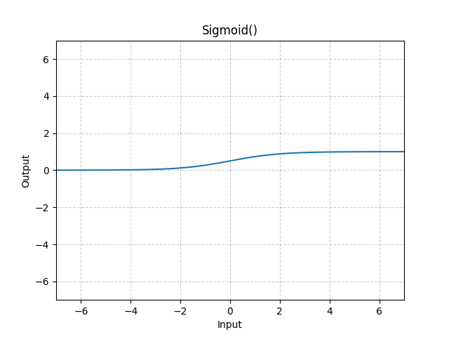

## 2、nn.Tanh

$$Tanh(x) = tanh(x) = \frac{exp(x) - exp( - x)}{exp(x) + exp( - x)}$$

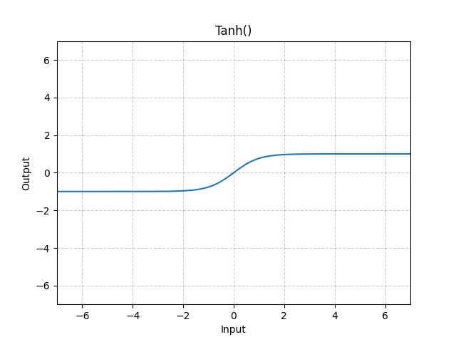

## 3、nn.ReLU

$$ReLU(x) = (x)^{+} = \max(0,x)$$

## 4、nn.LeakyReLU

$$LeakyReLU(x) = \{\begin{array}{r}
x,\ \ \ \ \ \ \ \ \ \ \ \ \ \ \ \ \ \ \ \ \ \ \ \ \ \ \ \ \ \ \ \ \ ,if\ x \geq 0\ \ \ \ \ \ \  \\
negative\_ slope \times x,\ otcherwise
\end{array}$$

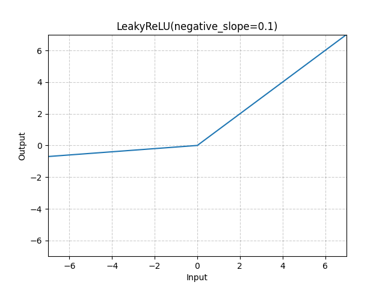

## 5、nn.PReLU

$$PReLU(x) = \{\begin{array}{r}
x\ \ \ \ \ \ \ \ ,if\ x \geq 0\ \ \ \ \ \  \\
\alpha \times x,\ otcherwise
\end{array}$$

其中$\alpha$是一个可学习的参数。使用该函数时，要避免使用权重衰减。

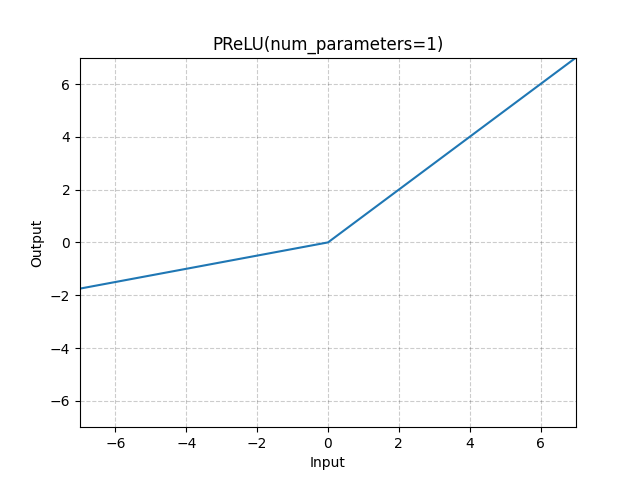

## 6、nn.RReLU

$$RReLU(x) = \{\begin{array}{r}
x\ \ \ \ \ \ \ \ ,if\ x \geq 0\ \ \ \ \ \  \\
\alpha \times x,\ otcherwise
\end{array}$$

$\alpha$是从均匀分布中采用的来。

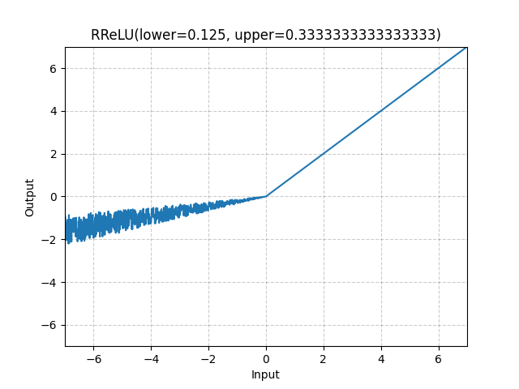

## 7、nn.ELU

$$ELU(x) = max(0,x) + min(0,\alpha*(\exp(x) - 1)) = \left\{ \begin{array}{r}
x\ \ \ \ \ \ \ \ \ \ \ \ \ \ \ \ \ \ \ \ \ \ \ \ \ \ \ \ \ \ ,x \geq 0 \\
\begin{array}{r}
\ \ \ \ \ \  \\
\alpha \times (exp(x) - 1),\ x < 0
\end{array}
\end{array} \right.\ $$

ELU不同于ReLU的点是，它可以输出小于0的值，使得系统的平均输出为0。因此，ELU会使得模型收敛的更加快速，其变种(CELU,
SELU)只是不同参数组合ELU。

## 8、nn.CELU

$$CELU(x) = max(0,x) + min(0,\alpha*(\exp(\frac{x}{\alpha}) - 1))$$

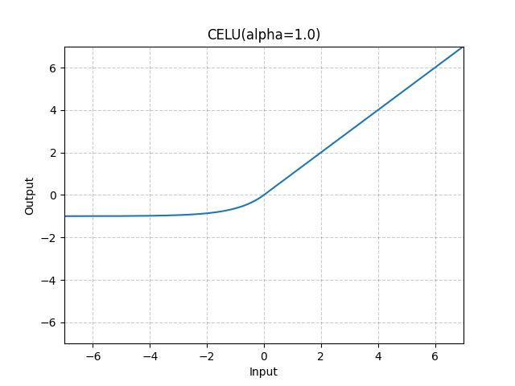

## 9、nn.SELU

$$SELU(x) = scale*\left( \max(0,x) + min\left( 0,\alpha*\left( {exp}(x) - 1 \right) \right) \right)$$

其中$\alpha = 1.67$，$\text{scale} = 1.05$。当使用kaiming_normal或kaiming_normal_初始化时,
应使用nonlinearity=\'linear\' 而不是使用nonlinearity=\'selu\'。

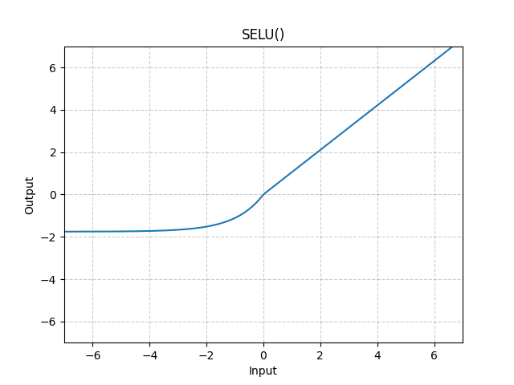

## 10、nn.ReLU6

$$ReLU6(x) = min(max(0,x),6)$$

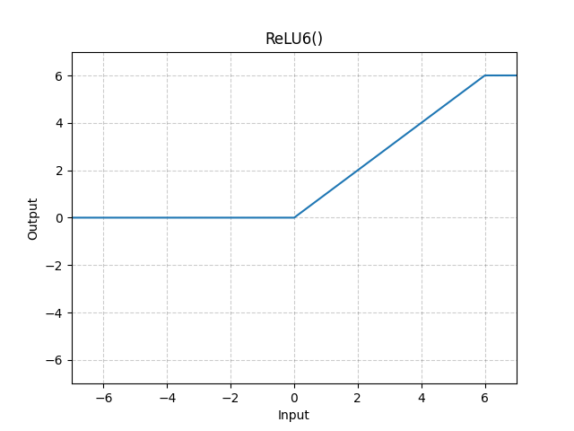

ReLU6是在ReLU的基础上，限制正值的上限为6。

## 11、nn.Softplus (beta=1, threshold=20)

$$Softplus(x) = \frac{1}{\beta}*\log(1 + \exp(\beta*x))$$

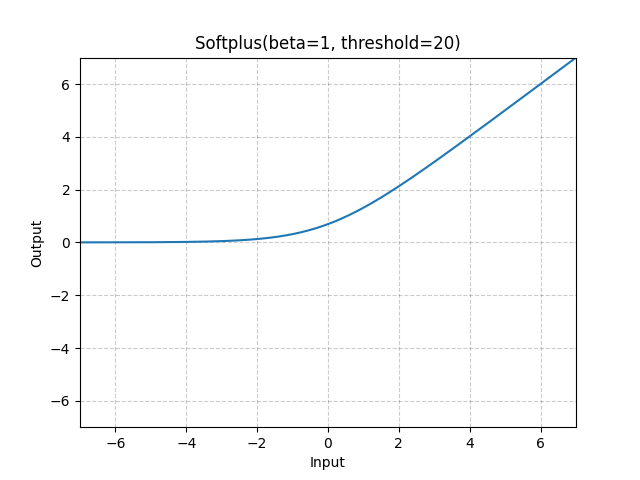

Softplus是ReLU的光滑近似，可以有效的对输出都为正值的网络进行约束。随着$\beta$的增加，Softplus与ReLU越来越接近。为了数值稳定性，input×β\>threshold.

## 12、nn.Mish

$$Mish(x) = x*Tanh(Softplus(x)) = x*\frac{exp(x) + 2}{exp(x) + 2 + 2exp( - x)}$$

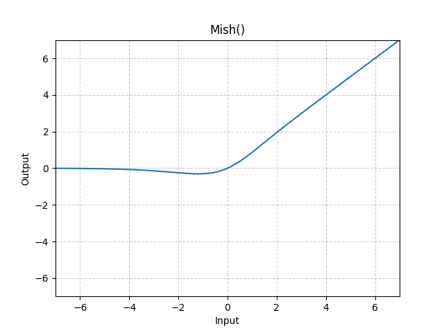

Mish激活函数中的softplus函数中的$\beta$为1。在网络层数较深时，mish激活函数效果较好。其无上界有下届，非单调，无穷阶连续且光滑。

## 13、nn.SiLU（Swish）

$$SiLU(x) = x*\sigma(x) = \frac{x}{1 + \exp( - x)}$$

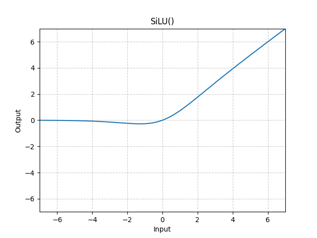

## 14、nn.GELU

$$GELU(x) = x*\Phi(x)$$

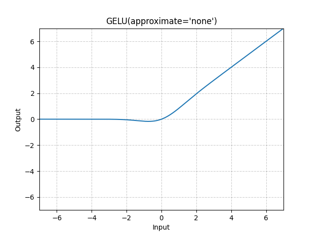

其中，$\Phi(x)$是高斯分布的累积分布函数。其可近似使用tanh激活函数代替。该函数在NLP任务中经常使用。

$$GELU(x) = 0.5 \times x \times (1 + Tanh(\sqrt{\frac{2}{\pi}}*(x + 0.044715*x^{3})))$$
