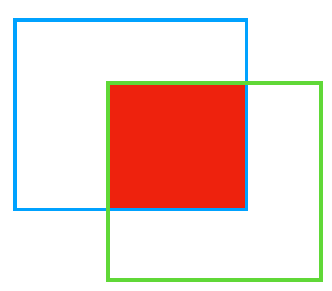
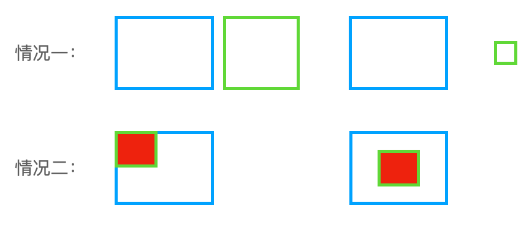
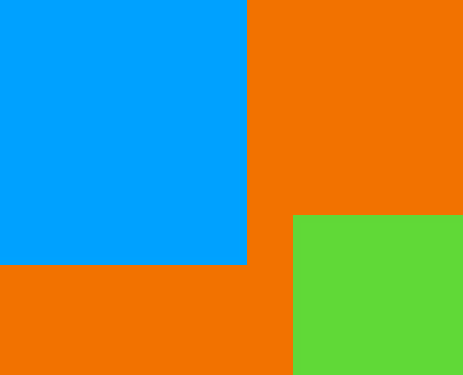
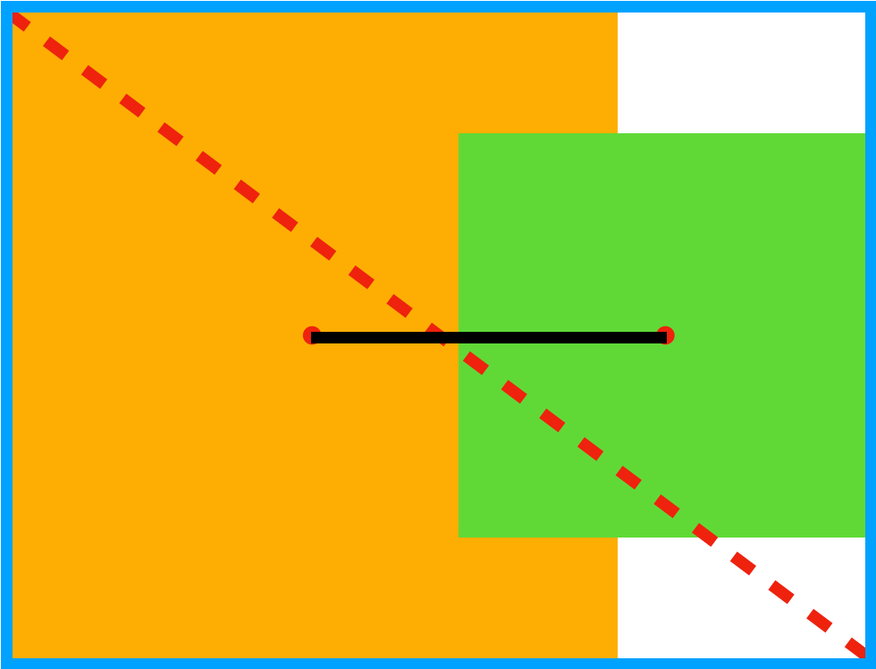

# 目标检测八股

## IoU变种合集

### IoU

交并比 (IoU) 是目标检测中的一个重要概念，即为目标框与真实框交集与并集的比值，如上图中图上红色部分为蓝绿两个方块的交集，该部分与蓝绿两个方块的并集面积的比值就是交并比。

$\mathrm{IoU}(\mathrm{B}_1,\mathrm{B}_2)=\frac{|\mathrm{B}_1\cap\mathrm{B}_2|}{|\mathrm{B}_1\cup\mathrm{B}_2|}$

可见当两个框完全重叠时，其交并比为 1，完全不重叠时为 0。那么损失即可定义为$\mathrm{L_{IoU}}=1-\mathrm{IoU}(\mathrm{B},\mathrm{B_{gt}})$

但该方式还存在两个问题：

1. 当真实框和预测框完全不重叠时，因为其损失都为 1，则无法反映预测框离真实框的远近
2. 当真实框包含预测框，且真实框与预测框的大小固定时，其 IoU 很定为预测框与真实框面积的比值，则无论预测框在真实框中的哪个位置，损失都不变。

### GIoU

GIoU 在 IoU 的基础上还增加了一个框，即为能够同时框住真实框与预测框的最小的框，

$\mathrm{x_{1}^{c}=min(x_{1}^{B},x_{1}^{B_{gt}}),\quad x_{2}^{c}=max(x_{2}^{B},x_{2}^{B_{gt}})}\\\mathrm{y_{1}^{c}=min(y_{1}^{B},y_{1}^{B_{gt}}),\quad y_{2}^{c}=max(y_{2}^{B},y_{2}^{B_{gt}})}\\\mathrm{C=(x_{2}^{c}-x_{1}^{c})\times(y_{2}^{c}-y_{1}^{c})}\\\mathrm{GIoU(B,B_{gt})=IoU(B,B_{gt})-\frac{|C-(B\cup B_{gt})|}{|C|}}\\\mathrm{L_{GIoU}~(B,B_{gt})=1-GIoU(B,B_{gt})=1-IoU(B,B_{gt})+\frac{|C-(B\cup B_{gt})|}{|C|}}$

GIoU 中，真实框与预测框距离越远时, C 的值也越大，C 减去预测框与真实框面积的值也越大，最后趋近于 1。那么真实框与预测框当越远时，损失也越接近 2。但是 GIoU 虽然解决了真实框与预测框完全分离时 IoU 无法衡量两者距离的问题，但是依旧无法解决问题二。

### DIoU

DIoU 中使用真实框和预测框中心点距离的平方与两者最小框 C 对角线长度平方的比值作为衡量标准的一部分。黄色和绿色的方块分别为真实框和预测框，其中红色的点为两者的重点，中间的黑色线段为真实框和预测框中点的连线。蓝色的框为最小框 C，红色虚线为 C 的对角线。DIoU 的计算方法以及损失如下：

$\begin{gathered}
\mathrm{x_{1}^{p}~=x_{2}^{B}~-x_{1}^{B}~,~y_{1}^{p}~=y_{2}^{B}~-y_{1}^{B}} \\
\mathrm{x_{2}^{p}~=x_{2}^{B_{gt}}~-x_{1}^{B_{gt}}~,~y_{2}^{p}~=y^{B_{gt}}~-y_{1}^{B_{gt}}} \\
\mathrm{\rho^{2}(B,B_{gt})=(x_{1}^{p}-x_{2}^{p})^{2}+(y_{1}^{p}-y_{2}^{p})^{2}} \\
x_{1}^{\mathrm{c}} \\
\mathrm{y_{1}^{c}=min(y_{1}^{B},y_{1}^{B_{gt}}),\quad y_{2}^{c}=max(y_{2}^{B},y_{2}^{B_{gt}})} \\
\mathrm{c^2=(x_2^c-x_1^c)^2+(y_2^c-y_1^c)^2} \\
\mathrm{DIoU(B,B_{gt})=IoU(B,B_{gt})-\frac{\rho^2(B,B_{gt})}{c^2}} \\
\mathrm{L_{DIoU}\left(B,B_{gt}\right)=1-DIoU(B,B_{gt})=1-IoU(B,B_{gt})+\frac{\rho^{2}(B,B_{gt})}{c^{2}}} 
\end{gathered}$

其中， $b$和$b^{gt}$分别代表了预测框和真实框的中心点，且$ρ$代表的是计算两个中心点间的欧式距离。$c$代表的是能够同时包含预测框和真实框的最小闭包区域的对角线距离。

✒️优点：DIoU 的好处即为解决了最初的第二个问题，使得预测框的中心点能够向真实框的中心点靠近。同时 DIoU 相比 GIoU 能够更快地收敛。

### CIoU

CIoU 为 DIoU 的再次升级版，其中考虑到了预测框与真实框的长宽比例问题，再其中新添加了两个参数，即：

$\begin{gathered}
\mathrm{CIoU(B,B_{gt})=IoU(B,B_{gt})-\frac{\rho^{2}(B,B_{gt})}{c^{2}}-\alpha v} \\
\mathrm{v} = \frac{4}{\pi} \left(\arctan\frac{\mathrm{w^{gt}}}{\mathrm{h^{gt}}} -\arctan\frac{\mathrm{w}}{\mathrm{h}} \right)^{2} \\
\alpha=\frac{\mathrm{V}}{1-\mathrm{IoU}(\mathrm{B},\mathrm{B}_{\mathrm{gt}})+\mathrm{v}} 
\end{gathered}$

$-1 \leq CIoU \leq 1$

其中 v 为预测框和真实框长宽比例差值的归一化，$ \left(\arctan\frac{\mathrm{w^{gt}}}{\mathrm{h^{gt}}} -\arctan\frac{\mathrm{w}}{\mathrm{h}} \right)^{2}$部分的值在 0 到 π/4 之间，乘以 4/π 后就可以转化为到 0 到 1 之间。而 $\alpha$为权衡长宽比例造成的损失和 IoU 部分造成的损失的平衡因子。

CIoU 通过更多的维度来考虑预测框与真实框的差异，效果更好，所以一般使用 CIoU。

## 检测模型里为啥用smoothL1去回归bbox

首先，对于L2 loss，其导数包含了$(f(x)-Y)$，所以当预测值与gt差异过大时，容易梯度爆炸；
而对于L1 loss，即使训练后期预测值和gt差异较小，梯度依然为常数，损失函数将在稳定值附近波动，难以收敛到更高精度。

对输入$x$ ,输出$f(x)$ ,标签$Y:$

L2 loss$=\left|f\left(x\right)-Y\right|^{2}$ ,其导数为 2$\left(f\left(x\right)-Y\right)f^\prime\left(x\right);$

L1 loss$=\left|f\left(x\right)-Y\right|$ ,其导数为$\pm f^\prime\left(x\right)$ 。

所以SmoothL1 loss结合了两者的优势，当预测值和gt差异较大时使用L1 loss；差异较小时使用L2 loss：
$$\begin{flalign}L_{\mathrm{loc}}(t^u,v)=\sum_{i\in\{\mathrm{x,y,w,h}\}}\mathrm{smooth}_{L_1}(t_i^u-v_i),\end{flalign}$$
$$\begin{flalign}\mathrm{smooth}_{L_1}(x)=\begin{cases}0.5x^2&\mathrm{if}\:|x|<1\\|x|-0.5&\mathrm{otherwise},\end{cases}\end{flalign}$$

# RCNN系列

## 算法步骤

RCNN算法流程可分为4个步骤

- 一张图像生成1K~2K个候选区域(使用Selective Search方法)
- 对每个候选区域，使用深度网络提取特征
- 特征送入每一类的SVM 分类器，判别是否属于该类
- 使用回归器精细修正候选框位置

Fast R-CNN算法流程可分为3个步骤

- 一张图像生成1K~2K个候选区域(使用Selective Search方法)
- 将图像输入网络得到相应的特征图，将SS算法生成的候选框投影到特征图上获得相应的特征矩阵
- 将每个特征矩阵通过ROI pooling层缩放到7x7大小的特征图，接着将特征图展平通过一系列全连接层得到预测结果

Faster R-CNN算法流程可分为3个步骤

- 将图像输入网络得到相应的特征图
- 使用RPN结构生成候选框，将RPN生成的候选框投影到特征图上获得相应的特征矩阵
- 将每个特征矩阵通过ROI pooling层缩放到7x7大小的特征图接着将特征图展平通过一系列全连接层得到预测结果

## Selective Search算法

Selective Search算法主要用于在图像中生成可能包含目标的候选区域（Region Proposals）。

### 算法步骤：

1. **初始化区域集合**：首先将图像分割成多个小区域。
2. **计算相似度**：计算所有相邻区域的相似度。
3. **合并相似区域**：选择相似度最高的两个区域进行合并，并从区域集合中移除这两个区域，将合并后的新区域加入集合。
4. **重复步骤2和3**：重复计算相似度和合并区域的过程，直到所有相邻区域的相似度都被计算过。
5. **生成候选区域**：最终得到的区域集合即为候选区域。

### 相似度计算：

Selective Search算法在计算区域间的相似度时，主要考虑以下几个方面：

- **颜色相似度**：使用图像的颜色直方图来计算区域间的颜色相似度。
- **纹理相似度**：使用SIFT等特征来计算区域的纹理相似度。
- **大小相似度**：鼓励合并小区域，以便生成更完整的对象区域。
- **填充相似度**：考虑区域的边界框与区域内部像素的关系，以避免生成过于紧密的区域。

### 优点：

- **多样性**：通过考虑多种相似度，Selective Search能够生成多样化的候选区域。
- **高效性**：算法相对高效，能够快速生成大量候选区域。

### 缺点：

- **计算量大**：对于大型图像，生成所有候选区域可能需要较长时间。
- **可能遗漏小目标**：由于算法倾向于合并小区域，可能会导致小目标的候选区域不够准确。

## RPN结构

### 算法步骤：

1. **锚点（Anchors）**：在特征图的每个位置，RPN生成多个不同大小和宽高比的矩形框，称为锚点。这些锚点覆盖了多种可能的目标形状和大小。
2. **卷积层和全连接层**：RPN在共享的特征图上应用一个小的卷积网络，通常是一个3x3的卷积层，接着是两个并行的1x1卷积层。一个用于分类（是否包含目标），另一个用于边界框回归（调整锚点以更好地匹配目标）。
3. **分类分支**：这个分支为每个锚点预测其包含目标的概率。通常使用二分类（目标/非目标）来判断每个锚点是否包含目标。
4. **边界框回归分支**：这个分支为每个正类锚点（即被判断为包含目标的锚点）预测边界框的偏移量。这些偏移量用于调整锚点，使其更精确地覆盖目标。

### RPN的训练

RPN的训练是端到端的，它通过最小化一个多任务损失函数来实现。这个损失函数包括两部分：

- **分类损失**：通常使用交叉熵损失来衡量锚点分类的准确性。
- **回归损失**：使用平滑L1损失来衡量边界框回归的准确性。

## ROI Pooling

### 算法步骤：

1. **输入特征图和ROI**：ROI pooling层接收两个输入：一个是卷积神经网络（CNN）生成的特征图（feature map），另一个是ROI列表，这些ROI是由SS算法或RPN生成的候选区域。
2. **ROI划分**：对于每个ROI，ROI pooling层将其映射到特征图上，并将其划分为固定大小的网格（例如7×7）。这个映射通常是通过将ROI的坐标从原始图像空间转换到特征图空间来完成的。
3. **池化操作**：对于每个网格单元，ROI pooling层执行最大池化操作，即在每个网格单元内选择最大的特征值作为该单元的输出。这一步骤确保了无论ROI的原始大小如何，输出都是固定大小的H×W特征图。
4. **输出固定大小的特征图**：每个ROI经过上述步骤后，都会生成一个固定大小的特征图，这些特征图随后被送入后续的全连接层进行分类和边界框回归。

### 优点：

- **灵活性**：ROI pooling层允许网络处理不同大小的输入图像和ROI，这使得网络更加灵活和高效。
- **加速训练和测试**：通过将不同大小的ROI转换为固定大小的特征图，ROI pooling层简化了后续层的处理，从而加速了整个网络的训练和测试过程。

### 划分网格

在ROI Pooling层中，划分网格的过程如下：

1. **确定输出大小**：首先确定所需的输出特征图的大小，例如H×W。
2. **计算网格单元的尺寸**：对于映射到特征图上的ROI区域，计算其宽度和高度。然后，将宽度除以W，将高度除以H，得到每个网格单元的尺寸。
3. **划分ROI**：根据计算出的网格单元尺寸，将ROI区域划分为H×W个网格单元。这个划分是基于像素的，即每个网格单元的边界落在特征图的像素边界上。
4. **处理边界情况**：如果ROI的宽度和高度不是W和H的整数倍，那么在划分网格时，某些网格单元可能会跨越ROI的边界。在这种情况下，通常会将网格单元的边界调整到最近的像素边界，以确保每个网格单元都是矩形。

Faster R-CNN中的损失函数是一个多任务损失，它结合了分类损失和边界框回归损失。这个损失函数用于训练RPN（Region Proposal Network）和最终的检测网络。下面详细介绍这两个部分：

## 损失函数

### 1. RPN损失函数

RPN的损失函数包括两个部分：分类损失和边界框回归损失。

##### 分类损失（$L_{cls}$）

分类损失是一个二分类损失，用于判断每个锚点（anchor）是否包含目标。使用交叉熵损失来衡量预测概率与真实标签之间的差异。数学表达式为：

$L_{cls}(p_i,p_i^*)=-\frac1{N_{cls}}\sum_i[p_i^*\log(p_i)+(1-p_i^*)\log(1-p_i)]$

其中，$( p_i ) $是锚点 $( i ) $的预测概率，$( p_i^* )$ 是锚点$ ( i )$ 的真实标签（1表示正类，0表示负类）。

##### 边界框回归损失（$L_{reg}$）

边界框回归损失用于调整锚点，使其更精确地匹配目标的边界框。使用平滑L1损失（smooth L1 loss）,数学表达式为：
$L_{reg}(t_i, t_i^*) = \sum_{i \in {x, y, w, h}} \text{smooth}_{L1}(t_i - t_i^*)$
其中，$( t_i )$是锚点$ ( i )$ 的预测边界框偏移量，$( t_i^* ) $是锚点$ ( i )$ 的真实边界框偏移量。

RPN的总损失是分类损失和边界框回归损失的加权和：
$L({p_i}, {t_i}) = \frac{1}{N_{cls}} \sum_i L_{cls}(p_i, p_i^*) + \lambda \frac{1}{N_{reg}} \sum_i p_i^* L_{reg}(t_i, t_i^*)$
其中$N_{cls}$ 和$ N_{reg}$是归一化常数，用于平衡两个损失项，$\lambda$是平衡分类损失和回归损失的超参数。

### 2. 检测网络损失函数

检测网络的损失函数与RPN类似，也包括分类损失和边界框回归损失。分类损失用于对每个建议区域（proposal）进行分类，而边界框回归损失用于调整建议区域以更好地匹配目标。

##### 分类损失（$L_{cls}$）

对于每个建议区域，分类损失是一个多类别的交叉熵损失，用于预测目标的类别。

##### 边界框回归损失（$L_{reg}$）

边界框回归损失与RPN中的相同，用于调整建议区域的边界框。

**检测网络的总损失**是分类损失和边界框回归损失的加权和，类似于RPN的损失函数。

# YOLO系列

## YOLO分类头和回归头

在YOLO（You Only Look Once）目标检测算法中，分类头（classification head）和回归头（regression head）是网络结构中的两个不同的输出分支，它们分别负责不同的任务。

1. 分类头（Classification Head）：
   分类头的主要任务是对检测到的边界框（bounding box）进行分类，即确定边界框内包含的是哪一个类别的目标。在YOLO中，分类头通常输出一个概率分布，表示每个边界框属于各个类别的概率。例如，在一个有C个类别的数据集上，分类头会为每个边界框输出一个C维的向量，其中每个元素表示该边界框属于对应类别的可能性。
2. 回归头（Regression Head）：
   回归头的主要任务是预测边界框的精确位置和大小。在YOLO中，回归头通常输出四个值，分别表示边界框的中心点坐标（x, y）以及边界框的宽度和高度（w, h）。这些值通常是相对于图像或特征图的尺寸进行归一化的，以便网络可以学习到尺度不变的表示。

YOLO算法通过同时使用分类头和回归头，能够在一个统一的网络结构中完成目标的检测和分类任务。网络的输出层会为每个预测的边界框提供分类概率和位置信息，然后通过后处理步骤（如非极大值抑制NMS）来去除重叠的边界框，得到最终的检测结果。

总结来说，分类头关注的是“是什么”（目标的类别），而回归头关注的是“在哪里”（目标的位置和大小）。两者协同工作，使得YOLO能够高效地进行目标检测。

## YOLO解耦头和非解耦头

在YOLO系列的目标检测算法中，解耦头（Decoupled Head）与非解耦头（Non-Decoupled Head）指的是网络输出层的设计方式。

1. 非解耦头（Non-Decoupled Head）：
   在早期的YOLO版本中，通常使用非解耦头，即分类和边界框回归任务共享同一个输出层。这意味着网络的最后一部分会同时输出分类概率和边界框的位置信息。这种设计简单直接，但由于分类和回归任务共享相同的特征，可能会导致两个任务之间的干扰，影响检测性能。
2. 解耦头（Decoupled Head）：
   随着YOLO算法的发展，研究者们发现将分类和回归任务解耦可以提高检测性能。解耦头指的是将分类任务和边界框回归任务分别用不同的输出层来处理。这样，每个任务可以有自己的特征表示，减少了任务间的干扰。例如，在YOLOv3和YOLOv4中，分类和回归任务使用相同的输出层，而在YOLOv5和YOLOX中，采用了解耦头的设计，分别对分类和回归任务进行优化。

解耦头的设计通常能够带来更好的性能，因为它允许网络更专注于每个任务的特定需求。分类任务可能更关注于目标的语义信息，而回归任务则更关注于目标的精确位置和形状。通过解耦，网络可以更有效地学习到适合每个任务的特征表示。

总结来说，解耦头与非解耦头的区别在于是否将分类和回归任务分开处理。解耦头通过为每个任务提供独立的输出层，有助于提高目标检测的准确性和效率。

## YOLO anchor based/free

### Anchor-Based 方法

在anchor-based方法中，网络会在特征图的每个位置预先定义一组固定大小和宽高比的边界框，这些预定义的框称为“anchors”。这些anchors通常是通过对训练数据集中的边界框进行聚类分析得到的，以确保它们能够覆盖数据集中常见的目标大小和形状。

在检测过程中，网络会为**每个anchor预测一个偏移量**，这些偏移量用于调整anchor的位置、大小和宽高比，以匹配实际的目标边界框。具体来说，网络会输出以下信息：

- **分类概率**：每个anchor属于各个类别的概率。
- **边界框偏移量**：相对于原始anchor，目标边界框的中心点坐标偏移量、宽度和高度的缩放因子。

通过这些偏移量，可以将anchor“变形”成与目标更匹配的边界框。然后，通过非极大值抑制（NMS）等后处理步骤，去除重叠的边界框，得到最终的检测结果。

### Anchor-Free 方法

在anchor-free方法中，网络不依赖于预定义的anchors，而是直接预测目标的中心点位置和边界框的大小。这种方法通常会输出以下信息：

- **中心点热度图**：特征图上的每个位置都有一个热度值，表示该位置是目标中心点的概率。
- **边界框大小**：直接预测目标边界框的宽度和高度。

在一些anchor-free方法中，还会预测中心点与边界框四个边的距离，或者预测边界框的角点位置。

Anchor-free方法的一个关键优势是简化了网络的输出结构，减少了超参数的数量，并且通常更加直观。它不需要手动设置anchors的参数，也不需要对anchors进行聚类分析。

## YOLOV1-V5改进

⭐**YOLOV1**: 

- one-stage开山之作，将图像分成S*S的单元格，根据物体中心是否落入某个单元格来决定哪个单元格来负责预测该物体，每个单元格预测两个框的坐标、存在物体的概率（和gt的IoU）、各类别条件概率。
- 损失函数：均采用均方误差。
- 优点：速度快。
- 缺点：1、每个单元格预测两个框，并且只取和gt IoU最大的框，相当于每个单元格只能预测一个物体，**无法处理密集物体场景**。2、输出层为**全连接层**，只能输入固定分辨率图片 3、**计算IoU损失时，将大小物体同等对待**，但同样的小误差，对大物体来说是微不足道的，而对小物体来说是很严重的，这会导致定位不准的问题。4、没有密集锚框、没有RPN，导致召回率低

**⭐YOLOV2:**

- 改进点：

(1)、**Batch normalization**替代dropout，防止过拟合 

(2)、**去掉全连接层，使用类似RPN的全卷积层**

(3)、**引入Anchor**，并使用k-means聚类确定anchor大小、比例，提高了recall 

(4)、高分辨率预训练backbone （224-->448）

(5)、**限定预测框的中心点只能在cell内，具体通过预测相对于cell左上角点的偏移实现**，这样网络收敛更稳定 

(6)、添加passthrough层，相当于多尺度特征融合，$1 \ast 1$卷积将$26 \ast 26 \ast 512$ feature map降维成$26 \ast 26 \ast 64$, 然后将特征重组，拆分为4份$13 \ast 13 \ast 64$，concate得到$13 \ast 13 \ast 256$ feature map，和低分辨率的$13  \ast 13 \ast 1024$ feature map进行concate

(7)、提出Darknet19进行特征提取，参数更少，速度更快

**⭐YOLOV3:**

(1)、**改变了输出层的激活函数，使用sigmoid分类器替代softmax分类器**，可以处理多标签分类问题

(2)、**引入残差结构，进一步加深网络深度（使用Darknet53）**

(3)、**多尺度预测，使用FPN模块**，每个尺度预测3个bbox（YOLOV2为5个）

**⭐YOLOV4:**

(1)、**Mosaic data augmentation**：四张图片拼接成一张图片，扩充样本的多样性

(2)、**DropBlock**：drop out只丢弃单个像素，而因为二维图像中相邻特征强相关，所以丢弃后网络依然可以推断出丢失区域信息，导致过拟合；所以dropblock选择丢弃一块连续区域。

(3)、label smoothing

 (4)、CIoU loss
CIoU = IoU + bbox中心距离/对角线距离+长宽比例之差

-1<=CIoU<=1

 (5)、YOLO with SPP：就是用不同大小的卷积核对特征图进行卷积，得到不同感受野的特征，然后concate到一起。

 (6)、**由yolov3的darknet-53升级为了CSPDarknet53。**采用了CSP网络中的CSP模块，使用了Mish激活函数。

 (7)、在yolov3的基础上（FPN模块）又增加了PAN模块，PAN简单理解就是FPN多了一条Bottom-up path augmentation。下图中(a)为FPN模块，(b)为PAN模块

 (8)、对于yolov2中限定限定预测框的中心点只能在cell内，其放宽了限制，可以到超过0.5个格子，并以此进一步扩充正样本比例

**⭐YOLOV5:**

(1)、将yolov4中的CSPDarknet53进行了更新，采用了等价于SPP的SPPF模块，对PAN换成了CSP-PAN，即将CSP模块加入到了PAN中

(2)、可以针对数据集设置初始的Anchor。具体而言每次训练数据集之前，都会使用K-means算法自动计算该数据集最合适的Anchor尺寸

(3)、采用**Focus结构**减少FLOPs，提高速度。但后面使用了6*6卷积代替了该结构。

(4)、针对不同特征层上采用不同权重的损失计算

## YOLOX核心改进：

(1)✒️Decoupled head：就是anchor free方法里最常用的cls head和reg head

(2)✒️Anchor-free: 即类似FCOS，不同的是预测的是中心点相对于grid左上角坐标的offset值，以及bbox的长宽，将物体中心的某个区域内的点定义为正样本，并且每个尺度预测不同大小物体。

(3)✒️Label assignment(SimOTA): 将prediction和gt的匹配过程建模为运输问题，使得cost最小。

- cost表示：$pred_i$和$gt_j$的cls和reg loss。
- 对每个gt，选择落在指定中心区域的top-k least cost predictions当作正样本，每个gt的k值不同。
- 最佳正锚点数量估计：某个gt的适当正锚点数量应该与该gt回归良好的锚点数量正相关，所以对于每个gt，我们根据IoU值选择前q个预测。这些IoU值相加以表示此gt的正锚点估计数量。

## 损失函数

### 1 分类损失

对于分类损失，最初YOLOv1,v2采用的多类交叉熵损失来度量分类误差。

${y_i~=~Softmax(x_i)=\frac{e^{x_i}}{\sum_{n=1}^Ne^{x_n}}}$

${L_{class}~=-\sum_{n=1}^Ny_n^*\log(y_n)}$

yolov3 之后考虑到一个目标可能同时属于多个类别，如同时识别一个人的性别和姿态，则会输出如“男性”、“行走”两个结果。此时概率之和可能将大于 1。故在 yolov3 之后则对每一个类别预测的结果使用二元交叉熵损失：

${y_i~=Sigmoid(x_i)=\frac1{1+e^{-x_i}}}$

${L_{class}~=-\sum_{n=1}^Ny_i^*\log(y_i)+(1-y_i^*)\log(1-y_i)}$

### 2 边界框定位损失

在之前的版本中，使用的是平方损失，即：$\mathrm{L_{local}~=(x-x^*)^2+(y-y^*)^2+(w-w^*)^2+(h-h^*)^2}$

但该方法存在一定问题，由于边界框预测需要着重于该框与真实框的重叠区域面积，且重叠区域的面积与两者并集区域的面积之比越大越好，但光使用平方损失无法很好地衡量这一点。为了解决这一问题，之后衍生出多个[基于 IoU 的损失计算方式](#IoU变种合集)。

### 3 置信度损失

置信度损失用于度量预测边界框是否包含目标的置信度误差，包括前景和背景的置信度。

$\text{confidence}=\Pr(\text{object})\times\text{IOU}_{\text{pred}}^{\text{truth}}$

$Pr(\text{object})$表示该边界框包含目标的概率，$\text{IOU}_{\text{pred}}^{\text{truth}}$是预测框与真实框之间的交并比。

假设第i个网格单元预测的置信度为 $C_i$，真实置信度为$C_i^*$，则置信度损失定义为：

$L_{conf}=\sum_{i=0}^{S^2}\sum_{j=0}^B1_{ij}^{obj}(C_i-C_i^*)^2+\lambda_{ncobj}\sum_{i=0}^{S^2}\sum_{j=0}^B1_{ij}^{ncobj}(C_i-C_i^*)^2$

其中，$\lambda_{ncobj}$是背景置信度损失的权重系数，$1_{ij}^{ncobj}$​ 表示第i个网格单元不包含目标。

YOLOv1和YOLOv2采用平方误差来计算置信度损失。YOLOv3及以后版本采用二元交叉熵损失来计算置信度损失，提升了计算稳定性和准确性。

**总损失函数**是上述三部分损失的加权和：$L=L_{loc}+L_{conf}+L_{cls}$

# DETR系列

## 前言

DETR（**DE**tection **TR**ansformer）基于 Transformer 的端到端目标检测，没有非极大值抑制 NMS 后处理步骤、没有 anchor 等先验知识和约束，整个由网络实现端到端的目标检测实现，大大简化了目标检测的 pipeline。DETR把目标检测任务也变成一个 Set Prediction 任务，即一口气预测一个集合。

## DETR 框架

DETR 分为四个部分，首先是一个 CNN 的 backbone，Transformer 的 Encoder，Transformer 的 Decoder，最后的预测层 FFN。

### CNN Backbone

目标检测的图一般比较大，那么直接上 Transformer 计算上吃不消，所以先用 CNN 进行特征提取并缩减尺寸，再使用 Transformer 是常规操作（或者说无奈之举）。原始 DETR 使用 Imagenet 预训练好的 Resnet。

### Transformer Encoder

经过 Backbone 后，将输出特征图 reshape 为$ C × H W $，因为 C = 2048 是每个 token 的维度，还是比较大，所以先经过一个 1 × 1的卷积进行降维，然后再输入 Transformer Encoder 。此时自注意力机制在特征图上进行全局分析，因为最后一个特征图对于大物体比较友好，那么在上面进行 Self-Attention 会便于网络更好的提取不同位置不同大物体之间的相互关系的联系，比如有桌子的地方可能有杯子，有草坪的地方有树，有一个鸟的地方可能还有一个鸟等等。所以 DETR 在大目标上效果比 Faster RCNN 好就比较容易理解到了。位置编码是被每一个 Multi-Head Self-Attention 前都加入。为了体现图像在 x 和 y 维度上的信息，作者的代码里分别计算了两个维度的 Positional Encoding，然后 Cat 到一起。整个 Transformer Encoder 和之前的没什么不同。

### Transformer Decoder

Transformer Decoder 首先就是如何考虑同时进行一个集合预测？之前的一些分类任务（ViT）的时候都是给一个 class token，因为只进行一类预测。那么现在同时进行不知道多少类怎么办呢？因为目标预测框和输入 token 是一一对应的，所以最简单的做法就是给超多的查询 token，超过图像中会出现的目标的个数（在过去也是先生成 2000 个框再说）。所以在 DETR 中，作者选择了固定的 N = 100 个 token 作为输入，只能最多同时检测 100 个物体。输入 100 个 decoder query slots (Object Query)，并行解码N个object，对应的 Transformer decoder 也就会输出 100 个经过注意力和映射之后的 token，然后将它们同时喂给一个 FFN 就能得到 100 个框的位置和类别分数（因为是多分类，所以类别个数是 K + 1，1 指的是背景类别）。

**Object query**是一组初始化为随机值的可学习参数，它们在模型训练过程中通过反向传播进行更新。在Transformer Decoder 中，Object query作为初始的查询向量，与编码器输出的特征图进行交互。Object query学习关注图像中的不同区域，从而定位潜在的目标。

DETR 的 Decoder 也加了 Positional Encoding。这个思想其实也很自然。当作图像分类是，其实 class token 就一个，对应整个图片，那么自然无需 positional encoding，自己把整个图都占全了。但是在做目标检测时，可能会希望不同的 Object Query 是不是对应图像中不同的位置会好一些。那么按照这个思想，Object Query 自然就是 positional encodings，也就是我就是要查询这里的物体，你预测出来的就是对应的如果有物体的话就是它的类别和位置。

怎么加，在哪里加 positional encodings？ Transformer Decoder 做得比 Encoder 还要狠，不仅 encoder 用的那个 position encodings，也要给每层的 key 加上；Decoder 每一层的 query 还是加了 positional encodings (Object Query) 的。

还有一点值得注意的是：Decoder 每一层的输出结果也经过参数共享的最后的那个 FFN 进行预测并计算loss，实现 **深监督**。

### FFN

最后的 FFN 是由具有 ReLU 激活函数且具有隐藏层的 3 层线性层计算的，或者说就是 1 × 1卷积。FFN 预测框标准化中心坐标，高度和宽度，然后使用 softmax 函数激活获得预测类标签。

##  二分图匹配和损失函数

DETR 预测了一组固定大小的 N = 100 个边界框，这比图像中感兴趣的对象的实际数量大得多。怎么样来计算损失呢？或者说预测出来的框我们怎么知道对应哪一个 ground-truth 的框呢？

为了解决这个问题，第一步是将 ground-truth 也扩展成 N = 100 个检测框。使用了一个额外的特殊类标签 ϕ \phiϕ 来表示在未检测到任何对象，或者认为是背景类别。这样预测和真实都是两个100 个元素的集合了。这时候采用匈牙利算法进行二分图匹配，即对预测集合和真实集合的元素进行一一对应，使得匹配损失最小。

$\hat{\sigma}=\arg\min_{\sigma\in\widetilde{\Theta}_{\mathrm{N}}}\sum_{\mathrm{i}}^{\mathrm{N}}\mathcal{L}_{\mathrm{match}} \left(\mathrm{y_{i}},\hat{\mathrm{y}}_{\mathrm{\sigma(i)}}\right)\\\mathcal{L}_{\mathrm{match}} \left(\mathrm{y_i},\hat{\mathrm{y}}_{\sigma(i)}\right)=-1_{\{\mathrm{c_i}\neq\varnothing\}} \hat{\mathrm{p}}_{\sigma(\mathrm{i})} \left(\mathrm{c_i}\right)+1_{\{\mathrm{c_i}\neq\varnothing\}} \mathcal{L}_{\mathrm{box}} \left(\mathrm{b_i},\hat{\mathrm{b}}_{\sigma(\mathrm{i})}\right)$

我们来看看 ground truth$ y_i$和预测出来的第$\delta(i)$ 个结果之间的匹配损失。首先是对于那些不是背景的，获得其对应的预测是目标类别的概率，然后用框损失减去预测类别概率。这也就是说不仅框要近，类别也要基本一致，是最好的。经过匈牙利算法之后，我们就得到了 ground truth 和预测目标框之间的一一对应关系。然后就可以计算损失函数了。

损失函数和匹配损失不同之处在于，损失函数需要是正值，所以使用了 log-probability。对于$c_i = \phi $的类别损失，将分类损失除了 10，降低其作用，因为正负样本不均衡。这种思想和 Faster R-CNN 等一致。目标边界框回归损失则是 IOU 损失和 L1 损失的加权和，其中 IOU 损失对于 Scale 不敏感，L1 损失对于 Scale 敏感。事实上 DETR 用的是 GIoU 损失。

$$\mathcal{L}_{\mathrm{Hungarian~}}\left(\mathrm{y},\hat{\mathrm{y}}\right)=\sum_{\mathrm{i}=1}^{\mathrm{N}}\left[-\log\hat{\mathrm{p}}_{\hat{\sigma}(\mathrm{i})}\left(\mathrm{c}_{\mathrm{i}}\right)+1_{\{\mathrm{c}_{\mathrm{i}}\neq0\}}\mathcal{L}_{\mathrm{box}} \left(\mathrm{b}_{\mathrm{i}},\hat{\mathrm{b}}_{\hat{\sigma}}\left(\mathrm{i}\right)\right)\right]\\\mathcal{L}_{\mathrm{box}} \left(\mathrm{b}_{\mathrm{i}},\hat{\mathrm{b}}_{\mathrm{\hat{\sigma}}}\left(\mathrm{i}\right)\right)=\lambda_{\mathrm{iou}} \mathcal{L}_{\mathrm{iou}} \left(\mathrm{b}_{\mathrm{i}},\hat{\mathrm{b}}_{\mathrm{\sigma}\left(\mathrm{i}\right)}\right)+\lambda_{\mathrm{L}1} \left\|\mathrm{b}_{\mathrm{i}}-\hat{\mathrm{b}}_{\mathrm{\sigma}\left(\mathrm{i}\right)}\right\|_{1}$$

## 理解

Transformer 的 Self-Attention 对于目标检测友好的观点：Backbone 输出的特征图经过 1 × 1卷积后进行降维，得到的是$ d × H × W $，被 reshape 成 $d × H W $作为 Transformer Block 的输入。在 Encoder 阶段，会计算$H W × H$的 Attention Matrix，那么其实 Attention Matrix 上每一个值，其实就是考虑了 Backbone 输出的特征图空间上的两个点，因为 token 数量和特征图空间像素个数一样，那么这两个点，其实就已经构建出来了一个 box（左上角和右下角）。从这个角度来看，神经网络在基于 Attention Matrix 进行思考时，其实也可以从某种意义上就是在对一个个 bounding box 进行思考，这对于目标检测任务似乎是非常利好的。

## Object query与Class token

Object query和Class token都是在基于Transformer的模型中用于处理视觉任务的特殊标记，但它们在用途、位置和功能上有所不同。下面是它们的区别和联系：

**区别：**

1. **用途不同：**
   - Object query主要用于目标检测任务，它们是DETR模型中用于查询图像中目标位置和类别的可学习参数。
   - Class token主要用于图像分类任务，它是ViT模型中用于捕获图像全局信息并进行类别预测的特殊标记。
2. **位置不同：**
   - Object query在DETR的Transformer解码器中作为输入，它们与编码器输出的特征图进行交互。
   - Class token在ViT的输入序列中被添加，通常位于序列的开头，与图像块嵌入一起作为Transformer编码器的输入。
3. **功能不同：**
   - Object query通过解码器与编码器特征交互，学习定位和分类图像中的目标。
   - Class token通过Transformer编码器与其他图像块嵌入交互，捕获图像的全局上下文信息，用于分类。
4. **输出不同：**
   - Object query的输出（通过FFN之后）包括目标的位置（边界框）和类别。
   - Class token的输出是图像的全局表示，用于通过线性分类器进行类别预测。

**联系：**

1. **可学习参数：**
   - 两者都是可学习的参数，初始化为随机值，并在训练过程中通过反向传播进行更新。
2. **交互机制：**
   - 无论是Object query还是Class token，它们都通过Transformer中的自注意力和/或编码器-解码器注意力机制与其他输入元素进行交互。
3. **任务特定：**
   - 两者都是为了特定任务（目标检测或图像分类）而设计的，它们在模型中的作用是任务特定的。
4. **全局信息捕获：**
   - 尽管用途不同，但Object query和Class token都旨在捕获图像或场景中的全局信息，以便更好地完成其各自的任务。

