# 数据结构的实现类型

## 1 队列

对于队列，其是先进先出（First In First Out）类型，在Java中Queue是实现队列的接口，Queue的实现类有LinkedList（由链表实现，可作为双端队列）和PriorityQueue（优先队列，由数组存储，底层为堆）。
其常用的方法有

1. offer(int num)：入队，
2. int poll()：出队，
3. int peek()：返回队列顶部元素但不出队。

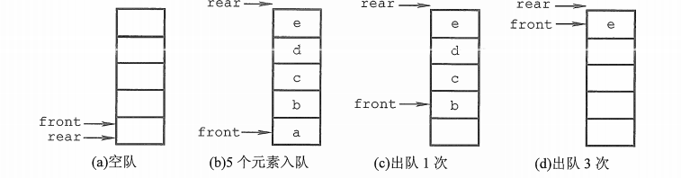

使用数组实现的环形队列代码如下：

	public class MyQueue {
	    private int[] arr;
	    private int head = 0; // 指向队列中第一个元素
	    private int tail = 0; // 指向队列中最后一个元素
	    private int size = 0;
	    private int maxSize;
	
	    public MyQueue(int maxSize) {
	        this.maxSize = maxSize;
	        arr = new int[maxSize];
	    }
	
	    public void offer(int num) {
	        grow();
	        arr[tail++] = num;
	        size++;
	        tail %= maxSize;
	    }
	
	    public int poll() {
	        if (isEmpty()) {
	            throw new RuntimeException("队列为空，无法取出数据");
	        }
	        int value = arr[head++];
	        size--;
	        head %= maxSize;
	        return value;
	    }
	
	    public int peek() {
	        if (isEmpty()) {
	            throw new RuntimeException("队列为空，无法取出数据");
	        }
	        return arr[head];
	    }
	
	    private void grow(){
	        if (size == maxSize){
	            int[] newArr = new int[maxSize * 2];
	            System.arraycopy(arr, head, newArr, 0, maxSize - head);
	            System.arraycopy(arr, 0, newArr, head + 1, head);
	            head = 0;
	            tail = maxSize; //对新的队列重新赋首尾值
	            maxSize *= 2;
	            arr = newArr;
	        }
	    }
	
	    public int size() {return size;}
	
	    public boolean isEmpty() {return size == 0;}
	
	    @Override
	    public String toString() {
	        StringBuilder sb = new StringBuilder(size * 4);
	        sb.append('[');
	        if (isEmpty()) {
	            sb.append(']');
	            return sb.toString();
	        }
	        sb.append(arr[0]);
	        for (int i = head; i < head + size; i++) {
	            sb.append(',');
	            sb.append(' ');
	            sb.append(arr[i % maxSize]);
	        }
	        sb.append(']');
	        return sb.toString();
	    }
	
	    public void show() {
	        System.out.println(this);
	    }
	}

## 2 栈

对于队列，其是先进后出（First In Last Out）类型，在Java中的实现类为Stack，其是Vector的子类。
其常用的方法有

1. push(int num)：入栈，
2. int pop()：出栈，
3. int peek()：返回队列顶部元素但不出队。

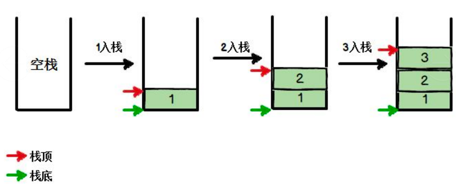

使用数组实现的栈代码如下：

	public class MyStack {
	    private int[] arr;
	    private int size = 0;
	    private int maxSize;
	
	    public MyStack(int size){
	        arr = new int[size];
	        maxSize = size;
	    }
	
	    public void push(int num){
	        grow();
	        arr[size++] = num;
	    }
	
	    public int pop(){
	        if (isEmpty()){
	            throw new RuntimeException("栈为空，无法取出数据");
	        }
	        return arr[--size];
	    }
	
	    public int peek(){
	        if (isEmpty()){
	            throw new RuntimeException("栈为空，无法取出数据");
	        }
	        return arr[size - 1];
	    }
	
	    private void grow(){
	        if (size == maxSize){
	            int[] newArr = new int[maxSize * 2];
	            System.arraycopy(arr, 0, newArr, 0, maxSize);
	            maxSize *= 2;
	            arr = newArr;
	        }
	    }
	
	    public int size() {return size;}
	
	    public boolean isEmpty() {return size == 0;}
	
	    @Override
	    public String toString() {
	        StringBuilder sb = new StringBuilder(size * 4);
	        sb.append('[');
	        if (isEmpty()) {
	            sb.append(']');
	            return sb.toString();
	        }
	        sb.append(arr[0]);
	        for (int i = 1; i < size; i++) {
	            sb.append(',');
	            sb.append(' ');
	            sb.append(arr[i]);
	        }
	        sb.append(']');
	        return sb.toString();
	    }
	
	    public void show() {
	        System.out.println(this);
	    }
	}

## 3 双端队列 ##

对于双端队列，其结合了队列和栈，实现了在头部添加元素，在尾部添加元素，在头部取出元素，在尾部取出元素。在Java中Deque是一个双端队列接口，继承自Queue接口，Deque的实现类是LinkedList、ArrayDeque、LinkedBlockingDeque。
其常用的方法有

1. addFirst(int num)：在头部添加元素，
2. addLast(int num)：在尾部添加元素，
3. int pollFirst()：在头部取出元素，
4. int pollLast()：在尾部取出元素，
5. int peekFirst()：返回头部元素，
6. int peekLast()：返回尾部元素。

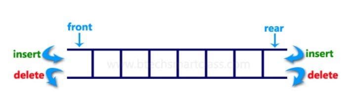

使用数组实现的双端队列代码如下：

	public class MyDeque {
	    private int[] arr;
	    private int head = 0; // 指向队列中第一个元素
	    private int tail = 0; // 指向队列中最后一个元素
	    private int size = 0;
	    private int maxSize;
	
	    public MyDeque(int maxSize) {
	        this.maxSize = maxSize;
	        arr = new int[maxSize];
	    }
	
	    public void addFirst(int num) {
	        grow();
	        arr[head = dec(head, maxSize)] = num;
	        size++;
	    }
	
	    public void addLast(int num) {
	        grow();
	        arr[tail] = num;
	        tail = inc(tail, maxSize);
	        size++;
	    }
	
	    public int pollFirst() {
	        if (isEmpty()){
	            throw new RuntimeException("双端队列为空，无法取出数据");
	        }
	        int result = arr[head];
	        head = inc(head, maxSize);
	        size--;
	        return result;
	    }
	
	    public int pollLast() {
	        if (isEmpty()){
	            throw new RuntimeException("双端队列为空，无法取出数据");
	        }
	        size--;
	        return arr[tail = dec(tail, maxSize)];
	    }
	
	    public int peekFirst() {
	        if (isEmpty()){
	            throw new RuntimeException("双端队列为空，无法取出数据");
	        }
	        return arr[head];
	    }
	
	    public int peekLast() {
	        if (isEmpty()) {
	            throw new RuntimeException("双端队列为空，无法取出数据");
	        }
	        return arr[dec(tail, maxSize)];
	    }
	
	    public int size() {return size;}
	
	    public boolean isEmpty() {return size == 0;}
	
	    private void grow(){
	        if (size == maxSize - 1){
	            int[] newArr = new int[maxSize * 2];
	            System.arraycopy(arr, head, newArr, 0, maxSize - head);
	            System.arraycopy(arr, 0, newArr, head + 1, head);
	            head = 0;
	            tail = maxSize; //对新的双端队列重新赋首尾值
	            maxSize *= 2;
	            arr = newArr;
	        }
	    }
	    //用于计算增加索引后的值
	    private int inc(int i, int size) {
	        if (++i == size) i = 0;
	        return i;
	    }
	    //用于计算减少索引后的值
	    private int dec(int i, int size) {
	        if (--i < 0) i = size - 1;
	        return i;
	    }
	
	    @Override
	    public String toString() {
	        StringBuilder sb = new StringBuilder(size * 4);
	        sb.append('[');
	        if (isEmpty()) {
	            sb.append(']');
	            return sb.toString();
	        }
	        sb.append(arr[0]);
	        for (int i = head; i < head + size; i++) {
	            sb.append(',');
	            sb.append(' ');
	            sb.append(arr[inc(i, maxSize)]);
	        }
	        sb.append(']');
	        return sb.toString();
	    }
	
	    public void show() {
	        System.out.println(this);
	    }
	}

## 4 堆 ##

堆（heap）通常是一个可以被看做一棵树的数组对象。堆总是满足下列性质：堆中某个节点的值总是不大于或不小于其父节点的值；堆总是一棵完全二叉树。
将根节点最大的堆叫做最大堆或大根堆，根节点最小的堆叫做最小堆或小根堆。在Java中，堆的实现为PriorityQueue（优先队列）。

完全二叉树：若二叉树的深度为h，则除第h层外，其他层的结点均有左右子树，且第h层的所有结点都集中在左子树。

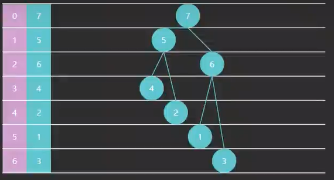

其常用的方法有

1. heap(int[] arr)：建堆（构造器建立堆，复杂度为：$O(n)$），
2. int remove(int key)：移除元素，
3. offer(int num)：入堆（复杂度为：$O(log {N})$），
4. int poll()：出堆（复杂度为：$O(log {N})$），
5. int peek()：返回堆顶部元素但不出堆。

Floyd 建堆算法，时间复杂度 $O(n)$：

1. 找到最后一个非叶子节点
2. 从后向前，对每个节点执行下潜

使用数组实现的堆代码如下：

	public class MyHeap {
	    private int[] arr;
	    private int size;
	    private int maxSize;
	    private final Comparator<Integer> comparator;
	
	    public MyHeap(int maxSize, Comparator<Integer> comparator) {
	        this.size = 0;
	        this.maxSize = maxSize;
	        this.arr = new int[this.maxSize];
	        this.comparator = comparator;
	    }
	
	    public MyHeap(int[] array, Comparator<Integer> comparator) {
	        this.size = array.length;
	        this.maxSize = size + (size >>> 1);
	        this.arr = new int[maxSize];
	        this.comparator = comparator;
	        System.arraycopy(array, 0, this.arr, 0, this.size);
	        heapify();
	    }
	
	    public void offer(int num){
	        grow();
	        arr[size++] = num;
	        up(size - 1);
	    }
	
	    public int peek(){
	        if (isEmpty()){
	            throw new RuntimeException("堆为空，无法取出数据");
	        }
	        return arr[0];
	    }
	
	    public int pool(){
	        if (isEmpty()){
	            throw new RuntimeException("堆为空，无法取出数据");
	        }
	        int top = arr[0];
	        swap(0, size-- - 1);
	        down(0);
	        return top;
	    }
	
	    public int pool(int index){
	        int deleted = arr[index];
	        if (isEmpty() || index > size){
	            throw new RuntimeException("堆为空或数组索引值超过了数据范围，无法取出数据");
	        }
	        swap(index, size-- - 1);
	        down(index);
	        return deleted;
	    }
	
	    public boolean replace(int index, int num){
	        if (index > size){
	            return false;
	        }
	        arr[index] = num;
	        down(index);
	        return true;
	    }
	
	    private void heapify(){
	        for (int i = size / 2 - 1; i >= 0; i--) {
	            down(i);
	        }
	    }
	
	    private void up(int child){
	        int num = arr[child];
	        while (child > 0){
	            int parent = (child - 1) / 2;
	            if (comparator.compare(arr[child], arr[parent]) > 0){
	                arr[child] = arr[parent];
	            } else {
	                break;
	            }
	            child = parent;
	        }
	        arr[child] = num;
	    }
	
	    private void down(int parent){
	        int left = parent * 2 + 1;
	        int right = left + 1;
	        int child = parent;
	        if (left < size && comparator.compare(arr[left], arr[child]) > 0){
	            child = left;
	        }
	        if (right < size && comparator.compare(arr[right], arr[child]) > 0){
	            child = right;
	        }
	        if (child != parent){
	            swap(child, parent);
	            down(child);
	        }
	    }
	
	    private void swap(int i, int j){
	        int temp = arr[i];
	        arr[i] = arr[j];
	        arr[j] = temp;
	    }
	
	    private void grow(){
	        if (size == maxSize){
	            int[] newArr = new int[maxSize * 2];
	            System.arraycopy(arr, 0, newArr, 0, maxSize);
	            maxSize *= 2;
	            arr = newArr;
	        }
	    }
	
	    public int size() {return size;}
	
	    public boolean isEmpty() {return size == 0;}
	
	    @Override
	    public String toString() {
	        StringBuilder sb = new StringBuilder(size * 4);
	        sb.append('[');
	        if (isEmpty()) {
	            sb.append(']');
	            return sb.toString();
	        }
	        sb.append(arr[0]);
	        for (int i = 1; i < size; i++) {
	            sb.append(',');
	            sb.append(' ');
	            sb.append(arr[i]);
	        }
	        sb.append(']');
	        return sb.toString();
	    }
	
	    public void show() {
	        System.out.println(this);
	    }
	}

## 5 二叉树 ##

树是一种非线性的数据结构，它是由n（n>=0）个有限结点组成一个具有层次关系的集合。二叉树是树的一种，一棵二叉树是结点的一个有限集合，该集合为空，或者是由一个根节点加上两棵称为左子树和右子树的二叉树组成。

二叉树的存储方式有链式存储和顺序存储（使用数组，即如上面的堆所示）两种方式。

二叉树的特殊种类：
1、满二叉树：高度为h，并且由2h –1个结点的二叉树，被称为满二叉树。
2、完全二叉树：完全二叉树中只有最下面两层节点的度可以小于2，并且最下层的叶节点集中在靠左的若干位置上。堆结构即为完全二叉树。
3、二叉查找树：二叉查找树（Binary Search Tree）,又被称为二叉搜索树。设x为二叉树中的一个节点，x节点包含关键字 val，节点x的val值记为 x.val 。如果y是x的左子树中的一个节点，则 y.val<x.val；如果y是x的有子树的一个节点，则 y.val>x.val 。

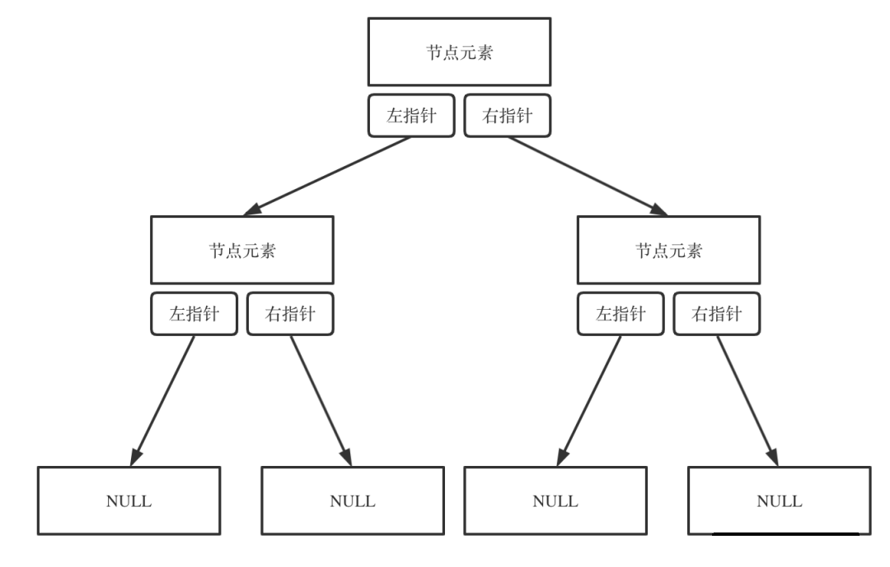

二叉树的链式存储定义代码如下：

	class TreeNode {
	    int val;
	    TreeNode left;
	    TreeNode right;
	
	    TreeNode() {
	    }
	
	    TreeNode(int val) {
	        this.val = val;
	    }
	
	    TreeNode(int val, TreeNode left, TreeNode right) {
	        this.val = val;
	        this.left = left;
	        this.right = right;
	    }
	}

### 5.1 二叉树的遍历 ###

二叉树的遍历有两种，深度优先遍历（DFS）和广度优先遍历（BFS）。其中深度优先遍历又分为了三种，分别为前序遍历（中左右），中序遍历（左中右）和后续遍历（左右中）。广度优先遍历又称为层次遍历。


对于上图，前序遍历为：	

	0，1，3，7，8，4，9，10，2，5，11，12，6，13，14

中序遍历为：

	7，3，8，1，9，4，10，0，11，5，12，2，13，6，14

后续遍历为：

	7，8，3，9，10，4，1，11，12，5，13，14，6，2，0

层次遍历为：

	0，1，2，3，4，5，6，7，8，9，10，11，12，13，14

对于深度优先遍历，其既有递归版也有迭代版，递归版的二叉树深度优先遍历如下：

	public class TraversingBinaryTree {
	    // 前序、中序和后序
	    public void DFSRecursion(TreeNode node) {
	        if (node == null) return;
	        //在此处处理前序遍历节点
	        DFSRecursion(node.left);
	        //在此处处理中序遍历节点
	        DFSRecursion(node.right);
	        //在此处处理后序遍历节点
	    }
	    // 前序和中序
	    public void DFSIteration(TreeNode root) {
	        Stack<TreeNode> stack = new Stack<>();
	        while (!stack.isEmpty() || root != null) {
	            if (root != null) {
	                //在此处处理前序遍历节点
	                stack.push(root);
	                root = root.left;//处理左子树
	            } else { //走到此处意味着左子树已经处理完毕
	                TreeNode pop = stack.pop();
	                //在此处处理中序遍历节点
	                root = pop.right;
	            }
	        }
	    }
	    // 前序、中序和后序
	    public void DFSIteration1(TreeNode root) {
	        Stack<TreeNode> stack = new Stack<>();
	        TreeNode pop = null;
	        while (!stack.isEmpty() || root != null) {
	            if (root != null) {
	                //在此处处理前序遍历节点
	                stack.push(root);
	                root = root.left;//处理左子树
	            } else { //走到此处意味着左子树已经处理完毕
	                TreeNode peek = stack.peek();
	                if (peek.right == null) {
	                    pop = stack.pop(); // 无右子树，直接出栈
	                    // 在此处处理中序遍历节点
	                    // 在此处处理后序遍历节点
	                } else if (peek.right == pop) {
	                    pop = stack.pop(); // 右子树处理完成，可以出栈
	                    // 在此处处理后序遍历节点
	                } else {
	                    // 在此处处理中序遍历节点
	                    root = peek.right; //处理右子树
	                }
	            }
	        }
	    }
	    // 前序、中序和后序
	    public void BFSIteration(TreeNode root) {
	        ArrayDeque<TreeNode> deque = new ArrayDeque<>();
	        deque.offer(root);
	        // 在此处处理层序遍历节点
	        while (!deque.isEmpty()){
	            root = deque.poll();
	            if (root.left != null){
	                // 在此处处理层序遍历节点
	                deque.offer(root.left);
	            }
	            if (root.right != null){
	                // 在此处处理层序遍历节点
	                deque.offer(root.right);
	            }
	        }
	    }
	}

### 5.2 二叉搜索树

二叉搜索树（BST，Binary Search Tree）（也称二叉排序树）是一棵二叉树，其可以为空；如果不为空，满足以下

#### 特性：

1. 非空左子树的所有键值小于其根结点的键值。
2. 非空右子树的所有键值大于其根结点的键值。
3. 左、右子树都是二叉搜索树。

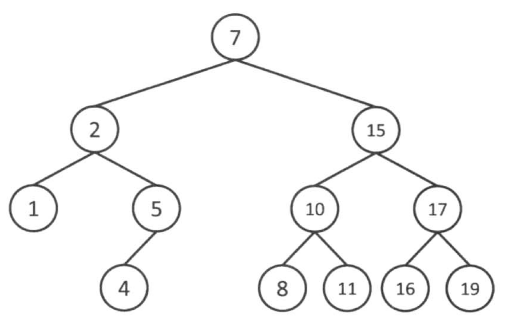

查找的时间复杂度与**树高**相关，插入、删除也是如此。

* 如果这棵树长得还不赖（左右平衡）上图，那么时间复杂度均是 $O(\log{N})$
* 当然，这棵树如果长得丑（左右高度相差过大）下图，那么这时是最糟的情况，时间复杂度是 $O(N)$

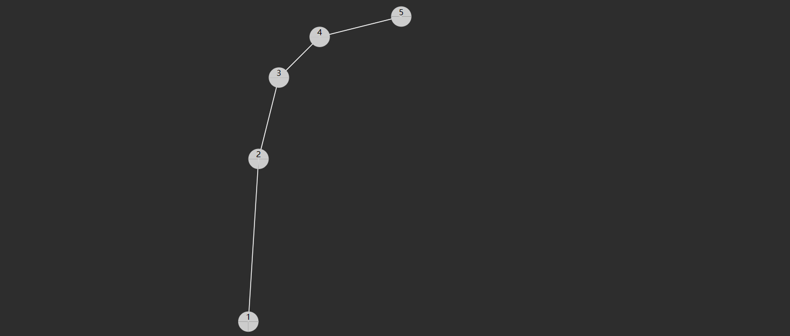

在Java中二叉搜索树的实现实例为TreeSet()和TreeMap()。

二叉搜索树的BSTNode<K, V>定义如下

	public class BSTNode<K, V> {
	    K key;
	    V val;
	    BSTNode<K, V> left;
	    BSTNode<K, V> right;
	
	    public BSTNode() {}
	
	    public BSTNode(K key, V val) {
	        this.key = key;
	        this.val = val;
	    }
	
	    public BSTNode(K key, V val, BSTNode<K, V> left, BSTNode<K, V> right) {
	        this.key = key;
	        this.val = val;
	        this.left = left;
	        this.right = right;
	    }
	}

实现的迭代版代码如下：

	public class MyBST<K, V> {
	    private BSTNode<K, V> root;
	    private final Comparator<K> comparator;
	    //使用迭代实现
	    public MyBST(Comparator<K> comparator) {
	        this.comparator = comparator;
	    }
	
	    public V remove(K key) {
	        BSTNode<K, V> deleted = root, parent = null;
	        while (deleted != null) {
	            if (comparator.compare(key, deleted.key) < 0) {
	                parent = deleted;
	                deleted = deleted.left;
	            } else if (comparator.compare(key, deleted.key) > 0) {
	                parent = deleted;
	                deleted = deleted.right;
	            } else { //有key对应的node
	                if (deleted.left == null) { // 只有右子树
	                    shift(parent, deleted, deleted.right);
	                } else if (deleted.right == null) { // 只有左子树
	                    shift(parent, deleted, deleted.left);
	                } else { //如果左右子树均存在，则把后任节点顶替到删除的节点上
	                    BSTNode<K, V> child = deleted.right, childParent = deleted;
	                    while (child.left != null) { // 查询后任节点是否与删除节点相邻
	                        childParent = child;
	                        child = child.left;
	                    }
	                    if (childParent != deleted) { // 如果不相邻，把后任的子节点顶替到前任上
	                        childParent.left = child.right; // 处理完child的右子树后，child可以顶替到删除节点的位置
	                        child.right = deleted.right; // 更新child的右子树为删除节点的右子树
	                    }
	                    shift(parent, deleted, child); // 要把child顶替到删除的节点上
	                    child.left = deleted.left; // 如果相邻，child就是删除节点的右子树，因此无需赋值右子树
	                }
	                return deleted.val;
	            }
	        }
	        return null;
	    }
	
	    public V successor(K key) {
	        BSTNode<K, V> p = root, ancestorFromRight = null;
	        while (p != null) {
	            if (comparator.compare(key, p.key) < 0) {
	                ancestorFromRight = p;
	                p = p.left;
	            } else if (comparator.compare(key, p.key) > 0) {
	                p = p.right;
	            } else { //有key对应的node
	                if (p.left != null) { //有右子树，查询右子树的最大值
	                    return min(p.left);
	                } else {
	                    return ancestorFromRight == null ? null : ancestorFromRight.val; //无右子树，返回自右而来的祖先
	                }
	            }
	        }
	        return null;
	    }
	
	    public V predecessor(K key) {
	        BSTNode<K, V> p = root, ancestorFromLeft = null;
	        while (p != null) {
	            if (comparator.compare(key, p.key) < 0) {
	                p = p.left;
	            } else if (comparator.compare(key, p.key) > 0) {
	                ancestorFromLeft = p;
	                p = p.right;
	            } else { //有key对应的node
	                if (p.left != null) { //有左子树，查询左子树的最大值
	                    return max(p.left);
	                } else {
	                    return ancestorFromLeft == null ? null : ancestorFromLeft.val; //无左子树，返回自左而来的祖先
	                }
	            }
	        }
	        return null;
	    }
	
	    public void put(K key, V val) {
	        if (root == null) { //如果根节点为空，则直接赋值结束
	            root = new BSTNode<>(key, val);
	            return;
	        }
	        BSTNode<K, V> node = root;
	        BSTNode<K, V> parent = null;
	        while (node != null) { //寻找是否有相同的key，并替换
	            parent = node;
	            if (comparator.compare(key, node.key) < 0) {
	                node = node.left;
	            } else if (comparator.compare(key, node.key) > 0) {
	                node = node.right;
	            } else {
	                node.val = val;
	                return;
	            }
	        }
	        //如果没有查找到相同的key，则记录最近的节点，创建其child
	        if (comparator.compare(key, parent.key) < 0) {
	            parent.left = new BSTNode<>(key, val);
	        } else {
	            parent.right = new BSTNode<>(key, val);
	        }
	    }
	
	    public V min() {
	        if (root == null) return null;
	        BSTNode<K, V> node = root;
	        while (node.left != null) {
	            node = node.left;
	        }
	        return node.val;
	    }
	
	    public V max() {
	        if (root == null) return null;
	        BSTNode<K, V> node = root;
	        while (node.right != null) {
	            node = node.right;
	        }
	        return node.val;
	    }
	
	    public V get(K key) {
	        BSTNode<K, V> node = root;
	        while (node != null) {
	            if (comparator.compare(key, node.key) < 0) {
	                node = node.left;
	            } else if (comparator.compare(key, node.key) > 0) {
	                node = node.right;
	            } else {
	                return node.val;
	            }
	        }
	        return null;
	    }
	
	    private void shift(BSTNode<K, V> parent, BSTNode<K, V> deleted, BSTNode<K, V> child) {
	        if (parent == null) {
	            root = child;
	            return;
	        }
	        if (deleted == parent.left) {
	            parent.left = child;
	        } else {
	            parent.right = child;
	        }
	    }
	
	    private V min(BSTNode<K, V> node) {
	        while (node.left != null) {
	            node = node.left;
	        }
	        return node.val;
	    }
	
	    private V max(BSTNode<K, V> node) {
	        while (node.right != null) {
	            node = node.right;
	        }
	        return node.val;
	    }
		}

其中的max()、min()、get()、put()、remove()方法均有递归的方式实现，其递归版的代码如下：

	public class MyBSTRecursion<K, V> {
	    private BSTNode<K, V> root;
	    private final Comparator<K> comparator;
	
	    public MyBSTRecursion(Comparator<K> comparator) {
	        this.comparator = comparator;
	    }
	
	    public V remove(K key) {
	        ArrayList<BSTNode<K, V>> list = new ArrayList<>(2);
	        root = doRemove(root, key, list);
	        return list.isEmpty() ? null : list.get(0).val;
	    }
	
	    public V max(){
	        return root == null ? null : doMax(root);
	    }
	
	    public V min(){
	        return root == null ? null : doMin(root);
	    }
	
	    public V get(K key){
	        return doGet(root, key);
	    }
	
	    public void put(K key, V val){
	        root = doPut(root, key, val);
	    }
	
	    private BSTNode<K, V> doPut(BSTNode<K, V> node, K key, V val){
	        if (node == null) return new BSTNode<>(key, val);
	        if (comparator.compare(key, node.key) == 0) {
	            node.val = val;
	            return node;
	        } else if (comparator.compare(key, node.key) < 0){
	            node.left = doPut(node.left, key, val);
	        } else {
	            node.right = doPut(node.right, key, val);
	        }
	        return node;
	    }
	
	    private BSTNode<K, V> doRemove(BSTNode<K, V> node, K key, ArrayList<BSTNode<K, V>> list){
	        if (node == null) return null;
	        if (comparator.compare(key, node.key) < 0){
	            node.left = doRemove(node, key, list);
	            return node;
	        }
	        if (comparator.compare(key, node.key) > 0){
	            node.right = doRemove(node, key, list);
	            return node;
	        }
	        list.add(node); // 到此处说明已经找到了对应key的node
	        if (node.right == null) return node.left; //只有左子树
	        if (node.left == null) return node.right; //只有右子树
	        BSTNode<K, V> child = node.right;
	        while (child.left != null){ // 寻找后任节点
	            child = child.left;
	        }
	        child.right = doRemove(node.right, child.key, list); // 处理后任节点的右子树
	        child.left = node.left;
	        return child;
	    }
	    //使用递归实现get
	    private V doGet(BSTNode<K, V> node, K key){
	        if (node == null){
	            return null;
	        }
	        if (comparator.compare(key, node.key) < 0){
	            return doGet(node.left, key);
	        } else if (comparator.compare(key, node.key) > 0){
	            return doGet(node.right, key);
	        } else {
	            return node.val;
	        }
	    }
	
	    private V doMin(BSTNode<K, V> node){
	        if (node.left == null){
	            return node.val;
	        }
	        return doMin(node);
	    }
	
	    private V doMax(BSTNode<K, V> node){
	        if (node.right == null){
	            return node.val;
	        }
	        return doMax(node);
	    }
		}

### 5.3 AVL树 

> 在二叉搜索树中，如果插入的元素按照特定的顺序排列，可能会导致树变得非常不平衡，从而降低搜索、插入和删除的效率。为了解决这个问题，AVL 树通过在每个节点中维护一个平衡因子来确保树的平衡。平衡因子是左子树的高度减去右子树的高度。如果平衡因子的绝对值大于等于 2，则通过旋转操作来重新平衡树。

AVL树是最早被发明的自平衡二叉查找树。在AVL树中，任一节点对应的两棵子树的最大高度差为1，因此它也被称为高度平衡树。

如果一棵二叉搜索树长的不平衡，那么查询的效率会受到影响，如下图


通过旋转可以让树重新变得平衡，并且不会改变二叉搜索树的性质（即左边仍然小，右边仍然大）


#### 如何判断失衡？

> 如果一个节点的**左右孩子，高度差超过 1**，则此节点失衡，才需要旋转

#### 何时触发失衡判断？

定义平衡因子（balance factor）如下
$$
平衡因子 = 左子树高度 - 右子树高度
$$
当平衡因子

* bf = 0，1，-1 时，表示左右平衡
* bf > 1 时，表示左边太高
* bf < -1 时，表示右边太高

#### AVL树的四种失衡情况：

1. 左-左（LL）：当一个节点的左子树的左子树上插入新节点后，导致左子树比右子树高度更大，则需要进行右旋转操作来恢复平衡。

   

2. 右-右（RR）：当一个节点的右子树的右子树上插入新节点后，导致右子树比左子树高度更大，则需要进行左旋转操作来恢复平衡。

   

3. 左-右（LR）：当一个节点的左子树的右子树上插入新节点后，导致左子树比右子树高度更大，则需要先对左子树进行左旋转，然后再对原节点进行右旋转操作来恢复平衡。

   

4. 右-左（RL）：当一个节点的右子树的左子树上插入新节点后，导致右子树比左子树高度更大，则需要先对右子树进行右旋转，然后再对原节点进行左旋转操作来恢复平衡。

   

这些旋转操作都是通过调整节点之间的链接来重新平衡树，以确保树的深度平衡。通过这种方式，AVL树可以保持在$O(log (n)$时间复杂度内进行插入、删除和查找操作。

#### 解决失衡

失衡可以通过树的旋转解决。什么是树的旋转呢？它是在不干扰元素顺序的情况下更改结构，通常用来让树的高度变得平衡。

观察下面一棵二叉搜索树，可以看到，旋转后，并未改变树的左小右大特性，但根、父、孩子节点都发生了变化

```
      4                                   2
     / \             4 right             / \
    2   5      -------------------->    1   4
   / \         <--------------------       / \
  1   3              2 left               3   5
```

AVL树的AVLNode<K, V>定义如下

	public class AVLNode<K, V> {
	    K key;
	    V val;
	    int height = 1;
	    AVLNode<K, V> left;
	    AVLNode<K, V> right;
	
	    public AVLNode() {}
	
	    public AVLNode(K key, V val) {
	        this.key = key;
	        this.val = val;
	    }
	
	    public AVLNode(K key, V val, AVLNode<K, V> left, AVLNode<K, V> right) {
	        this.key = key;
	        this.val = val;
	        this.left = left;
	        this.right = right;
	    }
	}


AVL树实现的代码如下：

	public class MyAVLTree<K, V> {
	    private AVLNode<K, V> root;
	    private final Comparator<K> comparator;
	
	    public MyAVLTree(Comparator<K> comparator) {
	        this.comparator = comparator;
	    }
	
	    public V remove(K key) {
	        ArrayList<AVLNode<K, V>> list = new ArrayList<>(2);
	        root = doRemove(root, key, list);
	        return list.isEmpty() ? null : list.get(0).val;
	    }
	
	    private AVLNode<K, V> doRemove(AVLNode<K, V> node, K key, ArrayList<AVLNode<K, V>> list){
	        if (node == null) return null;
	        if (comparator.compare(key, node.key) < 0){
	            node.left = doRemove(node, key, list);
	            return node;
	        }
	        if (comparator.compare(key, node.key) > 0){
	            node.right = doRemove(node, key, list);
	            return node;
	        }
	        list.add(node); // 到此处说明已经找到了对应key的node
	        if (node.right == null){
	            updateHeight(node.left);
	            return balance(node.left); //只有左子树
	        }
	        if (node.left == null) {
	            updateHeight(node.right);
	            return balance(node.right); //只有右子树
	        }
	        AVLNode<K, V> child = node.right;
	        while (child.left != null){ // 寻找后任节点
	            child = child.left;
	        }
	        child.right = doRemove(node.right, child.key, list); // 处理后任节点的右子树
	        child.left = node.left;
	        updateHeight(child);
	        return balance(child);
	    }
	
	    public void put(K key, V val){ // 由于添加元素时会更改树的高度，因此需要递归从下到上更新高度
	        root = doPut(root, key, val);
	    }
	
	    private AVLNode<K, V> doPut(AVLNode<K, V> node, K key, V val){
	        if (node == null) return new AVLNode<>(key, val);
	        if (comparator.compare(key, node.key) == 0) {
	            node.val = val;
	            return node;
	        } else if (comparator.compare(key, node.key) < 0){
	            node.left = doPut(node.left, key, val);
	        } else {
	            node.right = doPut(node.right, key, val);
	        }
	        updateHeight(node);
	        return balance(node);
	    }
	
	    public V get(K key){
	        AVLNode<K, V> node = root;
	        while (node != null) {
	            if (comparator.compare(key, node.key) < 0) {
	                node = node.left;
	            } else if (comparator.compare(key, node.key) > 0) {
	                node = node.right;
	            } else {
	                return node.val;
	            }
	        }
	        return null;
	    }
	
	    private AVLNode<K, V> balance(AVLNode<K, V> node) {
	        if (node == null) {
	            return null;
	        }
	        int bf = balanceFactor(node);
	        if (bf > 1) { // 左边高度更高
	            if (balanceFactor(node.left) >= 0) { //左左
	                return leftRotate(node);
	            } else {  //左右
	                return leftRightRotate(node);
	            }
	        } else if (bf < -1) { // 右边高度更高
	            if (balanceFactor(node.right) <= 0) { //右右
	                return rightRotate(node);
	            } else { //右左
	                return rightLeftRotate(node);
	            }
	        } else {
	            return node;
	        }
	    }
	
	    private AVLNode<K, V> leftRightRotate(AVLNode<K, V> node) {
	        node.left = leftRotate(node.left);
	        return rightRotate(node);
	    }
	
	    private AVLNode<K, V> rightLeftRotate(AVLNode<K, V> node) {
	        node.right = rightRotate(node.right);
	        return leftRotate(node);
	    }
	
	    private AVLNode<K, V> rightRotate(AVLNode<K, V> node) {
	        AVLNode<K, V> root = node.left;
	        node.left = root.right;
	        root.right = node;
	        updateHeight(node);
	        updateHeight(root);
	        return root;
	    }
	
	    private AVLNode<K, V> leftRotate(AVLNode<K, V> node) {
	        AVLNode<K, V> root = node.right;
	        node.right = root.left;
	        root.left = node;
	        updateHeight(node);
	        updateHeight(root);
	        return root;
	    }
	
	    private int height(AVLNode<K, V> node) {
	        return node == null ? 0 : node.height;
	    }
	
	    private void updateHeight(AVLNode<K, V> node) {
	        node.height = Math.max(height(node.left), height(node.right)) + 1;
	    }
	
	    private int balanceFactor(AVLNode<K, V> node) {
	        return height(node.left) - height(node.right);
	    }
	}


### 5.4 红黑树

红黑树和AVL树一样，都是自平衡的二叉搜索树，它们都能保证在最坏情况下的时间复杂度为$O(log (n))$。红黑树是一种近似于平衡的二叉搜索树，它通过在每个节点中添加一个额外的表示节点颜色（红色或黑色）的位来实现自平衡。红黑树在插入和删除操作时的平衡调整比AVL树要少，而且在大多数情况下具有更好的性能。

#### 红黑树特性

1. 所有节点都有两种颜色：红:red_circle:、黑:black_circle:
2. 所有 null 视为黑色:black_circle:
3. 红色:red_circle:节点不能相邻
4. 根节点是黑色:black_circle:
5. 从根到任意一个叶子节点，路径中的黑色:black_circle:节点数一样

#### 插入情况

插入节点均视为红色:red_circle:

case 1：插入节点为根节点，将根节点变黑:black_circle:

case 2：插入节点的父亲若为黑色:black_circle:，树的红黑性质不变，无需调整


插入节点的父亲为红色:red_circle:，触发红红相邻

case 3：叔叔为红色:red_circle:

- 父亲变为黑色:black_circle:，为了保证黑色平衡，连带的叔叔也变为黑色:black_circle:
- 祖父如果是黑色不变，会造成这颗子树黑色过多，因此祖父节点变为红色:red_circle:

- 祖父如果变成红色，可能会接着触发红红相邻，因此对将祖父进行递归调整

case 4：叔叔为黑色:black_circle:

1. 父亲为左孩子，插入节点也是左孩子，此时即 LL 不平衡
   * 让父亲变黑:black_circle:，为了保证这颗子树黑色不变，将祖父变成红:red_circle:，但叔叔子树少了一个黑色
   * 祖父右旋，补齐一个黑色给叔叔，父亲旋转上去取代祖父，由于它是黑色，不会再次触发红红相邻
2. 父亲为左孩子，插入节点是右孩子，此时即 LR 不平衡
   * 父亲左旋，变成 LL 情况，按 1. 来后续处理
3. 父亲为右孩子，插入节点也是右孩子，此时即 RR 不平衡
   * 让父亲变黑:black_circle:，为了保证这颗子树黑色不变，将祖父变成红:red_circle:，但叔叔子树少了一个黑色
   * 祖父左旋，补齐一个黑色给叔叔，父亲旋转上去取代祖父，由于它是黑色，不会再次触发红红相邻
4. 父亲为右孩子，插入节点是左孩子，此时即 RL 不平衡
   * 父亲右旋，变成 RR 情况，按 3. 来后续处理


#### 删除情况

case0：如果删除节点有两个孩子

* 交换删除节点和后继节点的 key，value，递归删除后继节点，直到该节点没有孩子或只剩一个孩子


如果删除节点没有孩子或只剩一个孩子

case 1：删的是根节点

* 删完了，直接将 root = null
* 用剩余节点替换了根节点的 key，value，根节点孩子 = null，颜色保持黑色:black_circle:不变


删黑色会失衡，删红色不会失衡，但删黑色有一种简单情况

case 2：删的是黑:black_circle:，剩下的是红:red_circle:，剩下这个红节点变黑:black_circle:


删除节点和剩下节点都是黑:black_circle:，触发双黑，双黑意思是，**少了一个黑**

case 3：被调整节点的兄弟为红:red_circle:，此时两个侄子定为黑 :black_circle:

* 删除节点是左孩子，父亲左旋
* 删除节点是右孩子，父亲右旋
* 父亲和兄弟要变色，保证旋转后颜色平衡
* 旋转的目的是让黑侄子变为删除节点的黑兄弟，对删除节点再次递归，进入 case 4 或 case 5

case 4：被调整节点的兄弟为黑:black_circle:，两个侄子都为黑 :black_circle:

* 将兄弟变红:red_circle:，目的是将删除节点和兄弟那边的黑色高度同时减少 1
* 如果父亲是红:red_circle:，则需将父亲变为黑，避免红红，此时路径黑节点数目不变
* 如果父亲是黑:black_circle:，说明这条路径还是少黑，再次让父节点触发双黑

case 5：被调整节点的兄弟为黑:black_circle:，至少一个红:red_circle:侄子

* 如果兄弟是左孩子，左侄子是红:red_circle:，LL 不平衡
  * 将来删除节点这边少个黑，所以最后旋转过来的父亲需要变成黑:black_circle:，平衡起见，左侄子也是黑:black_circle:
  * 原来兄弟要成为父亲，需要保留父亲颜色
* 如果兄弟是左孩子，右侄子是红:red_circle:，LR 不平衡
  * 将来删除节点这边少个黑，所以最后旋转过来的父亲需要变成黑:black_circle:
  * 右侄子会取代原来父亲，因此它保留父亲颜色
  * 兄弟已经是黑了:black_circle:，无需改变
* 如果兄弟是右孩子，右侄子是红:red_circle:，RR 不平衡
  * 将来删除节点这边少个黑，所以最后旋转过来的父亲需要变成黑:black_circle:，平衡起见，右侄子也是黑:black_circle:
  * 原来兄弟要成为父亲，需要保留父亲颜色
* 如果兄弟是右孩子，左侄子是红:red_circle:，RL 不平衡
  * 将来删除节点这边少个黑，所以最后旋转过来的父亲需要变成黑:black_circle:
  * 左侄子会取代原来父亲，因此它保留父亲颜色
  * 兄弟已经是黑了:black_circle:，无需改变

### 5.5 Huffman 树

给定N个权值作为N个叶子结点，构造一棵二叉树，若该树的带权路径长度达到最小，称这样的二叉树为最优二叉树，也称为哈夫曼树(Huffman Tree)。哈夫曼树是带权路径长度最短的树，权值较大的结点离根较近。

**路径和路径长度**

在一棵树中，从一个结点往下可以达到的孩子或孙子结点之间的通路，称为路径。

通路中分支的数目称为路径长度。若规定根结点的层数为1，则从根结点到第L层结点的路径长度为L-1。

**节点的权和带权路径长度**

若将树中结点赋给一个有着某种含义的数值，则这个数值称为该结点的权。结点的带权路径长度为：从根结点到该结点之间的路径长度与该结点的权的乘积。

**树的带权路径长度**

树的带权路径长度规定为所有叶子结点的带权路径长度之和，记为WPL。

#### Huffman 树的构造

  1. 将统计了出现频率的字符，放入优先级队列
  2. 每次出队两个频次最低的元素，给它俩找个爹
  3. 把爹重新放入队列，重复 2~3
  4. 当队列只剩一个元素时，Huffman 树构建完成

#### Huffman 编解码

哈夫曼编码是一种压缩编码的编码算法，是基于哈夫曼树的一种编码方式。哈夫曼树又称为带权路径长度最短的二叉树。

**哈夫曼编码跟 ASCII 编码有什么区别？**

ASCII 编码是对照ASCII 表进行的编码，每一个字符符号都有对应的编码，其编码长度是固定的。而哈夫曼编码对于不同字符的出现频率其使用的编码是不一样的。其会对频率较高的字符使用较短的编码，频率低的字符使用较高的编码。这样保证总体使用的编码长度会更少，从而实现到了数据压缩的目的。

**为什么哈夫曼树的构造是如上的过程？请细看以下过程：**

* java 中每个 char 对应的数字会占用固定长度 2 个字节
* 如果在传输中仍采用上述规则，传递 abbccccccc 这 10 个字符
  * 实际的字节为  `0061 0062 0062 0063 0063 0063 0063 0063 0063 0063`（16进制表示）
  * 总共 20 个字节，不经济

现在希望找到一种最节省字节的传输方式，怎么办？假设传输的字符中只包含 a，b，c 这 3 个字符，有同学重新设计一张二进制编码表，见下图：

* 0 表示 a
* 1 表示 b
* 10 表示 c

现在还是传递 abbccccccc 这 10 个字符

* 实际的字节为  `0 1 1 10 10 10 10 10 10 10` （二进制表示）
* 总共需要 17 bits，也就是 2 个字节多一点，行不行？

不行，因为解码会出现问题，因为 10 会被错误的解码成 ba，而不是 c

* 解码后结果为 abbbababababababa，是错误的

怎么解决？必须保证编码后的二进制数字，要能区分它们的前缀（prefix-free）

用满二叉树结构编码，可以确保前缀不重复


* 向左走 0，向右走 1
* 走到叶子字符，累计起来的 0 和 1 就是该字符的二进制编码

再来试一遍

* a 的编码 0
* b 的编码 10
* c 的编码 11

现在还是传递 abbccccccc 这 10 个字符

* 实际的字节为  `0 10 10 11 11 11 11 11 11 11`（二进制表示）
* 总共需要 19 bits，也是 2 个字节多一点，并且解码没有问题了，行不行？

这回解码没问题了，但并非最少字节，因为 c 的出现频率高（7 次）a 的出现频率低（1 次），因此出现频率高的字符编码成短数字更经济

考察下面的树


* 00 表示 a
* 01 表示 b
* 1 表示 c

现在还是传递 abbccccccc 这 10 个字符

* 实际的字节为 `00 01 01 1 1 1 1 1 1 1`  （二进制表示）
* 总共需要 13 bits，这棵树就称之为 Huffman 树
* 根据 Huffman 树对字符和数字进行编解码，就是 Huffman 编解码

综上我们就可以很轻松的得到Huffman 树的实现代码了。~~难度不是吗？~~

```java
public class MyHuffmanTree {
    String str;
    Map<Character, Node> map = new HashMap<>();
    Node root;

    static class Node {
        Character ch; // 字符
        int freq;     // 频次
        Node left;
        Node right;
        String code;  // 编码，为了简便而设置为String类型的01，实际为二进制类型的01

        public Node(Character ch) {
            this.ch = ch;
        }

        public Node(int freq, Node left, Node right) {
            this.freq = freq;
            this.left = left;
            this.right = right;
        }

        int freq() {
            return freq;
        }

        boolean isLeaf() {
            return left == null;
        }

        @Override
        public String toString() {
            return "Node{" +
                    "ch=" + ch +
                    ", freq=" + freq +
                    '}';
        }
    }

    public MyHuffmanTree(String str) {
        this.str = str;
        // 功能1：统计频率
        char[] chars = str.toCharArray();
        for (char c : chars) {
            Node node = map.computeIfAbsent(c, Node::new);	// 看不懂就去继续学HashMap和方法引用
            node.freq++;
        }
        // 功能2: 构造树
        PriorityQueue<Node> queue = new PriorityQueue<>(Comparator.comparingInt(Node::freq));
        queue.addAll(map.values());
        while (queue.size() >= 2) {
            Node x = queue.poll();
            Node y = queue.poll();
            int freq = x.freq + y.freq;
            queue.offer(new Node(freq, x, y));
        }
        root = queue.poll();
        // 功能3：计算每个字符的编码, 功能4：字符串编码后占用 bits
        int sum = dfs(root, new StringBuilder());
        for (Node node : map.values()) {
            System.out.println(node + " " + node.code);
        }
        System.out.println("总共会占用 bits:" + sum);
    }

    private int dfs(Node node, StringBuilder code) {
        int sum = 0;
        if (node.isLeaf()) {
            node.code = code.toString();
            sum = node.freq * code.length();
        } else {
            sum += dfs(node.left, code.append("0"));
            sum += dfs(node.right, code.append("1"));
        }
        if (code.length() > 0) {
            code.deleteCharAt(code.length() - 1);
        }
        return sum;
    }

    public String encode() {
        char[] chars = str.toCharArray();
        StringBuilder sb = new StringBuilder();
        for (char c : chars) {
            sb.append(map.get(c).code);
        }
        return sb.toString();
    }
    // 解码
    public String decode(String str) {
        /*
            从根节点，寻找数字对应的字符
                数字是 0 向左走
                数字是 1 向右走
                如果没走到头，每走一步数字的索引 i++
            走到头就可以找到解码字符，再将 node 重置为根节点
         */
        char[] chars = str.toCharArray();
        int i = 0;
        StringBuilder sb = new StringBuilder();
        Node node = root;
        while (i < chars.length) {
            if (!node.isLeaf()) { // 非叶子
                if(chars[i] == '0') { // 向左走
                    node = node.left;
                } else if(chars[i] == '1') { // 向右走
                    node = node.right;
                }
                i++;
            }
            if (node.isLeaf()) {	// 是为了解决i自增到chars.length后没有把node增加到sb中的问题，其实循环后再处理也行
                sb.append(node.ch);
                node = root;
            }
        }
        return sb.toString();
    }

    @SuppressWarnings("all")
    public static void main(String[] args) {
        MyHuffmanTree tree = new MyHuffmanTree("abbccccccc");
        String encoded = tree.encode();
        System.out.println(encoded);
        System.out.println(tree.decode(encoded));
    }
}
```

> ***注意***
>
> * 循环中非叶子节点 i 要自增，但叶子节点 i 暂不自增
> * 第一个非叶子的 if 判断结束后，仍需要第二个叶子的 if 判断，因为在第一个 if 内 node 发生了变化


## 6 图

### 1) 概念

图是由顶点（vertex）和边（edge）组成的数据结构，例如

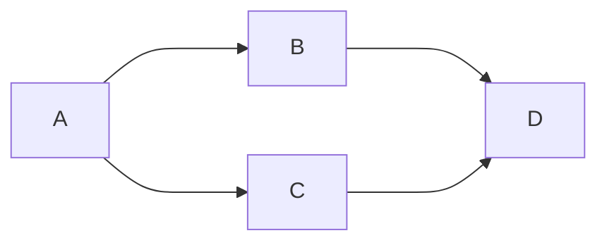

该图有四个顶点：A、B、C、D 以及四条有向边，有向图中，边是单向的

**有向 vs 无向**

如果是无向图，那么边是双向的，下面是一个无向图的例子

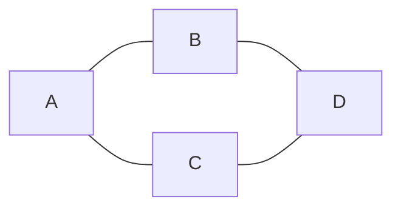

**度**

**度**是指与该顶点相邻的边的数量

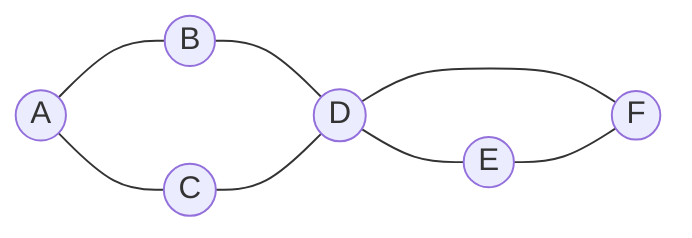

例如上图中

* A、B、C、E、F 这几个顶点度数为 2
* D 顶点度数为 4

有向图中，细分为**入度**和**出度**，参见下图

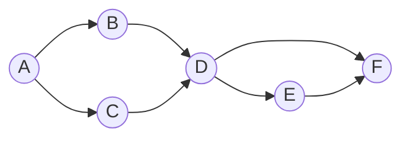

* A (2 out / 0 in)
* B、C、E (1 out / 1 in)
* D (2 out / 2 in)
* F (0 out / 2 in)

**权**

边可以有权重，代表从源顶点到目标顶点的距离、费用、时间或其他度量。

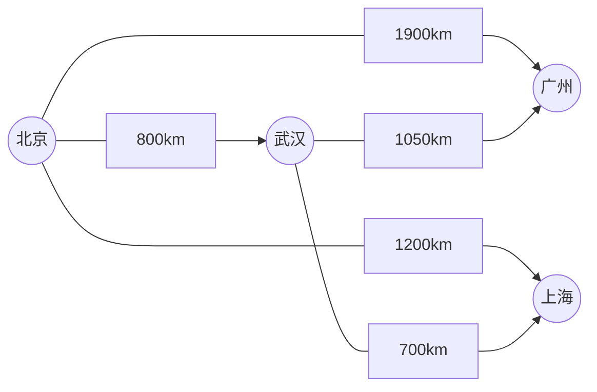

**路径**

路径被定义为从一个顶点到另一个顶点的一系列连续边，例如上图中【北京】到【上海】有多条路径

* 北京 - 上海
* 北京 - 武汉 - 上海

路径长度

* 不考虑权重，长度就是边的数量
* 考虑权重，一般就是权重累加

**环**

在有向图中，从一个顶点开始，可以通过若干条有向边返回到该顶点，那么就形成了一个环

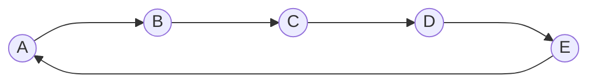

**图的连通性**

如果两个顶点之间存在路径，则这两个顶点是连通的，所有顶点都连通，则该图被称之为连通图，若子图连通，则称为连通分量

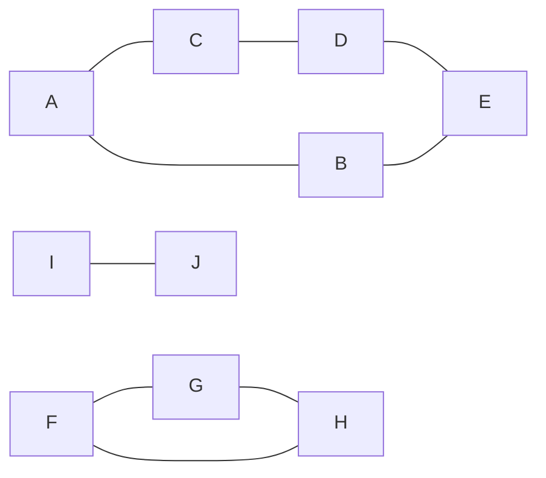

### 2) 图的表示

比如说，下面的图


用**邻接矩阵**可以表示为：

```
  A B C D
A 0 1 1 0
B 1 0 0 1 
C 1 0 0 1
D 0 1 1 0
```

用**邻接表**可以表示为：

```
A -> B -> C
B -> A -> D
C -> A -> D
D -> B -> C
```

有向图的例子


```
  A B C D
A 0 1 1 0
B 0 0 0 1
C 0 0 0 1
D 0 0 0 0
```

```
A - B - C
B - D
C - D
D - empty
```


### 3) Java 表示

Java使用邻接表的形式表示包含两个对象，一个是**顶点**

```java
public class Vertex {
    String name;
    List<Edge> edges;
    
    // 拓扑排序相关
    int inDegree;
    int status; // 状态 0-未访问 1-访问中 2-访问过，用在拓扑排序

    // dfs, bfs 相关
    boolean visited;

    // 求解最短距离相关
    private static final int INF = Integer.MAX_VALUE;
    int dist = INF;
    Vertex prev = null; // 最短路径的前一个顶点
}
```

另一个是**边**

```java
public class Edge {

    Vertex linked;
    int weight;

    public Edge(Vertex linked) {
        this(linked, 1);
    }

    public Edge(Vertex linked, int weight) {
        this.linked = linked;
        this.weight = weight;
    }
}
```

### 4) DFS遍历

对于使用邻接表表示的图，其DFS遍历如下代码如下：

```java
public class Dfs {
    public static void main(String[] args) {
        Vertex v1 = new Vertex("v1");
        Vertex v2 = new Vertex("v2");
        Vertex v3 = new Vertex("v3");
        Vertex v4 = new Vertex("v4");
        Vertex v5 = new Vertex("v5");
        Vertex v6 = new Vertex("v6");

        v1.edges = List.of(new Edge(v3), new Edge(v2), new Edge(v6));
        v2.edges = List.of(new Edge(v4));
        v3.edges = List.of(new Edge(v4), new Edge(v6));
        v4.edges = List.of(new Edge(v5));
        v5.edges = List.of();
        v6.edges = List.of(new Edge(v5));

        dfs1(v1);
    }
	// 非递归实现，使用了栈
    private static void dfs2(Vertex v) {
        LinkedList<Vertex> stack = new LinkedList<>();
        stack.push(v);
        while (!stack.isEmpty()) {
            Vertex pop = stack.pop();
            pop.visited = true; // 设置节点已经被访问
            // System.out.println(pop.name); 在此处处理节点
            for (Edge edge : pop.edges) {
                if (!edge.linked.visited) { // 没有被访问过就添加到栈中
                    stack.push(edge.linked);
                }
            }
        }
    }
	// 递归实现
    private static void dfs1(Vertex v) {
        v.visited = true;
        System.out.println(v.name);
        for (Edge edge : v.edges) {
            if (!edge.linked.visited) {
                dfs(edge.linked);
            }
        }
    }
}
```

对于使用邻接矩阵表示的图，其DFS遍历如下代码如下：

```java
	private void dfs(char[][] grid, int i, int j, int high, int width) {
        if (i < 0 || i >= high || j < 0 || j >= width) return;
        dfs(grid, i - 1, j, high, width);
        dfs(grid, i + 1, j, high, width);
        dfs(grid, i, j - 1, high, width);
        dfs(grid, i, j + 1, high, width);
    }
```

### 5) BFS遍历

对于使用邻接表表示的图，其DFS遍历如下代码如下：

```java
public class Bfs {
	// 非递归实现，使用了队列
    private static void bfs(Vertex v) {
        LinkedList<Vertex> queue = new LinkedList<>();
        v.visited = true; // 设置节点已经被访问
        queue.offer(v);
        while (!queue.isEmpty()) {
            Vertex poll = queue.poll();
            System.out.println(poll.name);
            for (Edge edge : poll.edges) {
                if (!edge.linked.visited) { // 没有被访问过就添加到队列中
                    edge.linked.visited = true;
                    queue.offer(edge.linked);
                }
            }
        }
    }
}
```

对于使用邻接矩阵表示的图，其DFS遍历如下代码如下：

```java
	public void bfs(char[][] grid, int high, int width) {
        for (int i = 0; i < high; ++i) {
            for (int j = 0; j < width; ++j) {
                Queue<Integer> neighbors = new LinkedList<>();
                neighbors.add(i * width + j);
                while (!neighbors.isEmpty()) {
                    int id = neighbors.remove();
                    int row = id / width;
                    int col = id % width;
                    if (row - 1 >= 0) {
                        neighbors.add((row - 1) * width + col);
                    }
                    if (row + 1 < high) {
                        neighbors.add((row + 1) * width + col);
                    }
                    if (col - 1 >= 0) {
                        neighbors.add(row * width + col - 1);
                    }
                    if (col + 1 < width) {
                        neighbors.add(row * width + col + 1);
                    }
                }
            }
        }
    }
```

### 6) 拓扑排序

> 拓扑排序最常见的应用是基于其依赖性来调度一系列作业或任务。拓扑排序给出了执行作业的顺序。 20世纪60年代早期，在PERT技术项目管理调度的背景下，首次研究了拓扑排序算法的密切相关应用（Jarnagin 1960）;在此应用程序中，图形的顶点表示项目的里程碑，边表示必须在一个里程碑与另一个里程碑之间执行的任务。拓扑排序构成了线性时间算法的基础，用于查找项目的关键路径，一系列里程碑和任务，用于控制整个项目进度的长度。

在图论中，拓扑排序（Topological Sorting）是一个有向无环图（DAG, Directed Acyclic Graph）的所有顶点的线性序列。且该序列必须满足下面两个条件：

1. 每个顶点出现且只出现一次。
2. 若存在一条从顶点 A 到顶点 B 的路径，那么在序列中顶点 A 出现在顶点 B 的前面。

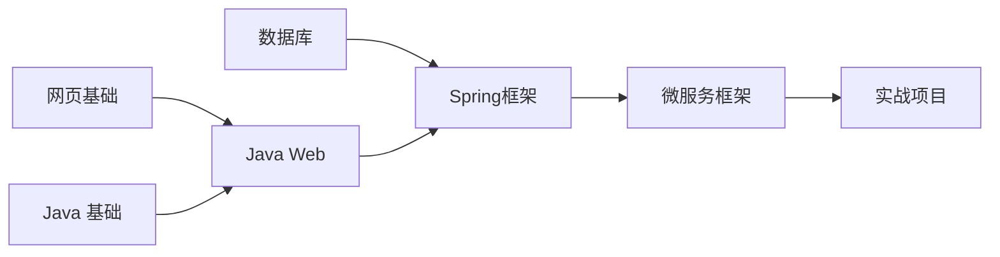

#### **Kahn’s** 算法

该算法的核心思路很简单：当一个顶点A的入度为0时，则说明顶点A此时没有任何的顶点可以排在它前面了。故我们就可以将顶点A从图中移除，并将其追加到排序结果后面；同时随着顶点A从图中移除，由它指出的有向边也将同时被删除，故而会导致图中相应顶点的入度也会减少。当图中某顶点的入度减到0时，重复上述步骤即可；最后，当排序结果中顶点的数量 **等于** 有向图的顶点总数，则说明排序结果即为该有向图的拓扑排序结果；反之，如果 排序结果中顶点的数量 **小于** 有向图的顶点总数，即排序结果未包含所有顶点。则说明该有向图中存在环，不是一个有向无环图DAG。

```java
class TopologicalSort {
    public static void main(String[] args) {
        Vertex v1 = new Vertex("网页基础");
        Vertex v2 = new Vertex("Java基础");
        Vertex v3 = new Vertex("JavaWeb");
        Vertex v4 = new Vertex("Spring框架");
        Vertex v5 = new Vertex("微服务框架");
        Vertex v6 = new Vertex("数据库");
        Vertex v7 = new Vertex("实战项目");

        v1.edges = List.of(new Edge(v3)); // +1
        v2.edges = List.of(new Edge(v3)); // +1
        v3.edges = List.of(new Edge(v4));
        v6.edges = List.of(new Edge(v4));
        v4.edges = List.of(new Edge(v5));
        v5.edges = List.of(new Edge(v7));
        v7.edges = List.of();
        List<Vertex> graph = List.of(v1, v2, v3, v4, v5, v6, v7);
        topologicalSortingKahn(graph);
    }
    
    public static void topologicalSortingKahn(List<Vertex> graph){
        for (Vertex v : graph) { // 1. 统计每个顶点的入度
            for (Edge edge : v.edges) {
                edge.linked.inDegree++; // 每个顶点的边对应的顶点的入度加1
            }
        }
        // 2. 将入度为0的顶点加入队列
        LinkedList<Vertex> queue = new LinkedList<>();
        for (Vertex v : graph) {
            if (v.inDegree == 0) {
                queue.offer(v);
            }
        }
        // 3. 队列中不断移除顶点，每移除一个顶点，把它相邻顶点入度减1，若减到0则入队
        List<String> result = new ArrayList<>();
        while (!queue.isEmpty()) {
            Vertex poll = queue.poll();
            result.add(poll.name);
            for (Edge edge : poll.edges) {
                edge.linked.inDegree--;
                if (edge.linked.inDegree == 0) {
                    queue.offer(edge.linked);
                }
            }
        }
        if (result.size() != graph.size()) {
            System.out.println("出现环");
        } else {
            for (String key : result) {
                System.out.println(key);
            }
        }
    }
}
```

#### DFS

该算法采用 **DFS+栈**，如果图中没有环，那么由图中某点出发的时候，**最先退出DFS的顶点一定是出度为0的顶点，也就是拓扑排序中最后的一个顶点（逆向思维）**。因此按DFS退出的先后记录下的顶点序列就是逆向的拓扑排序的序列。

```java
	public static void topologicalSortingDfs(List<Vertex> graph){
        LinkedList<String> result = new LinkedList<>();
        for (Vertex v : graph) {
            if(v.status==0) {
                dfs(v, result);
            }
        }
    }
    
    private static void dfs(Vertex v, LinkedList<String> result) {
        if (v.status == 2) return;
        if (v.status == 1) throw new RuntimeException("发现环"); // 第二次访问到了待访问的节点，则必有环
        v.status = 1; // 待访问
        for (Edge edge : v.edges) {
            dfs(edge.linked, result);
        }
        v.status = 2;
        result.push(v.name);
    }
```

### 7) 最短路径

> 在图中，不可避免要解决的一个问题就是计算两点之间的最短路径，对于图结构来说，两个点之间不一定只有一条路径，那么如何才能找出最短的那一条就是图中最短路径问题。

#### Dijkstra（单源）

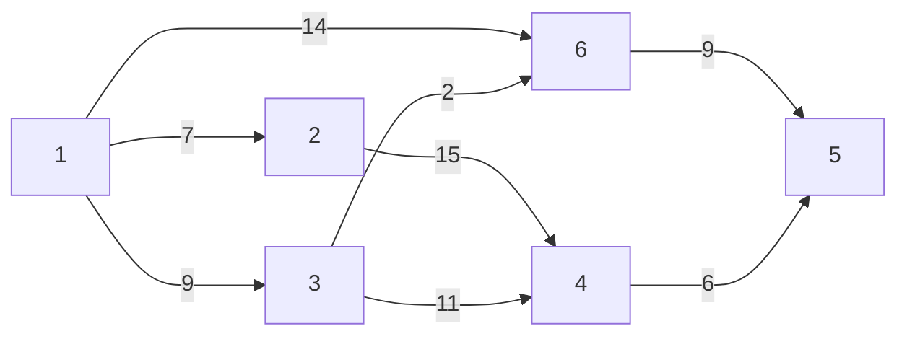

Dijkstra算法是典型最短路径算法，采用广度优先搜索，以起始点为中心向外层层扩展，直到终点为止。

基于优先队列的Dijkstra 算法其时间复杂度为$O ( ( V + E ) log(V)) $，其中 $V$为顶点数，$E$为边数。其算法描述为：

1. 将所有顶点标记为未访问。创建一个未访问顶点的集合。
2. 为每个顶点分配一个临时距离值
   * 对于我们的初始顶点，将其设置为零
   * 对于所有其他顶点，将其设置为无穷大。
3. 每次选择最小临时距离的未访问顶点，作为新的当前顶点
4. 对于当前顶点，遍历其所有未访问的邻居，并更新它们的临时距离为更小
   * 例如，1->6 的距离是 14，而1->3->6 的距离是11。这时将距离更新为 11
   * 否则，将保留上次距离值
5. 当前顶点的邻居处理完成后，把它从未访问集合中删除

```java
public class Dijkstra {
    public static void main(String[] args) {
        Vertex v1 = new Vertex("v1");
        Vertex v2 = new Vertex("v2");
        Vertex v3 = new Vertex("v3");
        Vertex v4 = new Vertex("v4");
        Vertex v5 = new Vertex("v5");
        Vertex v6 = new Vertex("v6");

        v1.edges = List.of(new Edge(v3, 9), new Edge(v2, 7), new Edge(v6, 14));
        v2.edges = List.of(new Edge(v4, 15));
        v3.edges = List.of(new Edge(v4, 11), new Edge(v6, 2));
        v4.edges = List.of(new Edge(v5, 6));
        v5.edges = List.of();
        v6.edges = List.of(new Edge(v5, 9));

        List<Vertex> graph = List.of(v1, v2, v3, v4, v5, v6);
        dijkstra(graph, v1);
    }

    public static void dijkstra(List<Vertex> graph, Vertex source) {
        PriorityQueue<Vertex> queue = new PriorityQueue<>(Comparator.comparingInt(v -> v.dist));
        source.dist = 0;
        for (Vertex v : graph) {
            queue.offer(v);
        }

        while (!queue.isEmpty()) {
            System.out.println(queue);
            // 3. 选取当前顶点
            Vertex curr = queue.peek();
            // 4. 更新当前顶点邻居距离
            if(!curr.visited) {
                updateNeighboursDist(curr, queue);
                curr.visited = true; // 由于每次都是选择一个距离最短的，因此直接设置为ture不再访问，同时也避免多次访问
            }
            // 5. 移除当前顶点
            queue.poll();
        }
    }

    private static void updateNeighboursDist(Vertex curr, PriorityQueue<Vertex> queue) {
        for (Edge edge : curr.edges) {
            Vertex n = edge.linked;
            if (!n.visited) {
                int dist = curr.dist + edge.weight;
                if (dist < n.dist) {
                    n.dist = dist;
                    n.prev = curr;
                    queue.offer(n); // 必须重新加入，如果不加入则不会修改其位置
                }
            }
        }
    }
}
```

**问题**

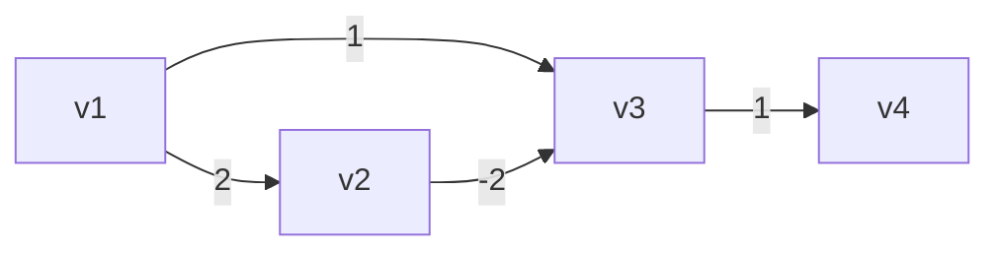

当路径中出现负数权值的边时，按照 Dijkstra 算法，得出

* v1 -> v2 最短距离2
* v1 -> v3 最短距离1
* v1 -> v4 最短距离2

出现了错误，而事实应当是

* v1 -> v2 最短距离2
* v1 -> v3 最短距离0
* v1 -> v4 最短距离1

#### Bellman-Ford（单源）

Bellman-ford 算法比Dijkstra 算法更具普遍性，因为它对边没有要求，可以处理负权边与负权回路，当仍然无法处理负环（环中的权重和为负数）。其缺点是时间复杂度过高，可达$O(VE)$, $V$为顶点数，$E$为边数。

**主要思想**：对所有的边进行n-1轮松弛操作，因为在一个含有n个顶点的图中，任意两点之间的最短路径最多包含n-1边。

换句话说，第1轮在对所有的边进行松弛后，得到的是源点最多经过一条边到达其他顶点的最短距离；第2轮在对所有的边进行松弛后，得到的是源点最多经过两条边到达其他顶点的最短距离；第3轮在对所有的边进行松弛后，得到的是源点最多经过一条边到达其他顶点的最短距离......

对于负环，其可以松弛n次，如果第n次还有可以能松弛的那说明就是负权环。

```java
public class BellmanFord {
    public static void main(String[] args) {
        // 负边情况
        /*Vertex v1 = new Vertex("v1");
        Vertex v2 = new Vertex("v2");
        Vertex v3 = new Vertex("v3");
        Vertex v4 = new Vertex("v4");

        v1.edges = List.of(new Edge(v2, 2), new Edge(v3, 1));
        v2.edges = List.of(new Edge(v3, -2));
        v3.edges = List.of(new Edge(v4, 1));
        v4.edges = List.of();
        List<Vertex> graph = List.of(v1, v2, v3, v4);*/
        // 负环情况
        Vertex v1 = new Vertex("v1");
        Vertex v2 = new Vertex("v2");
        Vertex v3 = new Vertex("v3");
        Vertex v4 = new Vertex("v4");

        v1.edges = List.of(new Edge(v2, 2));
        v2.edges = List.of(new Edge(v3, -4));
        v3.edges = List.of(new Edge(v4, 1), new Edge(v1, 1));
        v4.edges = List.of();
        
        List<Vertex> graph = List.of(v1, v2, v3, v4);
        bellmanFord(graph, v1);
    }

    private static void bellmanFord(List<Vertex> graph, Vertex source) {
        source.dist = 0;
        int size = graph.size();
        // 1. 进行 顶点个数 - 1 轮处理
        for (int i = 0; i < size - 1; i++) {
            // 2. 遍历所有的边
            for (Vertex s : graph) {
                for (Edge edge : s.edges) {
                    // 3. 处理每一条边
                    Vertex e = edge.linked;
                    if (s.dist != Integer.MAX_VALUE && s.dist + edge.weight < e.dist) {  // 松弛方程，判断中转点
                        e.dist = s.dist + edge.weight;
                        e.prev = s;
                        //在此处可以判断是否有负环
                    }
                }
            }
        }
    }
}
```

#### Floyd-Warshall（多源）

> Floyd-Warshall算法是有Floyd于1962年提出，其可以计算有向图中任意两点之间的最短路径，其核心思想是，最短路路径的本质就是比较在两个顶点之间中转点，比较经过与不经过中转点的距离哪个更短。类似Bellman-Ford算法，我们将此操作也称为松弛。
>
> Dijkstra 算法和Bellman-Ford 算法用于计算图中 **某一顶点** 到其他顶点的最短路径。
>
> Floyd-Warshal算法用于计算图中 **各个顶点** 之间的最短路径。

**~~I count weights!~~**

Floyd-Warshall算法可以使用下面的**迭代方程**表示：
$$
\left\{\begin{array}{l}
u_{i, j}^{(1)}=w_{i, j} \\
u_{i, j}^{(k+1)}=\min \left\{u_{i, j}^{(k)}, u_{i, k}^{(k)}+u_{k, j}^{(k)}\right\}
\end{array}\right.
$$
其中 $u_{i, k}^{(k)}$ 代表节点$ i $与节点$ j $在第 $k $次迭代时最短路路径长度，其中$ i,j,k=1,2,⋯,v$ 。因此上述迭代方程实际上就是比较最短路是否需要经过某个节点中转。

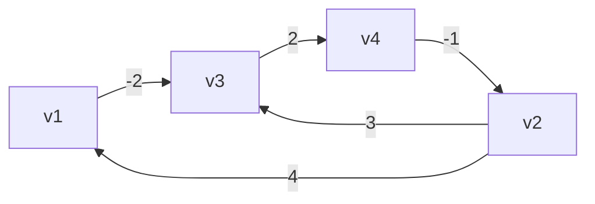


对于上图，有以下步骤：

```

            直接连通(初始化)				 k=0 借助v1到达其它顶点
                v1  v2  v3  v4				v1  v2  v3  v4
            v1  0   ∞   -2  ∞			 v1  0   ∞   -2  ∞
            v2  4   0   3   ∞			 v2  4   0   2   ∞
            v3  ∞   ∞   0   2			 v3  ∞   ∞   0   2
            v4  ∞   -1  ∞   0			 v4  ∞   -1  ∞   0

            k=1 借助v2到达其它顶点			k=2 借助v3到达其它顶点
                v1  v2  v3  v4				v1  v2  v3  v4
            v1  0   ∞   -2  ∞			 v1  0   ∞   -2  0
            v2  4   0   2   ∞			 v2  4   0   2   4
            v3  ∞   ∞   0   2			 v3  ∞   ∞   0   2
            v4  3   -1  1   0			 v4  3   -1  1   0

            k=3 借助v4到达其它顶点
                v1  v2  v3  v4
            v1  0   -1   -2  0
            v2  4   0   2   4
            v3  5   1   0   2
            v4  3   -1  1   0

```

实现的代码如下：

```java
public class FloydWarshall {
    public static void main(String[] args) {
        Vertex v1 = new Vertex("v1");
        Vertex v2 = new Vertex("v2");
        Vertex v3 = new Vertex("v3");
        Vertex v4 = new Vertex("v4");

        v1.edges = List.of(new Edge(v3, -2));
        v2.edges = List.of(new Edge(v1, 4), new Edge(v3, 3));
        v3.edges = List.of(new Edge(v4, 2));
        v4.edges = List.of(new Edge(v2, -1));
        List<Vertex> graph = List.of(v1, v2, v3, v4);

        floydWarshall(graph);
    }

    static void floydWarshall(List<Vertex> graph) {
        int size = graph.size();
        int[][] dist = new int[size][size];
        Vertex[][] prev = new Vertex[size][size];
        // 1）初始化
        for (int i = 0; i < size; i++) {
            Vertex v = graph.get(i); // v1 (v3)
            Map<Vertex, Integer> map = v.edges.stream().collect(Collectors.toMap(e -> e.linked, e -> e.weight));
            for (int j = 0; j < size; j++) {
                Vertex u = graph.get(j); // v3
                if (v == u) {
                    dist[i][j] = 0;
                } else {
                    dist[i][j] = map.getOrDefault(u, Integer.MAX_VALUE);
                    prev[i][j] = map.get(u) != null ? v : null;
                }
            }
        }
        print(prev);
        // 2）看能否借路到达其它顶点
        for (int k = 0; k < size; k++) {
            for (int i = 0; i < size; i++) {
                for (int j = 0; j < size; j++) {
//                    dist[i][k]   +   dist[k][j] // i行的顶点，借助k顶点，到达j列顶点
//                    dist[i][j]                  // i行顶点，直接到达j列顶点
                    if (dist[i][k] != Integer.MAX_VALUE && dist[k][j] != Integer.MAX_VALUE && // 首先判断距离不是无穷大
                            dist[i][k] + dist[k][j] < dist[i][j]) { // 松弛方程，判断中转点
                        dist[i][j] = dist[i][k] + dist[k][j];
                        prev[i][j] = prev[k][j];
                    }
                }
            }
        }
        print(prev);
    }

    static void path(Vertex[][] prev, List<Vertex> graph, int i, int j) {
        LinkedList<String> stack = new LinkedList<>();
        System.out.print("[" + graph.get(i).name + "," + graph.get(j).name + "] ");
        stack.push(graph.get(j).name);
        while (i != j) {
            Vertex p = prev[i][j];
            stack.push(p.name);
            j = graph.indexOf(p);
        }
        System.out.println(stack);
    }

    static void print(int[][] dist) {
        System.out.println("-------------");
        for (int[] row : dist) {
            System.out.println(Arrays.stream(row).boxed()
                    .map(x -> x == Integer.MAX_VALUE ? "∞" : String.valueOf(x))
                    .map(s -> String.format("%2s", s))
                    .collect(Collectors.joining(",", "[", "]")));
        }
    }

    static void print(Vertex[][] prev) {
        System.out.println("-------------------------");
        for (Vertex[] row : prev) {
            System.out.println(Arrays.stream(row).map(v -> v == null ? "null" : v.name)
                    .map(s -> String.format("%5s", s))
                    .collect(Collectors.joining(",", "[", "]")));
        }
    }
}
```

**负环**

如果在步骤2的k循环中，每一次循环结束后，如果在 dist 数组的对角线处（i==j 处）发现了负数，表示出现了负环

~~好了，你已经学会了Floyd-Warshall算法了，赶紧来试试[399. 除法求值](https://leetcode.cn/problems/evaluate-division/)题吧。~~

### 8) 最小生成树

最小生成树问题（MST，Minimum Cost Spanning Tree）：给定一个带权的无向连通图，如何选取一棵生成树，时树上所有边的权总和最小。

#### Prim

prim算法基于贪心算法，我们每次总是选出一个离生成树距离最小的点去加入生成树，最后实现最小生成树，该算法的思路与[Dijkstra算法](# Dijkstra（单源）)一模一样，只是在更新距离的时候是直接选择最小距离，而不是最小累计距离。

```java
public class Prim {
    public static void main(String[] args) {
        Vertex v1 = new Vertex("v1");
        Vertex v2 = new Vertex("v2");
        Vertex v3 = new Vertex("v3");
        Vertex v4 = new Vertex("v4");
        Vertex v5 = new Vertex("v5");
        Vertex v6 = new Vertex("v6");
        Vertex v7 = new Vertex("v7");

        v1.edges = List.of(new Edge(v2, 2), new Edge(v3, 4), new Edge(v4, 1));
        v2.edges = List.of(new Edge(v1, 2), new Edge(v4, 3), new Edge(v5, 10));
        v3.edges = List.of(new Edge(v1, 4), new Edge(v4, 2), new Edge(v6, 5));
        v4.edges = List.of(new Edge(v1, 1), new Edge(v2, 3), new Edge(v3, 2),
                new Edge(v5, 7), new Edge(v6, 8), new Edge(v7, 4));
        v5.edges = List.of(new Edge(v2, 10), new Edge(v4, 7), new Edge(v7, 6));
        v6.edges = List.of(new Edge(v3, 5), new Edge(v4, 8), new Edge(v7, 1));
        v7.edges = List.of(new Edge(v4, 4), new Edge(v5, 6), new Edge(v6, 1));

        List<Vertex> graph = List.of(v1, v2, v3, v4, v5, v6, v7);
        prim(graph, v1);
    }

    static void prim(List<Vertex> graph, Vertex source) {
        PriorityQueue<Vertex> queue = new PriorityQueue<>(Comparator.comparingInt(v -> v.dist));
        source.dist = 0;
        for (Vertex v : graph) {
            queue.offer(v);
        }

        while (!queue.isEmpty()) {
            System.out.println(queue);
            Vertex curr = queue.peek(); // 3. 选取当前顶点
            // 4. 更新当前顶点邻居距离
            if(!curr.visited) {
                updateNeighboursDist(curr, queue);
                curr.visited = true; // 由于每次都是选择一个距离最短的，因此直接设置为ture不再访问，同时也避免多次访问
            }
            queue.poll(); // 5. 移除当前顶点
        }
    }
    
	private static void updateNeighboursDist(Vertex curr, PriorityQueue<Vertex> queue) {
        for (Edge edge : curr.edges) {
            Vertex n = edge.linked;
            if (!n.visited) {
                int dist = edge.weight; // 与Dijkstra算法的不同之处
                if (dist < n.dist) {
                    n.dist = dist;
                    n.prev = curr;
                    queue.offer(n); // 必须重新加入，如果不加入则不会修改其位置
                }
            }
        }
    }
}
```

#### Kruskal

该算法是以边为核心，逐一处理每条边来得到最小生成树，其算法步骤如下：

1. 构建一个只含 n 个节点的森林
2. 依照权值从小到大，从联通网中选择边加入森林（避免产生回路）
3. 直到森林变成一棵树为止，就完成了最小生成树

```java
public class Kruskal {
    static class Edge implements Comparable<Edge> {
        List<Vertex> vertices;
        int start;
        int end;
        int weight;

        public Edge(List<Vertex> vertices, int start, int end, int weight) {
            this.vertices = vertices;
            this.start = start;
            this.end = end;
            this.weight = weight;
        }

        public Edge(int start, int end, int weight) {
            this.start = start;
            this.end = end;
            this.weight = weight;
        }

        @Override
        public int compareTo(Edge o) {
            return Integer.compare(this.weight, o.weight);
        }

        @Override
        public String toString() {
            return vertices.get(start).name + "<->" + vertices.get(end).name + "(" + weight + ")";
        }
    }

    public static void main(String[] args) {
        Vertex v1 = new Vertex("v1");
        Vertex v2 = new Vertex("v2");
        Vertex v3 = new Vertex("v3");
        Vertex v4 = new Vertex("v4");
        Vertex v5 = new Vertex("v5");
        Vertex v6 = new Vertex("v6");
        Vertex v7 = new Vertex("v7");

        List<Vertex> vertices = List.of(v1, v2, v3, v4, v5, v6, v7);
        PriorityQueue<Edge> queue = new PriorityQueue<>(List.of(
                new Edge(vertices,0, 1, 2),
                new Edge(vertices,0, 2, 4),
                new Edge(vertices,0, 3, 1),
                new Edge(vertices,1, 3, 3),
                new Edge(vertices,1, 4, 10),
                new Edge(vertices,2, 3, 2),
                new Edge(vertices,2, 5, 5),
                new Edge(vertices,3, 4, 7),
                new Edge(vertices,3, 5, 8),
                new Edge(vertices,3, 6, 4),
                new Edge(vertices,4, 6, 6),
                new Edge(vertices,5, 6, 1)
        ));

        kruskal(vertices.size(), queue);
    }

    static void kruskal(int size, PriorityQueue<Edge> queue) {
        List<Edge> result = new ArrayList<>();
        DisjointSet set = new DisjointSet(size); // 使用到了下面自定义的不相交集合
        while (result.size() < size - 1) {
            Edge poll = queue.poll();
            int s = set.find(poll.start);
            int e = set.find(poll.end);
            if (s != e) {
                result.add(poll);
                set.union(s, e);
            }
        }

        for (Edge edge : result) {
            System.out.println(edge);
        }
    }
}
```

### 9) 不相交集合（并查集合）

#### 基础

```java
public class DisjointSet {
    int[] s;
    // 索引对应顶点
    // 元素是用来表示与之有关系的顶点
    /*
        索引  0  1  2  3  4  5  6
        元素 [0, 1, 2, 3, 4, 5, 6] 表示一开始顶点直接没有联系（只与自己有联系）

    */
    public DisjointSet(int size) {
        s = new int[size];
        for (int i = 0; i < size; i++) {
            s[i] = i;
        }
    }
    // find 是找到老大
    public int find(int x) {
        if (x == s[x]) {
            return x;
        }
        return find(s[x]);
    }
    // union 是让两个集合“相交”，即选出新老大，x、y 是原老大索引
    public void union(int x, int y) {
        s[y] = x;
    }
    
    @Override
    public String toString() {
        return Arrays.toString(s);
    }
}
```

#### 路径压缩

通过优化find方法来减少查询时间，其思路就是已经找到了老大是谁，那就把此处的值定义为老大的值

```java
public int find(int x) { // x = 2
    if (x == s[x]) {
        return x;
    }
    return s[x] = find(s[x]); // 0    s[2]=0，s[1]=0
}
```

#### Union By Size

通过根据每个集合的元素个数进行判断哪个集合作为老大，来更新值

```java
public void union(int x, int y) {
    if (size[x] < size[y]) {
        int t = x;
        x = y;
        y = t;
    }
    s[y] = x;
    size[x] = size[x] + size[y];
}
```

#### 改进

**~~但是仍然有问题，不是吗？~~**

即如果union的两端本来就不是老大，那么size的值是并不是老大的值，因此查询size时可以使用find方法查找老大的size，但在实际情况中需要看情况修改

```java
class DisjointSet {
    int[] s;
    int[] size;
    public DisjointSet(int size) {
        s = new int[size];
        this.size = new int[size];
        for (int i = 0; i < size; i++) {
            s[i] = i;
            this.size[i] = 1;
        }
    }
    // find 是找到老大 - 优化：路径压缩
    public int find(int x) { // x = 2
        if (x == s[x]) {
            return x;
        }
        return s[x] = find(s[x]); // 0    s[2]=0
    }
    // union 是让两个集合“相交”，即选出新老大，x、y 是原老大索引
    public void union(int x, int y) {
        int eldestX = find(x);
        int eldestY = find(y);
        if (eldestX == eldestY) return;
        if (size[eldestX] < size[eldestY]) {
            int t = x;
            x = y;
            y = t;
            t = eldestX;
            eldestX = eldestY;
            eldestY = t;
        }
        s[y] = x;
        size[eldestX] = size[eldestX] + size[eldestY];
    }

    @Override
    public String toString() {
        return "内容："+Arrays.toString(s) + "\n大小：" + Arrays.toString(size);
    }

    public static void main(String[] args) {
        DisjointSetUnionBySize set = new DisjointSetUnionBySize(5);

        set.union(1, 2);
        set.union(3, 4);
        set.union(1, 3);
        System.out.println(set);
        set.union(2, 0);
        System.out.println(set);
    }
}
```

~~好了，你已经学会了不相交集合了，赶紧再来试试[399. 除法求值](https://leetcode.cn/problems/evaluate-division/)题吧。~~

## 7 字典树

> **Trie树**，即字典树，又称**前缀树**、**单词查找树**或**键**树，是一种树形结构，是一种哈希树的变种。用于高效地存储和检索字符串数据集中的键。这一数据结构有相当多的应用情景，例如自动补完和拼写检查。

Trie的**优点**是：利用字符串的公共前缀来减少查询时间，最大限度地减少无谓的字符串比较。

Trie的**核心思想**是空间换时间。利用字符串的公共前缀来降低查询时间的开销以达到提高效率的目的。

**字典树的3个基本性质：**

1. 根节点不包含字符，除根节点外每一个节点都只包含一个字符。
2. 从根节点到某一节点，路径上经过的字符连接起来，为该节点对应的字符串。
3. 每个节点的所有子节点包含的字符都不相同。

实际上只是二叉树扩展为了26叉树，也是力扣上的**[208. 实现 Trie (前缀树)](https://leetcode.cn/problems/implement-trie-prefix-tree/)**，其实现代码如下：

```java
class Trie {
    private final Trie[] node;
    private boolean isCutoff;

    public Trie() {
        node = new Trie[26];
    }

    public void insert(String word) {			// 插入的单词全部为小写字母
        Trie trie = this;
        int idx;
        for (char c : word.toCharArray()) {
            idx = c - 'a';
            if (trie.node[idx] == null)
                trie.node[idx] = new Trie();
            trie = trie.node[idx];
        }
        trie.isCutoff = true;					// 标记一下，从开始到此处为一个完整的单词
    }

    public boolean search(String word) {		// 查询是否插入过单词
        Trie trie = findWord(word);
        return trie != null && trie.isCutoff;
    }

    public boolean startsWith(String prefix) {	// 查询是否有前缀
        return findWord(prefix) != null;
    }

    private Trie findWord(String word) {
        Trie trie = this;
        int idx;
        for (char c : word.toCharArray()) {
            idx = c - 'a';
            if (trie.node[idx] == null)
                return null;
            trie = trie.node[idx];
        }
        return trie;
    }
}
```

这种数据结构背代码是不行是，各种题目稍微改变就需要更改代码，如果感觉已经掌握了，可以试试[212. 单词搜索 II](./算法难题.md#212. 单词搜索 II)，~~但做之前还是先试试[79. 单词搜索](https://leetcode.cn/problems/word-search/)吧~~。

## 8 B树

B树（B-Tree）结构是一种高效存储和查询数据的方法，该方法的主要思想是将每个节点扩展成多个子节点，以减少查找所需的次数。B树结构非常适合应用于磁盘等大型存储器的高效操作，被广泛应用于关系数据库和文件系统中。

B树结构有很多变种和升级版，例如B+树，B*树和SB树等。这些变种和升级版本都基于B树的核心思想，通过调整B树的参数和结构，提高了B树在不同场景下的性能表现。

### 特性

一棵 B-树具有以下性质

特性1：每个节点 x 具有

* 属性 n，表示节点 x 中 key 的个数
* 属性 leaf，表示节点是否是叶子节点
* 节点 key 可以有多个，以升序存储

特性2：每个非叶子节点中的孩子数是 n + 1、叶子节点没有孩子

特性3：最小度数t（节点的孩子数称为度）和节点中键数量的关系如下：

| 最小度数t | 键数量范围     |
| --------- | -------------- |
| 2         | 1 ~ 3          |
| 3         | 2 ~ 5          |
| 4         | 3 ~ 7          |
| ...       | ...            |
| n         | (n-1) ~ (2n-1) |

其中，当节点中键数量达到其最大值时，即 3、5、7 ... 2n-1，需要分裂

特性4：叶子节点的深度都相同

> 问：
>
> B-树为什么有最小度数的限制？
>
> 答：
>
> B树中有最小度数的限制是为了保证B树的平衡特性。
>
> 在B树中，每个节点都可以有多个子节点，这使得B树可以存储大量的键值，但也带来了一些问题。如果节点的子节点数量太少，那么就可能导致B树的高度过高，从而降低了B树的效率。此外，如果节点的子节点数量太多，那么就可能导致节点的搜索、插入和删除操作变得复杂和低效。
>
> 最小度数的限制通过限制节点的子节点数量，来平衡这些问题。在B树中，每个节点的子节点数量都必须在一定的范围内，即t到2t之间（其中t为最小度数）


### B-树与 2-3 树、2-3-4 树的关系

可以这样总结它们之间的关系：

1. 2-3树是最小度数为2的B树，其中每个节点可以包含2个或3个子节点。
2. 2-3-4树是最小度数为2的B树的一种特殊情况，其中每个节点可以包含2个、3个或4个子节点。
3. B树是一种更加一般化的平衡树，可以适应不同的应用场景，其节点可以包含任意数量的键值，节点的度数取决于最小度数t的设定。

## 9 单调队列

> 单调队列：不断地向缓存数组里读入元素，也不时地去掉最老的元素，不定期的询问当前缓存数组里的最小的元素。

单调队列从字面上看，无非就是**有某种单调性的队列**。 单调队列分两种，一种是单调递增的，另外一种是单调递减的。

用单调队列来解决问题，一般都是求得当前的某个范围内的最小值或最大值。

其代码实现并不难，而典型应用就是[239. 滑动窗口最大值](https://leetcode.cn/problems/sliding-window-maximum/)，~~学习完后可以试试该题目。~~

实现的单调队列（单调循环队列，无扩容）代码如下：

```java
public class MonotonicQueue {
    int[] nums;
    int maxSize;
    int size = 0;
    int head = 0;
    int tail = 0;

    public MonotonicQueue(int size) {
        this.nums = new int[size];
        this.maxSize = size;
    }

    public void offer(int num) {
        while (size > 0 && nums[dec(tail)] < num) {		// 维护单调性
            tail = dec(tail);
            size--;
        }
        nums[tail] = num;
        tail = inc(tail);
        size++;
    }

    public int peek(){
        if (size == 0)
            throw new RuntimeException("单独队列没有内容");
        return nums[head];
    }

    public int poll(){
        if (size == 0)
            throw new RuntimeException("单独队列没有内容");
        int result = nums[head];
        head = inc(head);
        size--;
        return result;
    }

    private int inc(int index) {
        if (++index == maxSize) index = 0;
        return index;
    }

    private int dec(int index) {
        if (--index == -1) index = maxSize - 1;
        return index;
    }
}
```

由代码可见，除了offer方法有改变外其他方法均没有改变。

在此也放出[239. 滑动窗口最大值](https://leetcode.cn/problems/sliding-window-maximum/)的代码，虽然其为困难题，但使用单调队列后变得异常简单：

```java
class Solution {
    public int[] maxSlidingWindow(int[] nums, int k) {
        int[] result = new int[nums.length - k + 1];
        MonotonicQueue queue = new MonotonicQueue(k);
        for (int i = 0; i < k; i++) {
            queue.offer(nums[i]);
        }
        result[0] = queue.peek();
        for (int i = k, j = 1; i < nums.length; i++, j++) {
            if (queue.peek() == nums[j - 1])
                queue.poll();
            queue.offer(nums[i]);
            result[j] = queue.peek();
        }
        return result;
    }
}
```

使用以上代码可以达到12ms，超越96%的用户。

## 10 单调栈

> 单调栈：不断地向缓存数组里读入元素，也不时地去掉最老的元素，不定期的询问当前缓存数组里的最小的元素。

单调栈从字面上看，无非就是**有某种单调性的栈**。 单调栈分两种，一种是单调递增的，另外一种是单调递减的。

用单调栈来解决问题，一般都是求最大面积或最小面积等。

其代码实现并不难，而典型应用就是[84. 柱状图中最大的矩形](https://leetcode.cn/problems/largest-rectangle-in-histogram/)，~~学习完后可以试试该题目。~~

实现的单调栈（无扩容）代码如下：

```java
public class MonotonicStack {
    int[] nums;
    int maxSize;
    int tail = 0;

    public MonotonicStack(int size) {
        this.nums = new int[size];
        this.maxSize = size;
    }
    
    public void push(int num){
        while (tail > 0 && nums[tail - 1] < num) {
            tail--;
        }
        nums[tail++] = num;
    }
    
    public int peek(){
        return nums[tail - 1];
    }
    
    public int pop(){
        return nums[--tail];
    }
}
```

在此也放出[84. 柱状图中最大的矩形](https://leetcode.cn/problems/largest-rectangle-in-histogram/)的代码，虽然其为困难题，~~但还是很困难~~：

```java
class Solution {
    public int largestRectangleArea(int[] heights) {
        if (heights.length == 1) return heights[0];
        MonotonicStack stack = new MonotonicStack(heights.length);
        int max = heights[0];
        int[] left;
        stack.push(new int[]{max, 0});
        for (int i = 1; i < heights.length; i++) {
            if (heights[i] < stack.peek()[0]) {
                do {
                    left = stack.pop();
                    max = Math.max(max, left[0] * (i - left[1]));
                } while (stack.size() > 0 && heights[i] < stack.peek()[0]);
                stack.push(new int[]{heights[i], left[1]});		// 修改地方
            } else {
                stack.push(new int[]{heights[i], i});
            }
        }
        while (stack.size() > 0){
            left = stack.pop();
            max = Math.max(max, left[0] * (heights.length - left[1]));
        }
        return max;
    }
	// 单调栈，做了修改
    static class MonotonicStack {
        int[][] nums;
        int maxSize;
        int size = 0;

        public MonotonicStack(int size) {
            this.nums = new int[size][2];
            this.maxSize = size;
        }

        public void push(int[] num){nums[size++] = num;}

        public int[] peek(){return nums[size - 1];}

        public int[] pop(){return nums[--size];}

        public int size(){return size;}
    }
}
```

其主要思路就是遍历每个高度，以当前高度为基准，寻找最大的宽度，组成最大的矩形面积。即：找左边第一个小于当前高度的下标left（其实也就是上面代码的注释`// 修改地方`），再找右边第一个小于当前高度的下标right 那宽度就是这两个下标之间的距离了。

以上代码并没有修改原始数组，因此将栈修改了一下，且性能较低，需要29ms，只击败了53%的用户，如果修改原始数组可以达到8ms，击败98%的用户

# 常用的算法

## 1 二分查找算法(Binary Search)

二分查找只适用于从**有序数列**中进行查找。其运行时间为 $O(log(N))$。

### 1) 基础版

需求：在**有序**数组 $A$ 内，查找值 $target$

* 如果找到返回索引
* 如果找不到返回 $-1$

算法描述

|      |                                                              |
| ---- | ------------------------------------------------------------ |
| 前提 | 给定一个内含 $n$ 个元素的有序数组 $A$，满足 $A_{0}\leq A_{1}\leq A_{2}\leq \cdots \leq A_{n-1}$，一个待查值 $target$ |
| 1    | 设置 $i=0$，$j=n-1$                                          |
| 2    | 如果 $i \gt j$，结束查找，没找到                             |
| 3    | 设置 $m = floor(\frac {i+j}{2})$ ，$m$ 为中间索引，$floor$ 是向下取整（$\leq \frac {i+j}{2}$ 的最小整数） |
| 4    | 如果 $target < A_{m}$ 设置 $j = m - 1$，跳到第2步            |
| 5    | 如果 $A_{m} < target$ 设置 $i = m + 1$，跳到第2步            |
| 6    | 如果 $A_{m} = target$，结束查找，找到了                      |

java 实现


```java
public static int binarySearch(int[] a, int target) {
    int i = 0, j = a.length - 1;
    while (i <= j) {
        int m = (i + j) >>> 1;
        if (target < a[m]) {			// 在左边
            j = m - 1;
        } else if (a[m] < target) {		// 在右边
            i = m + 1;
        } else {
            return m;
        }
    }
    return -1;
}
```

* $i,j$ 对应着搜索区间 $[0,a.length-1]$（注意是闭合的区间），$i<=j$ 意味着搜索区间内还有未比较的元素，$i,j$ 指向的元素也可能是比较的目标
  * 思考：如果不加 $i==j$ 行不行？
  * 回答：不行，因为这意味着 $i,j$ 指向的元素会漏过比较
* $m$ 对应着中间位置，中间位置左边和右边的元素可能不相等（差一个），不会影响结果
* 如果某次未找到，那么缩小后的区间内不包含 $m$

### 2) 改变版

另一种写法

```java
public static int binarySearch(int[] a, int target) {
    int i = 0, j = a.length;
    while (i < j) {
        int m = (i + j) >>> 1;
        if (target < a[m]) {			// 在左边
            j = m;
        } else if (a[m] < target) {		// 在右边
            i = m + 1;
        } else {
            return m;
        }
    }
    return -1;
}
```

* $i,j$ 对应着搜索区间 $[0,a.length)$（注意是左闭右开的区间），$i<j$ 意味着搜索区间内还有未比较的元素，$j$ 指向的**一定不是**查找目标
  * 思考：为啥这次不加 $i==j$ 的条件了？
  * 回答：这回 $j$ 指向的不是查找目标，如果还加 $i==j$ 条件，就意味着 $j$ 指向的还会再次比较，找不到时，会死循环
* 如果某次要缩小右边界，那么 $j=m$，因为此时的 $m$ 已经**不是**查找目标了

## 2 分治算法(Divide and Conquer)

分治思想

- 将大问题划分为两个到多个子问题
- 子问题可以继续拆分成更小的子问题，直到能够简单求解
- 如有必要，将子问题的解进行合并，得到原始问题的解

该算法也是很多高效算法的基础，如[二分查找算法](# 1 二分查找算法)，排序算法（[快速排序](# 8 快速排序)、[归并排序](# 6 归并排序)），傅立叶变换（快速傅立叶变换）等。

下面的代码是力扣中[23. 合并 K 个升序链表](https://leetcode.cn/problems/merge-k-sorted-lists/)的解法，其本质其实是[21. 合并两个有序链表](https://leetcode.cn/problems/merge-two-sorted-lists/)只是一道简答题，使用分治后很容易的就解决了。

```java
class Solution {
    public ListNode mergeKLists(ListNode[] lists) {
        if (lists == null || lists.length == 0){
            return null;
        }
        return mergeLists(lists, 0, lists.length - 1); // j代表的含义是要包含该值的
    }

    private ListNode mergeLists(ListNode[] lists, int i, int j){
        if (j == i){
            return lists[i];
        }
        int mid = (j + i) >>> 1; //等价于 mid = (i + j) / 2
        ListNode left = mergeLists(lists, i, mid); // 分为 i<-->mid 和 mid + 1<-->j
        ListNode right = mergeLists(lists, mid + 1, j);
        return mergeTwoLists(left, right); // 治 两个 链表
    }

    private ListNode mergeTwoLists(ListNode list1, ListNode list2){
        if (list1 == null){
            return list2;
        }
        if (list2 == null){
            return list1;
        }
        ListNode head = list1;
        if (list1.val > list2.val){ // 按大小取首个链表
            head = list2;
            list2 = list2.next;
        } else {
            list1 = list1.next;
        }
        ListNode node = head;
        while (list1 != null && list2 != null){
            if (list1.val > list2.val){
                head.next = list2;
                list2 = list2.next;
            } else {
                head.next = list1;
                list1 = list1.next;
            }
            head = head.next;
        }
        if (list1 == null){ // 此时list1与list2必有一个为null，只需把另一个不为null的接在head之后即可
            head.next = list2;
        } else {
            head.next = list1;
        }
        return node;
    }
}
```

## 3 贪心算法(Greedy Algorithm)

称之为贪心算法或贪婪算法，**核心思想**是

1. 将寻找最优解的问题分为若干个步骤
2. 每一步骤都采用贪心原则，选取当前最优解
3. 因为没有考虑所有可能，局部最优的堆叠**不一定**让最终解最优

贪心算法是一种在每一步选择中都采取在当前状态下最好或最优(即最有利)的选择，从而希望导致结果是最好或最优的算法。这种算法通常用于求解优化问题，如最小生成树、背包问题等。

**贪心算法的应用：**

1. 背包问题：给定一组物品和一个背包，每个物品有一定的重量和价值，要求在不超过背包容量的情况下，尽可能多地装入物品。
2. 活动选择问题：在一个活动集合中，每次只能参加一个活动，问如何安排时间以最大化所有活动的收益。
3. 编辑距离问题：给定两个字符串，求它们之间的最小编辑距离(即将一个字符串转换为另一个字符串所需的最少操作次数)。
4. 网络流问题：给定一张有向图和一些起点和终点，求最大流量。
5. 找零问题：给定一定数量的硬币和需要找零的金额，求使用最少的硬币数。

**常见问题及解答：**

1. 贪心算法一定会找到最优解吗？
   答：不一定。贪心算法只保证在每一步选择中都是最优的，但并不能保证整个问题的最优解。例如，背包问题中的贪心算法可能会导致最后一个物品没有被装入背包。
2. 如何判断一个问题是否适合用贪心算法解决？
   答：一个问题如果可以用递归的方式分解成若干个子问题，且每个子问题都有明确的最优解(即局部最优),那么这个问题就可以用贪心算法解决。
3. 贪心算法的时间复杂度是多少？
   答：贪心算法的时间复杂度取决于问题的规模和具体实现。一般来说，对于规模较小的问题，贪心算法的时间复杂度可以达到$O(nlog(n))$或$O(n^2)$;对于规模较大的问题，可能需要$O(n^3)$或更高。

几个贪心的例子**[Dijkstra 算法](# Dijkstra（单源）)** 、**[Prim 算法](# Prim)** 、**[Kruskal 算法](# Kruskal)**、**[Huffman 树](# 5.6 Huffman 树) **、**[选择排序](# 2 选择排序) **、**[堆排序](# 3 堆排序)**。

### 分数背包问题

1. n个物品都是液体，有重量和价值
   
1. 现在你要取走 10升 的液体
   
1. 每次可以不拿，全拿，或拿一部分，问最高价值是多少
   
    | 编号 | 重量 | 价值 |
    | ---- | ---- | ---- |
    | 0    | 4    | 24   |
    | 1    | 8    | 160  |
    | 2    | 2    | 4000 |
    | 3    | 6    | 108  |
    | 4    | 1    | 4000 |

```java
public class FractionalKnapsackProblem {
    static class Item {
        int index;
        int weight;
        int value;

        public Item(int index, int weight, int value) {
            this.index = index;
            this.weight = weight;
            this.value = value;
        }

        int unitPrice() {
            return value / weight;
        }

        @Override
        public String toString() {
            return "Item(" + index + ")";
        }
    }

    public static void main(String[] args) {
        Item[] items = new Item[]{
                new Item(0, 4, 24),
                new Item(1, 8, 160),
                new Item(2, 2, 4000),
                new Item(3, 6, 108),
                new Item(4, 1, 4000),
        };
        select(items, 10);
    }

    static void select(Item[] items, int total) {
        Arrays.sort(items, Comparator.comparingInt(Item::unitPrice).reversed());	// 将单位价值最高的排序到前面，
        int remainder = total;
        int max = 0;
        for (Item item : items) {					// 每次取最值钱的
            if (remainder - item.weight > 0) {
                max += item.value;
                remainder -= item.weight;
            } else {
                max += remainder * item.unitPrice();
                break;
            }
        }
        System.out.println("最高价值为：" + max);
    }
}
```

### 0-1 背包问题

1. n个物品都是固体，有重量和价值

2. 现在你要取走 10g 的固体

3. 每次可以不拿，全拿，问最高价值是多少

   | 编号 | 重量 | 价值    |
   | ---- | ---- | ------- |
   | 0    | 1    | 1000000 |
   | 1    | 4    | 1600    |
   | 2    | 8    | 2400    |
   | 3    | 5    | 30      |

可能得不到最优解

```java
public class KnapsackProblem {
    static class Item {
        int index;
        int weight;
        int value;

        public Item(int index, int weight, int value) {
            this.index = index;
            this.weight = weight;
            this.value = value;
        }

        public int unitValue() {
            return value / weight;
        }

        @Override
        public String toString() {
            return "Item(" + index + ")";
        }
    }

    public static void main(String[] args) {
        Item[] items = new Item[]{
                new Item(0, 1, 1_000_000),
                new Item(1, 4, 1600),
                new Item(2, 8, 2400),
                new Item(3, 5, 30)
        };
        select(items, 10);
    }

    static void select(Item[] items, int total) {
        Arrays.sort(items, Comparator.comparingInt(Item::unitValue).reversed());
        int max = 0; // 最大价值
        for (Item item : items) {
            System.out.println(item);
            if (total >= item.weight) { // 可以拿完
                total -= item.weight;
                max += item.value;
            }
        }
        System.out.println("最大价值是:" + max);
    }
}
```

### 贪心算法的局限

| 问题名称                                              | 是否能用贪心得到最优解 | 替换解法     |
| ----------------------------------------------------- | ---------------------- | ------------ |
| Dijkstra(不存在负边)                                  | ✔️                      |              |
| Dijkstra(存在负边)                                    | ❌                      | Bellman-Ford |
| Prim                                                  | ✔️                      |              |
| Kruskal                                               | ✔️                      |              |
| [零钱兑换](https://leetcode.cn/problems/coin-change/) | ❌                      | 动态规划     |
| Huffman 树                                            | ✔️                      |              |
| 活动选择问题                                          | ✔️                      |              |
| 分数背包问题                                          | ✔️                      |              |
| 0-1 背包问题                                          | ❌                      | 动态规划     |

## 4 动态规划(Dynamic Programming)

动态规划最核心的思想，就在于**拆分子问题，记住过往，减少重复计算**。

**对比分治算法**

* 都需要拆分子问题
* 动态规划的子问题有重叠、因此需要记录之前子问题解，避免重复运算
* 分而治之的子问题无重叠

### **做动态规划的思路：**

**1. 穷举分析**

**2. 确定边界**

**3. 找规律，确定最优子结构**

> ★ 一道动态规划问题，其实就是一个递推问题。假设当前决策结果是f(n),则最优子结构就是要让 f(n-k) 最优,最优子结构性质就是能让转移到n的状态是最优的,并且与后面的决策没有关系,即让后面的决策安心地使用前面的局部最优解的一种性质
> ”

**4， 写出状态转移方程**

通过前面3步，穷举分析，确定边界，最优子结构，我们就可以得出状态转移方程

**一般而言，对于原始问题是2维数组的，可以化简为1维数组，原始问题是1维数组的，可以化简为若干变量。**

### 0-1 背包问题

1. n个物品，有重量和价值，每个物体只有1个

2. 现在你要取走重量 10g 的物体

3. 每次可以不拿，全拿，问最高价值是多少

   | 名字 | 编号 | 重量 | 价值    |
   | ---- | ---- | ---- | ------- |
   | 钻石 | 0    | 1    | 1000000 |
   | 黄金 | 1    | 4    | 1600    |
   | 宝石 | 2    | 8    | 2400    |
   | 白银 | 3    | 5    | 30      |

做题思路：

1. 首先分析需要几维数组，目前来看，变量有两个，一个是你实际取的重量，一个是你实际取的物体。因此需要2维数组，其中一个维度是重量，一个维度是物体
2. 左边界可以是重量，因为拿物体是需要消耗重量的，因此可以从0开始。上边界可以是第一个物体，这样就无需考虑其他的物体影响
3. 每次选择时都要尽可能的让当前的价值最大，因此就必须比较，**上一次同容量背包的最大价值**和**这次物品价值 + 剩余背包空间能装下的最大价值**哪个更大
4. 由此也就得出了递推表达式：$value(x, y) = max(value(x-1, y), value(x-1, y-item.wight) + item.value)$

| 名字 |  0   |    1    |    2    |    3    |    4    |    5    |    6    |    7    |    8    |    9    |   10    |
| :--: | :--: | :-----: | :-----: | :-----: | :-----: | :-----: | :-----: | :-----: | :-----: | :-----: | :-----: |
| 黄金 |  0   |    0    |    0    |    0    |  1600   |  1600   |  1600   |  1600   |  1600   |  1600   |  1600   |
| 宝石 |  0   |    0    |    0    |    0    |  1600   |  1600   |  1600   |  1600   |  2400   |  2400   |  2400   |
| 白银 |  0   |    0    |    0    |    0    |  1600   |  1600   |  1600   |  1600   |  2400   |  2400   |  2400   |
| 钻石 |  0   | 1000000 | 1000000 | 1000000 | 1000000 | 1001600 | 1001600 | 1001600 | 1001600 | 1002400 | 1002400 |

上表中列出了value矩阵，其行表示只能取该行及该行以上的物体，列表示只能取该重量以内的。实现的代码如下：

```java
public class KnapsackProblem {
    static class Item {
        int index;
        String name;
        int weight;
        int value;

        public Item(int index, String name, int weight, int value) {
            this.index = index;
            this.name = name;
            this.weight = weight;
            this.value = value;
        }
    }

    public static void main(String[] args) {
        Item[] items = new Item[]{
                new Item(1, "黄金", 4, 1600),
                new Item(2, "宝石", 8, 2400),
                new Item(3, "白银", 5, 30),
                new Item(4, "钻石", 1, 10_000),
        };
        System.out.println(select(items, 10));
    }

    static int select(Item[] items, int total) {
        int[][] dp = new int[items.length][total + 1];
        Item item0 = items[0];
        for (int j = 0; j <= total; j++) {
            if (j >= item0.weight) {
                dp[0][j] = item0.value;
            }
        }
        for (int i = 1; i < dp.length; i++) {
            Item item = items[i];
            for (int j = 1; j <= total; j++) {
                if (j >= item.weight) { // 当前背包容量-这次物品重量=剩余背包空间
                    //              上一次同容量背包的最大价值  剩余背包空间能装下的最大价值 + 这次物品价值
                    dp[i][j] = Integer.max(dp[i - 1][j], dp[i - 1][j - item.weight] + item.value);
                } else {
                    dp[i][j] = dp[i - 1][j];
                }
            }
        }
        return dp[dp.length - 1][total];
    }
}
```

### 完全背包问题

1. n个物品，有重量和价值，每个物体有无数个

2. 现在你要取走重量 10g 的物体

3. 每次可以不拿，全拿，问最高价值是多少

   | 名字 | 编号 | 重量 | 价值 |
   | ---- | ---- | ---- | ---- |
   | 青铜 | 0    | 2    | 3    |
   | 白银 | 1    | 3    | 4    |
   | 黄金 | 2    | 4    | 7    |

做题思路：

1. 首先分析需要几维数组，目前来看，变量有两个，一个是你实际取的重量，一个是你实际取的物体。因此需要2维数组，其中一个维度是重量，一个维度是物体
2. 左边界可以是重量，因为拿物体是需要消耗重量的，因此可以从0开始。上边界可以是第一个物体，这样就无需考虑其他的物体影响
3. 每次选择时都要尽可能的让当前的价值最大，因此就必须比较，**上一次同容量背包的最大价值**和**这次物品价值 + 剩余背包空间能装下的最大价值**哪个更大
4. 由此也就得出了递推表达式：$value(x, y) = max(value(x-1, y), value(x, y-item.wight) + item.value)$

| 名字 |  0   |  1   |  2   |  3   |  4   |  5   |  6   |  7   |  8   |  9   |  10  |
| :--: | :--: | :--: | :--: | :--: | :--: | :--: | :--: | :--: | :--: | :--: | :--: |
| 青铜 |  0   |  0   |  3   |  3   |  6   |  6   |  9   |  9   |  12  |  12  |  15  |
| 白银 |  0   |  0   |  3   |  4   |  6   |  7   |  9   |  10  |  12  |  13  |  15  |
| 黄金 |  0   |  0   |  3   |  4   |  7   |  7   |  10  |  11  |  14  |  14  |  17  |

上表中列出了value矩阵，其行表示只能取该行及该行以上的物体，列表示只能取该重量以内的。实现的代码如下：

```java
class KnapsackProblemComplete {
    static class Item {
        int index;
        String name;
        int weight;
        int value;

        public Item(int index, String name, int weight, int value) {
            this.index = index;
            this.name = name;
            this.weight = weight;
            this.value = value;
        }
    }

    public static void main(String[] args) {
        Item[] items = new Item[]{
                new Item(1, "青铜", 2, 3),    
                new Item(2, "白银", 3, 4),   
                new Item(3, "黄金", 4, 7),    
        };
        System.out.println(select(items, 10));
    }
    private static int select(Item[] items, int total) {
        int[][] dp = new int[items.length][total + 1];
        Item item0 = items[0];
        for (int j = 0; j <= total; j++) {
            if (j >= item0.weight) {
                dp[0][j] = dp[0][j - item0.weight] + item0.value;
            }
        }
        for (int i = 1; i < items.length; i++) {
            Item item = items[i];
            for (int j = 1; j <= total; j++) {
                if (j >= item.weight) { // 当前背包容量-这次物品重量=剩余背包空间
                    //            上一次同容量背包的最大价值   剩余背包空间能装下的最大价值 + 这次物品价值
                    dp[i][j] = Integer.max(dp[i - 1][j], dp[i][j - item.weight] + item.value);
                } else {
                    dp[i][j] = dp[i - 1][j];
                }
            }
        }
        return dp[dp.length - 1][total];
    }
}
```

**对比**

对比0-1 背包问题与完全背包问题，其递推表达式分别为：

$value(x, y) = max(value(x-1, y), value(x-1, y-item.wight) + item.value)$

$value(x, y) = max(value(x-1, y), value(x, y-item.wight) + item.value)$

可以看出其差异仅在判断剩余背包空间能装下的最大价值，对于0-1 背包，其是判断从截止到上一个物体时候的价值，这样就避免拿取重复的物体，而完全背包则是从当前行开始，这样就有可能拿到重复的物体，这样的差别在下面的降维中也体现了出来。

**0-1 背包问题降维**

```java
static int select(Item[] items, int total) {
    int[] dp = new int[total + 1];
    for (Item item : items) {
        for (int j = total; j > 0; j--) {
            if (j >= item.weight) { // 装得下
                dp[j] = Integer.max(dp[j], item.value + dp[j - item.weight]);
            }
        }
        System.out.println(Arrays.toString(dp));
    }
    return dp[total];
}
```

**完全背包问题降维**

```java
private static int select(Item[] items, int total) {
    int[] dp = new int[total + 1];
    for (Item item : items) {
        for (int j = 0; j <= total; j++) {
            if (j >= item.weight) {
                dp[j] = Integer.max(dp[j], item.value + dp[j - item.weight]);
            }
        }
        System.out.println(Arrays.toString(dp));
    }
    return dp[total];
}
```

对比两个降维的降维的代码，其不同点只在第二个循环中j是从小到大还是从大到小，如果是从大到小，那么`dp[j - item.weight]`就是上个物体的价值，这样就不会包括当前的物体，也就避免了重复，如果是从小到大则正好相反。

一般而言，使用动态规划的场景很多，除了这些显而易见的类背包问题，一些求解一个或两个数字/字符串的题目都可以使用动态规划，例如下面的力扣72题：

### [72. 编辑距离](https://leetcode.cn/problems/edit-distance/)

给你两个单词 `word1` 和 `word2`， 请返回将 `word1` 转换成 `word2` 所使用的最少操作数 。

你可以对一个单词进行如下三种操作：

- 插入一个字符
- 删除一个字符
- 替换一个字符

这里我们就可以让`dp[i][j]` 代表 `word1` 到 `i` 位置转换成 `word2` 到 `j` 位置需要最少步数

- 当 `word1[i] == word2[j]`，`dp[i][j] = dp[i-1][j-1]`；
- 当 `word1[i] != word2[j]`，`dp[i][j] = min(dp[i-1][j-1], dp[i-1][j], dp[i][j-1]) + 1`
- 其中，`dp[i-1][j-1]` 表示替换操作，`dp[i-1][j]` 表示删除操作，`dp[i][j-1]` 表示插入操作。
- 针对第一行，第一列要单独考虑，我们引入 `''`

基于此实现的代码如下：

```java
class Solution {
    public int minDistance(String word1, String word2) {
        char[] c1 = word1.toCharArray();
        char[] c2 = word2.toCharArray();
        int high = c1.length + 1, width = c2.length + 1;
        int[][] dp = new int[high][width];
        for (int i = 1; i < high; i++) {
            dp[i][0] = i;					// 边界初始化
        }
        for (int j = 1; j < width; j++) {
            dp[0][j] = j;					// 边界初始化
        }
        for (int i = 1; i < high; i++) {
            for (int j = 1; j < width; j++) {
                if (c1[i - 1] == c2[j - 1]) {
                    dp[i][j] = dp[i - 1][j - 1];	// 状态转移方程
                } else {
                    dp[i][j] = 1 + min(dp[i - 1][j - 1], dp[i - 1][j], dp[i][j - 1]);	// 状态转移方程
                }
            }
        }
        return dp[c1.length][c2.length];
    }

    private int min(int x, int y, int z){
        return Math.min(x, Math.min(y, z));
    }
}
```

对于其他的动态规划方法，例如目标是求组合数、求排列数的完全背包问题，我们还需要考虑考虑循环方式是怎么样的。

对于普通的求最大价值的完全背包问题，不论怎么循环，其最后的价值是不变的，而对于求其组合成最大价值的方式，排列成最大价值的方式就不一样了，就需要对循环进行一番查看。

下面给出其结果：

- **如果求组合数就是外层for循环遍历物品，内层for遍历背包**。

- **如果求排列数就是外层for遍历背包，内层for循环遍历物品**。

如果把遍历nums（物品）放在外循环，遍历target的作为内循环的话，举一个例子：计算dp[4]的时候，结果集只有 {1,3} 这样的集合，不会有{3,1}这样的集合，因为nums遍历放在外层，3只能出现在1后面！

对应的题目为排列数：[377. 组合总和 Ⅳ](https://leetcode.cn/problems/combination-sum-iv/)，组合数：[518. 零钱兑换 II](https://leetcode.cn/problems/coin-change-ii/)

## 5 回溯算法(Back Tracking)

回溯算法(Backtracking Algorithm)（探索与回溯法）是一种选优搜索法，又称为试探法，按选优条件向前搜索，以达到目标。但当探索到某一步时，发现原先选择并不优或达不到目标，就退回到上一步，重新选择，这种走不通就退回再走的技术为回溯法，而满足回溯条件的某个状态的点称为“回溯点”。

**「回溯是递归的副产品，只要有递归就会有回溯」**，所以回溯法也经常和二叉树遍历，深度优先搜索混在一起，因为这两种方式都是用了递归。但是回溯的关键不在于递归，而在于“状态”。在回溯算法向前的每一步，你都会去设置某个状态，而当向前走走不通的时候回退，此时需要把之前设置的状态撤销掉。

## 6 最大子数组和算法

> Kadane's算法是一种用于解决**最大子数组和**问题的动态规划算法。这类问题的目标是在给定整数数组中找到一个连续的子数组，使其元素之和最大（数组含有负数）。

算法的核心思想是通过迭代数组的每个元素，维护两个变量来跟踪局部最优解和全局最优解。

以下是Kadane’s算法的详细步骤：

1. 初始化：

- 令 localMax 表示在当前位置结束的最大子数组和，初始值为数组的第一个元素。
- 令 globalMax 表示全局最大子数组和，初始值也为数组的第一个元素。

2. 迭代：

- 从数组的第二个元素开始迭代。对于每个元素，计算在当前位置结束的最大子数组和：

```java
localMax = Math.max(nums[i], localMax + nums[i]);
```


这表示要么继续当前子数组，要么从当前位置开始一个新的子数组。

- 更新全局最大子数组和：

```java
globalMax = Math.max(localMax, globalMax);
```


如果在当前位置结束的子数组和大于全局最大和，更新全局最大和。

3. 返回结果：

- 当迭代完成后，globalMax 中存储的即为最大子数组和。

**复杂度：**

时间复杂度：$O(n)$，其中 $n$ 为 nums 数组的长度。我们只需要遍历一遍数组即可求得答案。
空间复杂度：$O(1)$。我们只需要常数空间存放若干变量。

**[53. 最大子数组和](https://leetcode.cn/problems/maximum-subarray/)**

给你一个整数数组 `nums` ，请你找出一个具有最大和的连续子数组（子数组最少包含一个元素），返回其最大和。

```java
class Solution {
    public int maxSubArray(int[] nums) {
        int globalMax = nums[0], localMax = nums[0];
        for (int i = 1; i < nums.length; i++) {
            localMax = Math.max(nums[i], localMax + nums[i]);
            globalMax = Math.max(localMax, globalMax);
        }
        return globalMax;
    }
}
```

对于第51题，还有前缀和的解法，其解法类似于[560. 和为 K 的子数组](https://leetcode.cn/problems/subarray-sum-equals-k/)。

**[918. 环形子数组的最大和](https://leetcode.cn/problems/maximum-sum-circular-subarray/)**

给定一个长度为 `n` 的**环形整数数组** `nums` ，返回 `nums` 的非空 **子数组** 的最大可能和。

```java
class Solution {
    public int maxSubarraySumCircular(int[] nums) {
        int globalMax = nums[0], localMax = nums[0];
        int globalMin = nums[0], localMin = nums[0];
        int sum = nums[0];
        for (int i = 1; i < nums.length; i++) {
            sum += nums[i];
            localMax = Math.max(nums[i], localMax + nums[i]);
            globalMax = Math.max(localMax, globalMax);
            localMin = Math.min(nums[i], localMin + nums[i]);
            globalMin = Math.min(localMin, globalMin);
        }
        if (globalMax < 0) return globalMax; // 如果数组全为负数，则返回其中最大的负数
        return Math.max(globalMax, sum - globalMin);
    }
}
```

以上代码经过优化后可达4ms。

## 7 字符串查找算法

### 1） KMP 算法

> KMP（Knuth-Morris-Pratt），该算法以提出该算法的三人姓名命名，是一个解决查找 模式字符串 在文本中出现位置的经典算法，例如：[28. 找出字符串中第一个匹配项的下标](https://leetcode.cn/problems/find-the-index-of-the-first-occurrence-in-a-string/)。

KMP 算法利用前面判断过的信息，通过一个 LPS数组（**longest proper prefix**），保存模式串中前后最长公共子序列的长度。每次回溯时，通过 LPS数组找到前面匹配过的位置，省去了大量计算时间。

在 KMP 算法里，源串指针永远不会向前回溯，而对象串指针在当前位置匹配成功时后移，匹配失败时前移。

首先看一下不使用KMP算法，而是使用暴力匹配的代码：

```java
class Solution {
    public int strStr(String haystack, String needle) {
        char[] text = haystack.toCharArray();
        char[] pattern = needle.toCharArray();
        for (int i = 0; i <= (text.length - pattern.length); i++) {
            if (find(text, pattern, i)) {			// 如果没匹配成功，i退回i+1
                return i;
            }
        }
        return -1;
    }

    private boolean find(char[] text, char[] pattern, int i) {
        for (int j = 0; j < pattern.length; j++) {
            if (text[i + j] != pattern[j]) {		// 匹配时i前进
                return false;
            }
        }
        return true;
    }
}
```

以上代码将匹配的过程拆分为了一个函数，联合起来看，匹配时`i`增加，一直增加到`i+j`，如果匹配失败则i退回至`i+1`，但是可不可以少退回一点呢？因为在匹配的时候已经对比过了，因此KMP算法就是用来退回的时候尽量少退一点。

我们可以使用一个LPS数组来保存模式串中前后最长公共子序列的长度，其值代表匹配到`i`时前缀与后缀相等的长度。其可以通过模式串与模式串之间相互匹配来求得，其算法如下：

- 遇到相同字符：

  在LPS数组索引`i`处记录共同的前后缀长度`j+1`，然后`j++,i++`

- 遇到不同字符：

  前面没有共同字符（即`j=0`时），LSP数组在索引`i`处记录为0，`i++`

  前面有共同字符时，`j`先回找，由于之前的LSP数组已经记录过了，因此就可以用了，直接令`j=LPS[j-1]`即可。

即求取LPS数组的代码如下：

```java
	static int[] lps(char[] pattern) {
        int[] lps = new int[pattern.length];
        int i = 1; // 后缀
        int j = 0; // 前缀 同时也是数量
        while (i < pattern.length) {
            if (pattern[i] == pattern[j]) {
                lps[i++] = ++j;
            } else if (j != 0) {
                j = lps[j - 1];
            } else {
                i++;
            }
        }
        return lps;
    }
```

匹配算法如下，使用方法基本和求取LPS数组的方法一样：

```java
	static int strStr(String haystack, String needle) {
        char[] text = haystack.toCharArray();
        char[] pattern = needle.toCharArray();
        int n = text.length, m = pattern.length;
        int[] lps = lps(pattern);
        int i = 0, j = 0;
        while ((n - i) >= (m - j)) {
            if (text[i] == pattern[j]) { // 匹配成功
                i++;
                j++;
            } else if (j != 0) { // 匹配失败
                j = lps[j - 1];
            } else { // 匹配失败 j == 0
                i++;
            }
            if (j == m) { // 找到解
                return i - j;
            }
        }
        return -1;
    }
```

### 2） Boyer-Moore 算法


## 8 摩尔投票法

> 摩尔投票法(Boyer–Moore majority vote algorithm)出自[论文](https://www.cs.ou.edu/~rlpage/dmtools/mjrty.pdf)，算法解决的问题是如何在任意多的候选人（选票无序），选出获得票数最多的那个。算法的比较次数最多是选票（记为n）的两倍，可以在$O(n)$时间内选出获票最多的，空间开销为$O(1)$。
>
> 想象着这样一个画面：会议大厅站满了投票代表，每个都有一个牌子上面写着自己所选的候选人的名字。然后选举意见不合的（所选的候选人不同）两个人，会打一架，并且会同时击倒对方。显而易见，如果一个人拥有的选票比其它所有人加起来的选票还要多的话，这个候选人将会赢得这场“战争”，当混乱结束，最后剩下的那个代表（可能会有多个）将会来自多数人所站的阵营。但是如果所有参加候选人的选票都不是大多数（选票都未超过一半），那么最后站在那的代表（一个人）并不能代表所有的选票的大多数。因此，当某人站到最后时，需要统计他所选的候选人的选票是否超过一半（包括倒下的），来判断选票结果是否有效。

- 算法步骤

算法分为两个阶段：**pairing**阶段和**counting**阶段。

1. **pairing**阶段：两个不同选票的人进行对抗，并会同时击倒对方，当剩下的人都是同一阵营，相同选票时，结束。
2. **counting**阶段：计数阶段，对最后剩下的下进行选票计算统计，判断选票是否超过总票数的一半，选票是否有效。

更细节的实现过程（如果已知该众数已经占了一半以上）：

- 我们维护一个候选众数 `candidate` 和它出现的次数 `count`。初始时 `candidate` 可以为任意值，`count` 为 `0`；

- 我们遍历数组 `nums` 中的所有元素，对于每个元素 `x`，在判断 `x` 之前，如果 `count` 的值为 `0`，我们先将 `x` 的值赋予 `candidate`，随后我们判断 `x`：

- 如果 `x` 与 `candidate` 相等，那么计数器 `count` 的值增加 `1`；

  - 如果 `x` 与 `candidate` 相等，那么计数器 `count` 的值增加 `1`；

  - 如果 `x` 与 `candidate` 不等，那么计数器 `count` 的值减少 `1`。

- 在遍历完成后，`candidate` 即为整个数组的众数。

```python
class Solution:
    def majorityElement(self, nums: List[int]) -> int:
        count = 0
        candidate = None

        for num in nums:
            if count == 0:
                candidate = num
            count += (1 if num == candidate else -1)

        return candidate
```

对其稍加改造，可以实现超过$ \lfloor\frac{n}{3}\rfloor $次的元素。其算法步骤与上面的**pairing**阶段和**counting**阶段类似，只是每次是三个不同选票的人进行对抗。

实现代码如下：

```python
class Solution:
    def majorityElement(self, nums: List[int]) -> List[int]:
        ans = []
        element1, element2 = 0, 0
        vote1, vote2 = 0, 0

        for num in nums:
            # 如果该元素为第一个元素，则计数加1
            if vote1 > 0 and num == element1:
                vote1 += 1
            # 如果该元素为第二个元素，则计数加1
            elif vote2 > 0 and num == element2:
                vote2 += 1
            # 选择第一个元素
            elif vote1 == 0:
                element1 = num
                vote1 += 1
            # 选择第二个元素
            elif vote2 == 0:
                element2 = num
                vote2 += 1
            # 如果三个元素均不相同，则相互抵消1次
            else:
                vote1 -= 1
                vote2 -= 1

        cnt1, cnt2 = 0, 0
        for num in nums:
            if vote1 > 0 and num == element1:
                cnt1 += 1
            if vote2 > 0 and num == element2:
                cnt2 += 1        
        # 检测元素出现的次数是否满足要求
        if vote1 > 0 and cnt1 > len(nums) / 3:
            ans.append(element1)
        if vote2 > 0 and cnt2 > len(nums) / 3:
            ans.append(element2)

        return ans
```


## 10 筛选素数

要找出一定数字范围内，所有的质数，可以使用 **埃氏筛**。其通过素数的倍数不可能是素数。通过逐步筛除倍数，剩下的就是素数。

- #### 算法步骤：

  1. 创建一个列表，列表的索引代表数字，初始所有值都设为True。
  2. 从第一个素数2开始，将所有2的倍数标记为False。
  3. 找到下一个为True的数，它是下一个素数，然后将其所有倍数标记为False。
  4. 重复步骤3，直到达到要筛选的数的上限。
  5. 最后，所有标记为True的位置对应的索引就是素数。

```python
N = int(5e6)
is_prime = [True] * (N+1)
for i in range(2, int(N ** 0.5) + 1):
    if is_prime[i]:
        is_prime[i*i: N+1: i] = [False] * ((N - i*i) // i + 1) # 使用python中的切片赋值，效率很高，也可以使用循环赋值
#此时is_prime中为True的索引就是质数/素数，如果想要高效的取出，可以使用np.where
import numpy as np
primes = np.where(is_prime)[0][2:] # 过滤掉0，1
```

该算法的时间复杂度为 $O(Nloglog(N))$

除了埃氏筛外，还有一个**线性筛（欧拉筛）**，其可以达到$O(N)$的时间复杂度。

由于埃氏筛在标记合数的时候会出现重复标记的问题，因此优化的目标是让每个合数只被标记一次，这样时间复杂度即能保证为$O(N)$。

#### 算法步骤：

1. 创建一个列表，列表的索引代表数字，初始所有值都设为True，同时多维护一个 $primes$ 数组表示当前得到的质数集合。
2. 从第一个数2开始，标记质数集合中的数与该数相乘的数，即$x⋅primes_0,x⋅primes_1,…$且在发现 $x$ % $primes_i=0$的时候结束当前标记。
3. 重复下一个数，标记质数集合中的数与该数相乘的数。
4. 重复步骤3，直到达到要筛选的数的上限。
5. 最后，所有标记为True的位置对应的索引就是素数或者 $primes$ 数组代表了所有素数。

```python
N = int(5e6)
is_prime = [True] * (N+1)
primes = []
for i in range(2, N):
    if is_prime[i]:
        primes.append(i)
    for p in primes:
        if p*i > N: break
        is_prime[p*i] = False
        if i % p == 0: break
```

但是此方法并没有经过特别的优化，并且由于取模运算耗时较长，因此实际耗时比埃氏筛慢。


# 排序算法

## 概述

### 比较排序算法

| 算法 |    最好    |    最坏    |    平均    |   空间    | 稳定 | 思想 |                           注意事项                           |
| :--: | :--------: | :--------: | :--------: | :-------: | :--: | :--: | :----------------------------------------------------------: |
| 冒泡 |   $O(n)$   |  $O(n^2)$  |  $O(n^2)$  |  $O(1)$   |  Y   | 比较 |                     最好情况需要额外判断                     |
| 选择 |  $O(n^2)$  |  $O(n^2)$  |  $O(n^2)$  |  $O(1)$   |  N   | 比较 |                     交换次数一般少于冒泡                     |
|  堆  | $O(nlogn)$ | $O(nlogn)$ | $O(nlogn)$ |  $O(1)$   |  N   | 选择 |         堆排序的辅助性较强，理解前先理解堆的数据结构         |
| 插入 |   $O(n)$   |  $O(n^2)$  |  $O(n^2)$  |  $O(1)$   |  Y   | 比较 | 插入排序对于近乎有序的数据处理速度比较快，复杂度有所下降，可以提前结束 |
| 希尔 | $O(nlogn)$ |  $O(n^2)$  | $O(nlogn)$ |  $O(1)$   |  N   | 插入 |  gap序列的构造有多种方式，不同方式处理的数据复杂度可能不同   |
| 归并 | $O(nlogn)$ | $O(nlogn)$ | $O(nlogn)$ |  $O(n)$   |  Y   | 分治 |                   需要额外的O(n)的存储空间                   |
| 快速 | $O(nlogn)$ |  $O(n^2)$  | $O(nlogn)$ | $O(logn)$ |  N   | 分治 | 快排可能存在最坏情况，需要把枢轴值选取得尽量随机化来缓解最坏情况下的时间复杂度 |


### 非比较排序算法

| 非比较排序算法 |  时间复杂度  | 空间复杂度 | 稳定性 |
| :------------: | :----------: | :--------: | :----: |
|    计数排序    |   $O(n+k)$   |  $O(n+k)$  |  稳定  |
|     桶排序     |   $O(n+k)$   |  $O(n+k)$  |  稳定  |
|    基数排序    | $O(d*(n+k))$ |  $O(n+k)$  |  稳定  |

其中

* n 是数组长度
* k 是桶长度
* d 是基数位数


## 稳定 vs 不稳定


## Java 中的排序

Arrays.sort

JDK 7~13 中的排序实现

| 排序目标                      | 条件                                       | 采用算法            |
| ----------------------------- | ------------------------------------------ | ------------------- |
| int[] long[] float[] double[] | size < 47                                  | 混合插入排序 (pair) |
|                               | size < 286                                 | 双基准点快排        |
|                               | 有序度低                                   | 双基准点快排        |
|                               | 有序度高                                   | 归并排序            |
| byte[]                        | size <= 29                                 | 插入排序            |
|                               | size > 29                                  | 计数排序            |
| char[] short[]                | size < 47                                  | 插入排序            |
|                               | size < 286                                 | 双基准点快排        |
|                               | 有序度低                                   | 双基准点快排        |
|                               | 有序度高                                   | 归并排序            |
|                               | size > 3200                                | 计数排序            |
| Object[]                      | -Djava.util.Arrays.useLegacyMergeSort=true | 传统归并排序        |
|                               |                                            | TimSort             |

JDK 14~20 中的排序实现

| 排序目标                      | 条件                                         | 采用算法           |
| ----------------------------- | -------------------------------------------- | ------------------ |
| int[] long[] float[] double[] | size < 44 并位于最左侧                       | 插入排序           |
|                               | size < 65 并不是最左侧                       | 混合插入排序 (pin) |
|                               | 有序度低                                     | 双基准点快排       |
|                               | 递归次数超过 384                             | 堆排序             |
|                               | 对于整个数组或非最左侧 size > 4096，有序度高 | 归并排序           |
| byte[]                        | size <= 64                                   | 插入排序           |
|                               | size > 64                                    | 计数排序           |
| char[] short[]                | size < 44                                    | 插入排序           |
|                               | 再大                                         | 双基准点快排       |
|                               | 递归次数超过 384                             | 计数排序           |
|                               | size > 1750                                  | 计数排序           |
| Object[]                      | -Djava.util.Arrays.useLegacyMergeSort=true   | 传统归并排序       |
|                               |                                              | TimSort            |

* 其中 TimSort 是用归并+二分插入排序的混合排序算法
* 值得注意的是从 JDK 8 开始支持 Arrays.parallelSort 并行排序
* 根据最新的提交记录来看 JDK 21 可能会引入基数排序等优化


## 外部排序


### 1 冒泡排序

要点

* 每轮冒泡不断地比较**相邻**的两个元素，如果它们是逆序的，则交换它们的位置
* 下一轮冒泡，可以调整未排序的右边界，减少不必要比较

以数组 3、2、1 的冒泡排序为例，第一轮冒泡


第二轮冒泡


未排序区域内就剩一个元素，结束


优化手段：每次循环时，若能确定**更合适的**右边界，则可以减少冒泡轮数

以数组 3、2、1、4、5 为例，第一轮结束后记录的 x，即为右边界


#### 非递归版

```java
public class MyBubbleSort {
    //冒泡排序，使用非递归实现
    public static void sort(int[] arr){
        int end = arr.length - 1, endTemp = 0;
        while (end > 0){
            for (int i = 0; i < end; i++) {
                if (arr[i] > arr[i + 1]){
                    swap(arr, i, i + 1);
                    endTemp = i; // 只要不更新endTemp，那从i开始到最后就是有序的
                }
            }
            end = endTemp;
        }
    }
    private static void swap(int[] arr, int i, int j){
        if (i == j) return;
        int temp = arr[i];
        arr[i] = arr[j];
        arr[j] = temp;
    }
}
```

#### 递归版

```java
    public static void recursionSort(int[] arr){
        bubbleRecursion(arr, arr.length - 1);
    }
    
    private static void bubbleRecursion(int[] arr, int end){
        if (end == 0) return;
        int curEnd = 0;
        for (int i = 0; i < end; i++) {
            if (arr[i] > arr[i + 1]){
                swap(arr, i, i + 1);
                curEnd = i; // 只要不更新curEnd，那从i开始到最后就是有序的
            }
        }
        bubbleRecursion(arr, curEnd);
    }
```

### 2 选择排序

要点

* 每一轮选择，找出最大（最小）的元素，并把它交换到合适的位置

以下面的数组选择最大值为例


非递归版

```java
public class MySelectionSort {
    public static void sort(int[] arr){
        for (int right = arr.length - 1; right > 0; right--) {
            int max = right;
            for (int i = 0; i < right - 1; i++) {
                if (arr[i] > arr[max]){
                    max = i;
                }
            }
            swap(arr, right, max);
        }
    }

    private static void swap(int[] arr, int i, int j){
        if (i == j) return;
        int temp = arr[i];
        arr[i] = arr[j];
        arr[j] = temp;
    }
}
```

### 3 堆排序

要点：

* 建立大顶堆
* 每次将堆顶元素（最大值）交换到末尾，调整堆顶元素，让它重新符合大顶堆特性

建堆


交换，下潜调整


非递归版代码如下

```java
public class MyHeapSort {
    public static void sort(int[] arr) {
        heapify(arr);
        for (int right = arr.length - 1; right > 0; right--) {
            swap(arr, 0, right);
            down(arr, 0, right);
        }
    }

    private static void heapify(int[] arr) {
        for (int i = arr.length / 2 - 1; i >= 0; i--) {
            down(arr, i, arr.length);
        }
    }
    //将原来递归方法改为了非递归
    private static void down(int[] arr, int parent, int size) {
        while (true) {
            int left = parent * 2 + 1;
            int right = left + 1;
            int child = parent;
            if (left < size && arr[left] > arr[child]) {
                child = left;
            }
            if (right < size && arr[right] > arr[child]) {
                child = right;
            }
            if (child == parent) {
                return;
            }
            swap(arr, child, parent);
            parent = child;
        }
    }

    private static void swap(int[] arr, int i, int j) {
        int temp = arr[i];
        arr[i] = arr[j];
        arr[j] = temp;
    }
}
```

### 4 插入排序

要点

* *将数组分为两部分* *[0 .. low-1]  [low .. a.length-1]*
  * *左边* *[0 .. low-1]* *是已排序部分*
  * *右边* *[low .. a.length-1]* *是未排序部分*
* *每次从未排序区域取出* *low* *位置的元素*, *插入到已排序区域*

例


#### 非递归版

```java
public class MyInsertionSort {
    public static void sort(int[] arr) {
        for (int low = 1; low < arr.length; low++) {
            int temp = arr[low];
            int i = low - 1;
            while (i >= 0 && arr[i] > temp){
                arr[i + 1] = arr[i--]; // 寻找插入的位置
            } // 循环结束后，要么到了i=0的位置，要么arr[i]<arr[low]<arr[i+1]
            if (i != low - 1) arr[i + 1] = temp;
        }
    }

    public static void recursionSort(int[] arr){
        insertion(arr, 1);
    }
    
    private static void insertion(int[] arr ,int low){
        if (low == arr.length) return; // 排序完成
        int temp = arr[low];
        int i = low - 1;
        while (i >= 0 && arr[i] > temp){
            arr[i + 1] = arr[i--]; // 寻找插入的位置
        } // 循环结束后，要么到了i=0的位置，要么arr[i]<arr[low]<arr[i+1]
        if (i != low - 1) arr[i + 1] = temp;
        insertion(arr, low + 1);
    }
}
```

#### 递归版

```java
    public static void recursionSort(int[] arr){
        insertion(arr, 1);
    }
    
    private static void insertion(int[] arr ,int low){
        if (low == arr.length) return; // 排序完成
        int temp = arr[low];
        int i = low - 1;
        while (i >= 0 && arr[i] > temp){
            arr[i + 1] = arr[i--]; // 寻找插入的位置
        } // 循环结束后，要么到了i=0的位置，要么arr[i]<arr[low]<arr[i+1]
        if (i != low - 1) arr[i + 1] = temp;
        insertion(arr, low + 1);
    }
```

### 5 希尔排序

要点

* 简单的说，就是分组实现插入，每组元素间隙称为 gap
* 每轮排序后 gap 逐渐变小，直至 gap 为 1 完成排序 
* 对插入排序的优化，让元素更快速地交换到最终位置

下图演示了 gap = 4，gap = 2，gap = 1 的三轮排序前后比较


非递归版代码

```java
public class MyShellSort {
    public static void sort(int[] arr){
        for (int gap = arr.length >> 1; gap > 0; gap = gap >> 1) {
            //每隔gap为一组，在组内分别进行插入排序
            for (int low = gap; low < arr.length; low++) {
                int temp = arr[low];
                int i = low - gap;
                while (i >= 0 && arr[i] > temp){
                    arr[i + gap] = arr[i]; // 寻找插入的位置
                    i -= gap;
                } // 找到插入位置
                if (i != low - gap) arr[i + gap] = temp;
            }
        }
    }
}

```

### 6 归并排序

要点

* 分 - 每次从中间切一刀，处理的数据少一半
* 治 - 当数据仅剩一个时可以认为有序
* 合 - 两个有序的结果，可以进行合并排序（参见数组练习 E01. 合并有序数组）


#### 非递归版

```java
public class MyMergeSort {
    public static void sort(int[] arr) {
        int len = arr.length;
        int[] newArr = new int[len];
        for (int width = 1; width < len; width = width << 1) {
            int gap = width << 1;
            for (int left = 0; left < len; left += gap) {
                int right = Math.min(left + gap - 1, len - 1);
                int mid = Math.min(left + width - 1, len - 1);
                merge(arr, left, mid, mid + 1, right, newArr);
            }
            System.arraycopy(newArr, 0, arr, 0, len);
        }
    }

    private static void merge(int[] arr, int is, int ie, int js, int je, int[] newArr) {
        int k = is;
        while (is <= ie && js <= je) {
            if (arr[is] < arr[js]) {
                newArr[k++] = arr[is++];
            } else {
                newArr[k++] = arr[js++];
            }
            if (is > ie) {
                System.arraycopy(arr, js, newArr, k, je - js + 1);
            } else {
                System.arraycopy(arr, is, newArr, k, ie - is + 1);
            }
        }
    }
}
```

#### 递归版

```java
public static void recursionSort(int[] arr) {
        int[] newArr = new int[arr.length];
        split(arr, 0, arr.length - 1, newArr);
    }
    //使用递归实现，其是自上而下的方式
    private static void split(int[] arr, int left, int right, int[] newArr) {
        if (left == right) return;
        int m = (left + right) >>> 1;
        split(arr, left, m, newArr);
        split(arr, m + 1, right, newArr);
        merge(arr, left, m, m + 1, right, newArr);
        System.arraycopy(newArr, left, arr, left, right - left + 1);
    }
```

#### 时间复杂度

* 两个长度为 m 和 n 的链表合并，时间复杂度是 m + n

* 归并，时间复杂度：$f(n) = 2f(n/2) + n, f(1)=c$，等价解 $f(n) = nlog_2{n} + cn$

  ``` 
               8
            /     \
           4       4
          / \     / \
         2   2   2   2
        ||   ||  ||  ||
        11   11  11  11    
        
  f(8) = 2f(4) + 8
  f(4) = 2f(2) + 4
  f(2) = 2f(1) + 2
  f(1) = 1
  
  f(8) = 8 + 24
  f(4) = 4 + 8
  f(2) = 2 + 2
  f(1) = 1
  ```

  * 当 n = 16 时，结果 80
  * 当 n = 64 时，结果 448

* 若逐一合并，时间复杂度：$f(n)=\sum\limits_{n=0}^{n-1}n+1$，等价解 $f(n)=\frac{1}{2}(n^2+n)$

  ```
  1|0 => 1
  1|1 => 2
  1|2 => 3
  1|3 => 4
  1|4 => 5
  1|5 => 6
  1|6 => 7
  1|7 => 8
  
  36
  ```

  * 当 n = 16 时，结果 136
  * 当 n = 64 时，结果 2080


### 7 归并+插入

* 小数据量且有序度高时，插入排序效果高
* 大数据量用归并效果好
* 可以结合二者

```java
public class MyMergeInsertionSort {
    public static void sort(int[] arr) {
        int[] newArr = new int[arr.length];
        split(arr, 0, arr.length - 1, newArr);
    }
    //使用递归实现，其是自上而下的方式
    private static void split(int[] arr, int left, int right, int[] newArr) {
        if (right - left < 32) {
            insertionSort(arr, left, right);
            return;
        }
        int m = (left + right) >>> 1;
        split(arr, left, m, newArr);
        split(arr, m + 1, right, newArr);
        merge(arr, left, m, m + 1, right, newArr);
        System.arraycopy(newArr, left, arr, left, right - left + 1);
    }

    public static void insertionSort(int[] arr, int left, int right) {
        for (int low = left + 1; low <= right; low++) {
            int temp = arr[low];
            int i = low - 1;
            while (i >= left && arr[i] > temp){
                arr[i + 1] = arr[i--]; // 寻找插入的位置
            } // 循环结束后，要么到了i=0的位置，要么arr[i]<arr[low]<arr[i+1]
            if (i != low - 1) arr[i + 1] = temp;
        }
    }

    private static void merge(int[] arr, int is, int ie, int js, int je, int[] newArr) {
        int k = is;
        while (is <= ie && js <= je) {
            if (arr[is] < arr[js]) {
                newArr[k++] = arr[is++];
            } else {
                newArr[k++] = arr[js++];
            }
            if (is > ie) {
                System.arraycopy(arr, js, newArr, k, je - js + 1);
            } else {
                System.arraycopy(arr, is, newArr, k, ie - is + 1);
            }
        }
    }
}
```


### 8 快速排序

#### 单边循环（lomuto分区）

* 选择最右侧元素作为基准点
* j 找比基准点小的，i 找比基准点大的，一旦找到，二者进行交换
  * 交换时机：j 找到小的，且与 i 不相等
  * i 找到 >= 基准点元素后，不应自增
* 最后基准点与 i 交换，i 即为基准点最终索引

例：

i 和 j 都从左边出发向右查找，i 找到比基准点4大的5，j找到比基准点小的2，停下来交换


i 找到了比基准点大的5，j 找到比基准点小的3，停下来交换


j 到达right 处结束，right 与 i 交换，一轮分区结束


#### 双边循环（hoare版本）

* 选择最左侧元素作为基准点
* j 找比基准点小的，i 找比基准点大的，一旦找到，二者进行交换
  * i 从左向右
  * j 从右向左
* 最后基准点与 i 交换，i 即为基准点最终索引

例：

i 找到比基准点大的5停下来，j 找到比基准点小的1停下来（包含等于），二者交换


i 找到8，j 找到3，二者交换，i 找到7，j 找到2，二者交换


i == j，退出循环，基准点与 i 交换


#### 随机基准点

使用随机数作为基准点，避免万一最大值或最小值作为基准点导致的分区不均衡

例


#### 处理重复值

如果重复值较多，则原来算法中的分区效果也不好，如下图中左侧所示，需要想办法改为右侧的分区效果


* 核心思想是
  * 改进前，i 只找大于的，j 会找小于等于的。一个不找等于、一个找等于，势必导致等于的值分布不平衡
  * 改进后，二者都会找等于的交换，等于的值会平衡分布在基准点两边

* 细节：
  * 因为一开始 i 就可能等于 j，因此外层循环需要加等于条件保证至少进入一次，让 j 能减到正确位置
  * 内层 while 循环中 i <= j 的 = 也不能去掉，因为 i == j 时也要做一次与基准点的判断，好让 i 及 j 正确
  * i == j 时，也要做一次 i++ 和 j-- 使下次循环二者不等才能退出
  * 因为最后退出循环时 i 会大于 j，因此最终与基准点交换的是 j

* 内层两个 while 循环的先后顺序不再重要

所有改进的代码如下

```java
public class MyQuickSort {
    public static void sort(int[] arr) {
        quick(arr, 0, arr.length - 1);
    }

    private static void quick(int[] arr, int left, int right) {
        if (right - left < 32) {
            insertionSort(arr, left, right);
            return;
        }
        int p = enhancedPartition(arr, left, right);
        quick(arr, left, p - 1);
        quick(arr, p + 1, right);
    }

    private static int enhancedPartition(int[] arr, int left, int right){
        swap(arr, left, ThreadLocalRandom.current().nextInt(left, right + 1));
        int pv = arr[left]; // 基准点元素的值
        int i = left + 1, j = right; // i找比基准点大的，j找比基准点小的，如果两者都找到了则交换
        while (i <= j){
            while (i <= j && arr[i] < pv){
                i++;
            }
            while (i <= j && arr[j] > pv){
                j--;
            }
            if (i <= j){
                swap(arr, i++, j--);
            }
        }
        swap(arr, left, j);
        return j;
    }

    private static int hoarePartition(int[] arr, int left, int right){
        swap(arr, left, ThreadLocalRandom.current().nextInt(left, right + 1));
        int pv = arr[left]; // 基准点元素的值
        int i = left, j = right; // i找比基准点大的，j找比基准点小的，如果两者都找到了则交换
        while (i < j){
            while (i < j && arr[j] > pv){
                j--;
            }
            while (i < j && arr[i] <= pv){
                i++;
            }
            swap(arr, i, j);
        }
        swap(arr, left, i);
        return i;
    }

    private static int lomutoPartition(int[] arr, int left, int right) {
        swap(arr, left, ThreadLocalRandom.current().nextInt(left, right + 1));
        int pv = arr[right]; // 基准点元素的值
        int i = left, j = left; // i找比基准点大的，j找比基准点小的，如果两者都找到了则交换
        while (j < right) {
            if (arr[j] < pv) { // 找到比基准点小的值
                swap(arr, i, j);
                i++; // 没找到比基准点大的，则i一直增加
            }
            j++;
        }
        swap(arr, i, right);
        return i;
    }

    public static void insertionSort(int[] arr, int left, int right) {
        for (int low = left + 1; low <= right; low++) {
            int temp = arr[low];
            int i = low - 1;
            while (i >= left && arr[i] > temp){
                arr[i + 1] = arr[i--]; // 寻找插入的位置
            } // 循环结束后，要么到了i=0的位置，要么arr[i]<arr[low]<arr[i+1]
            if (i != low - 1) arr[i + 1] = temp;
        }
    }

    private static void swap(int[] arr, int i, int j) {
        if (i == j) return;
        int temp = arr[i];
        arr[i] = arr[j];
        arr[j] = temp;
    }
}
```

使用python实现的快排代码如下：

```python
class Solution:
    def sortArray(self, nums: List[int]) -> List[int]:
        def insert_sort(nums, left, right):
            for i in range(left + 1, right + 1):
                num = nums[i]
                j = i - 1
                while j >= left and nums[j] > num:
                    nums[j + 1] = nums[j]
                    j -= 1
                nums[j + 1] = num

        def quick_sort(nums, left, right):
            if right - left <= 32:
                insert_sort(nums, left, right)
                return
            index = partition(nums, left, right)
            quick_sort(nums, left, index - 1)
            quick_sort(nums, index + 1, right)

        def partition(nums, left, right):
            index = random.randint(left, right)
            nums[left], nums[index] = nums[index], nums[left]
            pivot = nums[left]
            i, j = left + 1, right
            while i <= j:
                while i <= j and nums[i] < pivot: i += 1
                while i <= j and nums[j] > pivot: j -= 1
                if i <= j: 
                    nums[i], nums[j] = nums[j], nums[i]
                    i += 1
                    j -= 1
            nums[left], nums[j] = nums[j], nums[left]
            return j

        quick_sort(nums, 0, len(nums) - 1)
        return nums
```


### 9 计数排序

方法1（简化后的计数排序）

```java
public class MyCountingSort {
    //计数排序，要求最大值与最小值的差不能超过int的最大值，数字范围比较小的时候有效
    public static void sort(int[] arr){
        int max = arr[0];
        int min = max;
        for (int i = 1; i < arr.length; i++) {
            if (arr[i] > max) max = arr[i];
            if (arr[i] < min) min = arr[i];
        }
        int[] count = new int[max - min + 1];
        for (int num : arr){
            count[num - min]++;
        }
        int inx = 0;
        for (int i = 0; i < count.length; i++) {
            while (count[i] > 0){
                arr[inx++] = i + min;
                count[i]--;
            }
        }
    }
}
```

针对 byte []，因为数据范围已知，省去了求最大、最小值的过程，java 中对 char[]、short[]、byte[] 的排序都可能采用 counting 排序

```java
public static void sort(byte[] a) {
    int[] counting = new int[256];
    for (int i : a) {
        counting[i & 0xFF]++;
    }
    int k = a.length-1;
    for (int i = 128 + 256; k >= 0; ) {            
        while (counting[--i & 0xFF] ==0);
        int v = i & 0xFF;
        int c = counting[i & 0xFF];
        for (int j = 0; j < c; j++) {
            a[k] = (byte) v;
            k--;
        }
    }
}
```

稳定计数排序

```java
public static void sort2(int[] a) {
    int min = a[0];
    int max = a[0];
    for (int i : a) {
        if (i > max) {
            max = i;
        } else if (i < min) {
            min = i;
        }
    }
    int[] counting = new int[max - min + 1];
    for (int i : a) {
        counting[i - min]++;
    }
    for (int i = 1; i < counting.length; i++) {
        counting[i] = counting[i] + counting[i - 1];
    }
    int[] b = new int[a.length];
    for (int i = a.length - 1; i >= 0; i--) {
        int j = a[i] - min;
        counting[j]--;
        b[counting[j]] = a[i];
    }
    System.arraycopy(b, 0, a, 0, a.length);
}
```


### 10 桶排序

初步实现，根据实际需求可进行更改

```java
public class MyBucketSort {
    //数字范围比较小的时候有效
    public static void sort(int[] arr, int range){
        int max = arr[0];
        int min = max;
        for (int i = 1; i < arr.length; i++) {
            if (arr[i] > max) max = arr[i];
            if (arr[i] < min) min = arr[i];
        }
        DynamicArray[] buckets = new DynamicArray[(max - min) / range + 1];
        for (int i = 0; i < buckets.length; i++){
            buckets[i] = new DynamicArray(range);
        }
        for (int num : arr){
            buckets[(num - min) / range].addLast(num);
        }
        int inx = 0;
        for (DynamicArray bucket : buckets){
            int[] array = bucket.array();
            if (array != null){
                System.out.println(Arrays.toString(array));;
                MyInsertionSort.sort(array);
                for (int num : array){
                    arr[inx++] = num;
                }
            }
        }
    }

    private static class DynamicArray{
        int[] arr;
        int size;
        int maxSize;

        public DynamicArray(int maxSize) {
            this.maxSize = maxSize;
            this.arr = new int[maxSize];
            this.size = 0;
        }

        public void addLast(int num){
            grow();
            arr[size++] = num;
        }

        public int[] array(){
            if (size == 0) return null;
            int[] newArr = new int[size];
            System.arraycopy(arr, 0, newArr, 0, size);
            return newArr;
        }

        private void grow(){
            if (size == maxSize){
                maxSize *= 2;
                int[] newArr = new int[maxSize];
                System.arraycopy(arr, 0, newArr, 0, size);
                arr = newArr;
            }
        }
    }
}
```


### 11 基数排序

初步实现，根据实际需求可进行更改

```java
public class RadixSort {
    public static void radixSort(String[] a, int length) {
        ArrayList<String>[] buckets = new ArrayList[128];
        for (int i = 0; i < buckets.length; i++) {
            buckets[i] = new ArrayList<>();
        }
        for (int i = length - 1; i >= 0 ; i--) {
            for (String s : a) {
                buckets[s.charAt(i)].add(s);
            }
            int k = 0;
            for (ArrayList<String> bucket : buckets) {
                for (String s : bucket) {
                    a[k++] = s;
                }
                bucket.clear();
            }
        }
    }

    public static void main(String[] args) {
        String[] phoneNumbers = new String[10];
        phoneNumbers[0] = "13812345678";
        phoneNumbers[1] = "13912345678";
        phoneNumbers[2] = "13612345678";
        phoneNumbers[3] = "13712345678";
        phoneNumbers[4] = "13512345678";
        phoneNumbers[5] = "13412345678";
        phoneNumbers[6] = "15012345678";
        phoneNumbers[7] = "15112345678";
        phoneNumbers[8] = "15212345678";
        phoneNumbers[9] = "15712345678";
        
        RadixSort.radixSort(phoneNumbers, 3);
        for (String phoneNumber : phoneNumbers) {
            System.out.println(phoneNumber);
        }
    }
}
```

基数排序是稳定排序，因此先排个位、再排十位，十位的排序不会打乱个位取值相等的元素顺序
